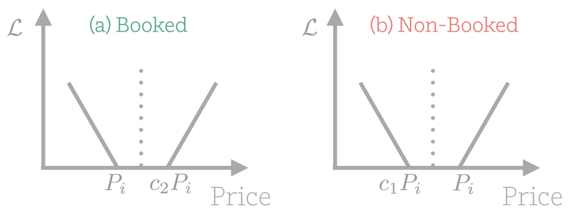
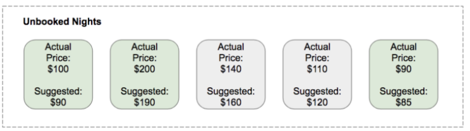
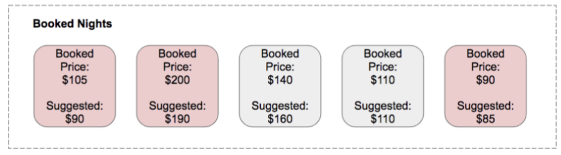

# Airbib 定价

[Customized Regression Model for Airbnb Dynamic Pricing](https://dl.acm.org/doi/pdf/10.1145/3219819.3219830)

Airbib的定价由三部分组成：
1. 一个二分类模型预测房屋每天被预定的概率
2. 一个预测房屋理想定价的模型
3. 在定价模型决策上的个性化定价策略

## 房屋预定概率模型

房屋预定概率模型很好理解，利用房屋的价格、设备、位置、日期等信息去预测未来被预定的概率。Airbib使用的是梯度提升树模型GBM。

## 定价预测模型

预测房屋理想定价模型的构建，首先要问如何获得训练的label，即某天定价多少是房屋的理想定价。
下面表格中 P_sug 表示建议定价，P表示当晚实际定价。其中b,c是错误定价，因为P_sug>=P实际没有预定，P_sug<P实际有预定，对于a,d无法确定。

| 条件       | 预定 | 没预定 |
| ---------- | ---- | ------ |
| P_sug >= P | a    | b      |
| P_sug < P  | c    | d      |

### 定价模型 I

借鉴SVM hinge loss的思想，落在上下界限之间的不计算loss。损失函数定义如下：

$$
\mathcal{L}=\underset{\boldsymbol{\theta}}{\arg \min } \sum_{i=1}^{N}\left(L\left(P_{i}, y_{i}\right)-f_{\boldsymbol{\theta}}\left(\boldsymbol{x}_{i}\right)\right)^{+}+\left(f_{\boldsymbol{\theta}}\left(\boldsymbol{x}_{i}\right)-U\left(P_{i}, y_{i}\right)\right)^{+}
$$

其中+表示取max(0,.), L(P_i,y_i) 和 U(P_i,y_i)表示理想定价的上下界。简单说就是如果这个房间当时以定价P_i被预定，理想定价的上下界就是 [P_i, c2 * P_i]，在这个区间不会产生loss。如果这个房间当时定价P_i没有被预定，理想定价的上下界就是 [c1 * P_i, P_i]。c1是属于(0,1)的常数,c2是大于1的常数，c1, c2通过超参数空间搜索得到。

### 定价模型 II

$$ P_{sug} = P V $$
其中 P_sug 是建议定价，P是实际定价，V是一个通过房屋预定概率模型计算出来的系数。公式中，q是当晚房屋预定概率，其他系数的定义具体可参见原论文。

$$
V= \begin{cases}1+\theta_{1}\left(q_{H}^{-q D}-\theta_{2}\right) & \text { if } D>0 \\ 1+\theta_{1}\left(q^{\varphi_{L}^{-(1-q) D}}-\theta_{2}\right) & \text { if } D \leq 0\end{cases}
$$

### 评估指标

Price Decrease Recall: 没预定的情况下，P_sug<P的比例(召回率), 图中绿色部分
$$ PDR = \frac{d}{b+d} $$

Booking Regret:
$$ BR = \{median_{bookings}(\max(0, \frac{P-P_{sug}}{P})) $$
下图中标红的建议价格分别低于预定价格14%(15元), 5%(10元), 6%(5元)，所以 BR = Median(14, 5, 6, 0, 0) = 5%

