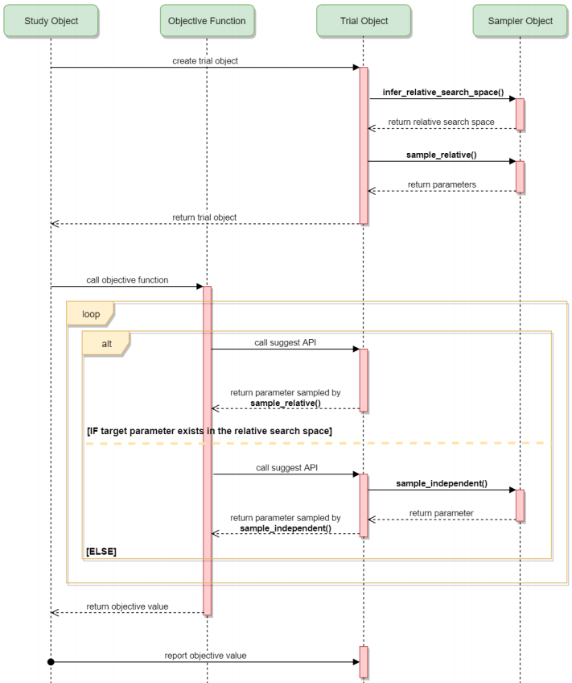

# AUTOML

值得关注的几个 auto tuning 框架

[auto-sklearn](https://github.com/automl/auto-sklearn)
[optuna](https://github.com/optuna/optuna#integrations)
[TPOT](https://github.com/EpistasisLab/tpot)
[hyperopt](https://github.com/hyperopt/hyperopt)

## optuna

目前看来， optuna 各种框架都支持（xgb, lgb, torch, tensorflow）值得尝试

- [optuna 官网](https://optuna.org)
- [optuna 文档](https://optuna.readthedocs.io/en/stable/index.html)
- [quickstart](https://colab.research.google.com/github/optuna/optuna/blob/master/examples/quickstart.ipynb#scrollTo=NGfNPIQHxo7i)
- [optuna 论文](https://dl.acm.org/doi/pdf/10.1145/3292500.3330701)
- [各个框架的 examples](https://github.com/optuna/optuna#integrations)
- [kaggle example](https://www.kaggle.com/corochann/optuna-tutorial-for-hyperparameter-optimization)
- [Distributed Optimization](https://optuna.readthedocs.io/en/v2.2.0/tutorial/004_distributed.html)

### optuna samplers
- [可选择的不同 samplers](https://optuna.readthedocs.io/en/stable/tutorial/10_key_features/003_efficient_optimization_algorithms.html?highlight=Distributed%20Optimization#sampling-algorithms)
- [TPESampler 原理](https://optuna.readthedocs.io/en/stable/reference/generated/optuna.samplers.TPESampler.html#optuna-samplers-tpesampler)

### optuna pruning methods
- [不同的 pruning 方法](https://optuna.readthedocs.io/en/stable/tutorial/10_key_features/003_efficient_optimization_algorithms.html?highlight=Distributed%20Optimization#pruning-algorithms)
- [MedianPruner](https://optuna.readthedocs.io/en/stable/reference/generated/optuna.pruners.MedianPruner.html#optuna-pruners-medianpruner)

### 活动图

### 贝叶斯优化

Grid Search和Randomized Search虽然可以让整个调参过程自动化，但它们无法从之前的调参结果中获取信息，可能会尝试很多无效的参数空间。而贝叶斯优化，会对上一次的评估结果进行追踪，建立一个概率模型，反应超参数在目标函数上表现的概率分布，即P(score|hyperparameters)，可用于指导下一次的参数选择。
