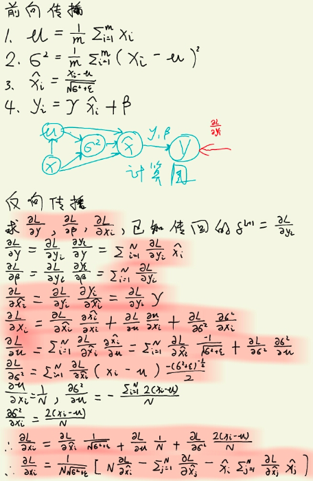
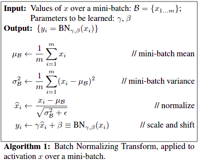

# Batchnorm
## Batchnorm 推导
参考 https://zhuanlan.zhihu.com/p/45614576


batchnorm 4步骤
1. 计算mini-batch内channel的均值
2. 计算mini-batch内channel的方差
3. 归一化
4. 缩放gamma, 平移beta



BN 解决的问题
一. 梯度消失,梯度爆炸


梯度的连续反向传播，是通过权重Wi的连乘进行的。因此，如果权重Wi的值总是较小的（与1相比），则在反向过程中，梯度呈指数级衰减，就出现了梯度消失的问题；反之，如果如果权重Wi总是较大，就会出现梯度爆炸的问题。

与不使用BN相比，$\frac{\partial H_l}{\partial H_k}$多了一个 $\frac{1}{\sigma_i}$, 对权重Wi进行缩放。如果权重Wi较小，则$W_l^TH_{l-1}$较小，从而使得 $\frac{1}{\sigma_i}$ 较大，所以$W_i\frac{1}{\sigma_i}$相对于原本的$W_i$就放大了，避免了梯度的衰减；同样的，如果权重$W_i$较大，$W_i\frac{1}{\sigma_i}$相对于原本的$W_i$缩小了，避免了梯度的爆炸。于是，加入了BN的反向传播过程中，就不易出现梯度消失或梯度爆炸，梯度将始终保持在一个合理的范围内。而这样带来的好处就是，基于梯度的训练过程可以更加有效的进行，即加快收敛速度，减轻梯度消失或爆炸导致的无法训练的问题。

二. 网络能力退化
平移参数β和缩放参数γ作用
bn有两个可学习参数,平移参数β和缩放参数γ,维度等于张量的通道数。这样就保证了每一次数据经过归一化后还保留有学习来的特征，同时又能完成归一化这个操作，加速训练。

三. 避免过拟合
在训练阶段引入随机性，防止过度匹配(在随机的batch上norm)；在测试阶段通过求期望等方式在全局去除掉这种随机性.

训练与推理时BN中的均值和方差分别是多少?
训练时: 均值、方差为该batch内,数据相应channel的均值与方差.
推理时: 均值、方差是基于所有批次的期望计算所得

在代码实现中，使用了滑动平均，储存固定个数Batch的均值和方差，不断迭代更新推理时需要的均值mean与方差Var.

参考: https://blog.csdn.net/bl128ve900/article/details/95309305
https://blog.csdn.net/qq_25737169/article/details/79048516
https://www.zhihu.com/question/38102762/answer/391649040

## 融合Conv和BN层
BN 可以写成
,即
$$ W_{bn} = \frac{\gamma}{\sigma^2 + \varepsilon} $$
$$ b_{bn} = \beta - \frac{\gamma u}{\sqrt{\sigma^2 + \varepsilon}} $$
现在融合卷积与BN
$$ f(X) = W_{bn}(W_{conv}X + b_{conv}) + b_{bn} $$

nn.Conv2d参数:


nn.BatchNorm2d参数:


```python
import torch
import torchvision

    def fuse(conv, bn):
        fused = torch.nn.Conv2d(
            conv.in_channels,
            conv.out_channels,
            kernel_size=conv.kernel_size,
            stride=conv.stride,
            padding=conv.padding,
            bias=True
        )

        # setting weights
        w_conv = conv.weight.clone().view(conv.out_channels, -1)
        w_bn = torch.diag(bn.weight.div(torch.sqrt(bn.eps+bn.running_var)))
        fused.weight.copy_( torch.mm(w_bn, w_conv).view(fused.weight.size()) )

        # setting bias
        if conv.bias is not None:
            b_conv = conv.bias
        else:
            b_conv = torch.zeros( conv.weight.size(0) )
        b_conv = torch.mm(w_bn, b_conv.view(-1, 1)).view(-1)
        b_bn = bn.bias - bn.weight.mul(bn.running_mean).div(
                              torch.sqrt(bn.running_var + bn.eps)
                            )
        fused.bias.copy_( b_conv + b_bn )

        return fused

    # Testing
    # we need to turn off gradient calculation because we didn't write it
    torch.set_grad_enabled(False)
    x = torch.randn(16, 3, 256, 256)
    resnet18 = torchvision.models.resnet18(pretrained=True)
    # removing all learning variables, etc
    resnet18.eval()
    model = torch.nn.Sequential(
        resnet18.conv1,
        resnet18.bn1
    )
    f1 = model.forward(x)
    fused = fuse(model[0], model[1])
    f2 = fused.forward(x)
    d = (f1 - f2).mean().item()
    print("error:",d)
```
参考: https://zhuanlan.zhihu.com/p/110552861
https://learnml.today/speeding-up-model-with-fusing-batch-normalization-and-convolution-3
