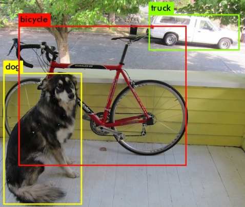
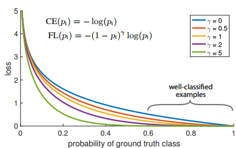

# 目标检测总结
做目标检测不知不觉已经1年多了，看过很多开源代码也自己写过两个检测网络，
希望在这篇文章比较系统的总结一下相关知识。
希望大家能够通过这篇文章，快速梳理清不同目标检测框架的核心，并能够独立开展自己的研究。

## 目标检测
目标检测的目的是输出待检测物体bbox的位置(x1,x2,y1,y2)及其分类。

TODO: diff. SGD, ADAM
## 基于深度学习的目标检测
通用目标检测网络基于是否使用预定义的anchor可分为：
- Anchor Based Network：Faster-RCNN, RetinaNet, SSD,
- Anchor Free Network: CornetNet, CenterNet, FCOS ...

2018年开始有许多Anchor Free的论文，与anchor based网络相比，Anchor free 网络更简单，
真值GT的定义更直接。但是基于个人实际经验(在CenterNet上的实验)，anchor free的网络在
test set 与 train set有较明显的domain gap的时候表现不如anchor based的网络稳定，
False positive 的检测偏多。

基于是否提供 foreground/background region proposals 可分为:
- Two stage Network: Faster-RCNN
- One stage Network: Yolo, RetinaNet, Retinaface ...

因为实时性的要求我主要接触的都是基于one stage的网络，但是two-stage的网络如
Faster-RCNN，虽然速度不够快，anchor计算较繁琐，任然被广泛使用。
尤其是一些拓展性工作，比如基于proposals 进一步embedding features 或者像Mask-RCNN 进一步语义分割。
虽然2 stage anchor的准备工作带来额外开销，但是由于有多任务监督loss，其实Faster-RCNN 的训练速度
并不比一些更简单的one-stage网络慢，至今任是一个稳定有效的通用网络。

因此网络选型： TODO

`了解一个目标检测框架的重点`
其实许多目标检测框架都十分相近，网络结构上的差别其实是只是其次，
理清它们之间不同最重要的三点
- 真值如何定义
- LOSS 如何计算
- 网络结构，一些细节

下面我将以Faster-RCNN, RetinaNet, Yolov3, CenterNet这四个很有代表性的网络为例，
从这三个方面分析他们的异同点。

### Faster-RCNN

### RetinaNet
RetinaNet是出了名的许多重复的层可以坎，一个典型的例子就是Retinaface. 可以去学习下RetinaNet
对于简单专业的检测任务，如何针对性的简化网络
#### 真值定义
在下采样的FPN特征图上，每个网格配备9个based-anchor. 这9个based-anchor有三个不同的尺寸，
长宽比分别为 1:2, 1:1, 2:1. 对于batch里每个图片，都会基于其特征图，每个网格生成based-anchor。
与GT物体bbox的IoU大于阈值0.5的based-anchor被定义为正样本，介于0.4,0.5之间的被定义为ignored，
小于0.4的定义为负样本。阈值可以自己调整。based-anchor的尺寸可以自己设定，尤其要小心的是，
不同数据集，源图片尺寸与coco数据集不一样，图片预处理后如果大小与网络本身预设输入的的尺寸不一致，
需要基于新的尺寸重新修改based-anchor size，如果一样，则不需要修改based-anchor size 尺寸。
因为based-anchor size已经基于原图片尺寸，卷积层感受野进行过合理配置，便于后续提供良好的
anchor matching(based-anchor与bbox GT)得到尽可能多的正样本。此时花时间调整based-anchor size
参数花时间并且通常效果更差。

对于类别回归的真值定义：
物体GT bbox的类别会被one-hot编码，与其IoU大于阈值的based-anchor被定义为正样本，也就是网络
最后一层的输出。其后不接batchnorm 和 activation。计算loss前, sigmoid缩放到(0,1)
$ sigmoid = \frac{1}{1 + e^{-x}} $
```python
torch.nn.Conv2d(in_channels, num_anchors*num_classes, kernel_size=3, padding=1)
```
正样本(one-hot编码的物体类别)与负样本(background)作为类别回归的真值。
网络class head 最终输出的out channel维度为 (num_anchors*num_classes)。
num_anchors为9，是特征图每个网格配备的based-anchor数目。
ps: 注意与Faster-RCNN 不同，Faster-RCNN class head 输出维度为 ((class_num+1) * 9)，
1 是 background，最后一层输出后接softmax。


对于bbox位置回归的真值定义：
每个based-anchor去回归delta cx, delta cy, delta h, delta w。
```python
torch.nn.Conv2d(in_channels, num_anchors*4, kernel_size=3, padding=1)
```
小的variance对网络的训练更好，因此网络并不是直接回归物体bbox的 cx,cy,h,w。
而是去回归物体bbox中心cx,cy基于其匹配的based_anchor中心的差值，并除以based_anchor的尺度
h,w 也同理。物体尺度相对于based_anchor的尺度的log。这些处理很巧妙的配合了图片归一化的前处理，
与batch normalization,使得网络能够更快更稳定收敛。
bbox gt真值的定义如下，直接看伪代码其实更方便理解。
```python
dx = (gt_cx - based_anchor_cx) / based_anchor_widths
dy = (gt_cy - based_anchor_cy) / based_anchor_heights
dw = ln(gt_widths / based_anchor_widths)
dh = ln(gt_heights / based_anchor_heights)
deltas = torch.stack((dx, dy, dw, dh), dim=1)
```

#### loss计算

##### binary loss
$$ sigmoid = \frac{1}{1 + e^{-x}} $$
$$ L = L_{neg} + L_{pos} = -\sum\limits_{i=1}^n log(1-p) - \sum\limits_{i=1}^n log(p)$$
$$ L = -ylog(p)-(1-y)log(1-p) $$

##### CE loss
$$ L = -\sum\limits_{i=1}^n log(p) $$

##### softmax loss
$$ softmax = \frac {e^{p_i}}{\sum\limits_{j=1}^n e^{p_j}} $$
$$ -\sum\limits_{i=1}^n log(\frac {e^{p_i}}{\sum\limits_{j=1}^n e^{p_j}}) $$

##### 分类loss
只有正样本与负样本会参与分类loss计算,被ignored的based-anchor不参与计算。分类loss是基于交叉熵的，优化的是概率。对于正样本，loss监督网络在其对应的class_id层有接近1的输出。对于负样本，loss监督网络在其对应输出层输出接近0。focal loss 是常见的one stage detector的分类loss，基于CE交叉熵loss，提出 1.优化正样本与background不平衡问题（可能只有几百个based_anchor与GT bbox匹配成功，其余十几万的都是负样本，负样本有可能主导分类loss） 2.重点优化难训练样本的概率见下图。focal loss中 1. alpha_t正样本权重，1-alpha_t负样本权重，解决正样本与background的不平衡 2. gamma，在ce_loss前乘上 $((1 - p_t))^{gamma}$，减少预测正确的大概率样本的loss，见下图。当gamma = 0, focal loss = CE loss
$$  $$


直接看下伪代码吧。

```python
# https://arxiv.org/pdf/1708.02002.pdf focal loss paper
p = torch.sigmoid(predicts)
ce_loss = torch.nn.functional.binary_cross_entropy_with_logits(predicts, targets, reduction="none")
p_t = p * targets + (1 - p) * (1 - targets)
loss = ce_loss * ((1 - p_t) ** gamma)
if alpha >= 0:
    alpha_t = alpha * targets + (1 - alpha) * (1 - targets)
    loss = alpha_t * loss
loss = loss.sum()
loss = loss / max(1, num_matched_based_anchors)
return loss
```

由于正负样本数目间悬殊的差距，会造成训练初期不稳定，focal loss 还提出网络权重初始化的问题，让模型训练初期正样本的预测更少，负样本的更多，获得一个更稳定更小的初期的训练loss，这个我在第一次看的时候完全没有注意到。网络class head最后一层的bias被设置成 $ -log((1-\pi)/\pi) $, 其中$\pi=0.01$。 其他层（backbone除外），被设置为
```python
torch.nn.init.normal_(layer.weight, mean=0, std=0.01)
torch.nn.init.constant_(layer.bias, 0)
```
