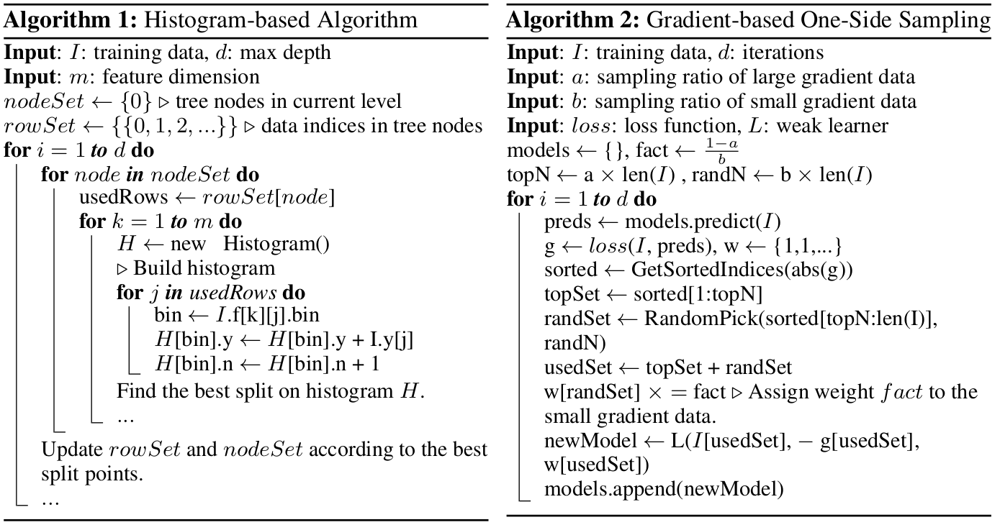
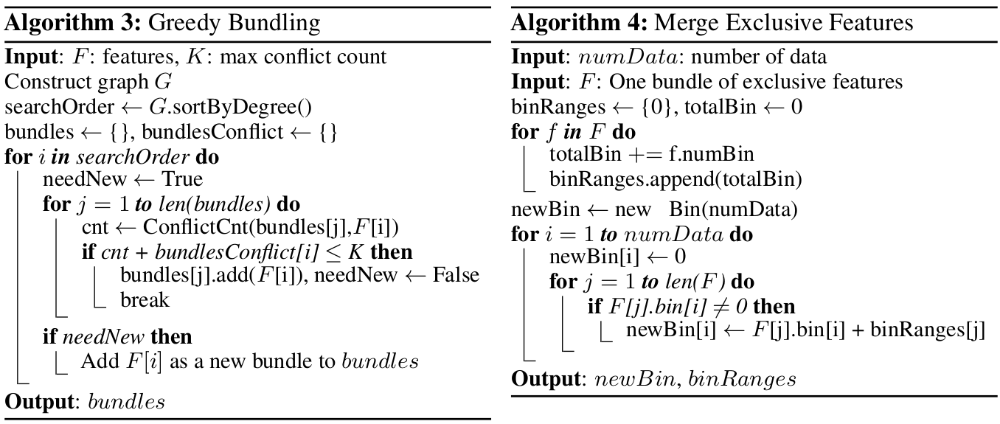

# 梯度提升树 xgb / lgb （实战篇）

## 基础知识

- [梯度提升树-基础知识](https://xgboost.readthedocs.io/en/latest/tutorials/model.html)

## xgboost tutorials

- [xgb github](https://github.com/microsoft/LightGBM)
- [自定义损失函数和评估函数](https://xgboost.readthedocs.io/en/latest/tutorials/custom_metric_obj.html)
- [basic walkthrough](https://github.com/dmlc/xgboost/blob/master/demo/guide-python/basic_walkthrough.py)
- [xgb API](https://xgboost.readthedocs.io/en/latest/python/python_api.html)

```python
def metric_eval(y_pred, dtrain):
    y_true = dtrain.get_label()
    metrics = []
    metrics.append(log_loss(y_true, y_pred.astype(float), labels=[0,1]))
    return 'logloss', float(np.mean(metrics))

dtrain = xgb.DMatrix(X_train, label=y_train)
dval = xgb.DMatrix(X_val, label=y_val)
watchlist = [(dtrain, 'train'), (dval, 'eval')]
results = {}
last = xgb.train(params, dtrain, num_boost_round=100, evals=watchlist, early_stopping_rounds = 10, feval=metric_eval, evals_result=results, verbose_eval=20)
# predict with ntree_limit=last.best_ntree_limit, if using early_stop
# https://xgboost.readthedocs.io/en/latest/python/python_intro.html#early-stopping
pred = last.predict(dval, ntree_limit=last.best_ntree_limit)
last.save_model('xgb.model')
last2 = xgb.Booster(model_file='xgb.model')

cNodeParams = {'shape': 'box',
               'style': 'filled,rounded',
               'fillcolor': '#78bceb'}
lNodeParams = {'shape': 'box',
               'style': 'filled',
               'fillcolor': '#e48038'}
xgb.plot_importance(last, max_num_features=10, grid=False, show_values=False)
xgb.plot_tree(last, num_trees=last.best_iteration, condition_node_params=cNodeParams, leaf_node_params=lNodeParams)
plt.show()
```

## lightgbm tutorials

- [lgb github](https://github.com/microsoft/LightGBM)
- [lgb example](https://github.com/microsoft/LightGBM/blob/master/examples/python-guide/advanced_example.py)
- [python API](https://lightgbm.readthedocs.io/en/latest/Python-API.html)


```python
def loglikelihood(preds, train_data):
    labels = train_data.get_label()
    preds = 1. / (1. + np.exp(-preds))
    grad = preds - labels
    hess = preds * (1. - preds)
    return grad, hess

def binary_error(preds, train_data):
    labels = train_data.get_label()
    preds = 1. / (1. + np.exp(-preds))
    return 'error', np.mean(labels != (preds > 0.5)), False

# set free_raw_data=False if you want to reuse the dataset
lgb_train = lgb.Dataset(X_train, y_train, free_raw_data=False)
lgb_eval = lgb.Dataset(X_val, y_val, reference=lgb_train, free_raw_data=False)
evals_result = {}
# lgb always return the best iteration. while xgb the last iteration.
gbm = lgb.train(params, lgb_train, num_boost_round=50, valid_sets=lgb_eval,
                evals_result=evals_result)
gbm.save_model('lgb_model.txt')
bst = lgb.Booster(model_file='lgb_model.txt')
pred = bst.predict(X_val)
# resume training
gbm = lgb.train(params, lgb_train, num_boost_round=50, init_model=gbm,
                valid_sets=lgb_eval, learning_rates=lambda iter: 0.05*(0.99**iter),
                fobj=loglikelihood, feval=binary_error)

loss = metric(y_val, pred)
total_loss += loss

lgb.plot_importance(gbm, max_num_features=10)
lgb.plot_split_value_histogram(gbm, feature='g-1', bins='auto')
lgb.plot_tree(gbm, tree_index=gbm.best_iteration, show_info=['split_gain'])
plt.show()
```

## 决策树可视化

num_boost_round 为树的个数，每次迭代，基于之前树们的残差新添加一个树。
非叶子节点就是一系列的 if-else 语句， 叶子节点的值 对于 regression 就是样本落到该叶子上的取值，对于 logic 把叶子节点的值加个sigmoid，就是最终的逻辑值。因为CART的本质还是回归树。注意最终的结果为所有树之和。

## gpu 版本安装配置
### xgboost-gpu
access: 2021.01.12

目前 xgboost-gpu 还不支持3.8，要用python 3.7及以下版本
安装比较简单，在相应的conda环境下conda install 即可，会自动安装cuda依赖，然后直接就可以在 python里 import xgboost 了
记得使用 tree_method='gpu_hist'

```sh
conda create -n kaggle-gpu python=3.7
conda install -c anaconda py-xgboost-gpu
```

### lightgbm-gpu
access: 2021.01.12

lightgbm 需要自己build下，手动安装cuda不是必须的，然后导入到相应的python环境

OpenCL, pip install pyopencl, sudo apt-get install -y ocl-icd-libopencl1, sudo apt-get install -y ocl-icd-opencl-dev
libboost, sudo apt-get install libboost-all-dev
CMake, sudo apt install cmake

```sh
git clone --recursive https://github.com/microsoft/LightGBM ; cd LightGBM
mkdir build ; cd build
cmake -DUSE_GPU=1 ..
make -j4
```

导入到相应的python环境
```sh
cd ../python-package/
conda activate yourEnv
python setup.py install --precompile
```

记得使用 'device': 'gpu'

reference:
1. https://github.com/microsoft/LightGBM/blob/master/docs/Installation-Guide.rst#linux-3
2. https://github.com/microsoft/LightGBM/issues/715#issuecomment-317158169

### simple test

- 我自己拿小数据集简单测试了下，lightgbm-gpu cuda内存占用较少，速度提升不明显，感觉lightgbm-gpu做得还不够完善，当然 lightgbm-cpu 比 xgboost-cpu 还是加速明显的
- xgboost-gpu cuda内存占用较多，速度提升明显
access: 2021.01.12

### lgb 的一点补充
[lgb paper](https://papers.nips.cc/paper/2017/file/6449f44a102fde848669bdd9eb6b76fa-Paper.pdf)
- Gradient-based One-Side Sampling (GOSS)
- Exclusive Feature Bundling (EFB)

GOSS 是 lgbm 提出的一个采样策略，目的是减少训练过程中的低梯度样本，并且不明显改变训练集的分布。


EFB 特征捆绑


## 加速 xgb/lgb 推理

[tree-lite](https://treelite.readthedocs.io/en/latest/tutorials/first.html)

[kaggle example](https://www.kaggle.com/code1110/janestreet-faster-inference-by-xgb-with-treelite)
