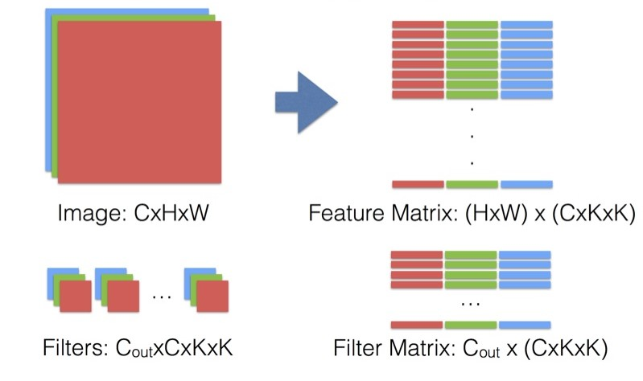

# 卷积运算原理 与 模型FlOPs复杂度分析

### 概念

FLOPS：floating point operations per second的缩写，每秒浮点运算次数，理解为计算速度。是一个衡量硬件性能的指标。

`FLOPs`：floating point operations的缩写（s表复数），浮点运算数，理解为计算量。可以用来衡量算法/模型的复杂度。

## 普通卷积层
### FLOPs 计算

`不考虑bias`，只考虑滑动窗口中的$k_h * k_w * c_{in-channel}$次乘法与$k_h * k_w * c_{in-channel} - 1$次加法运算 (batch size = 1)。 H, W 是feature map 的 高宽。

$$ (2 * k_h * k_w * c_{in-channel} - 1) * H_{out} * W_{out} * c_{out-channel} $$

`考虑bias`，z在上面的基础上 * 1的融合运算(img2col) + bias, 于是多了2次运算-1变+1

$$ (2 * k_h * k_w * c_{in-channel} + 1) * H_{out} * W_{out} * c_{out-channel} $$

`tf.profiler.profile` 提供的FLOPs计算API

$$ (2 * k_h * k_w * c_{in-channel}) * H_{out} * W_{out} * c_{out-channel} $$
$$ 2 * param * H_{out} * W_{out} $$

### Params 参数计算
`不考虑bias`
$$ k_h * k_w * c_{in-channel} * c_{out-channel} $$

`考虑bias`
$$ (k_h * k_w * c_{in-channel} + 1) * c_{out-channel} $$

## depthwise separable conv.
### FLOPs 计算
按mobilenetv2论文里的写法 忽略了bias
$$ (2 * k_h * k_w + c_{out-channel}) * H_{out} * W_{out} * c_{in-channel} $$

与普通卷积相比(忽略bias)计算量FLOPs
$$ \frac{k_h * k_w + c_{out-channel}}{k_h * k_w * c_{out-channel}} $$
### Params 计算
`不考虑bias`
$$ k_h * k_w * c_{in-channel} + 1 * 1 * c_{in-channel} * c_{out-channel} $$

与普通卷积相比(不考虑bias)参数量
$$ \frac{1}{c_{out-channel}} + \frac{1}{k_h * k_w} $$

### 简单的前向传播卷积实现
```python
def conv_forward(feature, filter, bias, conv_param):
    """
    :param feature: input batch image feature map, shape (batch, img_h, img_w, channel)
    :param filter:  implemented filter, shape (filter_num, filter_h, filter_w, filter_channel)
    :param bias: biases, shape (filter_num)
    :param conv_param: dictionary which contains 'pad', 'stride', ...
    :return: output feature map
    """
    batch, feature_h, feature_w, channel = feature.shape
    filter_num, filter_h, filter_w, filter_channel = filter.shape
    pad = conv_param['pad']
    stride = conv_param['stride']
    feature_pad = np.pad(x, ((0,0), (0,0), (pad,pad),(pad,pad)), 'constant')
    feature_out_h = 1 + int((feature_h + 2 * pad - filter_h) / stride)
    feature_out_w = 1 + int((feature_w + 2 * pad - filter_w) / stride)
    feature_out = np.zeros((batch, feature_out_h, feature_out_w, filter_num))

    for b in range(barch):
        for f in range(filter_num):
            for i in range(feature_out_h):
                for j in range(feature_out_w):
                    feature_window = feature_pad[b, :, i*stride:i*stride+filter_h, j*stride:j*stride+filter_w].reshape(1, -1)
                    filter_vector = filter[f].reshape(-1, 1)
                    feature_out[b, f, i, j] = feature_window.dot(filter_vector) + bias[f]
    cache = (feature, filter, bias, conv_param)
    return feature_out, cache
```

### 优化
用矩阵乘法代替多重for循环




reference: https://www.zhihu.com/question/28385679


### 实际tensorflow模型FLOPs统计示例
tf.profiler.profile 统计tensorflow freezing graph FLOPs

```python
import tensorflow as tf
from tensorflow.python.framework import graph_util

def load_pb(pb):
    with tf.gfile.GFile(pb, "rb") as f:
        graph_def = tf.GraphDef()
        graph_def.ParseFromString(f.read())
    with tf.Graph().as_default() as graph:
        tf.import_graph_def(graph_def, name='')
        return graph

# ***** (1) Create Graph *****
    g = tf.Graph()
    sess = tf.Session(graph=g)
    with g.as_default():
        A = tf.Variable(initial_value=tf.random_normal([25, 16]))
        B = tf.Variable(initial_value=tf.random_normal([16, 9]))
        C = tf.matmul(A, B, name='output')
        sess.run(tf.global_variables_initializer())
        flops = tf.profiler.profile(g, options = tf.profiler.ProfileOptionBuilder.float_operation())
        print('FLOP before freezing', flops.total_float_ops)
# *****************************
"""
Flops should be ~ 7200
result: FLOP before freezing 8288
解析：变量通常会通过高斯分布进行初始化，引入额外的FLOPs，
而初始化一次性完成，并且在训练或推理期间都不会发生。
此外，一份完整的模型还会包括loss, learning rate, BN 等参数。
因此在真正统计模型FLOPs之前, 我们需要冻结模型,
在~/dist-packages/tensorflow/python/tools文件下
tensorflow有提供 freeze_graph.py, 可以方便的冻结训练模型，
移除与输出节点不相干的nodes
"""
# ***** (2) freeze graph *****
    output_graph_def = graph_util.convert_variables_to_constants(sess, g.as_graph_def(), ['output'])

    with tf.gfile.GFile('graph.pb', "wb") as f:
        f.write(output_graph_def.SerializeToString())
# *****************************


# ***** (3) Load frozen graph *****
g2 = load_pb('path_to_your_freezing_graph')
with g2.as_default():
    flops = tf.profiler.profile(g2, options = tf.profiler.ProfileOptionBuilder.float_operation())
    print('after freezing: {} BFLOPs'.format(flops.total_float_ops / 1e9))
```

reference: https://stackoverflow.com/questions/45085938/tensorflow-is-there-a-way-to-measure-flops-for-a-model/50680663#50680663?newreg=384984a98356434bb936801d52714a46
