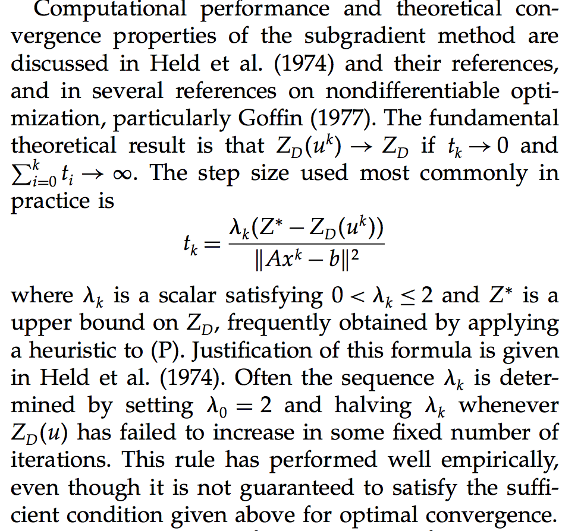

# 拉格朗日求解代码梳理

[Solving Billion-Scale Knapsack Problems](https://arxiv.org/pdf/2002.00352.pdf)

**求解流程**
- 基于拉格朗日松弛做inference, 获得当前$\lambda$下的决策分布 X
- 求解当前决策分布 X 下的次梯度分布 subgdt, $ subgbt_k = b_{i, j, k} x_{i, j}-B_{k} $ (k表示有多个全局约束)
- 通过次梯度更新$\lambda$, $\lambda' = \max(0, \lambda + lr * subgdt) $
- 如果 $\lambda' - \lambda$收敛退出循环，否侧基于新$\lambda$重复上面步骤


这里涉及学习率lr的计算，lr在拉格朗日的求解过程中是会改变的，每个迭代中学习率可通过下面公式计算


```python
from collections import defaultdict

from sklearn import metrics
from sklearn.metrics import log_loss
import numpy as np
import pandas as pd
import sys
import datetime
from sklearn import metrics
from sklearn.metrics import f1_score
import lightgbm as lgb
import time
import gc
#import cPickle
from tqdm import tqdm
import math
import json
import os
import feather
pd.options.display.max_columns = 999
pd.options.display.max_rows = 999
import warnings
from pandas.core.common import SettingWithCopyWarning
warnings.simplefilter('error', SettingWithCopyWarning)

from collections import defaultdict

from sklearn import metrics
from sklearn.metrics import log_loss
import numpy as np
import pandas as pd
import sys
import datetime
from sklearn import metrics
from sklearn.metrics import f1_score
import lightgbm as lgb
import time
import gc
# import cPickle
from tqdm import tqdm
import math
import json
import os
import feather

pd.options.display.max_columns = 999
pd.options.display.max_rows = 999
import warnings
from pandas.core.common import SettingWithCopyWarning

warnings.simplefilter('error', SettingWithCopyWarning)

pd.options.mode.chained_assignment = None  # default='warn'


# 拓扑图排序
def init_graph(S):
    graph = dict()
    L = len(S)
    for i in range(L):
        graph[i] = set()
    for i in range(L):
        for j in range(i + 1, L):
            if len(S[i] & S[j]) != 0:
                if S[j].issubset(S[i]):
                    graph[i].add(j)
                elif S[i].issubset(S[j]):
                    graph[j].add(i)
                else:
                    print('Not Hierarchical!')
    return graph


def topologicalSort(graph):
    L = len(graph)
    visited = [False] * L
    stack = []

    def topologicalSortUtil(v, visited, stack):
        visited[v] = True
        for j in graph[v]:
            if not visited[j]:
                visited, stack = topologicalSortUtil(j, visited, stack)
        stack = [v] + stack
        return visited, stack

    for i in range(L):
        if not visited[i]:
            visited, stack = topologicalSortUtil(i, visited, stack)
    stack.reverse()
    return stack


# DD opt
# B: N*M*K -> K*N*M

def child_solver_broadcast(P, B,C, topo,S,M,Lambda): 
    Lambda_broadcast = Lambda.reshape(-1, 1, 1)
    P_hat = P - (Lambda_broadcast * B).sum(axis=0)
    # print(P_hat)
    x = (P_hat > 0).astype('int')
    ids = np.argsort(P_hat, axis=1)  # 升序排序后的index

    ids_init_pos = np.zeros(ids.shape)
    for j1 in range(M):
        for j2 in range(M):
            ids_init_pos[ids[:, j1] == j2, j2] = j1  # ids_init_pos 位置与x一致，数值大表示越大
    # print(ids)
    for t in range(len(topo)):
        for j in S[t]:
            x[:, j][ids_init_pos[:, j] < M - C[t]] = 0

    # 保证x每行一定至少有一个1
    for j in range(M):
        x[(x.sum(axis=1) == 0) & (ids[:, M - 1] == j), j] = 1
    return x


def Subgradient(P, B,C,topo,S,M,K, Budget, Lambda):
    x = child_solver_broadcast(P, B,C,topo,S,M, Lambda)
    subgdt = [0] * K
    for k in range(K):
        subgdt[k] = (B[k] * x).sum() - Budget[k]
    subgdt = np.array(subgdt)
    return subgdt


def print_x_freg(x,M,N):
    index_df = np.tile(np.arange(0, M, 1), (N, 1))
    res = (x * index_df).sum(axis=1)
    print(pd.DataFrame(res, columns=['res'])['res'].value_counts())

def getResStr(x):
    return ",".join(str(i)for i in x)


# 测试 不同学习率下 目标函数值和约束满足情况 趋势图
# 固定0.000001学习率/rate = 0.5**step/上下界除以范数2平方/上下界除以范数2

import datetime


def DD_opt(df,B_K,S ,C,M,Lambda, T, Convergence, step_rate_type='one_order'):
    """
    对偶下降法求解分配问题
    :param df: 样本df文件，至少包含scores列（M元素，逗号隔开）,
    和candidate_coupons列（len(B_K)*M个元素，每相邻m个元素值表示当前这个约束下m个权益的消耗值）
    :param B_K: list，全局约束值
    :param S:  list<set<int>>，局部约束要求的信息，
    例如立减5种金额+现金券3种金额，两个局部约束：每个用户最多获得一个立减，每个用户最多获得一个现金券，则size(S) =2，其中元素S(0)={0,1,2,3,4},S(1)={5,6,7}
    :param C:list<int>,对应每个局部约束值
    :param M:候选权益个数
    :param Lambda:list<double>，初始lambda
    :param T:最大迭代次数
    :param Convergence:收敛条件，相邻两次lambda绝对值差异小于该值则收敛
    :param step_rate_type:学习率更新方式：
    'fixed_value':固定0.000001，
    'iteration_num'：0.5 ** 迭代次数
    'one_order'：次梯度模长基准下的学习率设定
    'two_order'：次梯度模长平台基准下的学习率设定
    :return:df:基于原始输入文件的决策结果，在原df中加入descions结果列，
    Lambda：求解结果参数,
    profit：目标函数值,
    list_target_values：各全局约束实际消耗,
    list_budget：各全局约束值,
    list_subgdt：当前次梯度方向,
    """
    P = df['scores'].str.split(',', expand=True).astype('double')
    B = df['candidate_coupons'].str.split(',', expand=True).astype('double')

    P = np.array( P.values.tolist())
    B =  np.array(B.values.tolist())
    #变为K*N*M
    B = B.reshape(len(P), len(B_K), len(P[0])).swapaxes(0, 1)

    graph = init_graph(S)
    topo = topologicalSort(graph)

    N = len(P)
    K = len(B_K)
    L = len(C)

    last_Z_lr = 0.0
    last_belta = 1.0

    list_target_values = []
    list_budget = []
    list_subgdt = []
    list_lambda = []
    profit = 0

    for t in range(T):

        x = child_solver_broadcast(P, B,C, topo,S,M,Lambda)
        subgdt = Subgradient(P, B,C,topo,S,M,K, B_K, Lambda)

        print_x_freg(x,M,N)

        df['desicion'] = list(
            map(lambda x_iter,: getResStr(x_iter),x))

        # 向list中填入信息
        list_target_values.append((P * x).sum())
        list_budget = B_K
        list_subgdt = subgdt
        list_lambda = Lambda

        z_lr = (P * x).sum() - (Lambda * subgdt).sum()
        profit = (P * x).sum()
        z_low = P.min(axis=1).sum()
        belta = last_belta if (z_lr - last_Z_lr < -0.0001) else last_belta / 2.0

        last_belta = belta
        last_Z_lr = z_lr
        Lambda_t = np.zeros((K, 1))

        if step_rate_type == 'fixed_value':
            step_rate = 0.000001
        if step_rate_type == 'iteration_num':
            step_rate = 0.5 ** t
        if step_rate_type == 'one_order':
            step_rate = (z_lr - z_low) * belta / (np.linalg.norm(subgdt))
        if step_rate_type == 'two_order':
            step_rate = (z_lr - z_low) * belta / np.square(np.linalg.norm(subgdt))

        # step_rate = (z_lr - z_low) * belta / (np.linalg.norm(subgdt))
        #         step_rate = 0.5**int(t/3)

        #         step_rate = (z_lr - z_low) * belta / np.square(np.linalg.norm(subgdt))
        cov= 0
        for k in range(K):
            Lambda_t[k] = max(0, Lambda[k] + step_rate * subgdt[k])
            cov  = cov+math.fabs(Lambda_t[k] - Lambda[k])
        if cov<=Convergence:
            print("Convergence condition meet!")
            print(
                "profit ={},subgdt = {}, belta = {}, z_lr = {}, z_low = {}, step_rate = {}".format(profit,subgdt, belta, z_lr, z_low,step_rate))
            print(t, Lambda.tolist())
            return df,Lambda,profit, list_target_values, list_budget, list_subgdt


        print('-' * 6)

        print(datetime.datetime.now())

        print("step = {}, Lambda = {}".format(t, Lambda.tolist()))

        print(
        "subgdt = {}, belta = {}, z_lr = {}, z_low = {}, step_rate = {}".format(subgdt, belta, z_lr, z_low, step_rate))

        #print (df.head(2))
        Lambda = Lambda_t

    return df,Lambda, profit,list_target_values, list_budget, list_subgdt
```
