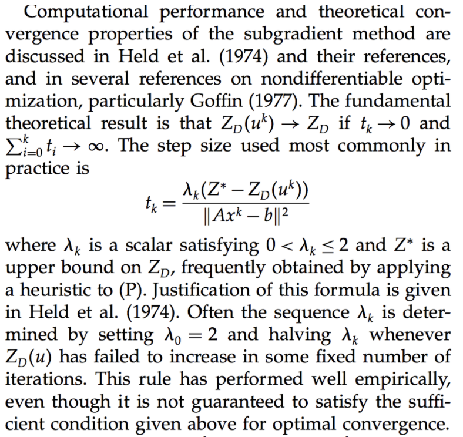
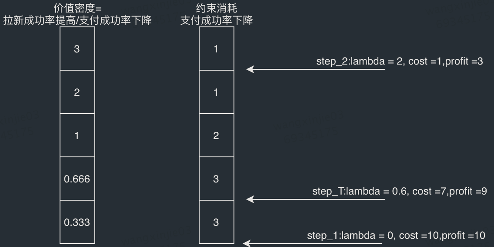
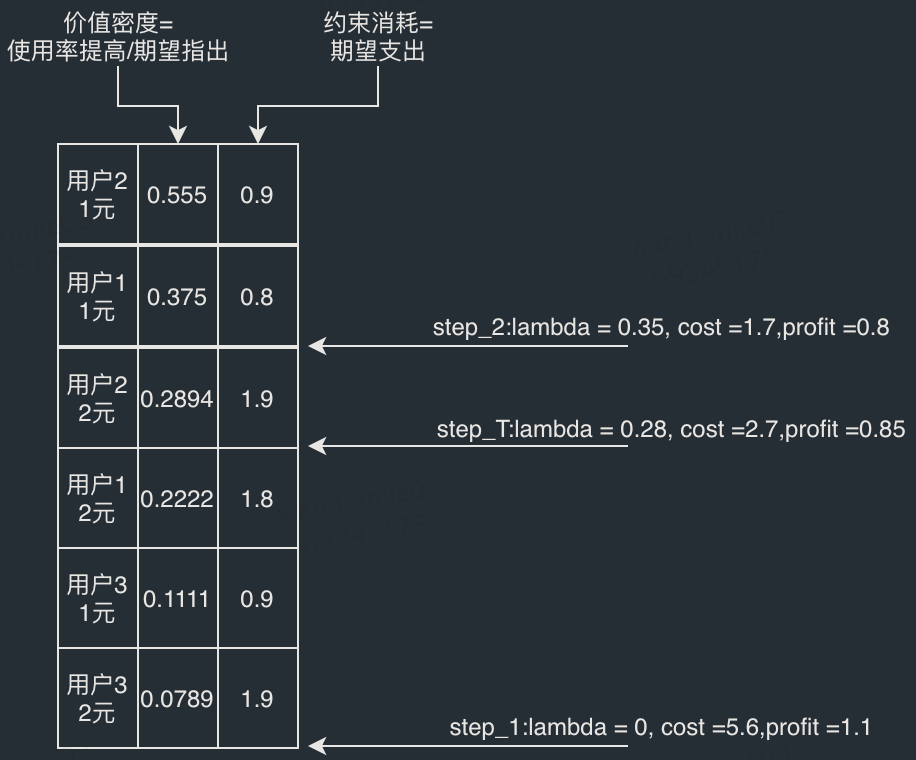

# 拉格朗日求解约束优化
[Solving Billion-Scale Knapsack Problems](https://arxiv.org/pdf/2002.00352.pdf)

**求解流程**
- 基于拉格朗日松弛做inference, 获得当前$\lambda$下的决策分布 X
- 求解当前决策分布 X 下的次梯度分布 subgdt, $ subgbt_k = b_{i, j, k} x_{i, j}-B_{k} $ (k表示有多个全局约束)
- 通过次梯度更新$\lambda$, $\lambda' = \max(0, \lambda + lr * subgdt) $
- 如果 $\lambda' - \lambda$收敛退出循环，否侧基于新$\lambda$重复上面步骤

这里涉及学习率lr的计算，lr在拉格朗日的求解过程中是会改变的，每个迭代中学习率可通过下面公式计算

# 形象理解
在求解过程中通过lambda来平衡收益和约束之间的关系，具体的计算过程可以通过以下例子来描述

## 0/1背包问题
对于0/1背包问题（单treatment），即决策变量x_i为二选一，拉格朗日的求解过程如下：
输入样例：
目标：提高总体cvr转化率
约束：ctr点击率下降期望不超过8pp
决策变量：是否给用户走A流程 （单一treatment）

| index | 用户走A流程cvr提升绝对值 | 用户走A流程ctr下降绝对值 |
| ----- | ------------------------ | ------------------------ |
| 0     | 3pp                      | 1pp                      |
| 1     | 2pp                      | 1pp                      |
| 2     | 2pp                      | 2pp                      |
| 3     | 2pp                      | 3pp                      |
| 4     | 1pp                      | 3pp                      |

- 在每个个体的子问题中，0/1KP问题事实上通过lambda来控制是否要选择这个对象，此时lambda可以视为“价值密度（ROI）的准入门槛”，选择该个体的收益/支出高于门槛，则进行赋值1。

- 该例子的具体求解过程可用下图来表示，每一步迭代lambda，都是在调整准入门槛

## MCKP 多重背包问题
对于多重背包（多treatment），即决策变量x_i为多选一，拉格朗日求解过程如下：
输入样例：
目标：提高cvr转化率
约束：成本期望不超过3元
决策变量：现金劵 0/1/2

| index | 0元转化概率 | 发1元转化概率 | 发2元转化概率 | 发1元转化率增量 | 发1元期望成本增量 | 1元劵价值密度 | 发2元转化率增量 | 发2元期望成本增量 | 2元劵价值密度 |
| ----- | ----------- | ------------- | ------------- | --------------- | ----------------- | ------------- | --------------- | ----------------- | ------------- |
| 0     | 0.4         | 0.9           | 0.95          | 0.5             | 0.9               | 0.555         | 0.55            | 1.9               | 0.2894        |
| 1     | 0.5         | 0.8           | 0.9           | 0.3             | 0.8               | 0.375         | 0.4             | 1.8               | 0.22222       |
| 2     | 0.8         | 0.9           | 0.95          | 0.1             | 0.9               | 0.111         | 0.15            | 1.9               | 0.007894      |

与0/1问题稍有差别，多选择的情况下，本质上是对于每个个体每个选项的增量ROI，或者说增量价值密度（相对于每个个体消耗资源最小的选项）准入门槛计算，每个个体在符合准入门槛要求内的选项中选择资源消耗最大的选项

上图中，step_t得到最优解，最后用户1给出1元立减，用户2给出2元，用户3不给补贴。

## 理解
- 在0/1-KP问题中，本质上他的求解结果和贪心算法等价！贪心算法经过排序后顺序遍历进行选择，而DD算法加入了一些迭代策略，这种迭代策略也完全可以由其他类似“二分查找”、“黄金分割法”替代
- 在MCKP中，同样可以基于贪心策略来求解
- 更多约束维度的问题上，贪心算法不再适用，必须需依赖类似次梯度的迭代方式，来调和多个约束之间的关系
