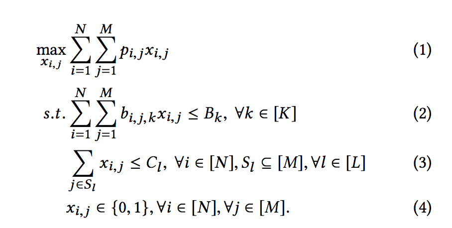
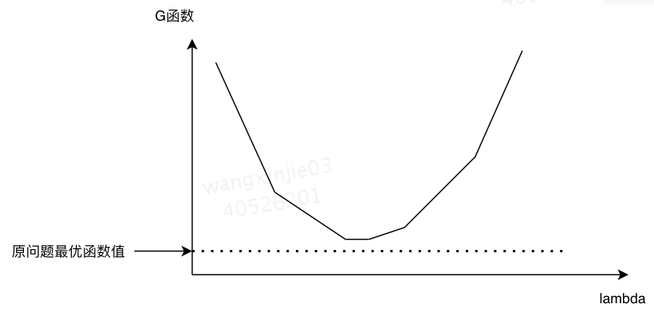
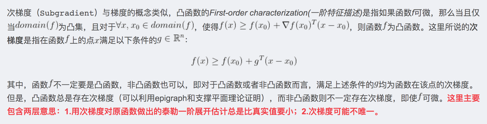

# 拉格朗日
## 建模
定义原问题为：

- N个个体，M中权益，K个全局约束，L个局部约束
a. 全局约束例子：整体成本<=B，ROI>=C ...
b. 局部约束例子：每个人有且只有1个权益，每个人<=2个权益 ...
- p_ij 第i个人分配第j种权益下的转化率
- x_ij 第i个人是否分配第j种权益
- b_ijk 第i个人分配第j种权益下，对于第k个全局约束的消耗
- C_l 第l个局部约束中最多选择C_l个权益

## 拉格朗日松弛
将原问题的全局约束进行松弛，则原问题的松弛问题 G(x, lambda) 可写为：
$$
\begin{array}{l}
\max _{x_{i, j}} \sum_{i=1}^{N} \sum_{j=1}^{M} p_{i, j} x_{i, j}-\sum_{k=1}^{K} \lambda_{k}\left(\sum_{i=1}^{N}  \sum_{j=1}^{M} b_{i, j, k} x_{i, j}-B_{k}\right) \\[6mm]
\text { s.t. } \sum_{j \in S_{l}} x_{i, j} \leq C_{l}, \forall i \in[N], S_{l} \subseteq[M], \forall l \in[L] \\[6mm]
x_{i, j} \in\{0,1\}, \forall i \in[N], \forall j \in[M] \\[5mm]
\end{array}
$$
- G(x, lambda) 恒 >= P
a. 给定任意>=0的lambda, 若 G(x, lambda) 的解x满足原问题约束，则 G(x,lambda) 右侧约束部分<=0，此时 G(x,lambda)>=原问题函数值P
b. 给定任意>=0的lambda, 若 G(x,lambda) 的解x不满足原问题约束，则意味着对应的G(x,lambda)函数值比满足原问题约束条件的所有x对应的函数值更好，同样也可以得出 G(x,lambda)>=原问题函数值P
- G(x, lambda) 是关于lambda的凸函数,其凸性与原目标函数和约束函数凹凸与否无关。
参见：https://blog.csdn.net/u014540876/article/details/79153913
- lambda >= 0

## 对偶转化
对偶函数 G(x, lambda) 是原问题最优值 P 的上界 (取min的时候是下界)，因此最好的上界就是最小化对偶函数
$$
\begin{array}{l}
\min _{\lambda} \max _{x_{i, j}} \sum_{i=1}^{N} \sum_{j=1}^{M} p_{i, j} x_{i, j}-\sum_{k=1}^{K} \lambda_{k}\left(\sum_{i=1}^{N} \sum_{j=1}^{M} b_{i, j, k} x_{i, j}-B_{k}\right) \\[6mm]
\text { s.t. } \sum_{j \in S_{l}} x_{i, j} \leq C_{l}, \forall i \in[N], S_{l} \subseteq[M], \forall l \in[L] \\[6mm]
x_{i, j} \in\{0,1\}, \forall i \in[N], \forall j \in[M] \\[6mm]
\lambda \ge 0 \\
\end{array}
$$
令 P 为原问题最优解， d 为对偶转化后最优解，则 d >= P. (松弛解 >= 对偶解 >= 原问题解)
- 当 d >= P 时，为弱对偶
- 当 d == P 时，为强对偶

满足KKT条件为强对偶问题，即对对偶转化后的问题求解的d即为原问题P的最优解
$$
\left\{\begin{array}{ll}
\left.\frac{\partial L\left(x, \lambda^{*}, v^{*}\right)}{\partial x}\right|_{x=x^{*}}=0 & \text { (stationarity) } \\
\lambda_{i}^{*} f_{i}\left(x^{*}\right)=0 & (\text { complementary slackness }) \\
f_{i}\left(x^{*}\right) \leq 0, h_{j}\left(x^{*}\right)=0 & (\text { primal feasibility }) \\
\lambda_{i}^{*} \geq 0 & (\text { dual feasibility })
\end{array}\right.
$$
参见：https://zhuanlan.zhihu.com/p/103961917

## 求解
利用 G(x,lambda) 是关于lambda的凸函数性质，可以设计一些策略来快速求解对偶问题，通常对偶问题的解对应的X，也是原问题的一个质量非常高的解。

拉格朗日松弛与对偶转换的意义：
- 去掉了难以解决的全局成本约束项目，在给定lambda后，可以拆分到每一个待决策的个体(i = 1->N)并行计算
- 建模方法对应了一个lambda解向量，假定我们online数据的统计规律上与离线建模工作中的数据集一致，那么线上可以直接针对子问题优化，就可以具备全局优化的能力

### DD对偶下降法
DD（Dual Descent）利用对偶问题的为凸函数的性质，通过寻找对偶问题的次梯度来进行优化求解
注意对偶问题除了是凸函数之外，还是一个分段线性函数（其原因为，只有在lambda的取值刚好使得某个个体的最优决策点发生变化时，才能改变G函数的左半部分计算值）

`次梯度`

目前的研究中，一般将当前的 “预期消耗” - “约束” 作为次梯度方向：
$$ \sum_{i=1}^{N} \sum_{j=1}^{M} b_{i, j, k} x_{i, j}-B_{k} $$

对于可导的凸函数，我们通常使用常规的梯度下降法处理，但当目标函数不可导（在某些点上导数不存在）时，我们就没法使用常规的梯度下降法处理。于是引入次梯度（Subgradient）用于解决此类目标函数并不总是处处可导的问题。
f 在 x0 处的左导数：
$$
a=\lim _{x \rightarrow x_{0}^{-}} \frac{f(x)-f\left(x_{0}\right)}{x-x_{0}}
$$
f 在 x0 处的右导数：
$$
b=\lim _{x \rightarrow x_{0}^{+}} \frac{f(x)-f\left(x_{0}\right)}{x-x_{0}}
$$
凸函数 f 的次微分等于闭区间 [a, b] ，[a, b] 中任何一个取值都是次梯度。

参考：https://km.sankuai.com/page/718404319

### SCD同步坐标下降法
