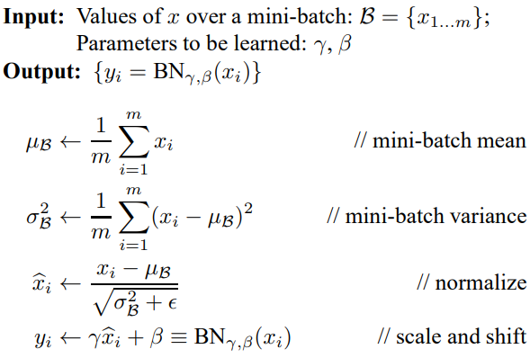
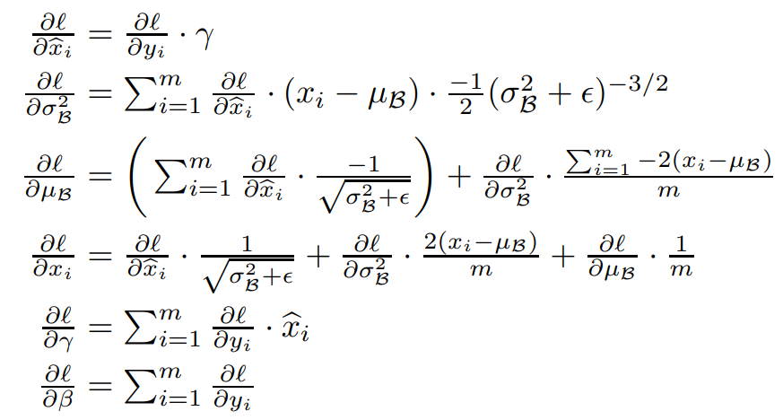

# 神经网络各种算子实现
参考：https://github.com/Halfish/cs231n/blob/master/assignment2/cs231n/layers.py

## relu
```python
def relu_forward(x):
    """
    x: inputs
    out: output
    cache: x
    """
    out = np.maximum(0, x)
    cache = x
    return out, cache

def relu_backward(dout, cache):
    """
    dout: 上游传来的导数
    cache: input 该层的输入
    """
    x = cache
    dx = dout * (x > 0)
    return dx
```

## batch normalization



```python
def batchnorm_forward(x, gamma, beta, bn_param):
    """
    x.shape (N, D) N个samples，D维特征
    gamma.shape (D,)
    beta.shape (D,)
    bn_param:
      - mode: 'train' or 'test'
      - eps: Constant for numeric stability
      - momentum: Constant for running mean / variance
      - running_mean: Array of shape (D,) giving running mean of features
      - running_var:  Array of shape (D,) giving running variance of features

    out.shape (N, D)
    cache, tuple values needed in backward
    """
    mode = bn_param['mode']
    eps = bn_param['eps']
    momentum = bn_param['momentum']
    N, D = x.shape
    running_mean = bn_param.get('running_mean', np.zeros(D, dtype=x.dtype))
    running_var = bn_param.get('running_var', np.zeros(D, dtype=x.dtype))

    out, cache = None, None
    if mode == 'train':
        sample_mean = np.mean(x, axis=0) # (D,)
        sample_var = np.var(x, axis=0) # (D,)
        x_hat = (x - sample_mean) / np.sqrt(sample_var + eps)
        out = gamma * x_hat + beta
        cache = (x, gamma, beta, x_hat, sample_mean, sample_var, eps)
        running_mean = momentum * running_mean + (1 - momentum) * sample_mean
        runing_var = momentum * running_var + (1 - momentum) * sample_var
    else:
        x_hat = (x - running_mean) / np.sqrt(running_var)
        out = gamma * x_hat + beta
    bn_param['running_mean'] = running_mean
    bn_param['running_var'] = running_var

    return out, cache
```



```python
def batchnorm_backward(dout, cache):
  """
  Inputs:
  - dout: Upstream derivatives, of shape (N, D)
  - cache: Variable of intermediates from batchnorm_forward.
  Returns a tuple of:
  - dx: Gradient with respect to inputs x, of shape (N, D)
  - dgamma: Gradient with respect to scale parameter gamma, of shape (D,)
  - dbeta: Gradient with respect to shift parameter beta, of shape (D,)
  """
  dx, dgamma, dbeta = None, None, None
  x, gamma, beta, x_hat, sample_mean, sample_var, eps = cache
  m = dout.shape[0] # m is N here
  dxhat = dout * gamma # (N, D)
  dvar = (dxhat * (x-sample_mean) * (-0.5) * np.power(sample_var+eps, -1.5)).sum(axis = 0)  # (D,)
  dmean = np.sum(dxhat * (-1) * np.power(sample_var + eps, -0.5), axis = 0)
  dmean += dvar * np.sum(-2 * (x - sample_mean), axis = 0) / m
  dx = dxhat * np.power(sample_var + eps, -0.5) + dvar*2*(x - sample_mean) / m + dmean / m
  dgamma = np.sum(dout * x_hat, axis = 0)
  dbeta = np.sum(dout, axis = 0)

  return dx, dgamma, dbeta
```

## dropout
```python
def dropout_forward(x, dropout_param):
    p = dropout_param['p'] # drop out ratio
    mode = dropout_param['mode'] # 'train' or 'test'
    np.random.seed(dropout_param.get('seed', 0))
    mask, out = None, None
    if mode == 'train':
        mask = np.random.rand(x.shape) < (1-p)
        mask = mask / (1-p)
        out = mask * x
    else:
        out = x
    cache = (dropout_param, mask)
    out = out.astype(x.dtype, copy=False)
    return out, cache

def dropout_backward(dout, cache):
    """
    Inputs:
    - dout: Upstream derivatives, of any shape
    - cache: (dropout_param, mask) from dropout_forward.
    """
    dropout_param, mask = cache
    mode = dropout_param['mode']
    dx = None
    if mode == 'train':
        dx = dout * mask
    else:
        dx = dout
    return dx
```

## 卷积 conv

```python
def conv_forward(feature, filter, bias, conv_param):
    """
    :param feature: input batch image feature map, shape (batch, img_h, img_w, channel)
    :param filter:  implemented filter, shape (filter_num, filter_h, filter_w, filter_channel)
    :param bias: biases, shape (filter_num)
    :param conv_param: dictionary which contains 'pad', 'stride', ...
    :return: output feature map
    """
    batch, feature_h, feature_w, channel = feature.shape
    filter_num, filter_h, filter_w, filter_channel = filter.shape
    pad = conv_param['pad']
    stride = conv_param['stride']
    feature_pad = np.pad(x, ((0,0), (0,0), (pad,pad),(pad,pad)), 'constant')
    feature_out_h = 1 + (feature_h + 2 * pad - filter_h) // stride)
    feature_out_w = 1 + (feature_w + 2 * pad - filter_w) // stride)
    feature_out = np.zeros((batch, filter_num, feature_out_h, feature_out_w))

    for b in range(barch):
        for f in range(filter_num):
            for i in range(feature_out_h):
                for j in range(feature_out_w):
                    feature_window = feature_pad[b, :, i*stride:i*stride+filter_h, j*stride:j*stride+filter_w].reshape(1, -1)
                    filter_vector = filter[f].reshape(-1, 1)
                    feature_out[b, f, i, j] = feature_window.dot(filter_vector) + bias[f]
    cache = (feature, filter, bias, conv_param)
    return feature_out, cache
```
优化版本
```python  
feature_ori = np.zeros((Ho, Wo, 3))
feature = np.zeros((Ho+2*p, Wo+2*p, 3))
feature[p:-p, p:-p, :] = feature_ori
matrix = np.zeros((Ho*Wo, Ci*k*k))
row = 0
for i in range(Ho):
    for j in range(Wo):
        window = feature[i*s:i*s+k, j*s:j*s+k, :].reshape(-1)
        matrix[row] = window
filters = filters.transpose()# (Ci*k*k, Co)
output = np.dot(matrix, filters) # (Ho*Wo, Co)
output = output.reshape(Ho, Wo, Co)
```

```python
def conv_backward_naive(dout, cache):
    """
    A naive implementation of the backward pass for a convolutional layer.
    Inputs:
    - dout: Upstream derivatives.
    - cache: A tuple of (x, w, b, conv_param) as in conv_forward_naive
    Returns a tuple of:
    - dx: Gradient with respect to x
    - dw: Gradient with respect to w
    - db: Gradient with respect to b
    """

    x, w, b, conv_param = cache

    N, C, H, W = x.shape
    F, _, HH, WW = w.shape
    stride, pad = conv_param['stride'], conv_param['pad']
    H_out = 1 + (H + 2 * pad - HH) / stride
    W_out = 1 + (W + 2 * pad - WW) / stride

    x_pad = np.pad(x, ((0,), (0,), (pad,), (pad,)), mode='constant', constant_values=0)
    dx = np.zeros_like(x)
    dx_pad = np.zeros_like(x_pad)
    dw = np.zeros_like(w)
    db = np.zeros_like(b)

    db = np.sum(dout, axis = (0,2,3))

    x_pad = np.pad(x, ((0,), (0,), (pad,), (pad,)), mode='constant', constant_values=0)
    for i in range(H_out):
      for j in range(W_out):
          x_pad_masked = x_pad[:, :, i*stride:i*stride+HH, j*stride:j*stride+WW]
          for k in range(F): #compute dw
              dw[k ,: ,: ,:] += np.sum(x_pad_masked * (dout[:, k, i, j])[:, None, None, None], axis=0)
          for n in range(N): #compute dx_pad
              dx_pad[n, :, i*stride:i*stride+HH, j*stride:j*stride+WW] += np.sum((w[:, :, :, :] *
                                                 (dout[n, :, i, j])[:,None ,None, None]), axis=0)
    dx = dx_pad[:,:,pad:-pad,pad:-pad]
    return dx, dw, db
```

## max pooling
每次取池化窗口取max写入out
```python
def max_pool_forward(x, pool_param):
    """
    Inputs:
    - x: Input data, of shape (N, C, H, W)
    - pool_param: dictionary with the following keys:
    - 'pool_height': The height of each pooling region
    - 'pool_width': The width of each pooling region
    - 'stride': The distance between adjacent pooling regions
    Returns a tuple of:
    - out: Output data
    - cache: (x, pool_param)
    """
    N, C, H, W = x.shape
    pool_height, pool_width = pool_param['pool_height'], pool_param['pool_width']
    stride = pool_param['stride']
    out_height = H // pool_height
    out_width = W // pool_width
    out = np.zeros((N, C, out_height, out_width))
    for i in range(out_height):
        for j in range(out_width):
            mask = x[:, :, i*stride:i*stride+pool_height, j*stride:j*stride+pool_width]
            out[:, :, i, j] = np.max(mask, axis=(2,3))
    cache = (x, pool_param)
    return out, cache
```
```python
def max_pool_backward(dout, cache):
    """
    Inputs:
    - dout: Upstream derivatives
    - cache: A tuple of (x, pool_param) as in the forward pass.
    Returns:
    - dx: Gradient with respect to x
    """
    x, pool_param = cache
    N, C, H, W = x.shape
    pool_height, pool_width = pool_param['pool_height'], pool_param['pool_width']
    stride = pool_param['stride']
    dx = np.zeros_like(x)
    out_height = H // pool_height
    out_width = W // pool_width
    for i in range(out_height):
        for j in range(out_width):
            x_mask = x[:, :, i*stride:i*stride+pool_height, j*stride:j*stride+pool_width]
            dx_mask = dx[:, :, i*stride:i*stride+pool_height, j*stride:j*stride+pool_width]
            flags = np.max(x_mask, axis=(2,3), keepdims=True) == x_mask
            dx_mask += flags * (dout[:, :, i, j])[:, :, None, None]
    return dx
```

## softmax loss
计算softmax时候，为了防止数值溢出，会减去一个exp指数上的最大值
```python
def softmax_loss(x, y):
    """
    Computes the loss and gradient for softmax classification.
    Inputs:
    - x: Input data, of shape (N, C) where x[i, j] is the score for the jth class
    for the ith input.
    - y: Vector of labels, of shape (N,) where y[i] is the label for x[i] and
    0 <= y[i] < C
    Returns a tuple of:
    - loss: Scalar giving the loss
    - dx: Gradient of the loss with respect to x
    """
    probs = np.exp(x - np.max(x, axis=1, keepdims=True))
    probs /= np.sum(probs, axis=1, keepdims=True)
    N = x.shape[0]
    loss = -np.sum(np.log(probs[np.arange(N), y])) / N
    dx = probs.copy()
    dx[np.arange(N), y] -= 1
    dx /= N
    return loss, dx
```

## 融合Conv和BN层
BN 可以写成
, 即
$$ W_{bn} = \frac{\gamma}{\sigma^2 + \varepsilon} $$
$$ b_{bn} = \beta - \frac{\gamma u}{\sqrt{\sigma^2 + \varepsilon}} $$
现在融合卷积与BN
$$ f(X) = W_{bn}(W_{conv}X + b_{conv}) + b_{bn} $$

nn.Conv2d参数:


nn.BatchNorm2d参数:


```python
import torch
import torchvision

    def fuse(conv, bn):
        fused = torch.nn.Conv2d(
            conv.in_channels,
            conv.out_channels,
            kernel_size=conv.kernel_size,
            stride=conv.stride,
            padding=conv.padding,
            bias=True
        )

        # setting weights
        w_conv = conv.weight.clone().view(conv.out_channels, -1)
        w_bn = torch.diag(bn.weight.div(torch.sqrt(bn.eps+bn.running_var)))
        fused.weight.copy_( torch.mm(w_bn, w_conv).view(fused.weight.size()) )

        # setting bias
        if conv.bias is not None:
            b_conv = conv.bias
        else:
            b_conv = torch.zeros( conv.weight.size(0) )
        b_conv = torch.mm(w_bn, b_conv.view(-1, 1)).view(-1)
        b_bn = bn.bias - bn.weight.mul(bn.running_mean).div(
                              torch.sqrt(bn.running_var + bn.eps)
                            )
        fused.bias.copy_( b_conv + b_bn )

        return fused

    # Testing
    # we need to turn off gradient calculation because we didn't write it
    torch.set_grad_enabled(False)
    x = torch.randn(16, 3, 256, 256)
    resnet18 = torchvision.models.resnet18(pretrained=True)
    # removing all learning variables, etc
    resnet18.eval()
    model = torch.nn.Sequential(
        resnet18.conv1,
        resnet18.bn1
    )
    f1 = model.forward(x)
    fused = fuse(model[0], model[1])
    f2 = fused.forward(x)
    d = (f1 - f2).mean().item()
    print("error:",d)
```
