# 立体视觉 Stereo Vision
最近在研究一些双目3D，深度估计的方向，但是中文这方面系统性的知识很少，于是在学习的同时做个总结。这份总结会从传统stereo vision的知识点与数学基础开始，过渡到深度学习的方法。
reference:
http://www.vision.deis.unibo.it/smatt/Seminars/StereoVision.pdf

## 传统 Stereo Vision
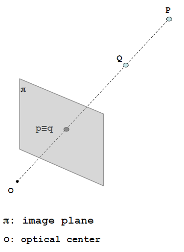
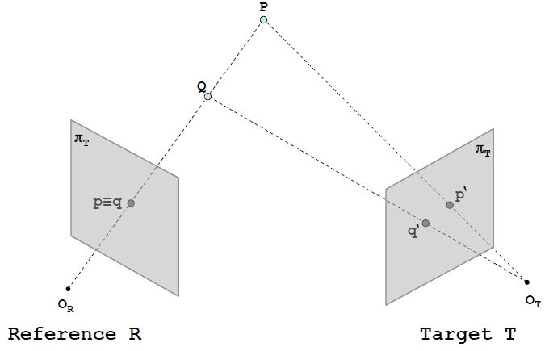

通过使用使用两个（或多个）相机，如果能在两个图像中找到对应点，则可以通过三角测量(triangulation)来推断深度

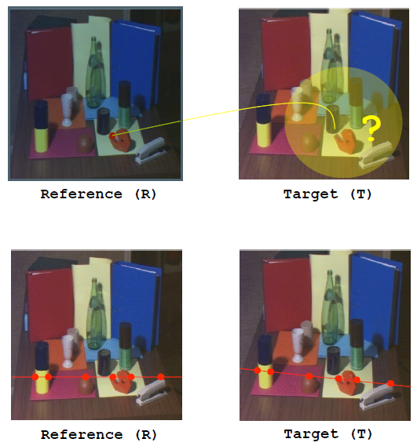
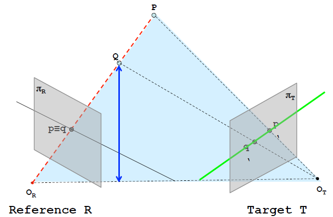

对极约束(epipolar constraint)指出: 位于（红色）视线的点的对应点位于目标图像像平面πT上的绿线上。

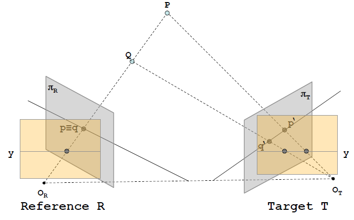

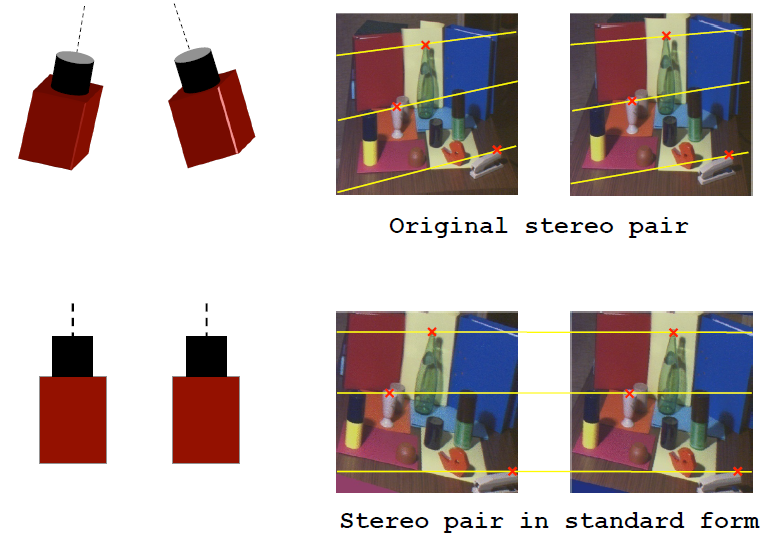

可以找到平行的相平面，使得πR与πT上的成像点位于同一扫描线上

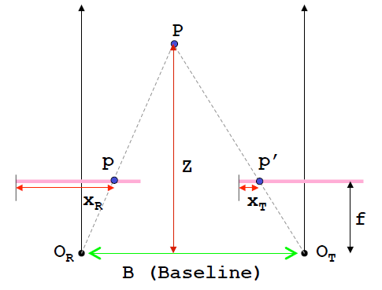

视差dis与深度Z的转换：相似三角形
$$ \frac{b}{Z} = \frac{(b - x_R) + x_T}{Z - f} $$
$$ Z = \frac{b * f}{x_R - x_T} = \frac{b * f}{dis} $$
根据Triangulation，世界坐标系的X, Y 也能由如下公式算出
$$ X = Z * \frac{x_R}{f}$$
$$ Y = Z * \frac{y_R}{f}$$

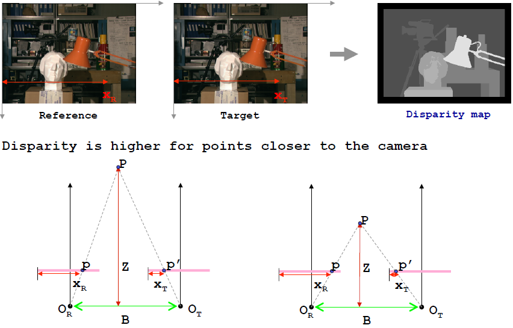

离摄像头越近，视差越大

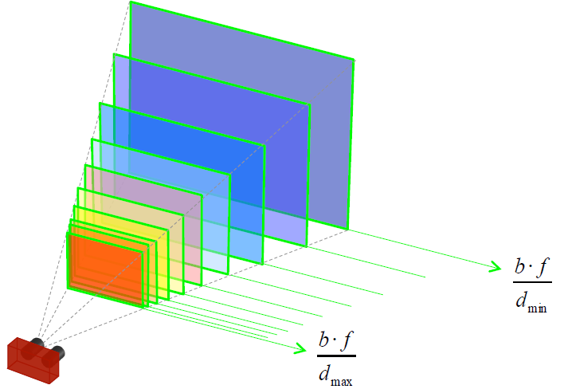

每个视差值对应一个深度平面, 深度Z的范围Horopter受限于视差d

立体视觉算法总体分为如下4个步骤
1) Matching cost computation 匹配损失计算
2) Cost aggregation 损失聚合
3) Disparity computation/optimization 视差计算/优化
4) Disparity refinement 视差细化

在1之前还有一些前处理的方法，例如：Laplacian of Gaussian (LoG) filtering, Subtraction of mean values computed in nearby pixels, Bilateral filtering, Census transform

### Local approaches
1. Matching cost computation + 2. Cost aggregation (+ WTA)

### Global (semi-global) approaches
1. Matching cost computation + 3. Disparity computation/optimization

### 1 + 2. Matching cost computation & Cost aggregation (+ WTA)

#### Pixel level

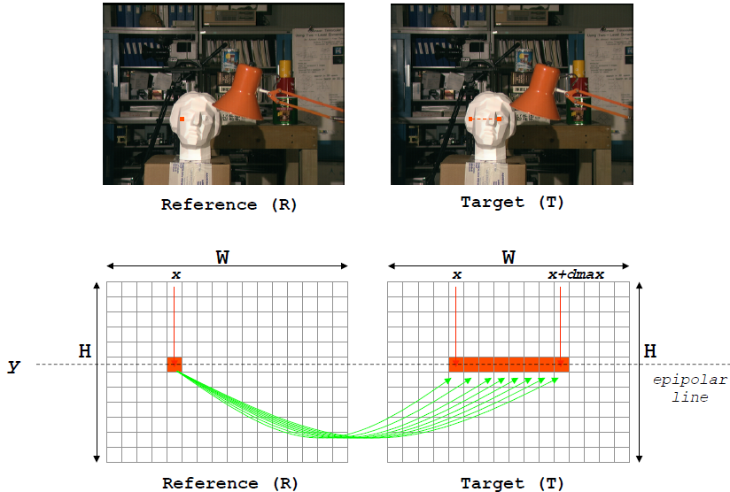

#### Fixed Window (FW)
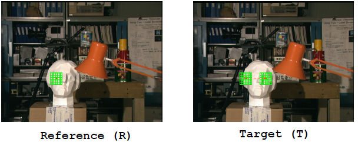

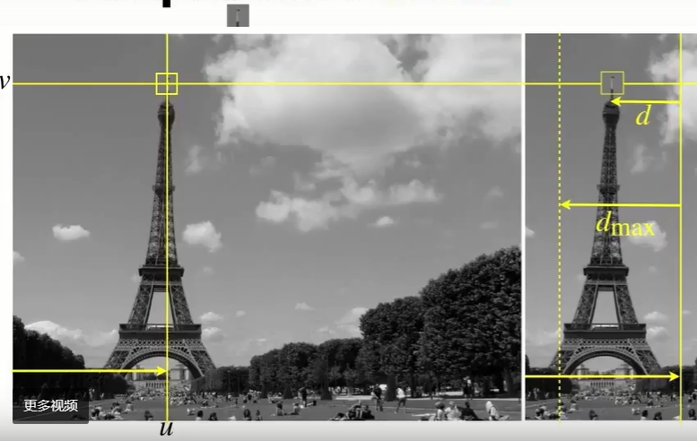

R平面上红点的对应点，在T平面对极线 [x, x+dmax] 范围内寻找

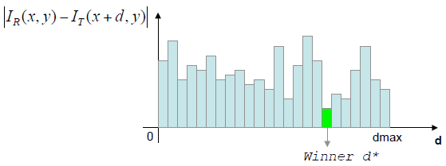

在像素层面计算匹配点(区域)的相似度(matching cost), winner takes all(WTA), cost最小的作为匹配点

#### Matching cost fomular
##### Single pixel
- Absolute differences
$$ e(x,y,d) = |I_R(x,y) - I_T(x+d,y)| $$
- Squared differences
$$ e(x,y,d) = (I_R(x,y) - I_T(x+d,y))^2 $$

##### Fixed Window (FW)
- Sum of Absolute differences (SAD)
$$ C(x,y,d) = \sum_{x∈S}|I_R(x,y) - I_T(x+d,y)| $$
- Sum of Squared differences (SSD)
$$ e(x,y,d) = \sum_{x∈S}(I_R(x,y) - I_T(x+d,y))^2 $$

基于window的matching cost计算会受以下因素影响：
- implicitly assumes frontal-parallel surfaces 假设平面平行

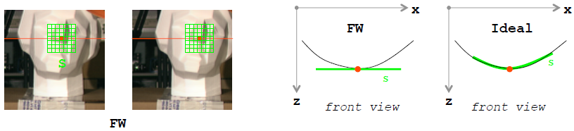
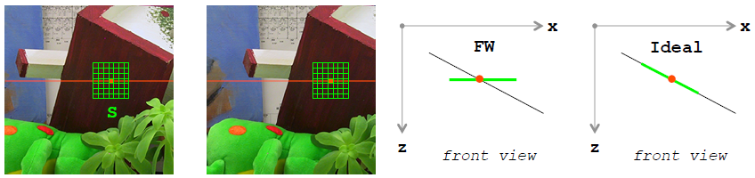

- ignores depth discontinuities 忽略深度不连续性

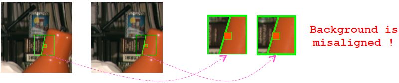

- does not deal explicitly with uniform areas and repetitive patterns 没有明确处理统一区域与重复模式

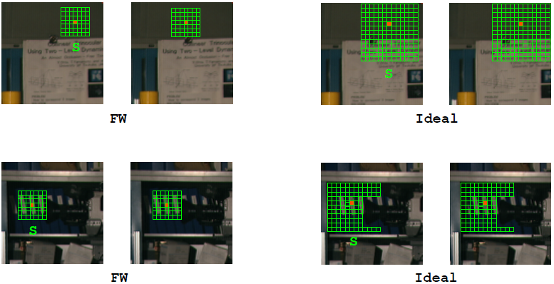

基于上述问题的一系列改进方案
- Shiftable Windows： D. Scharstein and R. Szeliski, A taxonomy and evaluation of dense two-frame stereo correspondence algorithms Int. Jour. Computer Vision, 47(1/2/3):7–42, 2002
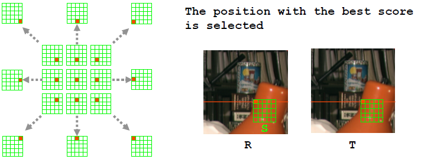

- Multiple Windows：H. Hirschmuller, P. Innocent, and J. Garibaldi, Real-time correlation-based stereo vision with reduced border errors Int. Journ. of Computer Vision, 47:1–3, 2002
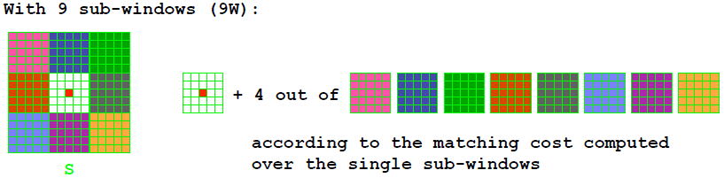

- Variable Windows：O. Veksler, Fast variable window for stereo correspondence using integral images In Proc. Conf. on Computer Vision and Pattern Recognition (CVPR 2003), pages 556–561, 2003

- Segmentation based
- Bilateral Filtering
- Adaptive Weights
- Segment Support
- Fast Aggregation

### 3. Disparity computation/optimization
目标：基于整个stereo pair找到最佳视差匹配
定义了能量函数E(d)
$$ E(d) = E_{data}(d) + E_{smooth}(d) $$

$E_{data}$ 衡量stereo pair的匹配程度 (基于总体 matching cost)

$E_{smooth}$ 衡量边界处的连续性

一系列可参考的方法
- Graph Cuts: V. Kolmogorov and R. Zabih, Computing visual correspondence with occlusions using graph cuts, ICCV 2001
- BP + segmentation: A. Klaus, M. Sormann and K. Karner, Segment-based stereo matching using belief propagation and a self-adapting dissimilarity measure. ICPR 2006
- Cooperative + segmentation: Z. Wang and Z. Zheng, A region based stereo matching algorithm using cooperative optimization, CVPR 2008
- Dynamic Programming: D. Scharstein and R. Szeliski, A taxonomy and evaluation of dense two-frame stereo correspondence algorithms Int. Jour. Computer Vision, 47(1/2/3):7–42, 2002
- Scanline Optimization: H. Hirschmüller. Stereo vision in structured environments by consistent semi-global matching. CVPR 2006, PAMI 30(2):328-341, 2008

### 4. Disparity refinement
修正计算的视差异常值
以下可参考的方法
- Sub-pixel interpolation
- Image filtering: Median filtering, Morphological operators, Bilateral filtering
- Single Matching Phase
- Segmentation based outliers identification and replacement
- Iterative approaches

## 补充

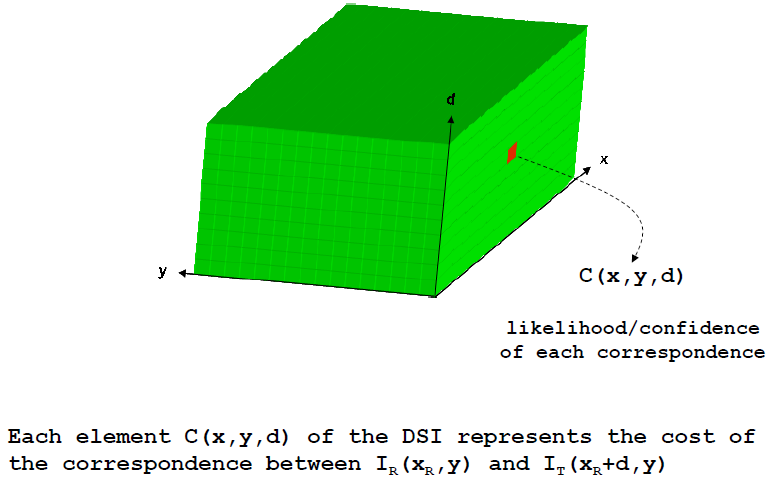

[0, d] 为 在R平面上点$x_R$对应T平面$x_R$向左搜索的范围, 如果对图片上每个点进行搜索匹配计算cost，就会形成上图3维的DSI视差匹配代价空间(cost volume)
如果WTA，就是在d维度上求min，变成2维，每个格子里可储存的是该像素点最小cost对应的d值，完成视差计算，进一步就可以通过 $Z = \frac{b * f}{dis}$ 转为深度了

## 初步思路
stereo imgs 输入同一个神经网络，做目标检测，在ROI对应的feature上构建cost volume，再来几层卷积，对应该ROI的深度
