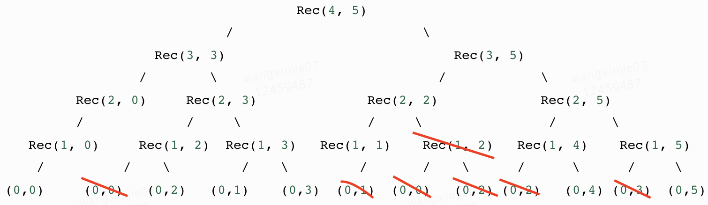

# 背包专栏

## 背景
背包问题是典型的 max 目标值，同时保证其他相关指标满足约束的问题，在不同的组合优化场景下，都可以有所应用，有比较高的实践价值。

因此梳理在这个wiki中，在这个wiki中除了整理了网上常见的背包问题和相关解法，还基于实际项目提出了变种背包问题的解法，使得背包解法的使用更加一般化（网上没有）

## 01背包
### 经典01背包
有 n 个物品和一个大小为 m 的背包. 给定数组 A 表示每个物品的大小和数组 V 表示每个物品的价值. 问最多能装入背包的总价值是多大? 所挑选的要装入背包的物品的总大小不能超过 m, 每个物品只能取一次
```
n = 4, m = 5
(a, v)={(2, 3), (3, 4), (1, 2), (2, 2)}
Rec(i, j) -> 还有i个物品可以选择，还有j的背包空间
                                        Rec(4, 5)
                               /                        \
                      Rec(3, 3)                             Rec(3, 5)
                    /        \                            /            \
            Rec(2, 0)     Rec(2, 3)              Rec(2, 2)             Rec(2, 5)  
            /             /     \                /     \                /       \
      Rec(1, 0)     Rec(1, 2)  Rec(1, 3)   Rec(1, 1)    Rec(1, 2)   Rec(1, 4)    Rec(1, 5)
       /          /    \         /    \         /       /    \      /      \      /     \
   (0,0)     (0,0)   (0,2)   (0,1)    (0,3)  (0,1)  (0,0)   (0,2) (0,2)   (0,4) (0,3)  (0,5)
```
递归从上至下，把大问题拆成小问题，再把小问题的结果合并，得到大问题的解
动态规划：
- 记忆化从下至上，把小问题的解存储在dp数组，当解决大问题需要小问题的解，再过来查表。
- 去除重复计算，对于任意Rec(i, j) 最多计算一次，因此计算次数最多为 O(n*m)

```python
class Solution:
    def backPack_search(self, m, A, V):
        #-- 记忆化递归
        n = len(A)
        dp = [[0 for i in range(m+1)] for j in range(n+1)]
        def helper(index, value, weight):
            if index == n:
                return 0
            if dp[index][weight]:
                return dp[index][weight]
            res = 0
            if weight + A[index] <= m:
                pick = helper(index+1, value, weight+A[index]) + V[index]
                not_pick = helper(index+1, value, weight)
                res = max(pick, not_pick)
            else:
                not_pick = helper(index+1, value, weight)
                res = not_pick
            dp[index][weight] = res
            return res

        return helper(0, 0, 0)

	 def backPack_dp_two(self, m, A, V):
        #--- 二维dp
        n, m = len(A)+1, m+1
        dp = [[0 for j in range(m)] for i in range(n)]
        for i in range(1, n):
            for j in range(m-1, 0, -1):
                if j < A[i-1]:
                    dp[i][j] = dp[i-1][j]
                else:
                    dp[i][j] = max(dp[i-1][j], dp[i-1][j-A[i-1]]+V[i-1])
        return dp[-1][-1]

		def backPack_dp_one(self, m, A, V):
        #--- 一维dp
        n, m = len(A)+1, m+1
        dp = [0 for i in range(m)]
        for i in range(1, n):
            for j in range(m-1, -1, -1):
                if j < A[i-1]:
                    continue
                else:
                    dp[j] = max(dp[j], dp[j-A[i-1]] + V[i-1])
        return dp[-1]
```

### 简化01背包
在n个物品中挑选若干物品装入背包，最多能装多满？假设背包的大小为m，每个物品的大小为A[i]
```python
class Solution:
    def backPack(self, m, A):
        # --- 递归
        n = len(A)
        dp = [[0 for i in range(m+1)] for j in range(n+1)]
        def helper(index, curr):
            if index == n:
                dp[index][curr] = curr
                return dp[index][curr]
            if dp[index][curr] > 0:
                return dp[index][curr]
            res = 0
            if curr+A[index] <= m:
                pick = helper(index+1, curr+A[index])
                not_pick = helper(index+1, curr)
                res = max(pick, not_pick)
            else:
                not_pick = helper(index+1, curr)
                res = not_pick
            dp[index][curr] = res
            return res
        return helper(0,0)

        #--- 二维数组
        n, m = len(A)+1, m+1
        dp = [[0 for j in range(m)] for i in range(n)]
        for i in range(1, n):
            for j in range(m-1, 0, -1):
                if j < A[i-1]:
                    dp[i][j] = dp[i-1][j]
                else:
                    dp[i][j] = max(dp[i-1][j], dp[i-1][j-A[i-1]]+A[i-1])
        # print(dp)
        return dp[-1][-1]

        #--- 一维数组
        n, m = len(A)+1, m+1
        dp = [0] * m
        for i in range(1, n):
            # 01背包逆序,完全背包正序
            for j in range(m, 0, -1):
                if j < A[i-1]:
                    continue
                dp[j] = max(dp[j], dp[j-A[i-1]]+A[i-1])
            # print(dp)
        return dp[-1]
```

### 完全背包
给出 n 个物品, 以及一个数组, nums[i]代表第i个物品的大小, 保证大小均为正数并且没有重复,正整数 target 表示背包的大小, 找到能填满背包的方案数。每一个物品可以使用无数次
```python
n, m = map(int, input().split())
dp = [0] * (m + 1)
for i in range(1, n + 1):
  v, w = map(int, input().split())
  for j in range(v, m + 1):
    dp[j] = max(dp[j], dp[j - v] + w)
    print(dp[m])
```

### 多重背包
有 N 种物品和一个容量是 V 的背包。 第 i 种物品最多有 si 件，每件体积是 vi，价值是 wi。求解将哪些物品装入背包，可使物品体积总和不超过背包容量，且价值总和最大, 输出最大价值。
最简单的方法转化为01背包即可，有兴趣可以了解一下二进制优化和单调队列优化
```python
N, V = list(map(int, input().split()))
v, w, s = [], [], []
for i in range(N):
    vi, wi, si = list(map(int, input().split()))
    v.extend([vi]*si)
    w.extend([wi]*si)
N = len(v)
dp = [0 for j in range(V+1)]
for i in range(1, N+1):
    for j in range(V, v[i-1]-1, -1):
        dp[j] = max(dp[j], dp[j-v[i-1]] + w[i-1])
print(dp[-1])
```

### 分组背包

有 N 组物品和一个容量是 V 的背包。每组物品有若干个，同一组内的物品最多只能选一个。
每件物品的体积是 vij，价值是 wij，其中 i 是组号，j 是组内编号。求解将哪些物品装入背包，可使物品总体积不超过背包容量，且总价值最大。输出最大价值，最大价值对应组合。
```python
v = [[],[1,2],[3],[4],[1,2]] # volume
w = [[],[2,4],[4],[5],[3,4]] # value
n = len(v) - 1
m = 6 # max knapsack volume

s = [len(item) for item in v]
# dp[i][j] 只从前i组物品中选，当前体积小于等于j的最大价值
dp = [[0 for j in range(m+1)] for i in range(n+2)]

for i in range(n, 0, -1):
    for j in range(m, 0, -1):
        dp[i][j] = dp[i+1][j]
        for k in range(s[i]):
            if (j >= v[i][k]):
                dp[i][j] = max(dp[i][j], dp[i+1][j-v[i][k]] + w[i][k])
j = m
result = []
for i in range(1, n+1):
    for k in range(s[i]):
        if (j >= v[i][k] and dp[i][j] == dp[i+1][j-v[i][k]] + w[i][k]):
            result.append([i, k+1, v[i][k], w[i][k]])
            j -= v[i][k]

# max value
print(dp[1][m])
# [i, k, volume, weight]
print(result)
```

#### 实际问题1

从常规流程用户以及一体化用户同等坐标的格子中二选一，最大化首借，s.t. 授信用户数 <= C ，求最优解方案

```python
def package_solver(v, w, n, m):
    dp = [[0 for i in range(m + 2)] for j in range(n + 2)]
    for i in range(n, 0, -1):
        for j in range(m+1):
            dp[i][j] = dp[i+1][j]
            if (j >= v[i]):
                dp[i][j] = max(dp[i][j], dp[i+1][j-v[i]] + w[i])

    j = m
    result = []
    for i in range(1, n+1):
        if (j >= v[i] and dp[i][j] == dp[i+1][j-v[i]] + w[i]):
            result.append(i)
            j -= v[i]
    return result


def helper(inp, credit_c):
    # solution with min credit, min lexicographic order
    ans = []
    min_credit = 0
    for item in inp:
        test, ctrl, index = item
        t_loan, t_credit = test
        c_loan, c_credit = ctrl
        # <= 0 -> prefer 0: test group
        res = 0 if t_credit <= c_credit else 1
        ans.append(res)
        min_credit += item[res][1]

    # compare with specified credit
    if min_credit > credit_c:
        return [], -1, -1, []

    # cast to 01 package problem
    credit_c -= min_credit
    v = [0]
    w = [0]
    indexs = [0]
    for i in range(len(inp)):
        choice = ans[i]
        diff_w = inp[i][1-choice][0] - inp[i][choice][0]
        if diff_w <= 0:
            continue
        diff_v = inp[i][1-choice][1] - inp[i][choice][1]
        index = inp[i][2]
        indexs.append(index)
        w.append(diff_w)
        v.append(diff_v)

    # solve 01 package problem
    result = package_solver(v, w, len(v)-1, credit_c)

    # replace packages
    for idx in result:
        ans[indexs[idx]-1] = 1 - ans[indexs[idx]-1]

    finial_loan = 0
    finial_credit = 0
    pick = []
    for i, choice in enumerate(ans):
        finial_loan += inp[i][choice][0]
        finial_credit += inp[i][choice][1]
        pick.append(inp[i][choice])

    return ans, finial_loan, finial_credit, pick


if __name__ == '__main__':
    # inp 3-d list: [ [[t_loan, t_credit], [c_loan, c_credit], index], ... ]
    inp = [[[80, 50], [100, 100], 1],
           [[150, 60], [120, 90], 2],
           [[150, 60], [120, 30], 3],
           [[150, 60], [120, 30], 4]]
    credit_c = 140000

    print("calculating ...")
    ans, finial_loan, finial_credit, res = helper(inp, credit_c)
    if len(ans) > 0:
        print("choice: {}".format(ans))
        print("loan sum: {}".format(finial_loan))
        print("credit sum: {}".format(finial_credit))
        print("solution: " + ", ".join(map(str,res)))
    else:
        print("no solution with credit {}".format(credit_c))
```

#### 实际问题2

- 从同等坐标的格子中k选一，最大化首借，s.t. 授信用户数 >= C ，求最优解方案
- 最大化t+0首借转化率，s.t. ROI >= C，求最优解方案

```python
def argmax(x):
    return max(enumerate(x), key=lambda x:x[1])

def MCKP_solver(v, w, n, m):
    s = [len(item) for item in v]
    dp = [[0 for j in range(m + 1)] for i in range(n + 2)]

    for i in range(n, 0, -1):
        for j in range(m, 0, -1):
            dp[i][j] = dp[i + 1][j]
            for k in range(s[i]):
                if (j >= v[i][k]):
                    dp[i][j] = max(dp[i][j], dp[i + 1][j - v[i][k]] + w[i][k])
    j = m
    result = [] # [group index, kp index, volume, weight]
    for i in range(1, n + 1):
        for k in range(s[i]):
            if (j >= v[i][k] and dp[i][j] == dp[i + 1][j - v[i][k]] + w[i][k]):
                result.append([i, k + 1, v[i][k], w[i][k]])
                j -= v[i][k]

    max_value = dp[1][m]
    return result, max_value

def helper(v, w, n, m):
    max_volume = 0
    indexes = [0]
    for i in range(1, n+1):
        index, val = argmax(v[i])
        max_volume += val
        indexes.append(index)

    # recast to less than problem
    max_volume -= m
    if max_volume < 0:
        return

    new_v = [[]]
    new_w = [[]]
    index_mapping = [[]]
    for i in range(1, n+1):
        gp_v = []
        gp_w = []
        gp_idx_mapping = []
        for j in range(len(v[i])):
            if j == indexes[i]:
                continue
            diff_v = v[i][indexes[i]] - v[i][j]
            diff_w = -(w[i][indexes[i]] - w[i][j])
            if diff_w <= 0:
                continue
            gp_v.append(diff_v)
            gp_w.append(diff_w)
            gp_idx_mapping.append(j)

        if len(gp_v) > 0:
            new_v.append(gp_v)
            new_w.append(gp_w)
            index_mapping.append(gp_idx_mapping)

    # result [group index, kp index, volume, weight]
    result, max_value = MCKP_solver(new_v, new_w, len(new_v)-1, max_volume)
    print(result)
    for item in result:
        gp_idx, kp_index = item[:2]
        indexes[gp_idx] = index_mapping[gp_idx][kp_index-1]

    return indexes


if __name__ == '__main__':
    v = [[], [1, 3, 4], [3, 5, 4]]  # volume
    w = [[], [5, 2, 3], [2, 4, 5]]  # value
    n = len(v) - 1
    m = 5  # max knapsack volume

    # index in result starting from 0
    result = helper(v, w, n, m)
    print(result)
```
