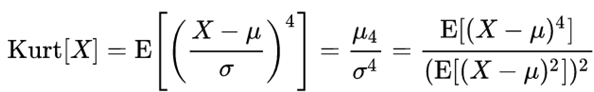
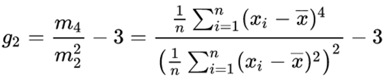
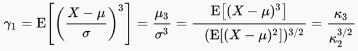
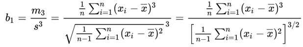

# Data Processing

```python
data = pd.read_csv('file_path.csv')
data.to_csv('save_path.csv', index=False)
data.columns
data.values
data.columns.drop('col_name').tolist()
data.merge(on='col_name', how='left')
pd.get_dummies(df, columns=['col1', 'col2'])

```

### 计算数据分布参数
```python
def calc_stats(df, g_feats, c_feats):
  """getattr(obj, str) 用于返回一个对象属性值,并且可以直接再后面加括号调用"""
    for stats in ['sum', 'mean', 'std', 'kurt', 'skew', 'max', 'min']:
        df['g-' + stats] = getattr(df[g_feats], stats)(axis=1)
        df['c-' + stats] = getattr(df[c_feats], stats)(axis=1)
        df['gc-' + stats] = getattr(df[g_feats + c_feats], stats)(axis=1)
    return df
```
df.kurt(): kurtosis, 峰度, 描述数据分布顶端的尖锐程度
（1）Kurtosis=0 与正态分布的陡缓程度相同。
（2）Kurtosis>0 比正态分布的高峰陡峭——尖顶峰
（3）Kurtosis<0 比正态分布的高峰平坦——平顶峰

峰度定义为四阶标准矩，计算公式如下：





df.skew(): skewness, 偏度，描述数据的不对称度
（1）Skewness = 0 ，与正态分布偏度相同。
（2）Skewness > 0 ，正偏差数值较大，右偏。
（3）Skewness < 0 ，负偏差数值较大，左偏。

偏度为样本的三阶标准矩，计算公式如下：





reference:
https://support.minitab.com/zh-cn/minitab/18/help-and-how-to/statistics/basic-statistics/supporting-topics/data-concepts/how-skewness-and-kurtosis-affect-your-distribution/
https://www.cnblogs.com/wyy1480/p/10474046.html
