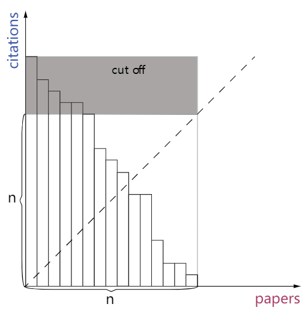
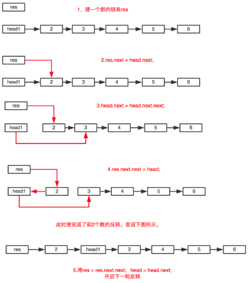
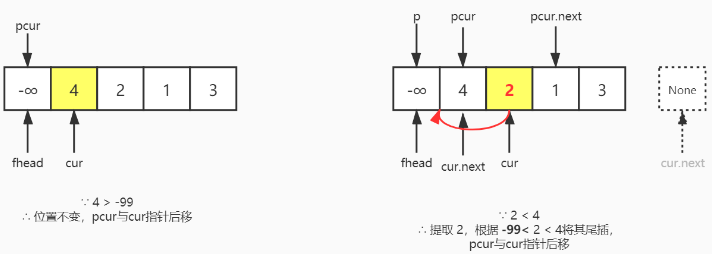

# 400 leetcode
### Array
#### 基础题
##### [27. 移除元素](https://leetcode-cn.com/problems/remove-element/)
python pop() - O(1), pop(i) - O(n), remove(val) - O(n)
对数组进行删除增加操作用while+指针！
动态维护指针start与end，遇到=val的元素交换到尾部(题目说不用管顺序)
```python
class Solution:
    def removeElement(self, nums: List[int], val: int) -> int:
        start, end = 0, len(nums) - 1
        while start <= end:
            if nums[start] == val:
                nums[start], nums[end], end = nums[end], nums[start], end - 1
            else:
                start +=1
        return start
```
##### [26. 删除排序数组中的重复项](https://leetcode-cn.com/problems/remove-duplicates-from-sorted-array/)
双指针，快指针往前走，当遇到快慢指针值不一样，慢指针走一步，修改当前元素为快指针指向的元素。(注意题目限制条件，数组有序！)
```python
class Solution:
    def removeDuplicates(self, nums: List[int]) -> int:
        if not A:
            return 0

        newTail = 0

        for i in range(1, len(A)):
            if A[i] != A[newTail]:
                newTail += 1
                A[newTail] = A[i]

        return newTail + 1
```
##### [80. 删除排序数组中的重复项 II](https://leetcode-cn.com/problems/remove-duplicates-from-sorted-array-ii/)
该解法可拓展为删除有序数组的k重复项，同样可解决 leetcode 26。

如果当前元素比其第前k个元素大（如果当前元素与其第前k个元素不同），将当前元素赋值给指针停留位置，指针停留位置+1。保证nums[:i]重复不超过k个元素.
```python
class Solution:
    def removeDuplicates(self, nums: List[int]) -> int:
        i = 0
        k = 2
        for num in nums:
            if i < k or num > nums[i-k]:
                nums[i] = num
                i += 1
        return i
```
##### [189. 旋转数组](https://leetcode-cn.com/problems/rotate-array/)
方法1： O(n) in time, O(1) in space.
- reverse the first n - k elements
- reverse the rest of them
- reverse the entire array
```python
class Solution:
    def rotate(self, nums: List[int], k: int) -> None:
        """
        Do not return anything, modify nums in-place instead.
        """
        if k is None or k <= 0:
            return
        k, end = k % len(nums), len(nums) - 1
        nums.reverse()  #inplace
        self.reverse(0, k-1, nums)
        self.reverse(k, end, nums) #end = len(nums)-1

    def reverse(self, start, end, nums):
        while start < end:
            nums[start], nums[end] = nums[end], nums[start]
            start, end = start + 1, end - 1
```
方法2： O(n^2) in time, O(1) in space.
旋转k次
```python
class Solution:
    def rotate(self, nums: List[int], k: int) -> None:
        k = k % len(nums)
        for i in range(0, k):
            tmp = nums[-1]
            for j in range(0, len(nums) - 1):
                nums[len(nums) - 1 - j] = nums[len(nums) - 2 - j]
            nums[0] = tmp
```
方法3：O(n) in time, O(1) in space.
put the last k elements in correct position (ahead) and do the remaining n - k. Once finish swap, the n and k decrease.
```python
class Solution(object):
    def rotate(self, nums, k):
        n, k, j = len(nums), k % len(nums), 0
        while n > 0 and k % n != 0:
            for i in range(0, k):
                nums[j + i], nums[len(nums) - k + i] = nums[len(nums) - k + i], nums[j + i] # swap
            n, j = n - k, j + k
            k = k % n
```
方法4: O(n) in time, O(1) in space.
```python
class Solution:
    def rotate(self, nums, k):
        n = len(nums)
        k = k % n
        nums[:] = nums[n-k:] + nums[:n-k]
```

##### [41. 缺失的第一个正数](https://leetcode-cn.com/problems/first-missing-positive/)
需要再理解一下
```python
class Solution:
    def firstMissingPositive(self, nums: List[int]) -> int:
        """
        after removing all the numbers greater than or equal to n,
        all the numbers remaining are smaller than n. If any number i appears,
        we add n to nums[i] which makes nums[i]>=n. Therefore, if nums[i]<n,
        it means i never appears in the array and we should return i.
        """
        nums.append(0)
        n = len(nums)
        for i in range(len(nums)): # delete those useless elements
            if nums[i]<0 or nums[i]>=n:
                nums[i]=0
        print(nums)
        for i in range(len(nums)): # use the index as the hash to record the frequency of each number
            nums[nums[i]%n]+=n
        print(nums)
        for i in range(1,len(nums)):
            if nums[i]//n==0:
                return i
        return n
```
##### [面试题 01.07. 旋转矩阵](https://leetcode-cn.com/problems/rotate-matrix-lcci/)
```python
class Solution:
    def rotate(self, matrix: List[List[int]]) -> None:
        """
        Do not return anything, modify matrix in-place instead.
        """
        # import copy
        # matrix_copy = copy.deepcopy(matrix)
        # rows = len(matrix)
        # if rows == 0: return matrix
        # cols = len(matrix[0])
        # i, j = 0, 0
        # for col in range(cols):
        #     for row in range(rows-1,-1,-1):
        #         matrix[i%rows][j%cols] = matrix_copy[row][col]
        #         j += 1
        #     i += 1

        # 先转置（以对称轴旋转）再以中轴旋转
        rows = len(matrix)
        if rows == 0: return matrix
        cols = len(matrix[0])
        for row in range(rows):
            for col in range(row+1,cols):
                matrix[row][col], matrix[col][row] = matrix[col][row], matrix[row][col]
        for row in range(rows):
            for col in range(cols//2):
                matrix[row][col], matrix[row][cols-1-col] = matrix[row][cols-1-col], matrix[row][col]
```

##### [299. 猜数字游戏](https://leetcode-cn.com/problems/bulls-and-cows/)
数据结构 Counter &, |, (a&b).values()
```python
class Solution:
    def getHint(self, secret: str, guess: str) -> str:
        """ Counter &, |, (a&b).values() """
        from collections import Counter
        s, g = Counter(secret), Counter(guess)
        a = sum(i == j for i, j in zip(secret, guess))
        return '%sA%sB' % (a, sum((s & g).values()) - a)
```
```python
class Solution:
    def getHint(self, secret: str, guess: str) -> str:
        from collections import defaultdict
        secret_dict = defaultdict(list)
        guess_dict = defaultdict(list)
        for i in range(len(secret)):
            secret_dict[secret[i]].append(i)
            guess_dict[guess[i]].append(i)
        A, B = 0, 0
        for key in guess_dict:
            if key in secret_dict:
                secret_indexs = secret_dict[key]
                guess_indexs = guess_dict[key]
                if len(secret_indexs) < len(guess_indexs):
                    short, long = secret_indexs, guess_indexs
                else: short, long = guess_indexs, secret_indexs
                for i in short:
                    if i in long: A += 1
                    else: B += 1

        result = str(A)+'A'+str(B)+'B'
        return result
```

##### [134. 加油站](https://leetcode-cn.com/problems/gas-station/)
1. if sum of gas is more than sum of cost, then there must be a solution.
2. The tank should never be negative, so restart whenever there is a negative number.
```python
class Solution:
    def canCompleteCircuit(self, gas: List[int], cost: List[int]) -> int:
        n = len(gas)

        total_tank, curr_tank = 0, 0
        starting_station = 0
        for i in range(n):
            total_tank += gas[i] - cost[i]
            curr_tank += gas[i] - cost[i]
            # If one couldn't get here,
            if curr_tank < 0:
                # Pick up the next station as the starting one.
                starting_station = i + 1
                # Start with an empty tank.
                curr_tank = 0

        return starting_station if total_tank >= 0 else -1
```

##### [118. 杨辉三角](https://leetcode-cn.com/problems/pascals-triangle/)
```python
class Solution:
    def generate(self, numRows: int) -> List[List[int]]:
        triangle = []

        for row_num in range(num_rows):
            # The first and last row elements are always 1.
            row = [None for _ in range(row_num+1)]
            row[0], row[-1] = 1, 1

            # Each triangle element is equal to the sum of the elements
            # above-and-to-the-left and above-and-to-the-right.
            for j in range(1, len(row)-1):
                row[j] = triangle[row_num-1][j-1] + triangle[row_num-1][j]

            triangle.append(row)

        return triangle
```

##### [119. 杨辉三角 II](https://leetcode-cn.com/problems/pascals-triangle-ii/)
```python
class Solution:
    def getRow(self, rowIndex: int) -> List[int]:
        """
        假设j - 1行为[1,3,3,1], 那么我们前面插入一个0(j行的数据会比j-1行多一个),
        然后执行相加[0+1,1+3,3+3,3+1,1] = [1,4,6,4,1], 最后一个1保留即可.
        """
        r = [1]
        for i in range(1, rowIndex + 1):
            r.insert(0, 0)
            for j in range(i):
                r[j] = r[j] + r[j + 1]
        return r
```

##### [169. 多数元素](https://leetcode-cn.com/problems/majority-element/)
哈希表：O(n), O(n)
```python
class Solution:
    def majorityElement(self, nums: List[int]) -> int:
        dict_ = {}
        half = len(nums) // 2
        for item in nums:
            if item not in dict_:
                dict_[item] = 1
            else:
                dict_[item] += 1
            if dict_[item] > half: return item
        return False
```
Boyer-Moore 投票：O(n), O(1). 数数相抵消，剩下的是众数
```python
class Solution:
    def majorityElement(self, nums: List[int]) -> int:
        count = 0
        candidate = None

        for num in nums:
            if count == 0:
                candidate = num
            count += (1 if num == candidate else -1)

        return candidate
```
排序: O(nlogn), O(1)
单调数组，数组长度偶数，众数坐标 n//2+1, 奇数 n//2
```python
class Solution:
    def majorityElement(self, nums: List[int]) -> int:
        nums = sorted(nums)
        return nums[len(nums)//2+1] if len(nums)%2 == 0 else nums[len(nums)//2]
```

##### [229. 求众数 II](https://leetcode-cn.com/problems/majority-element-ii/)
```python
class Solution:
    def majorityElement(self, nums: List[int]) -> List[int]:
        if not nums: return []
        count1, count2, candidate1, candidate2 = 0, 0, 0, 1
        for n in nums:
            if n == candidate1:
                count1 += 1
            elif n == candidate2:
                count2 += 1
            elif count1 == 0:
                candidate1, count1 = n, 1
            elif count2 == 0:
                candidate2, count2 = n, 1
            else:
                count1, count2 = count1 - 1, count2 - 1
        return [n for n in (candidate1, candidate2) if nums.count(n) > len(nums) // 3] # 注意最后有一个对c1,c2的筛选
```

##### [274. H指数](https://leetcode-cn.com/problems/h-index)

两种方法：1. sort，取直方图下最大正方形 2. cut为正方形，计数排序
https://leetcode-cn.com/problems/h-index/solution/hzhi-shu-by-leetcode/

##### [275. H指数 II](https://leetcode-cn.com/problems/h-index-ii)
线性
```python
class Solution:
    def hIndex(self, citations):
        n = len(citations)
        for idx, c in enumerate(citations):
            if c >= n - idx:
                return n - idx
        return 0

```
数组有序，用二分查找 时间复杂度 O(logn)
```python
class Solution:
    def hIndex(self, citations):
        n = len(citations)
        left, right = 0, n - 1
        while left <= right:
            pivot = left + (right - left) // 2
            if citations[pivot] == n - pivot:
                return n - pivot
            elif citations[pivot] < n - pivot:
                left = pivot + 1
            else:
                right = pivot - 1
        return n - left
```
https://leetcode-cn.com/problems/h-index-ii/solution/hzhi-shu-ii-by-leetcode/

##### [55. 跳跃游戏](https://leetcode-cn.com/problems/jump-game/)
https://leetcode-cn.com/problems/jump-game/solution/tiao-yue-you-xi-by-leetcode/
- 递归回溯 O(2^n)
- 递归记忆表
- 动态规划
- 贪心 （这题可以用贪心，只需要一种可能的方案即可）

##### [45. 跳跃游戏 II](https://leetcode-cn.com/problems/jump-game-ii/)

##### [121. 买卖股票的最佳时机](https://leetcode-cn.com/problems/best-time-to-buy-and-sell-stock/)
只能交易一次
```python
class Solution:
    def maxProfit(self, prices: List[int]) -> int:
        if len(prices) == 0: return 0
        profit_0 = 0
        profit_1 = -max(prices)
        for price in prices:
            profit_0 = max(profit_0, profit_1 + price) # 最高差值
            profit_1 = max(profit_1, - price) # 最低买入价
            print('profit_0 {}'.format(profit_0))
            print('profit_1 {}'.format(profit_1))
        return profit_0
```

##### [122. 买卖股票的最佳时机 II](https://leetcode-cn.com/problems/best-time-to-buy-and-sell-stock-ii/)
可以尽可能多的交易
```python
class Solution:
    def maxProfit(self, prices: List[int]) -> int:
        if len(prices) == 0: return 0
        profit_0 = 0
        profit_1 = -max(prices)

        for price in prices:
            profit_0 = max(profit_0, profit_1 + price)
            profit_1 = max(profit_1, profit_0 - price)
            print('profit_0 {}'.format(profit_0))
            print('profit_1 {}'.format(profit_1))

        return profit_0
```

##### [123. 买卖股票的最佳时机 III](https://leetcode-cn.com/problems/best-time-to-buy-and-sell-stock-iii/)
最多可以交易两次
```python
class Solution:
    def maxProfit(self, prices: List[int]) -> int:
        if len(prices) == 0: return 0
        profit_10 = 0
        profit_11 = -max(prices)
        profit_20 = 0
        profit_21 = -max(prices)

        for price in prices:
            profit_10 = max(profit_10, profit_11 + price)
            profit_11 = max(profit_11, -price)
            profit_20 = max(profit_20, profit_21 + price)
            profit_21 = max(profit_21, profit_10 - price)

        return profit_20
```

##### [188. 买卖股票的最佳时机 IV](https://leetcode-cn.com/problems/best-time-to-buy-and-sell-stock-iv/)
```python
class Solution:
    def maxProfit(self, k: int, prices: List[int]) -> int:
        if len(prices) == 0: return 0
        # k 太大导致爆栈, 因此如果k大于prices, 当成无限次交易处理
        if len(prices) < k:
            profit_0 = 0
            profit_1 = -max(prices)
            for price in prices:
                profit_0 = max(profit_0, profit_1 + price)
                profit_1 = max(profit_1, profit_0 - price)
            return profit_0

        profit_0 = [0 for i in range(k+1)]
        profit_1 = [0] + [-max(prices) for i in range(k+1)]

        for price in prices:
            for i in range(1, k+1):
                profit_0[i] = max(profit_0[i], profit_1[i] + price)
                profit_1[i] = max(profit_1[i], profit_0[i-1] - price)

        return profit_0[-1]
```

##### [309. 最佳买卖股票时机含冷冻期](https://leetcode-cn.com/problems/best-time-to-buy-and-sell-stock-with-cooldown/)
```python
class Solution:
    def maxProfit(self, prices: List[int]) -> int:
        if len(prices) == 0: return 0
        profit_0_pre = 0
        profit_0 = 0
        profit_1 = -max(prices)

        for price in prices:
            profit_0_old = profit_0
            profit_0 = max(profit_0, profit_1 + price)
            profit_1 = max(profit_1, profit_0_pre - price)
            profit_0_pre = profit_0_old

        return profit_0
```

##### [11. 盛最多水的容器](https://leetcode-cn.com/problems/container-with-most-water)
首尾双指针，哪边低，哪边指针向内移动
```python
class Solution:
    def maxArea(self, height: List[int]) -> int:
        p0 = 0
        p1 = len(height) - 1
        if p0 == p1: return 0
        max_area = 0

        while (p0 != p1):
            area = (p1 - p0) * min(height[p0], height[p1])
            print(area)
            max_area = max(area, max_area)
            if height[p0] < height[p1]:
                p0 += 1
            else: p1 -= 1

        return max_area
```

##### [42. 接雨水](https://leetcode-cn.com/problems/trapping-rain-water/)
四种解法
https://leetcode-cn.com/problems/trapping-rain-water/solution/xiang-xi-tong-su-de-si-lu-fen-xi-duo-jie-fa-by-w-8/

##### [334. 递增的三元子序列](https://leetcode-cn.com/problems/increasing-triplet-subsequence/)
```python
class Solution:
    def increasingTriplet(self, nums: List[int]) -> bool:
        first = second = float('inf')
        for n in nums:
            # 记录最小的数
            if n <= first:
                first = n
            # 记录第二小的数
            elif n <= second:
                second = n
            else:
                return True
        return False
```

#### [128. 最长连续序列](https://leetcode-cn.com/problems/longest-consecutive-sequence/solution/zui-chang-lian-xu-xu-lie-by-leetcode/)
1. 暴力法，遍历每个数字查询。总体复杂度O(n^3), 注意数组的 in 查询操作, 时间复杂度O(n)
```python
class Solution:
    def longestConsecutive(self, nums):
        longest_streak = 0
        for num in nums:
            current_num = num
            current_streak = 1
            while current_num + 1 in nums:
                current_num += 1
                current_streak += 1
            longest_streak = max(longest_streak, current_streak)

        return longest_streak
```

2. 先排序，再依次通过索引向后查询即可。O(nlogn)
```python
class Solution:
    def longestConsecutive(self, nums):
        if not nums:
            return 0
        nums.sort()
        longest_streak = 1
        current_streak = 1
        for i in range(1, len(nums)):
            if nums[i] != nums[i-1]:
                if nums[i] == nums[i-1]+1:
                    current_streak += 1
                else:
                    longest_streak = max(longest_streak, current_streak)
                    current_streak = 1
        return max(longest_streak, current_streak)
```

3. 基于1利用hashmap查找，添加O(1)的特性.先构造hashmap set(). 然后如果 num - 1 not in num_set，开始查找统计。O(n). 尽管在 for 循环中嵌套了一个 while 循环，时间复杂度看起来像是二次方级别的。但其实它是线性的算法。因为只有当 currentNum 遇到了一个序列的开始， while 循环才会被执行, while 循环在整个运行过程中只会被迭代 n 次。这意味着尽管看起来时间复杂度为O(n^2) ，实际这个嵌套循环只会运行 O(n + n)次。所有的计算都是线性时间的，所以总的时间复杂度是 O(n)。
```python
class Solution:
    def longestConsecutive(self, nums):
        longest_streak = 0
        num_set = set(nums)
        for num in num_set:
            if num - 1 not in num_set:
                current_num = num
                current_streak = 1
                while current_num + 1 in num_set:
                    current_num += 1
                    current_streak += 1
                longest_streak = max(longest_streak, current_streak)
        return longest_streak
```

#### [164. 最大间距](https://leetcode-cn.com/problems/maximum-gap/)
#### [287. 寻找重复数](https://leetcode-cn.com/problems/find-the-duplicate-number/)
两题排序题

#### [330. 按要求补齐数组](https://leetcode-cn.com/problems/patching-array/)
贪心，题解很巧妙
https://leetcode-cn.com/problems/patching-array/solution/an-yao-qiu-bu-qi-shu-zu-by-leetcode/

#### [4. 寻找两个有序数组的中位数](https://leetcode-cn.com/problems/median-of-two-sorted-arrays/)
TODO: check
```python
class Solution:
    def findMedianSortedArrays(self, nums1: List[int], nums2: List[int]) -> float:
        # 为了让搜索范围更小，我们始终让 num1 是那个更短的数组，PPT 第 9 张
        if len(nums1) > len(nums2):
            # 这里使用了 pythonic 的写法，即只有在 Python，中可以这样写
            # 在一般的编程语言中，得使用一个额外变量，通过"循环赋值"的方式完成两个变量的地址的交换
            nums1, nums2 = nums2, nums1

        # 上述交换保证了 m <= n，在更短的区间 [0, m] 中搜索，会更快一些
        m = len(nums1)
        n = len(nums2)

        # 使用二分查找算法在数组 nums1 中搜索一个索引 i，PPT 第 9 张
        left = 0
        right = m

        while left <= right:
            i = left + (right-left) // 2
            j = (m+n+1) // 2 - i

            # 边界值的特殊取法的原因在 PPT 第 10 张
            nums1_left_max = float('-inf') if i == 0 else nums1[i - 1]
            nums1_right_min = float('inf') if i == m else nums1[i]

            nums2_left_max = float('-inf') if j == 0 else nums2[j - 1]
            nums2_right_min = float('inf') if j == n else nums2[j]

            # 交叉小于等于关系成立，那么中位数就可以从"边界线"两边的数得到，原因在 PPT 第 2 张、第 3 张
            if nums1_left_max <= nums2_right_min and nums2_left_max <= nums1_right_min:
                # 已经找到解了，分数组之和是奇数还是偶数得到不同的结果，原因在 PPT 第 2 张
                if (m + n) % 2 == 1:
                    return max(nums1_left_max, nums2_left_max)
                else:
                    return (max(nums1_left_max, nums2_left_max) + min(nums1_right_min, nums2_right_min)) / 2
            elif nums1_left_max > nums2_right_min:
                # 这个分支缩短边界的原因在 PPT 第 8 张，情况 ②
                right = i - 1
            else:
                # 这个分支缩短边界的原因在 PPT 第 8 张，情况 ①
                left = i + 1
        raise ValueError('传入无效的参数，输入的数组不是有序数组，算法失效')
```

#### [321. 拼接最大数](https://leetcode-cn.com/problems/create-maximum-number/)
TODO: check
```python
class Solution:
    def maxNumber(self, nums1: List[int], nums2: List[int], k: int) -> List[int]:
        # 求出单个数组可以组成i位的最大数组
        def getMaXArr(nums, i):
            if not i:
                return []
            # pop表示最多可以不要nums里几个数字，要不组成不了i位数字
            stack, pop = [], len(nums) - i
            for num in nums:
                while pop and stack and stack[-1] < num :
                    pop -= 1
                    stack.pop()
                stack.append(num)
            return stack[:i]

        def merge(tmp1, tmp2):
            return [max(tmp1, tmp2).pop(0) for _ in range(k)]

        res = [0] * k
        for i in range(k + 1):
            if i <= len(nums1) and k - i <= len(nums2):
                # 取num1的i位, num2的k - i
                tmp1 = getMaXArr(nums1, i)
                tmp2 = getMaXArr(nums2, k - i)
                # 合并
                tmp = merge(tmp1, tmp2)
                if res < tmp:
                    res = tmp
        return res
```

[1013. 将数组分成和相等的三个部分](https://leetcode-cn.com/problems/partition-array-into-three-parts-with-equal-sum/)
```python
class Solution:
    def canThreePartsEqualSum(self, A: List[int]) -> bool:
        """数组等分3分，要巧利用/3，这里还用了贪心，把复杂度降到O(n)"""
        lookfor, rest = divmod(sum(A), 3)
        if rest != 0: return False
        sum_i = 0
        recode_i = 0
        for i in range(len(A)):
            sum_i += A[i]
            if sum_i == lookfor:
                recode_i = i
                break # 贪心
        sum_j = 0
        recode_j = 0
        for j in range(len(A)-1,-1,-1):
            sum_j += A[j]
            if sum_j == lookfor:
                recode_j = j
                break
        return True if recode_i+1 < recode_j else False

    def canThreePartsEqualSum(self, A: List[int]) -> bool:
        """暴力  O(n^2)"""
        comsum = [0]+[sum(A[:i+1]) for i in range(len(A))]
        for i in range((len(comsum))):
            if comsum[i] == sum_A
        for i in range(len(A)):
            for j in range(i,len(A)):
                if A[:i] and A[i:j] and A[j:] and comsum[i] == comsum[j]-comsum[i] == comsum[-1]-comsum[j]:
                    return True
        return False
```

#### [327. 区间和的个数](https://leetcode-cn.com/problems/count-of-range-sum)
不会啊, TODO:线段树

#### [289. 生命游戏](https://leetcode-cn.com/problems/game-of-life/)
遍历标记，再遍历修改

#### [57. 插入区间](https://leetcode-cn.com/problems/insert-interval/)
```python
class Solution:
    def insert(self, intervals: List[List[int]], newInterval: List[int]) -> List[List[int]]:
        # init data
        new_start, new_end = newInterval
        idx, n = 0, len(intervals)
        output = []

        # add all intervals starting before newInterval
        while idx < n and new_start > intervals[idx][0]:
            output.append(intervals[idx])
            idx += 1

        # add newInterval
        # if there is no overlap, just add the interval
        if not output or output[-1][1] < new_start:
            output.append(newInterval)
        # if there is an overlap, merge with the last interval
        else:
            output[-1][1] = max(output[-1][1], new_end)

        # add next intervals, merge with newInterval if needed
        while idx < n:
            interval = intervals[idx]
            start, end = interval
            idx += 1
            # if there is no overlap, just add an interval
            if output[-1][1] < start:
                output.append(interval)
            # if there is an overlap, merge with the last interval
            else:
                output[-1][1] = max(output[-1][1], end)
        return output
```

#### [239. 滑动窗口最大值](https://leetcode-cn.com/problems/sliding-window-maximum/)
注意体会双端队列的用法，左端popleft不在窗口的元素，右端pop小于当前元素的元素
```python
from collections import deque
class Solution:
    def maxSlidingWindow(self, nums: List[int], k: int) -> List[int]:
        # base cases
        n = len(nums)
        if n * k == 0:
            return []
        if k == 1:
            return nums

        def clean_deque(i):
            # remove indexes of elements not from sliding window
            if deq and deq[0] == i - k:
                deq.popleft()

            # remove from deq indexes of all elements
            # which are smaller than current element nums[i]
            while deq and nums[i] > nums[deq[-1]]:
                deq.pop()

        # init deque and output
        deq = deque()
        max_idx = 0
        for i in range(k):
            clean_deque(i)
            deq.append(i)
            # compute max in nums[:k]
            if nums[i] > nums[max_idx]:
                max_idx = i
        output = [nums[max_idx]]

        # build output
        for i in range(k, n):
            clean_deque(i)
            deq.append(i)
            output.append(nums[deq[0]])
        return output
```

#### [209. 长度最小的子数组](https://leetcode-cn.com/problems/minimum-size-subarray-sum/)
1. 暴力两次遍历 O(n^2)
2. 转为累计和，二分搜索左端点 O(nlogn)
3. 滑动窗口  O(n)


#### [238. 除自身以外数组的乘积](https://leetcode-cn.com/problems/product-of-array-except-self/)
1. 左右乘积列表 O(n), O(n)
数组 L 和 R. 对于给定索引 i，L[i] 代表的是 i 左侧所有数字的乘积，R[i] 代表的是 i 右侧所有数字的乘积。

#### [152. 乘积最大子序列](https://leetcode-cn.com/problems/maximum-product-subarray)
1. 动态规划，同时维护 min, max. O(n)

#### [228. 汇总区间](https://leetcode-cn.com/problems/summary-ranges/)
1. 一次遍历就可以了. O(n)

#### [88. 合并两个有序数组](https://leetcode-cn.com/problems/merge-sorted-array/)
#### [面试题 10.01. 合并排序的组](https://leetcode-cn.com/problems/sorted-merge-lcci/)
从后往前遍历，更利于数组的修改 O(n+m)
这道题坑了我半小时！！ 注意：
1. 循环的结束条件，B走完了即可，可以保证A中剩下的有序
2. 循环中要保证p1大于0，才能正常比较赋值。如果A p1指针已经走完了，将B走完，填满p3即可
```python
class Solution:
    def merge(self, A: List[int], m: int, B: List[int], n: int) -> None:
        """
        Do not return anything, modify A in-place instead.
        """
        p1, p2, p3 = m-1, n-1, len(A)-1
        while (p2 >= 0):
            if p1 >= 0 and A[p1] > B[p2]:
                A[p3] = A[p1]
                p1 -= 1
            else:
                A[p3] = B[p2]
                p2 -= 1
            p3 -= 1
```

#### [75. 颜色分类](https://leetcode-cn.com/problems/sort-colors/)
1. 基数排序 时间复杂度为O(n+k)，空间复杂度为O(n+k)。n 是待排序数组长度, k=2-0+1=3
```python
class Solution:
    def sortColors(self, nums: List[int]) -> None:
        def countingSort(array):
            min_value = min(array)
            max_value = max(array)
            bucket_len = max_value -  min_value + 1
            buckets = [0] * bucket_len
            for num in array:
                buckets[num - min_value] += 1
            array.clear() # 注意不要用 array = []
            for i in range(len(buckets)):
                while buckets[i] != 0:
                    buckets[i] -= 1
                    array.append(i + min_value)

        return countingSort(nums)
```
2. 三路快排，空间复杂度O(1)
```python
class Solution:
    def sortColors(self, nums: List[int]) -> None:
        """三路快排的partition的稍微改动"""
        pivot = 1
        p_l = 0
        p_r = len(nums)
        p = 0
        while (p < p_r):
            if nums[p] < pivot:
                nums[p], nums[p_l] = nums[p_l], nums[p]
                p += 1
                p_l += 1
            elif nums[p] > pivot:
                p_r -= 1
                nums[p], nums[p_r] = nums[p_r], nums[p]
            else:
                p += 1
```

#### [283. 移动零](https://leetcode-cn.com/problems/move-zeroes/)
双指针，快指针向前遍历，遇到非0将慢指针赋值，慢指针+1

#### [376. 摆动序列](https://leetcode-cn.com/problems/wiggle-subsequence/)
1. 动态规划（1维dp）
2. 动态规划（登楼梯）
3. 贪心

#### [324. 摆动排序 II](https://leetcode-cn.com/problems/wiggle-sort-ii/)
快速选择中位数 + 三路快排 + 插入

#### [278. 第一个错误的版本](https://leetcode-cn.com/problems/first-bad-version/)
二分查找

TODO: 33, 81, 153, 154 二分，有时间再多练习下
#### [33. 搜索旋转排序数组](https://leetcode-cn.com/problems/search-in-rotated-sorted-array/)
先寻找旋转点，再判断区间，再二分搜索，一大堆if太复杂
```python
class Solution:
    def search(self, nums: List[int], target: int) -> int:
        if len(nums) == 0: return -1
        if len(nums) == 1: return 0 if nums[0] == target else -1

        def find_rotation_index(arr, l, r):
            while (l < r):
                m = l + (r-l)//2
                if arr[m] < arr[m-1]:
                    return m
                else:
                    if arr[m] > arr[l]:
                        l = m
                    else:
                        r = m
            return l

        def low_bound(arr, l, r, target):
            while (l < r):
                m = l + (r-l)//2
                if arr[m] < target:
                    l = m + 1
                else:
                    r = m
            return l if l < len(arr) and arr[l] == target else -1

        rotation_index = find_rotation_index(nums, 0, len(nums))
        if nums[rotation_index] > nums[0]:
            return low_bound(nums, 0, len(nums), target)
        if target == nums[-1]:
            return len(nums)-1
        elif target < nums[-1]:
            return low_bound(nums, rotation_index, len(nums), target)
        else:
            return low_bound(nums, 0, rotation_index, target)
```
#### [81. 搜索旋转排序数组 II](https://leetcode-cn.com/problems/search-in-rotated-sorted-array-ii/)

#### [153. 寻找旋转排序数组中的最小值](https://leetcode-cn.com/problems/find-minimum-in-rotated-sorted-array/)
同154. 二分寻找旋转点，注意判断二分是否查到旋转点. log(n)

#### [154. 寻找旋转排序数组中的最小值 II](https://leetcode-cn.com/problems/find-minimum-in-rotated-sorted-array-ii/)
二分查找的难点就是边界如何收缩，这里m必须通过r-1得到！
缺点，该方法找到的只能保证是最小值，不能保证是旋转点。
```python
class Solution:
    def findMin(self, nums: List[int]) -> int:
        if len(nums) == 0: return None
        if len(nums) == 1: return nums[0]

        def search(arr, l, r):
            r = r - 1 # 使得中位数是靠前的元素
            while (l < r):
                m = l + (r-l)//2
                if arr[m] > arr[r]:
                    l = m + 1
                elif arr[m] < arr[r]:
                    r = m
                else:
                    r = r - 1
            return l

        return nums[search(nums, 0, len(nums))]
```

#### [374. 猜数字大小](https://leetcode-cn.com/problems/guess-number-higher-or-lower/)
```python
# The guess API is already defined for you.
# @return -1 if my number is lower, 1 if my number is higher, otherwise return 0
# def guess(num: int) -> int:

class Solution:
    def guessNumber(self, n: int) -> int:
        l, r = 0, n # 注意mapping
        while (l < r):
            m = l + (r-l)//2 + 1
            if guess(m) == 0:
                return m
            elif guess(m) == 1:
                l = m
            elif guess(m) == -1:
                r = m - 1
        return None
```

#### [34. 在排序数组中查找元素的第一个和最后一个位置](https://leetcode-cn.com/problems/find-first-and-last-position-of-element-in-sorted-array/)
low_bound, up_bound, 注意边界，注意up_bound为>target的index
```python
class Solution:
    def searchRange(self, nums: List[int], target: int) -> List[int]:
        def low_bound(arr, l, r, target):
            while (l < r):
                m = l + (r-l)//2
                if arr[m] < target:
                    l = m + 1
                else:
                    r = m
            return l

        def up_bound(arr, l, r, target):
            while (l < r):
                m = l + (r-l)//2
                if arr[m] <= target:
                    l = m + 1
                else:
                    r = m
            return l

        index0 = low_bound(nums, 0, len(nums), target)
        index1 = up_bound(nums, 0, len(nums), target)

        if index0 < len(nums) and nums[index0] == target:
            return [index0, index1-1]
        else:
            return [-1, -1]
```

#### [349. 两个数组的交集](https://leetcode-cn.com/problems/intersection-of-two-arrays/)
复习一下Counter用法
```python
class Solution:
    def intersection(self, nums1: List[int], nums2: List[int]) -> List[int]:
        from collections import Counter
        a = Counter(nums1)
        b = Counter(nums2)
        return a & b
```

#### [300. 最长上升子序列](https://leetcode-cn.com/problems/longest-increasing-subsequence/)
时间复杂度O(n^2), O(n)
```python
class Solution:
    def lengthOfLIS(self, nums: List[int]) -> int:
        if len(nums) == 0: return 0
        dp = [1] * len(nums)
        for i in range(len(nums)):
            for j in range(i):
                if nums[j] < nums[i]:
                    dp[i] = max(dp[i], dp[j]+1)
        return max(dp)
```
遍历nums，二分查找当前元素在dp中的low bound，替换dp中对应元素为当前元素，如果low bound 超过历史长度，长度+1. O(nlogn), O(n)
```python
class Solution:
    def lengthOfLIS(self, nums: List[int]) -> int:
        """只能保证长度对，不能保证dp就是其中一个答案"""
        dp = [0] * len(nums)
        lenth = 0
        for num in nums:
            l, r = 0, lenth
            while (l < r):
                m = l + (r-l)//2
                if dp[m] < num: # <= 非严格上升子序列
                    l = m + 1
                else:
                    r = m
            if l < lenth:
                dp[l] = num
            else:
                dp[l] = num
                lenth += 1
        return lenth
```

[354. 俄罗斯套娃信封问题](https://leetcode-cn.com/problems/russian-doll-envelopes/)
```python
class Solution:
    def maxEnvelopes(self, envelopes: List[List[int]]) -> int:
        """此方法为贪心，逻辑不严谨，是错误的，应考虑动态规划"""
        if len(envelopes) < 2: return len(envelopes)
        envelopes = sorted(envelopes, key=lambda ele: (ele[0],-ele[1]), reverse=True)
        print(envelopes)
        lenth = 1
        p = 0
        while (p < len(envelopes)):
            next_envelop = -1
            for i in range(p+1, len(envelopes)):
                if envelopes[i][0] < envelopes[p][0] and envelopes[i][1] < envelopes[p][1]:
                    next_envelop = i
                    lenth += 1
                    break
            if next_envelop != -1:
                p = next_envelop
            else:
                break
        return lenth
```
```python
class Solution:
    def maxEnvelopes(self, envelopes: List[List[int]]) -> int:
        """体会动态规划从下往上记录历史答案的思想，但该方法超时 O(n^2)"""
        if len(envelopes) < 2: return len(envelopes)
        envelopes = sorted(envelopes, key=lambda ele: (ele[0],ele[1]), reverse=True)
        # print(envelopes)
        dp = [1] * len(envelopes)
        for i in range(len(envelopes)):
            for j in range(i):
                if envelopes[i][0] < envelopes[j][0] and envelopes[i][1] < envelopes[j][1]:
                    dp[i] = max(dp[i],dp[j]+1)
        return max(dp)
```
```python
class Solution:
    def maxEnvelopes(self, envelopes: List[List[int]]) -> int:
        """巧用排序,保证w升序，相同w的h降序，使得问题可以转换成一维的最大上升子序列求解"""
        if len(envelopes) < 2: return len(envelopes)
        envelopes = sorted(envelopes, key=lambda ele: (ele[0],-ele[1]))
        dp = [0] * len(envelopes)
        lenth = 0
        for i in range(len(envelopes)):
            h = envelopes[i][1]
            l, r = 0, lenth
            while (l < r):
                m = l + (r-l)//2
                if dp[m] < h:
                    l = m + 1
                else:
                    r = m
            dp[l] = h
            if l >= lenth:
                lenth += 1
        return lenth
```

#### [315. 计算右侧小于当前元素的个数](https://leetcode-cn.com/problems/count-of-smaller-numbers-after-self/)
TODO: 归并排序，树状数组

### Array
#### 基础题
#### [28. 实现 strStr()](https://leetcode-cn.com/problems/implement-strstr/)
题解一：暴力遍历 + 避免不必要的遍历
```python
class Solution:
    def strStr(self, haystack: str, needle: str) -> int:
      """ 双指针O(m+n)超时，优化如下 """
        # 避免不必要的遍历
        if len(needle) == 0: return 0
        if len(needle) > len(haystack): return -1
        from collections import Counter
        haystack_dict = Counter(haystack)
        needle_dict = Counter(needle)
        for key in needle_dict:
            if key in haystack_dict and needle_dict[key] <= haystack_dict[key]:
                pass
            else: return -1
        # 避免 needle 太长
        for i in range(len(haystack)-len(needle)+1):
            if haystack[i:i+len(needle)] == needle:
                return i
        return -1
```
题解二： KMP
其实KMP并不难，解释起来也不需要一大段的，核心就是
1. 根据子串构造一个next部分匹配表
2. 遍历数组，当匹配失效时，查询next部分匹配表定位子串接着与主串比较的位置

next部分匹配表为对应元素前后缀共同元素的个数，以"ABCDABD"为例。
- "A"的前缀和后缀都为空集，共有元素的长度为0；
- "AB"的前缀为[A]，后缀为[B]，共有元素的长度为0；
- "ABC"的前缀为[A, AB]，后缀为[BC, C]，共有元素的长度0；
- "ABCD"的前缀为[A, AB, ABC]，后缀为[BCD, CD, D]，共有元素的长度为0；
- "ABCDA"的前缀为[A, AB, ABC, ABCD]，后缀为[BCDA, CDA, DA, A]，共有元素为"A"，长度为1；
- "ABCDAB"的前缀为[A, AB, ABC, ABCD, ABCDA]，后缀为[BCDAB, CDAB, DAB, AB, B]，共有元素为"AB"，长度为2；
- "ABCDABD"的前缀为[A, AB, ABC, ABCD, ABCDA, ABCDAB]，后缀为[BCDABD, CDABD, DABD, ABD, BD, D]，共有元素的长度为0。

具体如何实现子串公共前后缀数目的计算呢，这里使用到双指针i, j，以"ABCDABD"为例。
i指针遍历子串，如果没有相等元素，j指针保留在头部，如果遇到相同元素，j指针后移，当元素再次不相同时，j指针回到头部。
可以看到，其实i指针后缀，j指针前缀，实现前后缀相同元素的计数。
```sh
i         i          i           i            i             i             i
ABCDABD  ABCDABD   ABCDABD    ABCDABD     ABCDABD      ABCDABD      ABCDABD
ABCDABD   ABCDABD    ABCDABD     ABCDABD      ABCDABD      ABCDABD        ABCDABD
j         j          j           j            j             j             j
```

构造好子串的next表后，i指针遍历主串，当遇到子串首元素时，i，j同时前进，当匹配失效时，查找next表中当前元素的值，将j指针移动到该处。（这样可以避免将j指针又放到起始位置，重新逐一比较。）

## 题解二：KMP
```python
class Solution:
    def strStr(self, haystack: str, needle: str) -> int:
        def get_next(p):
            """ 构造子串needle的匹配表, 以 "ABCDABD" 为例
            i         i          i           i            i             i             i
            ABCDABD  ABCDABD   ABCDABD    ABCDABD     ABCDABD      ABCDABD      ABCDABD
            ABCDABD   ABCDABD    ABCDABD     ABCDABD      ABCDABD      ABCDABD        ABCDABD
            j         j          j           j            j             j             j
            """
            _next = [0] * (len(p)+1) #      A  B  C  D  A  B  D
            _next[0] = -1            # [-1, 0, 0, 0, 0, 1, 2, 0]
            i, j = 0, -1
            while (i < len(p)):
                if (j == -1 or p[i] == p[j]):
                    i += 1
                    j += 1
                    _next[i] = j
                else:
                    j = _next[j]
            return _next

        def kmp(s, p, _next):
            """kmp O(m+n). s以 "BBC ABCDAB ABCDABCDABDE" 为例"""
            i, j = 0, 0
            while (i < len(s) and j < len(p)):
                if (j == -1 or s[i] == p[j]):
                    i += 1
                    j += 1
                else:
                    j = _next[j]
            if j == len(p):
                return i - j
            else:
                return -1

        return kmp(haystack, needle, get_next(needle))
```
参考理解KMP比较好的两个链接
http://www.ruanyifeng.com/blog/2013/05/Knuth%E2%80%93Morris%E2%80%93Pratt_algorithm.html
https://www.zhihu.com/question/21923021/answer/281346746

#### [14. 最长公共前缀](https://leetcode-cn.com/problems/longest-common-prefix/)
```python
class Solution:
    def longestCommonPrefix(self, strs: List[str]) -> str:
        """水平遍历"""
        if len(strs) == 0: return ""
        p = strs[0]
        for i in range(1, len(strs)):
            while (strs[i].find(p) != 0): # 最长公共前缀
                p = p[:-1]
        return p
```
二分归并
```python
class Solution:
    def longestCommonPrefix(self, strs: List[str]) -> str:
        if len(strs) == 0: return ""
        if len(strs) == 1: return strs[0]

        def merge(l_arr, r_arr):
            while (l_arr.find(r_arr) != 0):
                r_arr = r_arr[:-1]
            return r_arr

        def merge_split(arr):
            if len(arr) == 1:
                return arr
            m = len(arr) // 2
            l_arr = merge_split(arr[:m])
            r_arr = merge_split(arr[m:])
            common_str = merge(l_arr[0], r_arr[0])
            return [common_str]

        return merge_split(strs)[0]
```

#### [205. 同构字符串](https://leetcode-cn.com/problems/isomorphic-strings/)
注意理解下题意
```python
class Solution:
    def isIsomorphic(self, s: str, t: str) -> bool:
        from collections import Counter
        a = Counter(s)
        b = Counter(t)
        for item_a, item_b in zip(a.items(), b.items()):
            if item_a[1] != item_b[1]:
                return False

        p = 0
        while (p < len(s)-1):
            if s[p] == s[p+1]:
                status_s = True
            else:
                status_s = False
            if t[p] == t[p+1]:
                status_t = True
            else:
                status_t = False
            if status_s != status_t:
                return False
            p += 1
        return True
```

#### [49. 字母异位词分组](https://leetcode-cn.com/problems/group-anagrams/)
熟悉一下defaultdict用法，tuple可以作为key，list不行
```python
class Solution:
    def groupAnagrams(self, strs: List[str]) -> List[List[str]]:
        """原Counter方法一个个比较加入result超时"""
        from collections import defaultdict
        result = defaultdict(list)
        for i in range(len(strs)):
            result[tuple(sorted(strs[i]))].append(strs[i]) # tuple 可以作为key, list 不行
        return list(result.values())
```

#### [87. 扰乱字符串](https://leetcode-cn.com/problems/scramble-string/)
```python
# TODO: 动态规划 or 递归
```

#### [168. Excel表列名称](https://leetcode-cn.com/problems/excel-sheet-column-title)
>>> ord("A") ... 65
>>> ord("a") ... 97
>>> ord("b") ... 98
>>> ord("B") ... 66
>>> chr(65) ... 'A'
>>> divmod(5,2)  ... (2, 1)

```python
class Solution:
    def convertToTitle(self, n: int) -> str:
        res = ""
        while n:
            n -= 1
            n, y = divmod(n, 26)
            res = chr(y + 65) + res
        return res
```
#### [171. Excel表列序号](https://leetcode-cn.com/problems/excel-sheet-column-number/)
```python
class Solution:
    def titleToNumber(self, s: str) -> int:
        result = 0
        mul = 1
        for str_ in s[::-1]:
            ASCII = ord(str_) - 64
            result += mul * ASCII
            mul *= 26
        return result
```

#### [13. 罗马数字转整数](https://leetcode-cn.com/problems/roman-to-integer)
1. 把一个小值放在大值的左边，就是做减法，否则为加法
2. jave, c++  用 switch case 会比哈希快很多

#### [65. 有效数字](https://leetcode-cn.com/problems/valid-number/)
automat 跳转，检测状态是否有效
```python
class Solution:
    def isNumber(self, s: str) -> bool:
        """automat"""
        states = [
            { 'b': 0, 's': 1, 'd': 2, '.': 4 }, # 0. start
            { 'd': 2, '.': 4 } ,                # 1. 'sign' before 'e'
            { 'd': 2, '.': 3, 'e': 5, 'b': 8 }, # 2. 'digit' before 'dot'
            { 'd': 3, 'e': 5, 'b': 8 },         # 3. 'dot' with 'digit'
            { 'd': 3 },                         # 4. no 'digit' before 'dot'
            { 's': 6, 'd': 7 },                 # 5. 'e'
            { 'd': 7 },                         # 6. 'sign' after 'e'
            { 'd': 7, 'b': 8 },                 # 7. 'digit' after 'e'
            { 'b': 8 }                          # 8. end with
        ]
        p = 0
        for c in s:
            if '0' <= c <= '9': typ = 'd'
            elif c == ' ': typ = 'b'
            elif c == '.': typ = '.'
            elif c == 'e': typ = 'e'
            elif c in "+-": typ = 's'
            else: typ = '?'
            if typ not in states[p]: return False
            p = states[p][typ]
        return p in [2, 3, 7, 8]
```

#### [面试题57 - II. 和为s的连续正数序列](https://leetcode-cn.com/problems/he-wei-sde-lian-xu-zheng-shu-xu-lie-lcof/)
```python
class Solution:
    def findContinuousSequence(self, target: int) -> List[List[int]]:
        """滑动窗口"""
        target_list = [i+1 for i in range(target)]
        l, r = 0, 1
        result = []
        while (r < len(target_list)):
            if sum(target_list[l:r]) < target:
                r += 1
            elif sum(target_list[l:r]) > target:
                l += 1
            el最长回文子串se:
                result.append([i for i in target_list[l:r]])
                l += 1 # important
        return result
```

#### [125. 验证回文串](https://leetcode-cn.com/problems/valid-palindrome/)
.isdigit()判断是否是数字 .isalpha()判断是否是字母 .lower()转化为小写 .upper()转化为大写
中心展开分奇数偶数讨论
```python
class Solution:
    def isPalindrome(self, s: str) -> bool:
        # filter and lower
        s_new = ""
        for str_ in s:
            if str_.isdigit() or str_.isalpha():
                s_new += str_.lower()
        # 中心展开
        center = len(s_new) // 2
        i = 0
        while (center+i) < len(s_new):
            if len(s_new)%2 == 0:
                if s_new[center-1-i] == s_new[center+i]:
                    i += 1
                else:
                    return False
            else:
                if s_new[center-i] == s_new[center+i]:
                    i += 1
                else:
                    return False
        return True
```

#### [5. 最长回文子串](https://leetcode-cn.com/problems/longest-palindromic-substring/)
中心拓展法,分奇偶数讨论，注意 两次初始化j=1
```python
class Solution:
    def longestPalindrome(self, s: str) -> str:
        if len(s) <= 1: return s
        max_str = ""
        for i in range(len(s)):
            j = 1
            while (i-j>=0 and i+j<len(s)):
                if s[i-j] == s[i+j]:
                    if 2*j+1 > len(max_str):
                        max_str = s[i-j:i+j+1]
                        # print(max_str)
                    j += 1
                else:
                    break
            j = 1 # be careful
            while (i-j+1>=0 and i+j<len(s)):
                if s[i-j+1] == s[i+j]:
                    if 2*j > len(max_str):
                        max_str = s[i-j+1:i+j+1]
                    j += 1
                else:
                    break
        return s[0] if len(max_str)==0 else max_str
```
```python
class Solution:
    def longestPalindrome(self, s: str) -> str:
        """动态规划"""
        dp = [[0] * len(s) for _ in range(len(s))]
        res = ""
        max_len = 0
        for r in range(len(s)):
            for l in range(r+1):
                if s[r] == s[l] and (r-l < 2 or dp[r-1][l+1] == 1):
                    dp[r][l] = 1
                    if r-l+1 > max_len:
                        max_len = r-l+1
                        res = s[l:r+1]
        return res
```

#### [214. 最短回文串](https://leetcode-cn.com/problems/shortest-palindrome/)
暴力法。 TODO： KMP
```python
class Solution:
    def shortestPalindrome(self, s: str) -> str:
        max_index = 0
        for i in range(len(s)):
            sub_s = s[:i+1]
            if sub_s == sub_s[::-1]:
                max_index = i+1
        return s[max_index:][::-1] + s
```

#### [131. 分割回文串](https://leetcode-cn.com/problems/palindrome-partitioning/)
TODO: dfs 回溯还不太明白
```python
class Solution:
    def partition(self, s: str) -> List[List[str]]:
        dp = [[0] * len(s) for _ in range(len(s))]
        for r in range(len(s)):
            for l in range(r+1):
                if s[r] == s[l] and (r-l < 2 or dp[r-1][l+1] == 1):
                    dp[r][l] = 1

        res = []
        def helper(i, tmp):
            if i == len(s):
                res.append(tmp)
            for j in range(i, len(s)):
                if dp[j][i]:
                    helper(j+1, tmp + [s[i:j+1]])
        helper(0, [])
        return res
```

#### [132. 分割回文串 II](https://leetcode-cn.com/problems/palindrome-partitioning-ii/)
TODO: 再重新好好思考下
```python
class Solution:
    def minCut(self, s: str) -> int:
        min_s = list(range(len(s)))
        n = len(s)
        dp = [[False] * n for _ in range(n)]
        for i in range(n):
            for j in range(i+1):
                if s[i] == s[j] and (i - j < 2 or dp[j + 1][i - 1]):
                    dp[j][i] = True
                    # 说明不用分割
                    if j == 0:
                        min_s[i] = 0
                    else:
                        min_s[i] = min(min_s[i], min_s[j - 1] + 1)
        return min_s[-1]
```

#### [20. 有效的括号](https://leetcode-cn.com/problems/valid-parentheses/)
```python
class Solution:
    def isValid(self, s: str) -> bool:
        stack = []
        mapping = {")": "(", "}": "{", "]":"["}
        for item in s:
            if stack:
                if item in mapping and mapping[item] == stack[-1]:
                    stack.pop()
                else:
                    stack.append(item)
            else:
                stack.append(item)
        return True if len(stack) == 0 else False
```

#### [22. 括号生成](https://leetcode-cn.com/problems/generate-parentheses/)
二叉树dfs用的妙
```python
class Solution:
    def generateParenthesis(self, n: int) -> List[str]:
        """用dfs逆向枚举， r<l剪枝"""
        ans = []
        def dfs(l, r, s):
            # 到底了向结果添加
            if l == r == 0:
                ans.append(s)
            # 保证括号有效，相当于剪枝操作
            if r < l:
                return
            if l > 0:
                dfs(l-1, r, s+"(")
            if r > 0:
                dfs(l, r-1, s+")")
        dfs(n, n, "")
        return ans
```

#### [32. 最长有效括号](https://leetcode-cn.com/problems/longest-valid-parentheses/)
还需要再好好理解一下
```python
class Solution:
    def longestValidParentheses(self, s: str) -> int:
        """用stack记录index"""
        stack = [-1]
        max_len = 0
        for i, item in enumerate(s):
            if item == "(":
                stack.append(i)
            else:
                stack.pop()
                if len(stack) == 0:
                    stack.append(i)
                else:
                    len_ = i - stack[-1]
                    max_len = max(len_, max_len)
        return max_len
```

#### [241. 为运算表达式设计优先级](https://leetcode-cn.com/problems/different-ways-to-add-parentheses/)
好好体会下枚举，晚上自己重写一遍
```python
class Solution:
    def diffWaysToCompute(self, input: str) -> List[int]:
        # 递归 + 备忘录
        self.formula = input
        self.memo = {}
        return self._diffWaysToCompute(0, len(input))

    def _diffWaysToCompute(self, lo, hi):
        if self.formula[lo:hi].isdigit():
            return [int(self.formula[lo:hi])]
        if((lo, hi) in self.memo):
            return self.memo.get((lo, hi))
        ret = []
        for i, char in enumerate(self.formula[lo:hi]):
            if char in ['+', '-', '*']:
                leftResult = self._diffWaysToCompute(lo, i + lo)
                rightResult = self._diffWaysToCompute(lo + i + 1, hi)
                ret.extend([eval(str(i) + char + str(j)) for i in leftResult for j in rightResult])
                self.memo[(lo, hi)] = ret
        return ret
```

#### [301. 删除无效的括号](https://leetcode-cn.com/problems/remove-invalid-parentheses/)
枚举+bfs搜索
```python
class Solution:
    def removeInvalidParentheses(self, s: str) -> List[str]:
        def is_valid(str_):
            stack = []
            flag = 0
            for item in str_:
                if stack and stack[-1] == "(" and item ==")":
                    stack.pop()
                elif item in ["(", ")"]:
                    stack.append(item)
                    flag = 1
            return True if len(stack)==0 and flag else False

        result = set()
        from collections import deque
        queue = deque([s])
        seen = set()

        while(queue):
            for _ in range(len(queue)):
                str_ = queue.pop()
                if is_valid(str_):
                    result.add(str_)
                    return list(result)
                for i in range(len(str_)):
                    left = str_[:i] + str_[i+1:]
                    if is_valid(left):
                        result.add(left)
                    else:
                        if left not in seen:
                            queue.appendleft(left)
                            seen.add(left) # must prune
            if len(result)>0:
                return list(result)

        return ["".join([item for item in s if item not in ["(",")"]])]
```
TODO: 好好练练递归，再把种树作一遍

[392. 判断子序列](https://leetcode-cn.com/problems/is-subsequence/)
```python
class Solution:
    def isSubsequence(self, s: str, t: str) -> bool:
        # i, j = 0, 0
        # while i < len(s) and j < len(t):
        #     if s[i] == t[j]:
        #         i += 1
        #     j += 1
        # return True if i == len(s) else False
        """find比双指针快，巧用find  arg2  起始索引"""
        if s == '':
            return True
        loc = -1
        for i in s:
            loc = t.find(i,loc+1)
            if loc == -1:
                return False
        return True
```

[115. 不同的子序列](https://leetcode-cn.com/problems/distinct-subsequences/)
TODO: 需要重做，重新理解
```python
class Solution:
    def numDistinct(self, s: str, t: str) -> int:
        n1 = len(s)
        n2 = len(t)
        dp = [[0] * (n1 + 1) for _ in range(n2 + 1)]
        for j in range(n1 + 1):
            dp[0][j] = 1
        for i in range(1, n2 + 1):
            for j in range(1, n1 + 1):
                if t[i - 1] == s[j - 1]:
                    dp[i][j] = dp[i - 1][j - 1]  + dp[i][j - 1]
                else:
                    dp[i][j] = dp[i][j - 1]
        print(dp)
        return dp[-1][-1]
```

### Backtracking
#### [78. 子集](https://leetcode-cn.com/problems/subsets/)
```python
class Solution:
    def subsets(self, nums: List[int]) -> List[List[int]]:
        result = []
        n = len(nums)
        def helper(i, res):
            result.append(res)
            for j in range(i, n):
                helper(j+1, res+[nums[j]])

        helper(0, [])
        return result
```

#### [90. 子集 II](https://leetcode-cn.com/problems/subsets-ii/)
```python
class Solution:
    def subsetsWithDup(self, nums: List[int]) -> List[List[int]]:
        nums.sort()
        n = len(nums)
        result = []
        def helper(i, res):
            result.append(res)
            for j in range(i, n):
                if j==i or nums[j] != nums[j-1]:
                    helper(j+1, res+[nums[j]])

        helper(0, [])
        return result
```

#### [39. 组合总和](https://leetcode-cn.com/problems/combination-sum/)
```python
class Solution:
    def combinationSum(self, candidates: List[int], target: int) -> List[List[int]]:
        # result = []
        # def helper(target, res):
        #     # 1. 如果越界，剪枝
        #     if target < 0:
        #         return
        #     # 2. 如果满足条件，添加. 到了结果才剪枝太慢！
        #     if target == 0:
        #         res.sort()
        #         if res not in result:
        #             result.append(res)
        #         return
        #     # 3. 递归
        #     for num in candidates:
        #         helper(target-num, res+[num])

        # helper(target, [])
        # return result

        result = []
        candidates.sort()
        n = len(candidates)
        def helper(target, i, res):
            if target == 0:
                result.append(res)
                return
            for j in range(i, n):
                rest = target-candidates[j]
                if rest < 0: break
                helper(rest, j, res+[candidates[j]])

        helper(target, 0, [])
        return result
```

#### [77. 组合](https://leetcode-cn.com/problems/combinations/)
```python
class Solution:
    def combine(self, n: int, k: int) -> List[List[int]]:
        result = []
        def helper(i, res):
            if len(res) == k:
                result.append(res)
                return
            # 剪枝上限   n+2-(k-len(res))
            for j in range(i, n+2-(k-len(res))):
                if len(res)>k: break
                helper(j+1, res+[j])

        helper(1, [])
        return result
```

#### [40. 组合总和 II](https://leetcode-cn.com/problems/combination-sum-ii/)
```python
class Solution:
    def combinationSum2(self, candidates: List[int], target: int) -> List[List[int]]:
        result = []
        if not candidates: return result
        candidates.sort()
        n = len(candidates)
        def helper(target, i, res):
            # if target < 0:
            #     return
            if target == 0:
                result.append(res)
                return

            for j in range(i, n):
                # 多个逻辑语句打个括号，避免出bug
                if (j==i or candidates[j] != candidates[j-1]):
                    # 提前剪枝，会比进入递归再退出快
                    rest = target-candidates[j]
                    # 注意这里是break，不是continue，因为candidates sort过，当前节点rest<0,之后节点肯定也是
                    if rest < 0: break
                    helper(rest, j+1, res+[candidates[j]])

        helper(target, 0, [])
        return result
```

#### [216. 组合总和 III](https://leetcode-cn.com/problems/combination-sum-iii/)
```python
class Solution:
    def combinationSum3(self, k: int, n: int) -> List[List[int]]:
        result = []
        upper = 10 if n >= 10 else n+1
        def helper(i, res):
            if len(res) == k and sum(res) == n:
                result.append(res)
                return
            # 剪枝上限  upper+1-(k-len(res))
            for j in range(i,upper+1-(k-len(res))):
                if len(res) > k-1: break
                if sum(res)+j > n: break # 有时候剪枝，反而可能更慢
                helper(j+1, res+[j])

        helper(1, [])
        return result
```

#### [377. 组合总和 Ⅳ](https://leetcode-cn.com/problems/combination-sum-iv/)
```python
class Solution:
    def combinationSum4(self, nums: List[int], target: int) -> int:
        """回溯+记忆表"""
        nums.sort()
        memo = {}
        # 可代替记忆表，但要注意输入只能是变量，不能是list，dict
        # import functools
        # @functools.lru_cache(None)
        def helper(temp_sum):
            if temp_sum == target:
                return 1
            node_result = 0
            for num in nums:
                # temp_sum += num # dangerous
                if temp_sum+num > target: break
                if temp_sum+num in memo:
                    node_result += memo[temp_sum+num]
                    continue
                node_result += helper(temp_sum+num)
            if temp_sum not in memo:
                memo[temp_sum] = node_result
            return node_result

        return helper(0)
```

#### [46. 全排列](https://leetcode-cn.com/problems/permutations/)
```python
class Solution:
    def permute(self, nums: List[int]) -> List[List[int]]:
        result = []
        def helper(res):
            if len(res) == len(nums):
                result.append(res)
                return

            for num in nums:
                if num not in res:
                    helper(res+[num])

        helper([])
        return result
```
#### [47. 全排列 II](https://leetcode-cn.com/problems/permutations-ii/)
```python
class Solution:
    def permuteUnique(self, nums: List[int]) -> List[List[int]]:
        from collections import Counter
        count = Counter(nums)
        nums.sort()
        result = []
        def helper(count, res):
            if len(res)==len(nums):
                result.append(res)
                return

            for i in range(len(nums)):
                if i == 0 or nums[i] != nums[i - 1]:
                    # if count[nums[i]] > 0:
                    #     count_temp = count.copy()
                    #     count_temp[nums[i]] -= 1
                    #     helper(count_temp, res+[nums[i]])

                    if count[nums[i]] > 0:
                        count[nums[i]] -= 1 # must inside if
                        helper(count, res + [nums[i]])
                        count[nums[i]] += 1 # recover when backtrack

        helper(count, [])
        return result
```

#### [60. 第k个排列](https://leetcode-cn.com/problems/permutation-sequence/)
```python
class Solution:
    def getPermutation(self, n: int, k: int) -> str:
        """剪枝  和  continue 的运用，好好体会！ 用剪枝退出递归！"""
        def get_factorial(n):
            if n<2: return 1
            result = 1
            for i in range(2,n+1):
                result *= i
            return result

        nums = ""
        for i in range(n):
            nums += str(i+1)

        self.result = ""
        self.find = False
        def helper(res, k):
            if len(res) == n:
                self.result = res
                self.find = True
                return
            value = get_factorial(n-len(res)-1)

            for i, num in enumerate(nums):
                if num in res: continue
                if k > value:
                    k -= value
                    continue
                if not self.find:
                    helper(res+str(num), k)

        helper("", k)
        return self.result
```

#### [139. 单词拆分](https://leetcode-cn.com/problems/word-break/)
```python
class Solution:
    def wordBreak(self, s: str, wordDict: List[str]) -> bool:
        """ 1. 先把总体思路写出来，有时候多余的剪枝，反而导致程序更慢
        2. set, dict 的查询比 list 快
        3. 从上到下的回溯，把尝试的结果记录下来，便于后面提前退出递归 """
        # max_len = 0
        # for item in wordDict:
        #     max_len = max(max_len, len(item))
        memo = {}
        wordDict = set(wordDict)
        def helper(start_idx,s):
            if start_idx == len(s): return True
            if start_idx in memo: return memo[start_idx]
            for i in range(start_idx+1, len(s)+1):
                # if i-start_idx > max_len: return False
                if s[start_idx:i] in wordDict and helper(i,s):
                    memo[start_idx] = True
                    return True
            memo[start_idx] = False
            return False

        return helper(0, s)
```
```python
class Solution:
    def wordBreak(self, s: str, wordDict: List[str]) -> bool:
        n = len(s)
        wordDict = set(wordDict)
        import functools
        @functools.lru_cache(None)
        def helper(start):
            if start == n:
                return True
            for i in range(start+1,n+1):
                if s[start:i] in wordDict and helper(i):
                    return True
            return False

        return helper(0)
```

#### [140. 单词拆分 II](https://leetcode-cn.com/problems/word-break-ii/)
https://leetcode-cn.com/problems/word-break-ii/solution/pythonji-yi-hua-dfsjian-zhi-90-by-mai-mai-mai-mai-/ TODO: 再做

#### [473. 火柴拼正方形]()
```python
class Solution:
    def makesquare(self, nums: List[int]) -> bool:
        total = sum(nums)
        if total % 4 != 0: return False
        target = total//4
        nums.sort(reverse=True)
        memo = {}
        def dfs(nums, consum, cnt):
            if not nums:
                if cnt == 4: return True
                return False
            if (nums, consum, cnt) in memo:
                return memo[(nums, consum, cnt)]
            for i in range(len(nums)):
                if consum + nums[i] == target:
                    if dfs(nums[:i] + nums[i+1:], 0, cnt + 1):
                        memo[(nums, consum, cnt)] = True
                        return True
                elif consum + nums[i] < target:
                    if dfs(nums[:i]+nums[i+1:], consum + nums[i], cnt):
                        memo[(nums, consum, cnt)] = True
                        return True
                else: break
            memo[(nums, consum, cnt)] = False
            return False
        nums = tuple(nums)
        return dfs(nums, 0, 0)
```
#### [365. 水壶问题](https://leetcode-cn.com/problems/water-and-jug-problem/)
```python
class Solution:
  def canMeasureWater(self, x: int, y: int, z: int) -> bool:
      """超时"""
      if z > x+y: return False
      if z == 0: return True

      flag = True
      old_waters = [x]
      new_waters = [y]
      while flag:
          waters = old_waters + new_waters
          newnew_waters = []
          for old_water in old_waters:
              for new_water in new_waters:
                  newnew_water = abs(old_water - new_water)
                  if newnew_water == z: return True
                  if newnew_water + old_water == z: return True
                  if newnew_water not in waters:
                      newnew_waters.append(newnew_water)
          old_waters = waters
          new_waters = newnew_waters
          if len(newnew_waters) == 0: flag = False

      return False
```
```python
class Solution:
    def canMeasureWater(self, x: int, y: int, z: int) -> bool:
        """搜索问题用bfs, dfs.
        枚举当前状态下的所有可能.
        1. 装满任意一个水壶
        2. 清空任意一个水壶
        3. 从一个水壶向另外一个水壶倒水，直到装满或者倒空"""

        stack = []
        stack.append([0, 0])
        seen = set()
        while stack:
            x_remain, y_remain = stack.pop()
            if (x_remain, y_remain) in seen:
                continue
            if x_remain == z or y_remain == z or x_remain+y_remain == z:
                return True
            seen.add((x_remain, y_remain))
            stack.append([x, y_remain])
            stack.append([x_remain, y])
            stack.append([0, y_remain])
            stack.append([x_remain, 0])
            water_transfer = min(x_remain, y-y_remain) # x -> y
            stack.append([x_remain-water_transfer, y_remain+water_transfer])
            water_transfer = min(y_remain, x-x_remain) # y -> x
            stack.append([x_remain+water_transfer, y_remain-water_transfer])

        return False
```
```python
class Solution:
    def canMeasureWater(self, x: int, y: int, z: int) -> bool:
        """搜索问题用bfs, dfs. 最短路经，bfs更快.
        枚举当前状态下的所有可能.
        1. 装满任意一个水壶
        2. 清空任意一个水壶
        3. 从一个水壶向另外一个水壶倒水，直到装满或者倒空"""

        from collections import deque
        queue = deque()
        queue.appendleft([0, 0])
        seen = set()
        while queue:
            for _ in range(len(queue)):
                x_remain, y_remain = queue.pop()
                if (x_remain, y_remain) in seen:
                    continue
                if x_remain == z or y_remain == z or x_remain+y_remain == z:
                    return True
                seen.add((x_remain, y_remain))
                queue.appendleft([x, y_remain])
                queue.appendleft([x_remain, y])
                queue.appendleft([0, y_remain])
                queue.appendleft([x_remain, 0])
                water_transfer = min(x_remain, y-y_remain) # x -> y
                queue.appendleft([x_remain-water_transfer, y_remain+water_transfer])
                water_transfer = min(y_remain, x-x_remain) # y -> x
                queue.appendleft([x_remain+water_transfer, y_remain-water_transfer])

        return False
```

#### [200. 岛屿数量](https://leetcode-cn.com/problems/number-of-islands/)
```python
class Solution:
    def numIslands(self, grid: List[List[str]]) -> int:
        height = len(grid)
        if height == 0: return 0
        width = len(grid[0])
        visited = set()
        directions = [[1,0],[-1,0],[0,1],[0,-1]]
        def bfs(i,j):
            from collections import deque

            queue = deque([(i,j)])
            visited.add((i,j))

            while queue:
                top = queue.pop()
                for direction in directions:
                    row = top[0]+direction[0]
                    col = top[1]+direction[1]
                    if row < height and row >= 0 and col < width and col >= 0:
                        if (row,col) not in visited and grid[row][col] == "1":
                            queue.appendleft((row,col))
                            visited.add((row,col))

        count = 0
        for i in range(height):
            for j in range(width):
                if grid[i][j] == "1" and (i,j) not in visited:
                    count += 1
                    bfs(i,j)

        return count
```

#### [130. 被围绕的区域](https://leetcode-cn.com/problems/surrounded-regions/)
TODO: 并查集
```python
class Solution:
    def solve(self, board: List[List[str]]) -> None:
        """
        Do not return anything, modify board in-place instead.
        """
        height = len(board)
        if height==0: return board
        width = len(board[0])
        directions = [(1,0),(-1,0),(0,1),(0,-1)]
        visited = set()
        def dfs(i,j):
            if i == 0 or i == height-1 or j == 0 or j == width-1:
                return False, None
            if (i,j) in visited:
                return False, None
            queue = [(i,j)]
            visited.add((i,j))
            result = [(i,j)]
            flag = True
            while queue:
                top = queue.pop()
                for direction in directions:
                    row = top[0] + direction[0]
                    col = top[1] + direction[1]
                    if row<0 or row>=height or col<0 or col>=width:
                        continue
                    if (row,col) not in visited and board[row][col] == "O":
                        if row == 0 or row == height-1 or col == 0 or col == width-1:
                            flag = False
                        queue.append((row,col))
                        visited.add((row,col))
                        result.append((row,col))
            return flag, result

        for i in range(height):
            for j in range(width):
                if board[i][j] == "O":
                    flag, result = dfs(i,j)
                    if flag:
                        for item in result:
                            row, col = item
                            board[row][col] = "X"
```

#### [127. 单词接龙](https://leetcode-cn.com/problems/word-ladder/)
超时
```python
class Solution:
    def ladderLength(self, beginWord: str, endWord: str, wordList: List[str]) -> int:
        def check(s1,s2):
            count = 0
            n = len(s1)
            for i in range(n):
                if s1[i] == s2[i]:
                    count += 1
            return True if count == n-1 else False

        if endWord not in wordList: return 0
        from collections import deque
        queue = deque([beginWord])
        visited = set([beginWord])
        level = 0
        while queue:
            level += 1
            for _ in range(len(queue)):
                top = queue.pop()
                if top == endWord: return level
                for item in wordList:
                    if item not in visited and check(item, top):
                        queue.appendleft(item)
                        visited.add(item)
        return 0
```
双向BFS，可运行时间还是太慢，勉强通过
```python
class Solution:
    def ladderLength(self, beginWord: str, endWord: str, wordList: List[str]) -> int:
        def check(s1,s2):
            count = 0
            n = len(s1)
            for i in range(n):
                if s1[i] == s2[i]:
                    count += 1
            return True if count == n-1 else False

        def bfs(queue, visited, visited_other):
            for _ in range(len(queue)):
                top = queue.pop()
                if top in visited_other: return True
                for item in wordList:
                    if item not in visited and check(item, top):
                        queue.appendleft(item)
                        visited.add(item)

        if endWord not in wordList: return 0
        from collections import deque
        queue_begin = deque([beginWord])
        visited_begin = set([beginWord])
        queue_end = deque([endWord])
        visited_end = set([endWord])

        level = 0
        while queue_begin and queue_end:
            if bfs(queue_begin, visited_begin, visited_end):
                return level*2+1
            if bfs(queue_end, visited_end, visited_begin):
                return level*2+2
            level += 1

        return 0
```
```python
from collections import defaultdict
class Solution(object):
    def ladderLength(self, beginWord, endWord, wordList):
        if endWord not in wordList or not endWord or not beginWord or not wordList:
            return 0

        L = len(beginWord)

        # 通过defaultdict(list)构造邻接矩阵，缩小遍历范围，好方法
        all_combo_dict = defaultdict(list)
        for word in wordList:
            for i in range(L):
                all_combo_dict[word[:i] + "*" + word[i+1:]].append(word)

        queue = [(beginWord, 1)]
        visited = {beginWord: True}
        while queue:
            current_word, level = queue.pop(0)
            for i in range(L):
                intermediate_word = current_word[:i] + "*" + current_word[i+1:]

                for word in all_combo_dict[intermediate_word]:
                    if word == endWord:
                        return level + 1
                    if word not in visited:
                        visited[word] = True
                        queue.append((word, level + 1))
                all_combo_dict[intermediate_word] = []

        return 0
```
#### [51. N皇后](https://leetcode-cn.com/problems/n-queens/)
```python
class Solution:
    def solveNQueens(self, n: int) -> List[List[str]]:
        results = []
        def result_to_board(result):
            board = [["."]*n for _ in range(n)]
            board_ = [""] * n
            for row, col in result:
                board[row-1][col-1] = "Q"
            for i in range(n):
                board_[i] = "".join(board[i])
            return board_

        def check(row, col, result):
            for exit_row, exit_col in result:
                if row == exit_row or col == exit_col:
                    return False
                if abs(row-exit_row) == abs(col-exit_col):
                    return False
            return True

        def helper(row, result):
            if row == n+1:
                results.append(result_to_board(result))
                return
            for col in range(1, n+1):
                if check(row, col, result):
                    result.append((row, col))
                    helper(row+1, result)
                    result.pop()

        helper(1, [])
        return results
```

#### [52. N皇后 II](https://leetcode-cn.com/problems/n-queens-ii/)
TODO: 理解位运算
```python
class Solution:
    def totalNQueens(self, n):
        def backtrack(row = 0, hills = 0, next_row = 0, dales = 0, count = 0):
            """
            :type row: 当前放置皇后的行号
            :type hills: 主对角线占据情况 [1 = 被占据，0 = 未被占据]
            :type next_row: 下一行被占据的情况 [1 = 被占据，0 = 未被占据]
            :type dales: 次对角线占据情况 [1 = 被占据，0 = 未被占据]
            :rtype: 所有可行解的个数
            """
            if row == n:  # 如果已经放置了 n 个皇后
                count += 1  # 累加可行解
            else:
                # 当前行可用的列
                # ! 表示 0 和 1 的含义对于变量 hills, next_row and dales的含义是相反的
                # [1 = 未被占据，0 = 被占据]
                free_columns = columns & ~(hills | next_row | dales)

                # 找到可以放置下一个皇后的列
                while free_columns:
                    # free_columns 的第一个为 '1' 的位
                    # 在该列我们放置当前皇后
                    curr_column = - free_columns & free_columns

                    # 放置皇后
                    # 并且排除对应的列
                    free_columns ^= curr_column

                    count = backtrack(row + 1,
                                      (hills | curr_column) << 1,
                                      next_row | curr_column,
                                      (dales | curr_column) >> 1,
                                      count)
            return count

        # 棋盘所有的列都可放置，
        # 即，按位表示为 n 个 '1'
        # bin(cols) = 0b1111 (n = 4), bin(cols) = 0b111 (n = 3)
        # [1 = 可放置]
        columns = (1 << n) - 1
        return backtrack()
```
#### [127. 单词接龙](https://leetcode-cn.com/problems/word-ladder/)
```python
class Solution(object):
    def ladderLength(self, beginWord, endWord, wordList):
        from collections import defaultdict, deque
        word_adjacency = defaultdict(list)
        word_len = len(beginWord)
        for word in wordList:
            for i in range(word_len):
                mask = word[:i] + "*" + word[i+1:]
                word_adjacency[mask].append(word)

        queue = deque([(beginWord, 1)])
        visited = set([beginWord])

        while queue:
            # print(queue)
            top, level = queue.pop()
            for i in range(word_len):
                mask = top[:i] + "*" + top[i+1:]
                for word in word_adjacency[mask]:
                    if word == endWord: return level+1
                    if word not in visited:
                        queue.appendleft((word, level+1))
                        visited.add(word)

        return 0
```
[126. 单词接龙 II](https://leetcode-cn.com/problems/word-ladder-ii/)
TODO: 再做一遍
```python
class Solution:
    def findLadders(self, beginWord: str, endWord: str, wordList: List[str]) -> List[List[str]]:
        if endWord not in wordList: return []
        from collections import deque, defaultdict
        n = len(beginWord)
        # construct adjacency matrix
        adjacency = defaultdict(list)
        for word in wordList:
            for i in range(n):
                mask = word[:i] + "*" + word[i+1:]
                adjacency[mask].append(word)

        level = 1
        queue = deque([(beginWord, level)])
        visited = {beginWord:level}
        level_words = defaultdict(list)
        endlevel = None

        # bfs
        while queue:
            for _ in range(len(queue)):
                top, level = queue.pop()
                if endlevel and level >= endlevel: continue
                for i in range(n):
                    mask = top[:i] + "*" + top[i+1:]
                    words = adjacency[mask]
                    for word in words:
                        if word == endWord:
                            endlevel = level+1
                        if word not in visited:
                            queue.appendleft((word, level+1))
                            visited[word] = level+1
                            # level_words[level].append(word)
                        if visited[word] == level+1:
                            level_words[top].append(word) # TODO: check


        # dfs
        # print(level_words)
        results = []
        def dfs(top, result):
            if result and result[-1] == endWord:
                results.append(result)
                return
            for word in level_words[top]:
                dfs(word, result+[word])
        dfs(beginWord, [beginWord])
        return results
```

### Dynamic Programming
#### [70. 爬楼梯](https://leetcode-cn.com/problems/climbing-stairs/)
```python
class Solution:
    def climbStairs(self, n: int) -> int:
        """ functools.lru_cache 用于回溯时，
        将已访问节点的值放入memo避免重复计算,
        重复节点不会再访问"""
        import functools
        @functools.lru_cache(None)
        def helper(step):
            print(step)
            if step == 0:
                return 1
            if step < 0:
                return 0
            res = 0
            for i in range(1,3):
                res += helper(step-i)
            return res

        return helper(n)
```

#### [62. 不同路径](https://leetcode-cn.com/problems/unique-paths/)
```python
class Solution:
    def uniquePaths(self, m: int, n: int) -> int:
        directions = [(1,0), (0,1)]
        import functools
        @functools.lru_cache(None)
        def helper(row, col):
            if row == n and col == m:
                return 1
            res = 0
            for direction in directions:
                i, j = direction
                if row+i <= n and col+j <= m:
                    res += helper(row+i, col+j)
            return res

        return helper(1,1)
```

#### [63. 不同路径 II](https://leetcode-cn.com/problems/unique-paths-ii/)
```python
class Solution:
    def uniquePathsWithObstacles(self, obstacleGrid: List[List[int]]) -> int:
        n = len(obstacleGrid)
        if n < 0: return 0
        m = len(obstacleGrid[0])
        directions = [(1,0),(0,1)]
        import functools
        @functools.lru_cache(None)
        def helper(row_, col_):
            if row_>=n or col_>=m or obstacleGrid[row_][col_] == 1:
                return 0
            if row_ == n-1 and col_ == m-1:
                return 1
            res = 0
            for direction in directions:
                row, col = row_+direction[0], col_+direction[1]
                res += helper(row, col)
            return res # don't forget
        return helper(0,0)
```

#### [120. 三角形最小路径和](https://leetcode-cn.com/problems/triangle/)
遍历所有节点，更新全局变量self.min_path
```python
class Solution:
    def minimumTotal(self, triangle: List[List[int]]) -> int:
        results = []
        total_level = len(triangle)
        self.min_path = float("inf")

        # import functools
        # @functools.lru_cache(None)
        def helper(level, index, count):
            if level == total_level:
                self.min_path = min(count, self.min_path)
                return
            # print(triangle[level][index])
            helper(level+1, index+1, count+triangle[level][index])
            helper(level+1, index, count+triangle[level][index])

        helper(0,0,0)
        return self.min_path
```
从上至下的动态规划，利用functools.lru_cache避免重复遍历
```python
class Solution:
    def minimumTotal(self, triangle: List[List[int]]) -> int:
        results = []
        total_level = len(triangle)
        import functools
        @functools.lru_cache(None)
        def helper(level, index):
            if level == total_level:
                return 0
            print(triangle[level][index])
            left  = helper(level+1, index) + triangle[level][index]
            right = helper(level+1, index+1) + triangle[level][index]
            return min(left, right)

        return helper(0,0)
```
利用memo记录可重复利用的结果，不再对已有结果的重复遍历
相比与递归与剪枝，
动态规划是一个从下到上，记录下节点的结果，避免从上节点向下重复遍历，实现剪枝
```python
class Solution:
    def minimumTotal(self, triangle: List[List[int]]) -> int:
        results = []
        total_level = len(triangle)
        """lru_cache 节省的遍历在于共享节点"""
        memo = {}
        def helper(level, index):
            if level == total_level:
                return 0
            # print(triangle[level][index])
            if (level+1,index) in memo:
                left = memo[(level+1,index)]
            else:
                left  = helper(level+1, index) + triangle[level][index]
                memo[(level+1,index)] = left
            if (level+1,index+1) in memo:
                right = memo[(level+1,index+1)]
            else:
                right = helper(level+1, index+1) + triangle[level][index]
                memo[(level+1,index+1)] = right
            return min(left, right)

        return helper(0,0)
```

#### [279. 完全平方数](https://leetcode-cn.com/problems/perfect-squares/)
```python
class Solution:
    def numSquares(self, n: int) -> int:
        from collections import deque
        queue = deque([n])
        visited = set([n])
        level = 0
        while queue:
            level += 1
            for _ in range(len(queue)):
                top = queue.pop()
                number = int(top ** 0.5)
                for item in range(number, 0, -1):
                    res = top - item**2
                    # 马上检查return，会比在top处快很多！
                    if res == 0: return level
                    if res not in visited:
                        queue.appendleft(res)
                        visited.add(res)

        return False
```

#### [64. 最小路径和](https://leetcode-cn.com/problems/minimum-path-sum/)
```python
class Solution:
    def minPathSum(self, grid: List[List[int]]) -> int:
        rows = len(grid)
        if rows == 0: return 0
        cols = len(grid[0])
        directions = [(1,0), (0,1)]

        memo = {}
        def helper(row, col):
            if row == rows-1 and col == cols-1:
                value = grid[row][col]
                memo[(row, col)] = value
                return value
            path = float("inf")
            for direction in directions:
                next_row = row + direction[0]
                next_col = col + direction[1]
                if next_row < 0 or next_row >= rows or next_col < 0 or next_col >= cols:
                    continue
                if (next_row, next_col) in memo:
                    value = memo[(next_row, next_col)]
                    path_ = value + grid[row][col]
                else:
                    value = helper(next_row, next_col)
                    memo[(next_row, next_col)] = value
                    path_ = value + grid[row][col]
                path = min(path, path_)
            return path

        return helper(0,0)

class Solution:
    def minPathSum(self, grid: List[List[int]]) -> int:
        rows = len(grid)
        if rows == 0: return 0
        cols = len(grid[0])
        directions = [(1,0), (0,1)]

        import functools
        @functools.lru_cache(None)
        def helper(row, col):
            if row == rows-1 and col == cols-1:
                value = grid[row][col]
                return value
            path = float("inf")
            for direction in directions:
                next_row = row + direction[0]
                next_col = col + direction[1]
                if next_row < 0 or next_row >= rows or next_col < 0 or next_col >= cols:
                    continue
                value = helper(next_row, next_col)
                path_ = value + grid[row][col]
                path = min(path, path_)
            return path

        return helper(0,0)
```

#### [72. 编辑距离](https://leetcode-cn.com/problems/edit-distance/)
TODO: do this


#### [174. 地下城游戏](https://leetcode-cn.com/problems/dungeon-game/)
```python
class Solution:
    def calculateMinimumHP(self, dungeon: List[List[int]]) -> int:
        """回溯return时加逻辑，保证正向走的时候血量的局部值
        """
        rows = len(dungeon)
        if rows == 0: return 1
        cols = len(dungeon[0])
        directions = [(1,0),(0,1)]
        import functools
        @functools.lru_cache(None)
        def helper(row, col):
            if row == rows-1 and col == cols-1:
                return -dungeon[row][col]
            needs = float("inf")
            for direction in directions:
                next_row = row + direction[0]
                next_col = col + direction[1]
                if next_row<0 or next_row>=rows or next_col<0 or next_col>=cols:
                    continue
                res = helper(next_row, next_col)
                next_value = -dungeon[next_row][next_col]
                res = max(res, next_value)
                needs = min(needs, res)
            return max(needs - dungeon[row][col], -dungeon[row][col])
        return max(1, helper(0,0) + 1)
```

#### [221. 最大正方形](https://leetcode-cn.com/problems/maximal-square/)
`if matrix[row][col] == "1":
    dp[row][col] = min(left_top, top, left) + 1`
```python
class Solution:
    def maximalSquare(self, matrix: List[List[str]]) -> int:
        rows = len(matrix)
        if rows == 0: return 0
        cols = len(matrix[0])
        dp = [[0] * cols for _ in range(rows)]
        max_area = 0
        for row in range(rows):
            for col in range(cols):
                if matrix[row][col] == "1":
                    left_top = dp[row-1][col-1] if (row-1)>=0 and (col-1)>=0 else 0
                    top = dp[row-1][col] if (row-1)>=0 else 0
                    left = dp[row][col-1] if (col-1)>=0 else 0
                    dp[row][col] = min(left_top, top, left) + 1
                    max_area = max(max_area, dp[row][col]**2)
        print(dp)
        return max_area
```

#### [355. 设计推特](https://leetcode-cn.com/problems/design-twitter/)
```python
from collections import defaultdict
class Twitter:
    def __init__(self):
        """
        Initialize your data structure here.
        """
        self.users = defaultdict(set)
        self.news  = defaultdict(list)
        self.new_id = 0
        self.top_new = 10

    def postTweet(self, userId: int, tweetId: int) -> None:
        """
        Compose a new tweet.
        """
        self.news[userId].append((tweetId, self.new_id))
        self.new_id += 1

    def getNewsFeed(self, userId: int) -> List[int]:
        """
        Retrieve the 10 most recent tweet ids in the user's news feed. Each item in the news feed must be posted by users who the user followed or by the user herself. Tweets must be ordered from most recent to least recent.
        """
        follows = self.users[userId]
        follows.add(userId)
        news = []
        for user in follows:
            news.extend(self.news[user])
        news = sorted(news, key = lambda ele: (ele[1]), reverse=True)
        top_new = min(self.top_new, len(news))
        return [news[i][0] for i in range(top_new)]

    def follow(self, followerId: int, followeeId: int) -> None:
        """
        Follower follows a followee. If the operation is invalid, it should be a no-op.
        """
        self.users[followerId].add(followeeId)

    def unfollow(self, followerId: int, followeeId: int) -> None:
        """
        Follower unfollows a followee. If the operation is invalid, it should be a no-op.
        """
        if followeeId in self.users[followerId]:
            self.users[followerId].remove(followeeId)


# Your Twitter object will be instantiated and called as such:
# obj = Twitter()
# obj.postTweet(userId,tweetId)
# param_2 = obj.getNewsFeed(userId)
# obj.follow(followerId,followeeId)
# obj.unfollow(followerId,followeeId)
```

#### [85. 最大矩形](https://leetcode-cn.com/problems/maximal-rectangle/)
```python
class Solution:
    def maximalRectangle(self, matrix: List[List[str]]) -> int:
        rows = len(matrix)
        if rows == 0: return 0
        cols = len(matrix[0])
        heights = [0] * (cols+2)
        max_area = 0
        for row in range(rows):
            stack = [0]
            for col in range(cols+2):
                if col < cols:
                    if matrix[row][col] == "1":
                        heights[col+1] += 1
                    else:
                        heights[col+1] = 0
                while heights[col] < heights[stack[-1]]:
                    cur_h = heights[stack.pop()]
                    cur_w = col - stack[-1] - 1
                    max_area = max(max_area, cur_h * cur_w)
                stack.append(col)
        return max_area
```

#### [198. 打家劫舍](https://leetcode-cn.com/problems/house-robber)
状态转移方程 cur_max = max(pprev_max + nums[i], prev_max)
```python
class Solution:
    def rob(self, nums: List[int]) -> int:
        # 动态规划两部曲，1.定义初始值 2.定义状态转移方程
        cur_max = 0
        prev_max = 0
        pprev_max = 0

        for i in range(len(nums)):
            cur_max = max(pprev_max + nums[i], prev_max)
            pprev_max = prev_max
            prev_max = cur_max

        return cur_max

class Solution:
    def rob(self, nums: List[int]) -> int:
        n = len(nums)
        if n == 0: return 0
        if n < 3: return max(nums)
        dp = [0] * (n+1)
        dp[1] = nums[0]
        for i in range(2, n+1):
            steal_pre = dp[i-1]
            steal_this = dp[i-2] + nums[i-1]
            dp[i] = max(steal_pre, steal_this)

        return dp[-1]
```

#### [213. 打家劫舍 II](https://leetcode-cn.com/problems/house-robber-ii/)
```python
class Solution:
    def rob(self, nums: List[int]) -> int:
        n = len(nums)
        if n == 0: return 0
        if n < 3: return max(nums)

        def helper(amounts):
            n = len(amounts)
            if n == 1: return amounts[0]
            dp = [0] * (n+1)
            dp[1] = amounts[0] # becareful
            for i in range(2, n+1):
                steal_pre = dp[i-1]
                steal_this = dp[i-2] + amounts[i-1]
                dp[i] = max(steal_pre, steal_this)
            return dp[-1]

        return max(helper(nums[1:]), helper(nums[:-1]))
```

#### [91. 解码方法](https://leetcode-cn.com/problems/decode-ways/)
```python
class Solution:
    def numDecodings(self, s: str) -> int:
        ac_list = range(1,27)
        n = len(s)
        import functools
        @functools.lru_cache(None)
        def helper(index):
            if index == n:
                return 1
            ans = 0
            if int(s[index]) in ac_list:
                ans += helper(index+1)
            else: return 0 # becareful
            if index+2 <= n and int(s[index:index+2]) in ac_list:
                ans += helper(index+2)
            return ans
        return helper(0)
```

#### [44. 通配符匹配](https://leetcode-cn.com/problems/wildcard-matching/)
TODO: do once more
```python
class Solution:
    def isMatch(self, s: str, p: str) -> bool:
        import functools
        @functools.lru_cache(None)
        def helper(s, p):
            if len(s) == 0:
                if len(p) == 0:
                    return True
                elif set(p) == {"*"}:
                    return True
                else: return False
            if s and p and (s[0] == p[0] or p[0] == "?") and helper(s[1:], p[1:]):
                return True
            elif p and p[0] == "*" and (helper(s[1:], p) or helper(s, p[1:])):
                return True
            return False

        return helper(s, p)

    def isMatch(self, s: str, p: str) -> bool:
        sn = len(s)
        pn = len(p)
        dp = [[False] * (pn + 1) for _ in range(sn + 1)]
        dp[0][0] = True
        for j in range(1, pn + 1):
            if p[j - 1] == "*":
                dp[0][j] = dp[0][j - 1]

        for i in range(1, sn + 1):
            for j in range(1, pn + 1):
                if (s[i - 1] == p[j - 1] or p[j - 1] == "?"):
                    dp[i][j] = dp[i - 1][j - 1]
                elif p[j - 1] == "*":
                    dp[i][j] = dp[i - 1][j] or dp[i][j - 1]
        return dp[-1][-1]
```

### 6 个动态规划股票题
#### [121. 买卖股票的最佳时机](https://leetcode-cn.com/problems/best-time-to-buy-and-sell-stock/)
```python
class Solution:
    def maxProfit(self, prices: List[int]) -> int:
        if len(prices) == 0: return 0
        profit_1 = -prices[0]
        profit_0 = 0
        for price in prices:
            profit_1 = max(profit_1, -price)
            profit_0 = max(profit_0, profit_1+price)
        return profit_0
```

#### [122. 买卖股票的最佳时机 II](https://leetcode-cn.com/problems/best-time-to-buy-and-sell-stock-ii/)
```python
class Solution:
    def maxProfit(self, prices: List[int]) -> int:
        if len(prices)==0:
            return 0
        profit_1 = -prices[0]
        profit_0 = 0
        for price in prices:
            profit_1 = max(profit_1, profit_0-price)
            profit_0 = max(profit_0, profit_1+price)
        return profit_0
```

#### [123. 买卖股票的最佳时机 III](https://leetcode-cn.com/problems/best-time-to-buy-and-sell-stock-iii/)
```python
class Solution:
    def maxProfit(self, prices: List[int]) -> int:
        if len(prices) == 0: return 0
        profit_01 = -prices[0]
        profit_00 = 0
        profit_11 = -prices[0]
        profit_10 = 0
        for price in prices:
            profit_01 = max(profit_01, -price)
            profit_00 = max(profit_00, profit_01+price)
            profit_11 = max(profit_11, profit_00-price)
            profit_10 = max(profit_10, profit_11+price)
        return profit_10
```

#### [188. 买卖股票的最佳时机 IV](https://leetcode-cn.com/problems/best-time-to-buy-and-sell-stock-iv/)
```python
class Solution:
    def maxProfit(self, k: int, prices: List[int]) -> int:
        if len(prices)==0 or k==0:
            return 0
        if k > len(prices):
            # 无限次交易处理
            profit_1 = -prices[0]
            profit_0 = 0
            for price in prices:
                profit_1 = max(profit_1, profit_0-price)
                profit_0 = max(profit_0, profit_1+price)
            return profit_0

        profit_1_k = [-prices[0]] * (k+1)
        profit_0_k = [0] * (k+1)
        for price in prices:
            for i in range(1, k+1):
                profit_1_k[i] = max(profit_1_k[i], profit_0_k[i-1]-price)
                profit_0_k[i] = max(profit_0_k[i], profit_1_k[i]+price)

        return profit_0_k[-1]
```

#### [309. 最佳买卖股票时机含冷冻期](https://leetcode-cn.com/problems/best-time-to-buy-and-sell-stock-with-cooldown/)
```python
class Solution:
    def maxProfit(self, prices: List[int]) -> int:
        if len(prices) == 0:
            return 0
        profit_1 = -prices[0]
        profit_0 = 0
        profit_freeze = 0
        for price in prices:
            profit_pre = profit_0
            profit_1 = max(profit_1, profit_freeze-price)
            profit_0 = max(profit_0, profit_1+price)
            profit_freeze = profit_pre

        return profit_0
```

#### [714. 买卖股票的最佳时机含手续费](https://leetcode-cn.com/problems/best-time-to-buy-and-sell-stock-with-transaction-fee/)
```python
class Solution:
    def maxProfit(self, prices: List[int], fee: int) -> int:
        if len(prices) == 0:
            return 0
        profit_1 = -prices[0]
        profit_0 = 0
        for price in prices:
            profit_1 = max(profit_1, profit_0-price)
            profit_0 = max(profit_0, profit_1+price-fee)
        return profit_0
```

## LinkedList
#### [206. 反转链表](https://leetcode-cn.com/problems/reverse-linked-list/)
```python
# Definition for singly-linked list.
# class ListNode:
#     def __init__(self, x):
#         self.val = x
#         self.next = None

class Solution:
    def reverseList(self, head: ListNode) -> ListNode:
        cur_node = head
        pre_node = None
        while cur_node:
            next_node = cur_node.next
            cur_node.next = pre_node
            pre_node = cur_node
            cur_node = next_node
        return pre_node
```

#### [141. 环形链表](https://leetcode-cn.com/problems/linked-list-cycle/)
```python
# Definition for singly-linked list.
# class ListNode:
#     def __init__(self, x):
#         self.val = x
#         self.next = None

class Solution:
    def hasCycle(self, head: ListNode) -> bool:
        """双指针 or hashmap"""
        fast_p = head
        slow_p = head
        while fast_p:
            if fast_p.next == None:
                return False
            fast_p = fast_p.next.next
            slow_p = slow_p.next
            if fast_p == slow_p:
                return True

        lookup = set()
        node = head
        while node:
            node_id = id(node)
            node = node.next
            if node_id not in lookup:
                lookup.add(node_id)
            else:
                return True
        return False
```

#### [24. 两两交换链表中的节点](https://leetcode-cn.com/problems/swap-nodes-in-pairs/)

```python
class Solution:
    def swapPairs(self, head: ListNode) -> ListNode:
        while head==None or head.next==None:
            return head
        dummy = ListNode(-1)
        res = dummy
        while head and head.next:
            dummy.next = head.next
            head.next = head.next.next
            dummy.next.next = head

            dummy = head
            head = head.next
        return res.next
```

#### [328. 奇偶链表](https://leetcode-cn.com/problems/odd-even-linked-list/)
```python
class Solution:
  def oddEvenList(self, head: ListNode) -> ListNode:
      if head==None or head.next==None:
          return head
      odd = head
      even = head.next
      odd_head = odd
      even_head = even
      while even and even.next:
          # becareful, odd first, even second
          odd.next = odd.next.next
          odd = odd.next
          even.next = even.next.next
          even = even.next

      odd.next = even_head
      return odd_head
```

#### [92. 反转链表 II](https://leetcode-cn.com/problems/reverse-linked-list-ii/)
```python
class Solution:
    def reverseBetween(self, head: ListNode, m: int, n: int) -> ListNode:
        node = head
        node_prev_m = None
        index = 1
        node_m = None
        while node:
            if index < m-1:
                node = node.next
            elif index == m-1:
                node_prev_m = node
                node = node.next
            elif index == m:
                node_m = node
                prev_node = node
                node = node.next
            elif m < index <= n:
                next_node = node.next
                node.next = prev_node
                prev_node = node
                if index == n:
                    node_m.next = next_node
                    if node_prev_m:
                        node_prev_m.next = node
                node = next_node
            else:
                break
            index += 1
        return prev_node if m==1 else head
```

#### [19. 删除链表的倒数第N个节点](https://leetcode-cn.com/problems/remove-nth-node-from-end-of-list/)
```python
class Solution:
    def removeNthFromEnd(self, head: ListNode, n: int) -> ListNode:
        """用dummy节点避免要删除头结点的情况"""
        dummy = ListNode(-1)
        dummy.next = head
        slow_p = dummy
        fast_p = dummy
        while (n > 0):
            fast_p = fast_p.next
            n -= 1
        while (fast_p):
            if fast_p.next == None:
                slow_p.next = slow_p.next.next
                break
            fast_p = fast_p.next
            slow_p = slow_p.next
        return dummy.next
```

#### [83. 删除排序链表中的重复元素](https://leetcode-cn.com/problems/remove-duplicates-from-sorted-list/)
```python
class Solution:
    def deleteDuplicates(self, head: ListNode) -> ListNode:
        if not head: return head
        node = head
        visited = set()
        while node.next:
            cur_node = node
            if node.val not in visited:
                visited.add(node.val)
            else:
                while node and node.val in visited:
                    node = node.next
                cur_node.next = node
            if node == None: break
        return head
```

#### [203. 移除链表元素](https://leetcode-cn.com/problems/remove-linked-list-elements/)
```python
class Solution:
    def removeElements(self, head: ListNode, val: int) -> ListNode:
        dummy = ListNode(-1)
        dummy.next = head
        prev, cur = dummy, head
        while cur:
            if cur.val == val:
                prev.next = cur.next
            else:
                prev = cur
            cur = cur.next
        return dummy.next
```

#### [82. 删除排序链表中的重复元素 II](https://leetcode-cn.com/problems/remove-duplicates-from-sorted-list-ii/)
TODO: do it again
```python
class Solution:
    def deleteDuplicates(self, head: ListNode) -> ListNode:
        if head == None or head.next == None:
            return head
        dummy = ListNode(-1)
        dummy.next = head
        slow = dummy
        fast = dummy.next
        while fast:
            while fast.next and slow.next.val == fast.next.val:
                fast = fast.next
            if slow.next == fast:
                slow = fast
            else:
                slow.next = fast.next
            fast = fast.next
        return dummy.next
```

#### [2. 两数相加](https://leetcode-cn.com/problems/add-two-numbers/)
```python
class Solution:
    def addTwoNumbers(self, l1: ListNode, l2: ListNode) -> ListNode:
        carry = 0
        dummy = head = ListNode(-1)
        while (l1 or l2 or carry):
            l1_val = l1.val if l1 else 0
            l2_val = l2.val if l2 else 0
            carry, value = divmod((l1_val + l2_val + carry), 10)
            dummy.next = ListNode(value)
            dummy = dummy.next
            if l1:
                l1 = l1.next
            if l2:
                l2 = l2.next
        return head.next
```

#### [160. 相交链表](https://leetcode-cn.com/problems/intersection-of-two-linked-lists/)
```python
class Solution:
    def getIntersectionNode(self, headA: ListNode, headB: ListNode) -> ListNode:
        nodeA, nodeB = headA, headB
        while nodeA != nodeB:
            nodeA = nodeA.next if nodeA else headB
            nodeB = nodeB.next if nodeB else headA
        return nodeA

        # nodeA = headA
        # nodeB = headB
        # lenthA = 0
        # lenthB = 0
        # while nodeA:
        #     nodeA = nodeA.next
        #     lenthA += 1
        # while nodeB:
        #     nodeB = nodeB.next
        #     lenthB += 1

        # nodeA, nodeB = headA, headB
        # gap = abs(lenthA - lenthB)
        # if lenthA > lenthB:
        #     while gap > 0:
        #         nodeA = nodeA.next
        #         gap -= 1
        # else:
        #     while gap > 0:
        #         nodeB = nodeB.next
        #         gap -= 1

        # while nodeA and nodeB:
        #     if nodeA == nodeB:
        #         return nodeA
        #     nodeA = nodeA.next
        #     nodeB = nodeB.next

        # return None
```

#### [21. 合并两个有序链表](https://leetcode-cn.com/problems/merge-two-sorted-lists/)
```python
class Solution:
    def mergeTwoLists(self, l1: ListNode, l2: ListNode) -> ListNode:
        """注意哨兵dummy节点的运用"""
        dummy = ListNode(-1)
        prev_node = dummy
        while l1 and l2:
            if l1.val < l2.val:
                prev_node.next = l1
                l1 = l1.next
            else:
                prev_node.next = l2
                l2 = l2.next
            prev_node = prev_node.next
        prev_node.next = l1 if l1 else l2
        return dummy.next
```
#### [234. 回文链表](https://leetcode-cn.com/problems/palindrome-linked-list/)
思路一：快慢指针找到中点，翻转后半个链表，再逐一比较前后两个半个链表
思路二：加入.val 到list中， 判断 [:] == [::-1]
```python
class Solution:
    def isPalindrome(self, head: ListNode) -> bool:
        slow = head
        fast = head
        # look up middle point
        while fast:
            if fast.next == None:
                break
            fast = fast.next.next
            slow = slow.next
        # reverse fast linkedlist
        prev = None
        cur = slow
        while cur:
            nxt = cur.next
            cur.next = prev
            prev = cur
            cur = nxt
        # compare reversed and head linkedlist
        while head and prev:
            if head.val != prev.val:
                return False
            head = head.next
            prev = prev.next

        return True
```
#### [143. 重排链表](https://leetcode-cn.com/problems/reorder-list/)
```python
class Solution:
    def reorderList(self, head: ListNode) -> None:
        """反转后半部分，重新链接"""
        slow = head
        fast = head
        while fast:
            if fast.next == None: break
            fast = fast.next.next
            slow = slow.next

        prev = None
        cur = slow
        while cur:
            nxt = cur.next
            cur.next = prev
            prev = cur
            cur = nxt

        dummy = ListNode(-1)
        count = 0
        while prev and head:
            if count % 2 == 0:
                dummy.next = head
                head = head.next
            else:
                dummy.next = prev
                prev = prev.next
            dummy = dummy.next
            count += 1

        return dummy.next
```

#### [148. 排序链表](https://leetcode-cn.com/problems/sort-list/submissions/)
```python
class Solution:
    def sortList(self, head: ListNode) -> ListNode:
        """递归版本"""
        def helper(head):
            if not head or not head.next:
                return head
            # important to set fast = head.next, so that
            # slow is one node before mid node for cut the linked list.
            fast, slow = head.next, head
            while fast and fast.next:
                fast = fast.next.next
                slow = slow.next
            mid = slow.next
            slow.next = None
            left = self.sortList(head)
            right = self.sortList(mid)
            # merge two linkedlist
            dummy = head_node = ListNode(-1)
            while right and left:
                if right.val > left.val:
                    dummy.next = left
                    left = left.next
                else:
                    dummy.next = right
                    right = right.next
                dummy = dummy.next
            dummy.next = left if left else right
            return head_node.next
        return helper(head)

    def sortList(self, head: ListNode) -> ListNode:
        """非递归版本"""
        h, length, intv = head, 0, 1
        while h:
            h = h.next
            length += 1
        res = ListNode(0)
        res.next = head
        # merge the list in different intv.
        while intv < length:
            pre = res
            h = res.next
            while h:
                # get the two merge head `h1`, `h2`
                h1, i = h, intv
                while i and h:
                    h = h.next
                    i -= 1
                if i: break # no need to merge because the `h2` is None.
                h2, i = h, intv
                while i and h:
                    h = h.next
                    i -= 1
                c1, c2 = intv, intv - i # the `c2`: length of `h2` can be small than the `intv`.
                # merge the `h1` and `h2`.
                while c1 and c2:
                    if h1.val < h2.val:
                        pre.next = h1
                        h1 = h1.next
                        c1 -= 1
                    else:
                        pre.next = h2
                        h2 = h2.next
                        c2 -= 1
                    pre = pre.next
                pre.next = h1 if c1 else h2
                while c1 > 0 or c2 > 0:
                    pre = pre.next
                    c1 -= 1
                    c2 -= 1
                pre.next = h
            intv *= 2

        return res.next
```

#### [61. 旋转链表](https://leetcode-cn.com/problems/rotate-list/)
```python
class Solution:
    def rotateRight(self, head: ListNode, k: int) -> ListNode:
        if head==None or head.next==None: return head
        lenth = 0
        node = head
        while node:
            node = node.next
            lenth += 1
        k = k % lenth
        while k > 0:
            prev, cur = ListNode(-1), head
            prev.next = head
            while cur.next:
                prev = prev.next
                cur = cur.next
            prev.next = None
            cur.next = head
            head = cur
            k -= 1
        return head
```

#### [86. 分隔链表](https://leetcode-cn.com/problems/partition-list/)
```python
class Solution:
    def partition(self, head: ListNode, x: int) -> ListNode:
        """linkedlist partition"""
        before_head = dummy_before = ListNode(-1)
        after_head = dummy_after = ListNode(-1)
        node = head
        while node:
            if node.val < x:
                dummy_before.next = node
                dummy_before = dummy_before.next
            else:
                dummy_after.next = node
                dummy_after = dummy_after.next
            node = node.next
        dummy_before.next = after_head.next
        dummy_after.next = None # important, end the linkedlist
        return before_head.next
```

#### [25. K 个一组翻转链表](https://leetcode-cn.com/problems/reverse-nodes-in-k-group/)
```python
class Solution:
    def reverseKGroup(self, head: ListNode, k: int) -> ListNode:
        """stack"""
        dummy = dummy_head = ListNode(-1)
        node = head
        stack = []
        count = 0
        while node:
            temp = node
            while count < k and node:
                stack.append(node)
                node = node.next
                count += 1
            if count < k:
                dummy.next = temp
                break
            while stack:
                dummy.next = stack.pop()
                dummy = dummy.next
                dummy.next = None
            count = 0
        return dummy_head.next
```

#### [199. 二叉树的右视图](https://leetcode-cn.com/problems/binary-tree-right-side-view/)
```python
from collections import deque
class Solution:
    def rightSideView(self, root: TreeNode) -> List[int]:
        result = []
        def bfs(node):
            queue = deque([node])
            while queue:
                for i in range(len(queue)):
                    top = queue.pop()
                    if i == 0:
                        result.append(top.val)
                    if top.right:
                        queue.appendleft(top.right)
                    if top.left:
                        queue.appendleft(top.left)
        visited = set()
        def dfs(node, level):
            if level not in visited:
                result.append(node.val)
                visited.add(level)
            if node.right:
                dfs(node.right, level+1)
            if node.left:
                dfs(node.left, level+1)
        if root == None:
            return result
        # bfs(root)
        dfs(root, level=0)
        return result
```

#### [23. 合并K个排序链表](https://mail.ipa.fraunhofer.de/OWA/?bO=1#path=/mail)
```python
import heapq
class Solution:
    def mergeKLists(self, lists: List[ListNode]) -> ListNode:
        heap = []
        for i in range(len(lists)):
            if lists[i]:
                heapq.heappush(heap, (lists[i].val, i))
                lists[i] = lists[i].next
        dummy = dummy_head = ListNode(-1)
        while heap:
            val, i = heapq.heappop(heap)
            dummy.next = ListNode(val)
            dummy = dummy.next
            if lists[i]:
                heapq.heappush(heap, (lists[i].val, i))
                lists[i] = lists[i].next
        return dummy_head.next
```

#### [147. 对链表进行插入排序](https://leetcode-cn.com/problems/insertion-sort-list/)



```python
class Solution:
    def insertionSortList(self, head: ListNode) -> ListNode:
        fhead = ListNode(float('-Inf'))
        fhead.next = head
        pcur = fhead
        cur = head

        while cur:
            if pcur.val <= cur.val:
                pcur = pcur.next
                cur = pcur.next
                continue

            pcur.next = cur.next
            cur.next = None

            p = fhead
            while p.next and p.next.val <= cur.val:
                p = p.next

            cur.next = p.next
            p.next = cur
            cur = pcur.next

        return fhead.next
```

## Tree
#### [98. 验证二叉搜索树](https://leetcode-cn.com/problems/validate-binary-search-tree/)
递归写法
```python
class Solution:
    def isValidBST(self, root: TreeNode) -> bool:
        def helper(node, lower, upper):
            if node == None:
                return True
            val = node.val
            if val <= lower or val >= upper:
                return False
            if not helper(node.left, lower, val):
                return False
            if not helper(node.right, val, upper):
                return False
            return True

        return helper(root, float("-inf"), float("inf"))
```
