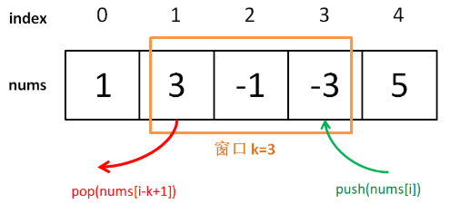
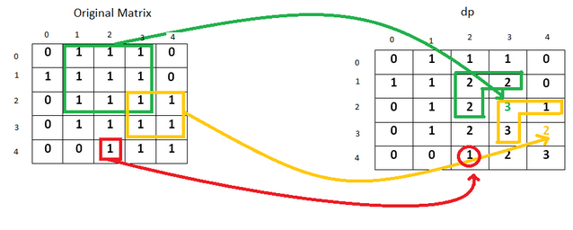
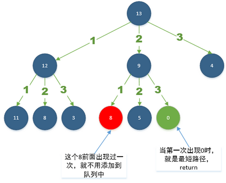

# Leetcode python

## 栈
#### [20. 有效的括号](https://leetcode-cn.com/problems/valid-parentheses/)
符号匹配用单个栈
```python
class Solution:
    def isValid(self, s: str) -> bool:
        stack = []
        match = {'{':'}', '[':']', '(':')'}
        for item in s:
            if item in match.keys():
                stack.append(item)
            else:
                if len(stack) != 0:
                    if match[stack[-1]] == item:
                        stack.pop()
                    else: return False
                else: return False
        if len(stack) == 0: return True
        else: return False
```

#### [394. 字符串解码](https://leetcode-cn.com/problems/decode-string/)
单个栈
```python
class Solution:
    def decodeString(self, s: str) -> str:
        stack = []
        str_out = ""

        for index, item in enumerate(s):
            if item != ']':
                stack.append(item)
            else:
                str_temp = ""
                str_num = ""
                count = 1
                sign = stack[-1]

                while (sign != '['):
                    str_temp += stack.pop()
                    sign = stack[-1]

                stack.pop() # delete '['
                sign = stack[-1]

                while (sign.isdigit()):
                    str_num += stack.pop()
                    if stack:
                        sign = stack[-1]
                    else:
                        sign = "end"

                str_num = str_num[::-1]
                str_temp = str_temp[::-1]

                try:
                    num = int(str_num)
                except:
                    num = 1
                str_temp *= num
                for item in str_temp:
                    stack.append(item)

        if stack:
            str_out = ''.join(stack)

        return str_out
```

#### [739. 每日温度](https://leetcode-cn.com/problems/daily-temperatures/)
包含index的单调递减栈
```python
class Solution:
    def dailyTemperatures(self, T: List[int]) -> List[int]:
        result = [0] * len(T)
        stack = []

        for index, item in enumerate(T):
            # while 维护单调栈
            while stack and item > stack[-1][1]:
                i, value = stack.pop()
                res = index - i
                result[i] = res

            stack.append((index, item))

        return result
```
#### [42. 接雨水](https://leetcode-cn.com/problems/trapping-rain-water/)
超时
```python
class Solution:
    def trap(self, height: List[int]) -> int:
        from collections import deque
        if len(height) == 0: return 0
        max_h = max(height)
        water_count = 0
        for level_h in range(1,max_h+1):
            stack = deque([])
            for index in range(len(height)):
                if len(stack)==0 and height[index] >= level_h:
                    stack.append(index)
                elif len(stack)==1 and height[index] >= level_h:
                    if index-stack[-1] > 1:
                        stack.append(index)
                    else:
                        stack[0] = index
                if len(stack)==2:
                    left_index = stack.popleft()
                    right_index = stack[0]
                    water_count += (right_index - left_index - 1)
        return water_count
```
```python
class Solution:
    def trap(self, height: List[int]) -> int:
      """维护一个高度单调递减的栈"""
        if len(height) == 0: return 0
        water_count = 0
        stack = []
        for index in range(len(height)):
            cur_height = height[index]
            # 维护一个高度单调递减的栈
            while stack and cur_height > height[stack[-1]]:
                top = stack.pop()
                if len(stack)==0: break
                h = min(height[stack[-1]], cur_height) - height[top]
                dist = index - stack[-1] - 1
                water_count += dist * h
            stack.append(index)
        return water_count
```

## 堆
#### [347. 前 K 个高频元素](https://leetcode-cn.com/problems/top-k-frequent-elements)
这题是对**堆，优先队列**很好的练习，因此有必要自己用python实现研究一下。**堆 处理海量数据的topK，分位数**非常合适，**优先队列**应用在元素优先级排序，比如本题的频率排序非常合适。与基于比较的排序算法 时间复杂度**O(nlogn)** 相比, 使用**堆，优先队列**复杂度可以下降到 **O(nlogk)**,在总体数据规模 n 较大，而维护规模 k 较小时，时间复杂度优化明显。
**堆，优先队列**的本质其实就是个完全二叉树，有其下重要性质
1. 父节点index为 (i-1) // 2
2. 左子节点index为 2*i + 1
3. 右子节点index为 2*i + 2
4. 大顶堆中每个父节点大于子节点，小顶堆每个父节点小于子节点
5. 优先队列以优先级为堆的排序依据
因为性质1，2，3，堆可以用数组直接来表示，不需要通过链表建树。

**堆，优先队列** 有两个重要操作，时间复杂度均是 O(logk)。以大顶锥为例：
1. 上浮sift up: 向堆新加入一个元素，堆规模+1，依次向上与父节点比较，如大于父节点就交换。
2. 下沉sift down: 从堆取出一个元素（堆规模-1，用于堆排序）或者更新堆中一个元素（本题），逆序遍历数组index从 (k-1) // 2 到 index为 0，向下走保证父节点大于子节点。

对于topk 问题：**最大堆求topk小，最小堆求topk大。**
- topk小：构建一个k个数的最大堆，当读取的数小于根节点时，替换根节点，重新塑造最大堆
- topk大：构建一个k个数的最小堆，当读取的数大于根节点时，替换根节点，重新塑造最小堆

**这一题的总体思路** 总体时间复杂度 **O(nlogk)**
- 建立字典遍历一次统计出现频率. O(logn)
- 取前k个数，构造**规模为k的最小堆** minheap. O(logn)
- 遍历规模k之外的数据，大于堆顶则入堆，维护规模为k的最小堆 minheap. O(nlogk)
- (如需按频率输出，对规模为k的堆进行排序)

```python
class Solution:
    def topKFrequent(self, nums: List[int], k: int) -> List[int]:
        # hashmap 统计频率
        freq_count = {}
        for num in nums:
            if num in freq_count:
                freq_count[num] += 1
            else:
                freq_count[num] = 1

        def sift_up(arr, k):
            """ 时间复杂度 O(logk) k 为堆的规模"""
            new_index, new_val = k-1, arr[k-1]
            while (new_index > 0 and arr[(new_index-1)//2][1] > new_val[1]):
                arr[new_index] = arr[(new_index-1)//2]
                new_index = (new_index-1)//2
            arr[new_index] = new_val # 这里采用的是类似插入排序的赋值交换

        def sift_down(arr, root, k):
            """ O(logk). 左节点index 2*root+1, 右节点 2*root+2, 父节点 (child-1)//2"""
            root_val = arr[root]
            while (2*root+1 < k):
                child = 2 * root + 1
                # 小顶锥 用 >，大顶锥 用 <
                if child+1 < k and arr[child][1] > arr[child+1][1]:
                    child += 1
                if root_val[1] > arr[child][1]:
                    arr[root] = arr[child]
                    root = child # 继续向下检查
                else: break # 如果到这里没乱序，不用再检查后续子节点
            arr[root] = root_val

        # 注意构造规模为k的堆, 时间复杂度O(n)，因为堆的规模是从0开始增长的
        freq_list = list(freq_count.items())
        min_heap = []
        for i in range(k):
            min_heap.append(freq_list[i])
            sift_up(min_heap, i+1)

        # 遍历剩下元素，大于堆顶入堆，下沉维护小顶堆
        for item in freq_list[k:]:
            priority = item[1]
            if priority > min_heap[0][1]:
                min_heap[0] = item
                sift_down(min_heap, 0, k)

        return [item[0] for item in min_heap]
```
```python
heapq 构造小顶堆， 若从大到小输出heappush负数
class Solution:
    def topKFrequent(self, nums: List[int], k: int) -> List[int]:
        import heapq
        from collections import Counter

        feuq = Counter(nums)
        heap = []
        for key, val in feuq.items():
            heapq.heappush(heap, (-val, key))
        result = []
        for _ in range(k):
            result.append(heapq.heappop(heap)[1])

        return result
```

#### [面试题40. 最小的k个数](https://leetcode-cn.com/problems/zui-xiao-de-kge-shu-lcof/)
```python
class Solution:
    def getLeastNumbers(self, arr: List[int], k: int) -> List[int]:
        def sift_up(arr, k):
            new_index, new_val = k-1, arr[k-1]
            while (new_index>0 and arr[(new_index-1)//2]<new_val):
                arr[new_index] = arr[(new_index-1)//2]
                new_index = (new_index-1)//2
            arr[new_index] = new_val

        def sift_down(arr, root, k):
            root_val = arr[root]
            while (2*root+1 < k):
                child = 2*root+1
                if child+1 < k and arr[child] < arr[child+1]:
                    child += 1
                if root_val < arr[child]:
                    arr[root] = arr[child]
                    root = child
                else: break
            arr[root] = root_val

        if k == 0: return []
        max_heap = []
        for i in range(k):
            max_heap.append(arr[i])
            sift_up(max_heap, i+1)

        for item in arr[k:]:
            if item < max_heap[0]:
                max_heap[0] = item
                sift_down(max_heap, 0, k)

        return max_heap
```

#### [295. 数据流的中位数](https://leetcode-cn.com/problems/find-median-from-data-stream/)
```python
class MaxHeap:
    def __init__(self):
        self.heap = []

    def sift_down(self, root, k):
        root_val = self.heap[root]
        while (2*root+1 < k):
            child = 2 * root + 1
            if child+1 < k and self.heap[child] < self.heap[child+1]:
                child += 1
            if root_val < self.heap[child]:
                self.heap[root] = self.heap[child]
                root = child
            else: break
        self.heap[root] = root_val

    def sift_up(self, k):
        new_index, new_val = k-1, self.heap[k-1]
        while (new_index > 0 and self.heap[(new_index-1)//2] < new_val):
            self.heap[new_index] = self.heap[(new_index-1)//2]
            new_index = (new_index-1)//2
        self.heap[new_index] = new_val

    def add_new(self, new_val):
        self.heap.append(new_val)
        self.sift_up(len(self.heap))

    def take(self):
        val = self.heap[0]
        self.heap[0], self.heap[-1] = self.heap[-1], self.heap[0]
        self.heap.pop()
        if self.heap:
            self.sift_down(0, len(self.heap))
        return val

    def __len__(self):
        return len(self.heap)


class MinHeap(MaxHeap):
    def __init__(self):
        self.heap = []

    def sift_down(self, root, k):
        root_val = self.heap[root]
        while (2*root+1 < k):
            child = 2 * root + 1
            if child+1 < k and self.heap[child] > self.heap[child+1]:
                child += 1
            if root_val > self.heap[child]:
                self.heap[root] = self.heap[child]
                root = child
            else: break
        self.heap[root] = root_val

    def sift_up(self, k):
        new_index, new_val = k-1, self.heap[k-1]
        while (new_index > 0 and self.heap[(new_index-1)//2] > new_val):
            self.heap[new_index] = self.heap[(new_index-1)//2]
            new_index = (new_index-1)//2
        self.heap[new_index] = new_val


class MedianFinder:
    def __init__(self):
        """
        initialize your data structure here.
        """
        self.max_heap = MaxHeap()
        self.min_heap = MinHeap()
        self.max_capacity =  4

    def addNum(self, num: int) -> None:
        self.max_heap.add_new(num)
        self.min_heap.add_new(self.max_heap.take())
        if len(self.max_heap) < len(self.min_heap):
            self.max_heap.add_new(self.min_heap.take())


    def findMedian(self) -> float:
        median = self.max_heap.heap[0] if len(self.max_heap) > len(self.min_heap) else (self.max_heap.heap[0]+self.min_heap.heap[0])/2
        return median

# Your MedianFinder object will be instantiated and called as such:
# obj = MedianFinder()
# obj.addNum(num)
# param_2 = obj.findMedian()
```

#### [215. 数组中的第K个最大元素](https://leetcode-cn.com/problems/kth-largest-element-in-an-array/)
1. 规模为k的最小堆
2. partition 直到 pivot_index = n-k, 可保证左边均小于pivot, 右边均大于等于pivot
快速选择可以用于查找中位数，任意第k大的数
在输出的数组中，pivot_index达到其合适位置。所有小于pivot_index的元素都在其左侧，所有大于或等于的元素都在其右侧。如果是快速排序算法，会在这里递归地对两部分进行快速排序，时间复杂度为 O(NlogN)。快速选择由于知道要找的第 N - k 小的元素在哪部分中，不需要对两部分都做处理，这样就将平均时间复杂度下降到 O(N)。
3. 注意输入的nums数组是被修改过的
```python
class Solution:
    def findKthLargest(self, nums: List[int], k: int) -> int:
        def partition(array, l, r):
            pivot = array[l]
            pivot_index = l
            for i in range(l+1, r):
                if array[i] < pivot:
                    pivot_index += 1
                    array[i], array[pivot_index] = array[pivot_index], array[i]
            array[l], array[pivot_index] = array[pivot_index], array[l]
            return pivot_index

        def select(array, l, r, k_smallest):
            while (l < r):
                pivot_index = partition(array, l, r)
                if pivot_index == k_smallest:
                    return pivot_index
                elif pivot_index < k_smallest:
                    l = pivot_index + 1
                else:
                    r = pivot_index
            return l

        index = select(nums, 0, len(nums), len(nums)-k)
        return nums[index]
```


## 队列
### 双向队列
#### [239. 滑动窗口最大值](https://leetcode-cn.com/problems/sliding-window-maximum/)
> TODO: 用动态规划再做一次

双向队列

```python
from collections import deque

class Solution:
    def maxSlidingWindow(self, nums: List[int], k: int) -> List[int]:
        # 建立双向队列,储存索引便于滑窗判断
        window = deque(); res = []
        for i in range(len(nums)):
            # 构建单调队列的push操作，注意用nums恢复索引
            while window and nums[window[-1]] <= nums[i]:
                window.pop()
            window.append(i)
            # 从k-1开始res append()
            if i >= k - 1:
                res.append(nums[window[0]])
            # 如果单调队列最大值落于滑窗之外，popleft()
            if window[0] == i-k+1:
                window.popleft()
        return res
```

## 动态规划
用额外的空间，存储子问题的最优解，找到状态转移方程，不断推出当前最优解。
1. 状态转移方程
2. 初始值
#### [55. 跳跃游戏](https://leetcode-cn.com/problems/jump-game)
动态规划，贪心
```python
class Solution:
    def canJump(self, nums: List[int]) -> bool:
        left_good = len(nums) - 1 # index
        for i in range(left_good, -1, -1):
            if nums[i] + i >= left_good:
                left_good = i
        return left_good == 0

# 从后往前，核对能否到达终点，或者到达后面能到达终点的点
class Solution:
    def canJump(self, nums: List[int]) -> bool:
        if len(nums) == 1:二叉搜索
            return True

        point_to_end = []
        for i in range(len(nums)-2,-1,-1):
            if nums[i] >= len(nums)-1-i:
                point_to_end.append(i)
            if point_to_end and nums[i] >= point_to_end[-1] - i:
                point_to_end.append(i)

        if 0 in point_to_end:
            return True
        else:
            return False
```
参看 [官方题解](https://leetcode-cn.com/problems/jump-game/solution/tiao-yue-you-xi-by-leetcode/) 四种方案思路很清楚

#### [70. 爬楼梯](https://leetcode-cn.com/problems/climbing-stairs/)
动态规划, 它的最优解可以从其子问题的最优解来有效地构建。

第 `i` 阶可以由以下两种方法得到：

- 在第 `(i-1)` 阶后向上爬 1 阶。

- 在第 `(i-2)` 阶后向上爬 2 阶。

所以到达第 `i` 阶的方法总数就是到第 `i-1` 阶和第 `i-2` 阶的方法数之和。

令 `dp[i]` 表示能到达第 `i` 阶的方法总数，
状态转移方程（同斐波那契数）：
`dp[i] = dp[i−1] + dp[i−2]`
```python
class Solution:
    def climbStairs(self, n: int) -> int:
        f0 = 1
        f1 = 2
        if n == 1: return f0
        if n == 2: return f1
        for i in range(n-2):
            f2 = f0 + f1
            f0 = f1
            f1 = f2
        return f2
```

```python
class Solution:
    def climbStairs(self, n: int) -> int:
        """ functools.lru_cache 用于回溯时，
        将已访问节点的值放入memo避免重复计算,
        重复节点不会再访问"""
        import functools
        @functools.lru_cache(None)
        def helper(step):
            print(step)
            if step == 0:
                return 1
            if step < 0:
                return 0
            res = 0
            for i in range(1,3):
                res += helper(step-i)
            return res

        return helper(n)
```

#### [198. 打家劫舍](https://leetcode-cn.com/problems/house-robber)
状态转移方程 cur_max = max(pprev_max + nums[i], prev_max)
```python
class Solution:
    def rob(self, nums: List[int]) -> int:
        # 动态规划两部曲，1.定义初始值 2.定义状态转移方程
        cur_max = 0
        prev_max = 0
        pprev_max = 0

        for i in range(len(nums)):
            cur_max = max(pprev_max + nums[i], prev_max)
            pprev_max = prev_max
            prev_max = cur_max

        return cur_max

class Solution:
    def rob(self, nums: List[int]) -> int:
        n = len(nums)
        if n == 0: return 0
        if n < 3: return max(nums)
        dp = [0] * (n+1)
        dp[1] = nums[0]
        for i in range(2, n+1):
            steal_pre = dp[i-1]
            steal_this = dp[i-2] + nums[i-1]
            dp[i] = max(steal_pre, steal_this)

        return dp[-1]
```

#### [213. 打家劫舍 II](https://leetcode-cn.com/problems/house-robber-ii/)
```python
class Solution:
    def rob(self, nums: List[int]) -> int:
        n = len(nums)
        if n == 0: return 0
        if n < 3: return max(nums)

        def helper(amounts):
            n = len(amounts)
            if n == 1: return amounts[0]
            dp = [0] * (n+1)
            dp[1] = amounts[0] # becareful
            for i in range(2, n+1):
                steal_pre = dp[i-1]
                steal_this = dp[i-2] + amounts[i-1]
                dp[i] = max(steal_pre, steal_this)
            return dp[-1]

        return max(helper(nums[1:]), helper(nums[:-1]))
```


#### [152. 乘积最大子序列](https://leetcode-cn.com/problems/maximum-product-subarray/)
```python
class Solution:
    def maxProduct(self, nums: List[int]) -> int:
        curr_min = 1
        curr_max = 1
        max_value = max(nums)
        for item in nums:
            # 如果遇到负数，最大变最小，最小变最大
            if item < 0:
                curr_min, curr_max = curr_max, curr_min
            curr_max = max(item, curr_max*item)  # 无负数阶段的当前最大值
            curr_min = min(item, curr_min*item)  # 维护连乘最小值或者当前值
            max_value = max(curr_max, max_value)
        return max_value
```


#### [64. 最小路径和](https://leetcode-cn.com/problems/minimum-path-sum)
逆序，二维
```python
class Solution:
    def minPathSum(self, grid: List[List[int]]) -> int:
        grid_h = len(grid)
        grid_w = len(grid[0])
        dp = [[0] * grid_w for i in range(grid_h)]

        for i in range(grid_h-1, -1, -1):
            for j in range(grid_w-1, -1, -1):
                if i+1 > grid_h-1 and j+1 > grid_w-1:
                    dp[i][j] = grid[i][j]
                elif i+1 > grid_h-1 and j+1 <= grid_w-1:
                    dp[i][j] = grid[i][j] + dp[i][j+1]
                elif i+1 <= grid_h-1 and j+1 > grid_w-1:
                    dp[i][j] = grid[i][j] + dp[i+1][j]
                else:
                    dp[i][j] = grid[i][j] + min(dp[i+1][j], dp[i][j+1])

        return dp[0][0]
```

#### [62. 不同路径](https://leetcode-cn.com/problems/unique-paths/)
```python
class Solution:
    def uniquePaths(self, m: int, n: int) -> int:
        dp = [[0]*m for i in range(n)]
        for i in range(m):
            for j in range(n):
                if j-1 < 0 and i - 1 < 0:
                    dp[j][i] = 1
                elif j-1 < 0:
                    dp[j][i] = dp[j][i-1]
                elif i-1 < 0:
                    dp[j][i] = dp[j-1][i]
                else:
                    dp[j][i] = dp[j-1][i] + dp[j][i-1]
        return dp[n-1][m-1]
```

#### [221. 最大正方形](https://leetcode-cn.com/problems/maximal-square/)

$$
\mathrm{dp}(i, j)=\min (\mathrm{dp}(i-1, j), \mathrm{dp}(i-1, j-1), \mathrm{dp}(i, j-1))+1
$$



```python
class Solution:
    def maximalSquare(self, matrix: List[List[str]]) -> int:
        h = len(matrix)
        try:
            w = len(matrix[0])
        except:
            return 0
        dp = [[0] * w for i in range(h)]
        max_value = 0
        for i in range(h):
            for j in range(w):
                if matrix[i][j] == '1':
                    top = 0 if i==0 else dp[i-1][j]
                    left = 0 if j==0 else dp[i][j-1]
                    top_left = 0 if (i==0 and j==0) else dp[i-1][j-1]
                    dp[i][j] = min(top_left, top, left) + 1
                    max_value = dp[i][j] if dp[i][j] > max_value else max_value
        return max_value**2
```

#### [139. 单词拆分](https://leetcode-cn.com/problems/word-break/)
对于给定的字符串（s）可以被拆分成子问题 s1 和 s2, 如果这些子问题都可以独立地被拆分成符合要求的子问题，那么整个问题 s 也可以满足.
```python
class Solution:
    def wordBreak(self, s: str, wordDict: List[str]) -> bool:
        dp = [1] + [0] * len(s)
        for i in range(1, len(s)+1):
            for j in range(i):
                if dp[j] and s[j:i] in wordDict:
                    dp[i] = True
        return dp[len(s)]

class Solution:
    def wordBreak(self, s: str, wordDict: List[str]) -> bool:
        dp = [0]
        for i in range(len(s)):
            for index in dp:
                if s[index:i+1] in wordDict and (i+1) not in dp:
                    dp.append(i+1)
        if dp[-1] == len(s): return True
        else: return False
```
```python
class Solution:
    def wordBreak(self, s: str, wordDict: List[str]) -> bool:
        n = len(s)
        wordDict = set(wordDict)
        import functools
        @functools.lru_cache(None)
        def helper(start):
            if start == n:
                return True
            for i in range(start+1,n+1):
                if s[start:i] in wordDict and helper(i):
                    return True
            return False

        return helper(0)
```


#### [96. 不同的二叉搜索树](https://leetcode-cn.com/problems/unique-binary-search-trees)
G(n): 长度为n的序列的不同二叉搜索树个数

F(i,n): 以i为根的不同二叉搜索树的个数(1<=i<=n)

$$ G(n) = \sum_{i=1}^n F(i,n) $$
$$ F(i,n) = G(i-1) G(n-i) $$
$$ G(n) = \sum_{i=1}^n G(i-1) G(n-i) $$

- 状态转移方程 $G(n) = \sum_{i=1}^n G(i-1) G(n-i)$
- 初始值 G(0) = 1, G(1) = 1

```python
class Solution:
    def numTrees(self, n: int) -> int:
        g0 = 1
        g1 = 1
        if n == 0: return g0
        if n == 1: return g1
        G = [g0,g1] + [0] * (n-1)
        for j in range(2,n+1):
            for i in range(1,j+1):
                G[j] += G[i-1] * G[j-i]
        return G[-1]
```

#### [279. 完全平方数](https://leetcode-cn.com/problems/perfect-squares/)
1. 队列构造 BTS 广度优先搜索
2. 动态规划



```python
class Solution:
    def numSquares(self, n: int) -> int:
        from collections import deque
        queue = deque([n]) # 通过队列构造 BTS
        seen = set() # 如果之前见过，没必要再搜索一次
        level = 1
        while queue:
            # 遍历完同级后,level+1
            for _ in range(len(queue)):
                node_val = queue.popleft()
                for item in range(1, int(node_val**0.5)+1):
                    node = node_val - item**2
                    if node == 0: return level
                    if node not in seen:
                        queue.append(node)
                        seen.add(node)
            level += 1
        return level
```

#### [300. 最长上升子序列](https://leetcode-cn.com/problems/longest-increasing-subsequence/)
时间复杂度O(n^2), O(n)
```python
class Solution:
    def lengthOfLIS(self, nums: List[int]) -> int:
        if len(nums) == 0: return 0
        dp = [1] * len(nums)
        for i in range(len(nums)):
            for j in range(i):
                if nums[j] < nums[i]:
                    dp[i] = max(dp[i], dp[j]+1)
        return max(dp)
```
遍历nums，二分查找当前元素在dp中的low bound，替换dp中对应元素为当前元素，如果low bound 超过历史长度，长度+1. O(nlogn), O(n)
```python
class Solution:
    def lengthOfLIS(self, nums: List[int]) -> int:
        """只能保证长度对，不能保证dp就是其中一个答案"""
        dp = [0] * len(nums)
        lenth = 0
        for num in nums:
            l, r = 0, lenth
            while (l < r):
                m = l + (r-l)//2
                if dp[m] < num: # <= 非严格上升子序列
                    l = m + 1
                else:
                    r = m
            if l < lenth:
                dp[l] = num
            else:
                dp[l] = num
                lenth += 1
        return lenth
```

#### [322. 零钱兑换](https://leetcode-cn.com/problems/coin-change/)
https://leetcode-cn.com/problems/coin-change/solution/dong-tai-gui-hua-tao-lu-xiang-jie-by-wei-lai-bu-ke/)
如果只是求最小个数，相当于问题只问了一半，可以用广度优先来做，但如果要列举所有满足条件的可能，还是需要动态规划或者递归来做，例如题377。
```python
class Solution:
    def coinChange(self, coins: List[int], amount: int) -> int:
        dp = [float('inf')] * (amount+1)
        dp[0] = 0 # 注意初始化是0!
        for i in range(1, amount+1):
            for coin in coins:
                if i < coin:
                    dp[i] = dp[i]
                else:
                    dp[i] = min(dp[i], dp[i-coin]+1) # 注意是 dp[i-coin]+1
        return dp[-1] if dp[-1] != float('inf') else -1
```
```python
class Solution:
    def coinChange(self, coins: List[int], amount: int) -> int:
        if amount == 0: return 0
        from collections import deque
        def bfs(amount, level):
            queue = deque([amount])
            seen = set([amount])
            level = 0
            while queue:
                for _ in range(len(queue)):
                    top = queue.pop()
                    for coin in coins:
                        res = top - coin
                        if res == 0:
                            return level+1
                        # 剪枝 important
                        if res > 0 and res not in seen:
                            seen.add(res)
                            queue.appendleft(res)
                level += 1
            return -1
        return bfs(amount, 0)
```

#### [面试题 08.11. 硬币](https://leetcode-cn.com/problems/coin-lcci/)
```python
import functools
class Solution:
    def waysToChange(self, n: int) -> int:
        coins = [25, 10, 5, 1]
        n_coin = len(coins)
        mod = 10**9 + 7
        @functools.lru_cache(None)
        def helper(cur_value, index):
            if cur_value < 0:
                return 0
            if cur_value == 0:
                return 1
            res = 0
            for i in range(index, n_coin):
                res += helper(cur_value-coins[i], i)
            return res
        return helper(n, index=0) % mod
    def waysToChange(self, n: int) -> int:
        mod = 10**9 + 7
        coins = [25, 10, 5, 1]

        f = [1] + [0] * n
        for coin in coins:
            for i in range(coin, n + 1):
                f[i] += f[i - coin]
        return f[n] % mod
```

#### [338. 比特位计数](https://leetcode-cn.com/problems/counting-bits/)
```python
class Solution:
    def countBits(self, num: int) -> List[int]:
        dp = [0] * (num+1)
        count = 0
        pivot = pow(2, count)
        for i in range(1, num+1):
            if i == pow(2, count+1):
                count += 1
                pivot = pow(2, count)

            dp[i] = 1 + dp[i-pivot]

        return dp
```

#### [416. 分割等和子集](https://leetcode-cn.com/problems/partition-equal-subset-sum/)
```python
二维dp
class Solution:
    def canPartition(self, nums: List[int]) -> bool:
        nums_sum = sum(nums)
        if nums_sum % 2 != 0: return False
        target = nums_sum // 2

        dp = [[False] * (target+1) for _ in range(len(nums)+1)]
        dp[0][0] = True

        for i in range(1, len(dp)):
            for j in range(1, len(dp[0])):
                if j < nums[i-1]:
                    dp[i][j] = dp[i-1][j]
                else:
                    dp[i][j] = dp[i-1][j] or dp[i-1][j-nums[i-1]]

        return dp[-1][-1]
空间优化，不断覆盖之前的记录
class Solution:
    def canPartition(self, nums: List[int]) -> bool:
        if sum(nums) % 2 != 0: return False
        target = sum(nums) // 2
        dp = [False] * (target+1)
        dp[0] = True

        for num in nums:
            for i in range(target, num-1, -1):
                dp[i] = dp[i] or dp[i-num]

        return dp[-1]
```

#### [494. 目标和](https://leetcode-cn.com/problems/target-sum/)
```python
class Solution:
    def findTargetSumWays(self, nums: List[int], S: int) -> int:
        if (S + sum(nums)) % 2 != 0 or sum(nums) < S: return 0
        T = (S + sum(nums)) // 2
        dp = [0] * (T+1)
        dp[0] = 1
        for num in nums:
            for j in range(T, num-1, -1): # 注意到 num-1，否则索引<0反向更新
                dp[j] = dp[j] + dp[j-num] # 不放num的方法数 + 放num之前容量的方法数
        return dp[-1]
```

#### [647. 回文子串](https://leetcode-cn.com/problems/palindromic-substrings/)
```python
class Solution:
    def countSubstrings(self, s: str) -> int:
        # 中心拓展法
        count = len(s)
        if count <= 1: return count
        for i in range(len(s)):
            # 重点，两个回文中心
            j = 1
            while (i-j >= 0 and i+j < len(s) and s[i-j] == s[i+j]):
                count += 1
                j += 1
            j = 1
            while (i-j+1 >= 0 and i+j < len(s) and s[i-j+1] == s[i+j]):
                count += 1
                j += 1
        return count

class Solution:
    def countSubstrings(self, s: str) -> int:
        # 二维dp
        dp = [[0]*len(s) for _ in range(len(s))]
        for i in range(len(s)):
            dp[i][i] = 1
        for i in range(1, len(s)):
            for j in range(0, i):
                # 对角线旁的特殊处理
                if i-j == 1:
                    if s[i] == s[j]:
                        dp[i][j] = 1
                else:
                    if s[i] == s[j] and dp[i-1][j+1]:
                        dp[i][j] = 1
        count = 0
        for i in range(len(s)):
            count += sum(dp[i])
        return count

class Solution:
    def countSubstrings(self, s: str) -> int:
        # 一维dp
        dp = [0]*len(s)
        dp[0] = 0
        count = 0
        for i in range(1, len(s)):
            for j in range(0, i):
                # 对角线旁的特殊处理
                if i-j == 1:
                    if s[i] == s[j]:
                        dp[j] = 1
                    else: dp[j] = 0
                else:
                    if s[i] == s[j] and dp[j+1]:
                        dp[j] = 1
                    else: dp[j] = 0
            dp[i] = 1
            count += sum(dp)
        return count+1
```

[5. 最长回文子串](https://leetcode-cn.com/problems/longest-palindromic-substring/)
```python
class Solution:
    def longestPalindrome(self, s: str) -> str:
        # 1维dp
        if len(s) <= 1: return s
        dp = [0] * len(s)
        min_l = len(s)
        max_r = 0
        max_lenth = 0
        for r in range(1, len(s)):
            for l in range(r):
                if r - l == 1:
                    if s[r] == s[l]:
                        dp[l] = 1
                        if r-l > max_lenth:
                            max_lenth = r-l
                            min_l = l
                            max_r = r
                    else:
                        dp[l] = 0
                else:
                    if s[r] == s[l] and dp[l+1]:
                        dp[l] = 1
                        if r-l > max_lenth:
                            max_lenth = r-l
                            min_l = l
                            max_r = r
                    else:
                        dp[l] = 0
                dp[r] = 1

        return s[min_l:max_r+1] if max_lenth != 0 else s[0]
```

#### [121. 买卖股票的最佳时机](https://leetcode-cn.com/problems/best-time-to-buy-and-sell-stock/)
```python
class Solution:
    def maxProfit(self, prices: List[int]) -> int:
        """profit_1记录数组最小值，profit_0 记录当前值与最小值的差"""
        if len(prices)==0: return 0
        profit_0 = 0
        profit_1 = -max(prices)
        for item in prices:
            profit_0 = max(profit_0, profit_1+item)
            profit_1 = max(profit_1, -item)
        return profit_0
```

## 贪心算法
在每一步选择中都采取在当前状态下最好或最优（即最有利）的选择，从而希望导致结果是最好或最优的算法,
贪心使用前提,局部最优可实现全局最优.
#### [406. 根据身高重建队列](https://leetcode-cn.com/problems/queue-reconstruction-by-height/)
```python
class Solution:
    def reconstructQueue(self, people: List[List[int]]) -> List[List[int]]:
        # 从大往小贪心排
        people = sorted(people, key=lambda ele: (-ele[0], ele[1]))
        result = []
        for item in people:
            index = item[1]
            result.insert(index,item)
        return result
```

#### [621. 任务调度器](https://leetcode-cn.com/problems/task-scheduler/)
```python
import collections

class Solution:
    def leastInterval(self, tasks: List[str], n: int) -> int:
        dict_task = collections.Counter(tasks)
        time = 0
        while (max(dict_task.values()) > 0):
            count = 0
            for key in dict_task.most_common():
                if count < n+1:
                    if dict_task[key[0]] > 0:
                        dict_task[key[0]] -= 1
                        time += 1
                        count += 1
                else:
                    break
            if count < n + 1 and max(dict_task.values()) > 0:
                time += n + 1 - count
        return time
```

## 树
### 树的遍历

- 深度遍历：`后序遍历, 前序遍历, 中序遍历`
- 广度遍历：`层次遍历`

#### [94. 二叉树的中序遍历](https://leetcode-cn.com/problems/binary-tree-inorder-traversal/)
输出顺序如同看二叉树的俯视图：左后 -> 中间节点 -> 右后。递归回溯

前提：任何一个节点都有左孩子，叶子左孩子为`None`
- 从该节点出发，一直递归到其最左节点
- 当该节点左孩子为`None`，该层递归退出，保存该节点
- 尝试去访问该节点右孩子，若为`None`则退出该层递归，返回并保存父节点
- 若不为`None`则去寻找该右孩子的最左节点

解法一： 递归
- 时间复杂度：O(n)。递归函数 T(n) = 2 * T(n/2) + 1。
- 空间复杂度：最坏情况下需要空间O(n)，平均情况为O(logn)
```python
# Definition for a binary tree node.
class TreeNode:
    def __init__(self, x):
        self.val = x
        self.left = None
        self.right = None

class Solution:
    def inorderTraversal(self, root: TreeNode) -> List[int]:
        def traversal(node, res):
            if node != None:
                traversal(node.left, res)
                res.append(node.val)
                traversal(node.right, res)

        res = []
        traversal(root, res)
        return res
```
遍历
```python
class Solution:
    def inorderTraversal(self, root: TreeNode) -> List[int]:
        stack = []
        if root: stack.append(root)
        result = []
        while stack:
            top = stack[-1]
            if top.left:
                stack.append(top.left)
                top.left = None # 设置left已经访问!
            else:
                stack.pop()
                result.append(top.val)
                if top.right:
                    stack.append(top.right)
        return result
```

#### [144. 二叉树的前序遍历](https://leetcode-cn.com/problems/binary-tree-preorder-traversal/)
输出顺序：根 -> 左子节点 -> 右子节点. dfs
思路：
- 从根节点开始，若当前节点非空，输出
- 依次向左，左子为空再向右

```python
class Solution:
    def preorderTraversal(self, root: TreeNode) -> List[int]:
        def traversal(node, res):
            if node != None:
                res.append(node.val)
                traversal(node.left, res)
                traversal(node.right, res)

        res = []
        traversal(root, res)
        return res
```

```python
class Solution:
    def preorderTraversal(self, root: TreeNode) -> List[int]:
        stack = []
        if root: stack.append(root)
        result = []
        while stack:
            top = stack.pop()
            result.append(top.val)
            if top.right:
                stack.append(top.right)
            if top.left:
                stack.append(top.left)
        return result
```

#### [145. 二叉树的后序遍历](https://leetcode-cn.com/problems/binary-tree-postorder-traversal/)
输出顺序：左后 -> 右后 -> 根

```python
class Solution:
    def postorderTraversal(self, root: TreeNode) -> List[int]:
        def traversal(node, res):
            if node != None:
                traversal(node.left, res)
                traversal(node.right, res)
                res.append(node.val)

        res = []
        traversal(root, res)
        return res
```
循环，每次添加两个点
```python
class Solution:
    def postorderTraversal(self, root: TreeNode) -> List[int]:
        result = []
        if root: stack = [root] * 2
        else: return result

        while stack:
            # 每次添加2个点，点2用于循环树, 点1用于result
            cur_node = stack.pop()
            if stack and stack[-1] == cur_node:
                if cur_node.right:
                    stack += [cur_node.right] * 2
                if cur_node.left:
                    stack += [cur_node.left] * 2
            else:
                result.append(cur_node.val)
        return result
```

```python
class Solution:
    def postorderTraversal(self, root: TreeNode) -> List[int]:
        WHITE, GRAY = 0, 1
        stack = []
        stack.append((root, WHITE))
        result = []
        while stack:
            node, color = stack.pop()
            if node:
                if color == WHITE:
                    stack.append((node, GRAY))
                    stack.append((node.right, WHITE))
                    stack.append((node.left, WHITE))
                else:
                    result.append(node.val)
        return result
```

#### [102. 二叉树的层次遍历](https://leetcode-cn.com/problems/binary-tree-level-order-traversal/)
输出顺序：按层级从左到右. bfs
递归
```python
class Solution:
    def levelOrder(self, root: TreeNode) -> List[List[int]]:
        def traversal(node, level, res):
            if node != None:
                if len(res) == level: res.append([])
                res[level].append(node.val)
                traversal(node.left, level+1, res)
                traversal(node.right, level+1, res)

        res = []; level = 0
        traversal(root, level, res)
        return res
```
非递归
```python
class Solution:
    def levelOrder(self, root: TreeNode) -> List[List[int]]:
        from collections import deque
        queue = deque([])
        if root: queue.appendleft(root)
        level = 0
        result = []
        while queue:
            result.append([])
            # 一次遍历一个level，方便level+1
            for i in range(len(queue)):
                top = queue.pop()
                result[level].append(top.val)
                if top.left:
                    queue.appendleft(top.left)
                if top.right:
                    queue.appendleft(top.right)
            level += 1
        return result
```

#### [542. 01 矩阵](https://leetcode-cn.com/problems/01-matrix/)
```python
from collections import deque
class Solution:
    def updateMatrix(self, matrix: List[List[int]]) -> List[List[int]]:
        rows = len(matrix)
        if rows == 0:
            return []
        cols = len(matrix[0])

        def bfs(i, j):
            queue = deque([(i, j)])
            visited = set([(i, j)])
            directions = [(1, 0), (0, 1), (-1, 0), (0, -1)]
            level = 0
            while queue:
                level += 1
                for _ in range(len(queue)):
                    row, col = queue.pop()
                    for direction in directions:
                        next_row = row + direction[0]
                        next_col = col + direction[1]
                        if next_row < 0 or next_row >= rows or next_col < 0 or next_col >= cols:
                            continue
                        if matrix[next_row][next_col] == 0:
                            return level
                        if matrix[next_row][next_col] == 1 and (next_row, next_col) not in visited:
                            queue.appendleft((next_row, next_col))
                            visited.add((next_row, next_col))


        result = [[0] * cols for _ in range(rows)]
        for i in range(rows):
            for j in range(cols):
                if matrix[i][j] == 0:
                    result[i][j] = 0
                else:
                    result[i][j] = bfs(i, j)

        return result
```

#### [994. 腐烂的橘子](https://leetcode-cn.com/problems/rotting-oranges/)
坑很多。。
1. bfs 可以以多个节点为起始，不要被二叉树束缚
2. 注意已经访问过的节点设置为已访问
3. 返回level-1
3. 注意边界条件，左开右闭
4. 注意检查0， -1 的情况
```python
class Solution:
    def orangesRotting(self, grid: List[List[int]]) -> int:
        from collections import deque

        grid_h = len(grid)
        grid_w = len(grid[0]) if grid_h != 0 else 0
        if grid_h == 0 or grid_w == 0: return 0

        queue = deque()
        count_fresh = 0
        for i in range(len(grid)):
            for j in range(len(grid[0])):
                if grid[i][j] == 2:
                    queue.appendleft([i, j])
                if grid[i][j] == 1:
                    count_fresh += 1
        if count_fresh == 0: return 0

        level = 0
        while queue:
            for _ in range(len(queue)):
                i, j = queue.pop()
                if i+1 < grid_h and grid[i+1][j] == 1:
                    queue.appendleft([i+1, j])
                    grid[i+1][j] = 2
                if i-1 >= 0 and grid[i-1][j] == 1:
                    queue.appendleft([i-1, j])
                    grid[i-1][j] = 2
                if j+1 < grid_w and grid[i][j+1] == 1:
                    queue.appendleft([i, j+1])
                    grid[i][j+1] = 2
                if j-1 >= 0 and grid[i][j-1] == 1:
                    queue.appendleft([i, j-1])
                    grid[i][j-1] = 2
            level += 1

        for i in range(len(grid)):
            for j in range(len(grid[0])):
                if grid[i][j] == 1:
                    return -1

        return level-1
```

#### [LCP 09. 最小跳跃次数](https://leetcode-cn.com/problems/zui-xiao-tiao-yue-ci-shu/)
```python
from collections import deque
class Solution:
    def minJump(self, jump: List[int]) -> int:
        """
        1. visited 数组 比 set 快
        2. left_max = max(left_max, top) 比 left_max = top 快10倍
        """
        queue = deque([0])
        n = len(jump)
        visited = [0] * n
        level = 0
        left_max = 0
        while queue:
            level += 1
            for _ in range(len(queue)):
                top = queue.pop()
                # jump to right
                next_index = top + jump[top]
                if next_index < n:
                    if not visited[next_index]:
                        queue.appendleft(next_index)
                        visited[next_index] = 1
                else:
                    return level
                # jump to left
                for i in range(left_max+1, top):
                    if not visited[i]:
                        queue.appendleft(i)
                        visited[i] = 1
                left_max = max(left_max, top)
```

#### [864. 获取所有钥匙的最短路径](https://leetcode-cn.com/problems/shortest-path-to-get-all-keys/)
三维的bfs
```python
from collections import deque
class Solution:
    def shortestPathAllKeys(self, grid: List[str]) -> int:
        rows, cols = len(grid), len(grid[0])
        start_row, start_col, key_num = 0, 0, 0
        for row in range(rows):
            for col in range(cols):
                cell = grid[row][col]
                if cell.islower():
                    key_num += 1
                if cell == "@":
                    start_row, start_col = row, col
        keys, step, visited = tuple(), 0, set()
        visited.add((start_row, start_col, keys))
        queue = deque([(start_row, start_col, keys, step)])
        directions = [(1,0),(0,1),(-1,0),(0,-1)]
        while queue:
            row, col, keys, step = queue.pop()
            for direction in directions:
                next_row, next_col = row + direction[0], col + direction[1]
                add_keys = keys
                # 遇到边界
                if next_row < 0 or next_row >= rows or next_col < 0 or next_col >= cols:
                    continue
                cell = grid[next_row][next_col]
                # 遇到墙壁
                if cell == "#":
                    continue
                # 遇到新钥匙，添加
                if cell.islower() and cell not in add_keys:
                    add_keys = add_keys + (cell,)
                    if len(add_keys) == key_num:
                        return step+1
                # 遇到锁没相应钥匙
                if "A" <= cell <= "F" and cell.lower() not in add_keys:
                    continue
                # 已经访问过
                if (next_row, next_col, add_keys) in visited:
                    continue
                queue.appendleft((next_row, next_col, add_keys, step+1))
                visited.add((next_row, next_col, add_keys))
        return -1
```

#### [987. 二叉树的垂序遍历](https://leetcode-cn.com/problems/vertical-order-traversal-of-a-binary-tree/submissions/)
输出顺序：左 -> 右， 上 -> 下
```python
class Solution:
    def verticalTraversal(self, root: TreeNode) -> List[List[int]]:
        def traversal(node, level, res, levels, deep=0):
            if node != None:
                # 层次遍历
                if level not in levels: levels.append(level); res[level] = []
                traversal(node.left, level-1, res, levels, deep = deep + 1)
                res[level].append([node.val, deep])
                traversal(node.right, level+1, res, levels, deep = deep +  1)

        res = {}; res_order = []; level = 0; levels = []; out = []
        traversal(root, level, res, levels)
        # 按宽度排序
        for key in sorted(res.keys()):
            res_order.append(res[key])
        # 按深度排序（同时保证同深度的，值小的在前）
        for item in res_order:
            item = sorted(item, key=lambda ele:(ele[1],ele[0]))
            out.append([i[0] for i in item])
        return out

class Solution:
    def verticalTraversal(self, root: TreeNode) -> List[List[int]]:
        def traversal(node, level, deep, res):
            if node:

                traversal(node.left, level+1, deep-1, res)
                res.append((node.val, deep, level))
                traversal(node.right, level+1, deep+1, res)

        level = 0
        deep = 0
        res = []
        traversal(root, level, deep, res)

        res_deep = sorted(res, key=lambda ele: ele[1])
        output = []
        deep_level = -1
        deep_last = None

        for item in res_deep:
            val, deep, level = item
            if deep_last != deep:
                output.append([])
                deep_level += 1

            output[deep_level].append((val, level))
            deep_last = deep

        out = []
        for i in range(len(output)):
            output[i] = sorted(output[i], key=lambda ele: (ele[1], ele[0]))
            out.append([])
            for item in output[i]:
                out[i].append(item[0])

        return out
```

#### [104. 二叉树的最大深度](https://leetcode-cn.com/problems/maximum-depth-of-binary-tree)
```python
# Definition for a binary tree node.
# class TreeNode:
#     def __init__(self, x):
#         self.val = x
#         self.left = None
#         self.right = None

class Solution:
    def maxDepth(self, root: TreeNode) -> int:
        if root == None: return 0
        stack = []
        stack.append([1, root])
        depth = 0
        while (stack):
            curr_depth, top = stack.pop()
            left = top.left
            right = top.right
            depth = max(curr_depth, depth)
            if right: stack.append([curr_depth+1,right])
            if left: stack.append([curr_depth+1,left])
        return depth
```

#### [226. 翻转二叉树](https://leetcode-cn.com/problems/invert-binary-tree/)
注意体会递归的逐步进入与退出，变量的生命周期
```python
class Solution:
    def invertTree(self, root: TreeNode) -> TreeNode:
        if root != None:
            left_node = self.invertTree(root.left)
            right_node = self.invertTree(root.right)
            root.left = right_node
            root.right = left_node
        return root

class Solution:
    def invertTree(self, root: TreeNode) -> TreeNode:
        def traversal(node):
            if node:
                traversal(node.left)
                traversal(node.right)
                temp = node.left
                node.left = node.right
                node.right = temp
        traversal(root)
        return root
```

#### [437. 路径总和 III](https://leetcode-cn.com/problems/path-sum-iii/submissions/)
```python
class Solution:
    def pathSum(self, root: TreeNode, sum: int) -> int:
        def traversal(node, stack):
            if node:
                stack.append(node.val)
                cur = 0
                for i in range(len(stack)-1, -1, -1):
                    cur += stack[i]
                    if cur == sum: # 注意比较区别 sum(stack[i:]) == sum_
                        self.count += 1
                traversal(node.left, stack)
                traversal(node.right, stack)
                stack.pop() # 注意递归变量的生命周期

        self.count = 0; stack = [] # self.count与直接定义count的区别
        traversal(root, stack)
        return self.count
```

二叉搜索树具有以下性质：
- 如果节点的左子树不空，则左子树上所有结点的值均小于等于它的根结点的值；
- 如果节点的右子树不空，则右子树上所有结点的值均大于等于它的根结点的值；
- 任意节点的左、右子树也分别为二叉查找树；（二叉搜索树的定义是递归的二叉搜索树的定义是递归的）
- 没有键值相等的节点
- 中序遍历是升序

#### [538. 把二叉搜索树转换为累加树](https://leetcode-cn.com/problems/convert-bst-to-greater-tree/)
这道题对理解递归，回溯很有帮助。以树为例子，递归从root开始，在root结束。
递归回溯是一个不断深入，又回溯退出，在之间的操作注意理解同级性
```python
class Solution:
    def convertBST(self, root: TreeNode) -> TreeNode:
        def traversal(node):
            if node:
                traversal(node.right)
                node.val += self.last_value
                self.last_value = node.val
                traversal(node.left)

        self.last_value = 0
        traversal(root)
        return root
```

#### [543. 二叉树的直径](https://leetcode-cn.com/problems/diameter-of-binary-tree)
注意理解递归，通过dsf遍历得到每个当前节点的直径，保存最大直径
重点理解递归的 return, 二叉树遍历的退出,很好的练习

```python
class Solution:
    def diameterOfBinaryTree(self, root: TreeNode) -> int:
        self.max_diam = 0
        def traversal(node):
            # 递归到底部，返回基础值
            if node == None:
                return 0
            # 从底部归上来，每层如何处理，返回中间值
            else:
                L = traversal(node.left)
                R = traversal(node.right)
                self.max_diam = max(self.max_diam, L+R)
                return max(L, R) + 1
        _ = traversal(root)
        return self.max_diam
```

### 图
#### [399. 除法求值](https://leetcode-cn.com/problems/evaluate-division/)
```python
from collections import defaultdict, deque

class Solution:
    def bfs(self, query, graph):
            top, bottom = query
            visited = set([top])
            queue = deque([[top, 1]]) # careful
            while queue:
                top, value = queue.pop()
                if top == bottom:
                    return value
                for item in graph[top]:
                    if item not in visited:
                        visited.add(item)
                        queue.appendleft([item, value * graph[top][item]])
            return -1

    def dfs(self, query, graph):
        top, bottom = query
        visited = set([top])
        queue = deque([[top, 1]])
        while queue:
            top, value = queue.pop()
            if top == bottom:
                return value
            for item in graph[top]:
                if item not in visited:
                    visited.add(item)
                    queue.append([item, value * graph[top][item]])
        return -1

    def calcEquation(self, equations: List[List[str]], values: List[float], queries: List[List[str]]) -> List[float]:
        graph = defaultdict(dict)
        chars = set()
        for equation, value in zip(equations, values):
            x, y = equation[0], equation[1]
            chars.update(equation)
            graph[x][y] = value
            graph[y][x] = 1 / value

        result = []
        for query in queries:
            value = -1 if query[0] not in chars and query[1] not in chars else self.dfs(query, graph)
            result.append(value)
        return result
```

#### [207. 课程表](https://leetcode-cn.com/problems/course-schedule)
```python
class Solution:
    def canFinish(self, numCourses: int, prerequisites: List[List[int]]) -> bool:
        indegrees = [0 for _ in range(numCourses)]
        adjacency = [[] for _ in range(numCourses)]

        for item in prerequisites:
            curr, pre = item[0], item[1]
            adjacency[pre].append(curr)
            indegrees[curr] += 1
        queue = []
        for i, degree in enumerate(indegrees):
            if degree == 0:
                queue.append(i)
        while queue:
            pre = queue.pop()
            numCourses -= 1
            for curr in adjacency[pre]:
                indegrees[curr] -= 1
                if indegrees[curr] == 0:
                    queue.append(curr)

        return True if numCourses == 0 else False
```

#### [210. 课程表 II](https://leetcode-cn.com/problems/course-schedule-ii)
```python
class Solution:
    def findOrder(self, numCourses: int, prerequisites: List[List[int]]) -> List[int]:
        indegrees = [0 for _ in range(numCourses)]
        adjacency = [[] for _ in range(numCourses)]
        for item in prerequisites:
            curr, pre = item[0], item[1]
            indegrees[curr] += 1
            adjacency[pre].append(curr)
        queue = []
        for index, degree in enumerate(indegrees):
            if degree == 0:
                queue.append(index)
        result = []
        while queue:
            index = queue.pop()
            numCourses -= 1
            result.append(index)
            for curr in adjacency[index]:
                indegrees[curr] -= 1
                if indegrees[curr] == 0:
                    queue.append(curr)
        return result if numCourses == 0 else []
```
#### [1042. 不邻接植花](https://leetcode-cn.com/problems/flower-planting-with-no-adjacent)
```python
class Solution:
    def gardenNoAdj(self, N: int, paths: List[List[int]]) -> List[int]:
        adjacency = [[] for _ in range(N)]
        for path in paths:
            x, y = path[0]-1, path[1]-1
            adjacency[x].append(y)
            adjacency[y].append(x)
        result = [1] * N
        for i in range(N):
            flower = [1,2,3,4]
            for garden in adjacency[i]:
                if result[garden] in flower:
                    flower.remove(result[garden])
            result[i] = flower[0]
        return result
```
### 杂
#### [58. 最后一个单词的长度](https://leetcode-cn.com/problems/length-of-last-word)
```python
class Solution:
    def lengthOfLastWord(self, s: str) -> int:
        l = 0
        flag = 0
        for i in s[::-1]:
            if not i.isspace():
                l += 1
                flag = 1
            if i.isspace() and flag: break
        return l

class Solution:
    def lengthOfLastWord(self, s: str) -> int:
        split_list = s.split()
        if split_list:
            return len(split_list[-1])
        else: return 0
```
#### [1111. 有效括号的嵌套深度](https://leetcode-cn.com/problems/maximum-nesting-depth-of-two-valid-parentheses-strings/)
脑经急转弯
```python
class Solution:
    def maxDepthAfterSplit(self, seq: str) -> List[int]:
        ans = []
        depth = 0
        for item in seq:
            if item == "(":
                depth += 1
                ans.append(depth % 2)
            if item == ")":
                ans.append(depth % 2)
                depth -= 1

        return ans
```
#### [67. 二进制求和](https://leetcode-cn.com/problems/add-binary)
```python
class Solution:
    def addBinary(self, a: str, b: str) -> str:
        grap = abs(len(a) - len(b))
        if len(a) > len(b):
            b = '0' * grap + b
        else: a = '0' * grap + a;
        s = ''
        add = 0
        for i in range(-1, -len(a)-1, -1):
            res = int(a[i]) + int(b[i]) + add
            add = 0
            if res > 1:
                res = res % 2
                add = 1
            s += str(res)
        if add == 1: s += str(1)
        return s[::-1]

class Solution:
    def addBinary(self, a: str, b: str) -> str:
        if len(a) > len(b):
            b = '0' * (len(a) - len(b)) + b
        else:
            a = '0' * (len(b) - len(a)) + a

        out = ''
        next_ = 0

        for i in range(len(a)-1,-1,-1):
            c = int(a[i]) + int(b[i]) + next_
            next_ = 0
            if c > 1:
                c -= 2
                next_ = 1
            out += str(c)

        if next_ == 1:
            out += '1'

        return out[::-1]
```
#### [66. 加一](https://leetcode-cn.com/problems/plus-one)
```python
class Solution:
    def plusOne(self, digits: List[int]) -> List[int]:
        if digits[-1] < 9:
            digits[-1] += 1
            return digits

        digits[-1] += 1
        for i in range(len(digits)-1, 0, -1):
            if digits[i] == 10:
                digits[i] = 0
                digits[i-1] += 1
        if digits[0] == 10:
            digits[0] = 0
            digits.insert(0,1)

        return digits
```

#### [283. 移动零](https://leetcode-cn.com/problems/move-zeroes)
```python
class Solution:
    def moveZeroes(self, nums: List[int]) -> None:
        """
        Do not return anything, modify nums in-place instead.
        """
        end = len(nums)
        i = 0
        while (i<end): # 注意inplace操作不要用for
            if nums[i] == 0:
                nums.pop(i)
                nums.append(0)
                end -= 1
            else:
                i += 1
```

#### [581. 最短无序连续子数组](https://leetcode-cn.com/problems/shortest-unsorted-continuous-subarray/)
```python
class Solution:
    def findUnsortedSubarray(self, nums: List[int]) -> int:
        l, r = len(nums), 0
        for i in range(len(nums)):
            for j in range(i+1, len(nums)):
                if nums[i] > nums[j]:
                    l = min(l, i)
                    r = max(r, j)
        return r-l+1 if r-l+1 > 0 else 0

class Solution:
    def findUnsortedSubarray(self, nums: List[int]) -> int:
        sorted_nums = sorted(nums)
        l, r = len(nums), 0
        for i in range(len(nums)):
            if nums[i] != sorted_nums[i]:
                l = min(l, i)
                r = max(r, i)
        return r-l+1 if r-l+1 > 0 else 0
```
#### [560. 和为K的子数组](https://leetcode-cn.com/problems/subarray-sum-equals-k/)
```python
class Solution:
    def subarraySum(self, nums: List[int], k: int) -> int:
        # 最直接方法，O(n^2) 超时
        count = 0
        for i in range(len(nums)):
            sum_ = nums[i]
            if sum_ == k:
                count += 1

            for j in range(i+1, len(nums)):
                sum_ += nums[j]
                if sum_ == k:
                    count += 1

        return count

class Solution:
    def subarraySum(self, nums: List[int], k: int) -> int:
        # 如果累计总和，在索引i和j处相差k，即 sum[i] - sum[j] = k，则位于索引i和j之间的元素之和是k
        sum_dict = {}
        sum_dict[0] = 1
        sum_ = 0
        count = 0
        for item in nums:
            sum_ += item
            if sum_ - k in sum_dict:
                count += sum_dict[sum_-k]
            if sum_ not in sum_dict:
                sum_dict[sum_] = 1
            else:
                sum_dict[sum_] += 1
        return count
```

#### [445. 两数相加 II](https://leetcode-cn.com/problems/add-two-numbers-ii/)
```python
# Definition for singly-linked list.
# class ListNode:
#     def __init__(self, x):
#         self.val = x
#         self.next = None

class Solution:
    def reverse(self, head: ListNode):
        pre_node = None
        node = head
        while node:
            next_node = node.next
            node.next = pre_node
            pre_node = node
            node = next_node
        return pre_node

    def addTwoNumbers(self, l1: ListNode, l2: ListNode) -> ListNode:
        l1 = self.reverse(l1)
        l2 = self.reverse(l2)

        node1, node2 = l1, l2
        carry = 0
        ans = None
        while node1 or node2 or carry!=0:
            node1_val = node1.val if node1 else 0
            node2_val = node2.val if node2 else 0
            value = node1_val + node2_val + carry
            carry = value // 10
            node3 = ListNode(value%10)
            # 头插法
            node3.next = ans
            ans = node3
            if node1: node1 = node1.next
            if node2: node2 = node2.next

        return ans

    def addTwoNumbers(self, l1: ListNode, l2: ListNode) -> ListNode:
        s1, s2 = [], []
        while l1:
            s1.append(l1.val)
            l1 = l1.next
        while l2:
            s2.append(l2.val)
            l2 = l2.next
        ans = None
        carry = 0
        while s1 or s2 or carry != 0:
            a = 0 if not s1 else s1.pop()
            b = 0 if not s2 else s2.pop()
            cur = a + b + carry
            carry = cur // 10
            cur %= 10
            curnode = ListNode(cur)
            curnode.next = ans
            ans = curnode
        return ans
```

#### [83. 删除排序链表中的重复元素](https://leetcode-cn.com/problems/remove-duplicates-from-sorted-list/)
```python
# Definition for singly-linked list.
# class ListNode:
#     def __init__(self, x):
#         self.val = x
#         self.next = None

class Solution:
    def deleteDuplicates(self, head: ListNode) -> ListNode:
        if head == None: return None
        num_list = []
        node = head
        num_list.append(node.val)

        while(node.next):
            next_node = node.next
            if next_node.val not in num_list:
                num_list.append(next_node.val)
                node = node.next
            else: node.next = next_node.next
        return head

class Solution:
    def deleteDuplicates(self, head: ListNode) -> ListNode:
        if head == None or head.next == None: return head
        node = head

        while(node.next):
            while(node.val == node.next.val):
                node.next = node.next.next
                if node.next == None: break
            if node.next == None: break
            else: node = node.next

        return head
```
#### [88. 合并两个有序数组](https://leetcode-cn.com/problems/merge-sorted-array/submissions/)
双指针
```python
class Solution:
    def merge(self, nums1: List[int], m: int, nums2: List[int], n: int) -> None:
        nums1_copy = nums1[:m].copy()
        p0 = 0; p1 = 0; p3 = 0
        while (p0 < m and p1 < n):
            if nums1_copy[p0] < nums2[p1]:
                nums1[p3] = nums1_copy[p0]
                p0 += 1; p3 += 1
            else:
                nums1[p3] = nums2[p1]
                p1 += 1; p3 += 1
        if p0 == m: nums1[p3:] = nums2[p1:]
        else: nums1[p3:] = nums1_copy[p0:]
        return nums1

class Solution:
    def merge(self, nums1: List[int], m: int, nums2: List[int], n: int) -> None:
        i, j = 0, 0
        nums1[:] = nums1[:m]

        while (i < m and j < n):
            if nums1[i] > nums2[j]:
                nums1.insert(i, nums2[j]) # 注意insert后元素位置的变化, 数组大小的变化!
                j += 1
                i += 1
                m += 1
            else:
                i += 1

        if j < n: nums1.extend(nums2[j:])

        return nums1
```

#### [1296. 划分数组为连续数字的集合](https://leetcode-cn.com/problems/divide-array-in-sets-of-k-consecutive-numbers/)
```python
class Solution:
    def isPossibleDivide(self, nums: List[int], k: int) -> bool:
        dict_count = {}
        for i in range(len(nums)):
            if nums[i] not in dict_count:
                dict_count[nums[i]] = 1
            else:
                dict_count[nums[i]] += 1

        new_dict = {}
        for key in sorted(dict_count.keys()):
            new_dict[key] = dict_count[key]

        for key in new_dict:
            count = new_dict[key]
            if count > 0:
                try:
                    for i in range(key, key+k):
                        new_dict[i] = new_dict[i] - count
                except: return False

        for key in new_dict:
            if new_dict[key] != 0: return False
        return True
```


## 排序
### 比较排序
#### 快速排序
```python
def qsort(array, l, r):
    def partition(array, l, r):
        """单路快排，缺点：当数据有序程度高，递归调用太深"""
        pivot = array[l]
        pivot_index = l
        # 遍历区间，把<pivot的数交换到数组开头
        for i in range(l+1, r):
            if array[i] < pivot:
                pivot_index += 1
                array[i], array[pivot_index] = array[pivot_index], array[i]
        array[l], array[pivot_index] = array[pivot_index], array[l]
        return pivot_index
```
```python
    def partition_2(array, l, r):
        """双路快排"""
        pivot = array[l]
        p1 = l + 1
        p2 = r - 1
        while (p1 <= p2): # 注意是 <= !
            # 左指针找到大于pivot的数
            while (p1 < r and array[p1] <= pivot):
                p1 += 1
            # 右指针找到小于pivot的数
            while (p2 > l and array[p2] >= pivot):
                p2 -= 1
            if p1 < p2:
                array[p1], array[p2] = array[p2], array[p1]
        array[l], array[p2] = array[p2], array[l] # p2
        return p2

    if l < r:
        # partition: 交换，使得pivot左边<pivot,右边>=pivot
        pivot_index = partition_2(array, l, r)
        qsort(array, l, pivot_index)
        qsort(array, pivot_index+1, r)
```
```python
def qsort3(array, l, r):
    def partition_3(array, l, r):
        """三路快排，用于多重复元素的排序任务"""
        pivot = array[l]
        p_l = l
        p_r = r
        p = l + 1
        while (p < p_r):
            if array[p] < pivot:
                p_l += 1
                array[p], array[p_l] = array[p_l], array[p]
                p += 1
            elif array[p] > pivot:
                p_r -= 1
                array[p], array[p_r] = array[p_r], array[p]
            else:
                p += 1
        array[l], array[p_l] = array[p_l], array[l]
        return p_l, p_r

    if l < r:
        p_l, p_r = partition_3(array, l, r)
        qsort3(array, 0, p_l)
        qsort3(array, p_r+1, r)

qsort3(nums, 0, len(nums))
```
#### 归并排序
```python
def merge(l_arr, r_arr):
    p_l, p_r, merged_arr = 0, 0, []
    for i in range(len(l_arr)+len(r_arr)):
        if p_l == len(l_arr):
            merged_arr.append(r_arr[p_r])
            p_r += 1
        elif p_r == len(r_arr):
            merged_arr.append(l_arr[p_l])
            p_l += 1
        elif l_arr[p_l] < r_arr[p_r]:
            merged_arr.append(l_arr[p_l])
            p_l += 1
        else:
            merged_arr.append(r_arr[p_r])
            p_r += 1
    return merged_arr

def mergeSort(arr):
    if len(arr) == 1:
        return arr
    m = len(arr)//2
    l_arr = mergeSort(arr[:m])
    r_arr = mergeSort(arr[m:])
    if l_arr[-1] <= r_arr[0]:
        return l_arr + r_arr
    return merge(l_arr, r_arr)
```

```python
def merge(arr, l, m, r):
    temp = arr[l:r]
    p_l, p_r = 0, m-l
    for i in range(l, r):
        if p_l == m-l:
            arr[i] = temp[p_r]
            p_r += 1
        elif p_r == r-l:
            arr[i] = temp[p_l]
            p_l += 1
        elif temp[p_l] < temp[p_r]:
            arr[i] = temp[p_l]
            p_l += 1
        else:
            arr[i] = temp[p_r]
            p_r += 1

def mergeSort(arr, l, r):
    if l < r-1:
        m = l + (r-l)//2
        mergeSort(arr, l, m)
        mergeSort(arr, m, r)
        if arr[m-1] > arr[m]:
            merge(arr, l, m, r)

mergeSort(nums, 0, len(nums))
```


#### 冒泡排序
```python
def bubblesort(array):
    n = len(array)
    while(n != 1):
        flag = 1
        if n == len(array):
            last = len(array[:n])-1
        for i in range(last):
            j = i + 1
            if array[i] > array[j]:
                array[i], array[j] = array[j], array[i]
                flag = 0; last = i
        n -= 1
        if flag == 1: break
```
#### 选择排序
```python
def selectsort(array):
    sort_array = []
    while(len(array) > 0):
        temp_min = 1e5
        temp_i = 0
        for i in range(len(array)):
            if array[i] < temp_min:
                temp_min = array[i]
                temp_i = i
        sort_array.append(temp_min)
        del array[temp_i]
    return sort_array
```
#### 插入排序
```python
def insertionSort(arr):
    for i in range(len(arr)):
        preIndex = i - 1
        current = arr[i]
        while preIndex >= 0 and arr[preIndex] > current:
            arr[preIndex+1] = arr[preIndex]
            preIndex -= 1
        arr[preIndex+1] = current
    return arr
```

#### 堆排序
```python
def heapSort(arr):
    def sift_down(arr, root, k):
        root_val = arr[root] # 用插入排序的赋值交换
        # 确保交换后，对后续子节点无影响
        while (2*root+1 < k):
            # 构造根节点与左右子节点
            child = 2 * root + 1  # left = 2 * i + 1, right = 2 * i + 2
            if child+1 < k and arr[child] < arr[child+1]: # 如果右子节点在范围内且大于左节点
                child += 1
            if root_val < arr[child]:
                arr[root] = arr[child]
                root = child
            else: break # 如果有序，后续子节点就不用再检查了
        arr[root] = root_val

    n = len(arr) # n 为heap的规模
    # 构造 maxheap. 从倒数第二层起，该元素下沉
    for i in range((n-1)//2, -1, -1):
        sift_down(arr, i, n)
    # 从尾部起，依次与顶点交换并再构造 maxheap，heap规模-1
    for i in range(n - 1, 0, -1):
        arr[i], arr[0] = arr[0], arr[i]  # 交换
        sift_down(arr, 0, i)
```

#### 希尔排序
TODO: CHECK!
```python
count = 1
inc = 2
while (inc > 1):
    inc = len(array) // (2 * count)
    count += 1
    for i in range(len(array)-inc):
        if array[i] > array[i+inc]: array[i+inc], array[i] = array[i], array[i+inc]
```

### 非比较排序
#### 计数排序
时间复杂度为O(n+k)，空间复杂度为O(n+k)。n 是待排序数组长度，k 是 max_value-min_value+1长度。稳定排序算法，即排序后的相同值的元素原有的相对位置不会发生改变。

可以排序整数（包括负数），不能排序小数
1. 计算数组值最大与最小，生成长度为 max-min+1 的bucket
2. 遍历待排序数组，将当前元素值-min作为index，放在bucket数组
3. 清空原数组，遍历bucket，原数组依次append
```python
def countingSort(array):
    min_value = min(array)
    max_value = max(array)
    bucket_len = max_value -  min_value + 1
    buckets = [0] * bucket_len
    for num in array:
        buckets[num - min_value] += 1
    array.clear() # 注意不要用 array = []
    for i in range(len(buckets)):
        while buckets[i] != 0:
            buckets[i] -= 1
            array.append(i + min_value)
```

#### 桶排序
桶排序是计数排序的拓展

如果对每个桶（共M个）中的元素排序使用的算法是插入排序，每次排序的时间复杂度为O(N/Mlog(N/M))。则总的时间复杂度为O(N)+O(M)O(N/Mlog(N/M)) = O(N+ Nlog(N/M)) = O(N + NlogN - NlogM)。当M接近于N时，桶排序的时间复杂度就可以近似认为是O(N)的。是一种稳定排序算法.

可以排序负数与小数
```python
def bucketSort(array, n):
    min_value = min(array)
    max_value = max(array)
    bucket_count = int((max_value - min_value) / n) + 1
    buckets = [[] for _ in range(bucket_count)]
    for num in array:
        bucket_index = int((num - min_value) // n)
        buckets[bucket_index].append(num)
    array.clear()
    for bucket in buckets:
        insertionSort(bucket)
        for item in bucket:
            array.append(item)
```

#### 基数排序
非负整数排序
```python
def radixSort(array):
    rounds = len(str(max(array)))
    radix = 10
    for i in range(rounds):
        buckets = [[] for _ in range(radix)]
        for num in array:
            index = num // (10**i) % radix
            buckets[index].append(num)
        array.clear()
        for bucket in buckets:
            for item in bucket:
                array.append(item)
```


## 二分查找
### 基础 (前提，数组有序)
```python
def low_bound(arr, l, r, target):
    """查找第一个 >= target的数的index"""
    while (l < r):
        m = l + (r-l)//2
        if arr[m] < target:
            l = m + 1
        else:
            r = m
    return l

def up_bound(arr, l, r, target):
    """查找第一个 > target的数的index"""
    while (l < r):
        m = l + (r-l)//2
        if arr[m] <= target:
            l = m + 1
        else:
            r = m
    return l

index = low_bound(result, 0, len(result), array[i])
```

#### [LCP 08. 剧情触发时间](https://leetcode-cn.com/problems/ju-qing-hong-fa-shi-jian/)
```python
class Solution:
    def getTriggerTime(self, increase: List[List[int]], requirements: List[List[int]]) -> List[int]:
        """前缀和+二分"""
        n_increase = len(increase) + 1
        pre_sum_C = [0] * n_increase
        pre_sum_R = [0] * n_increase
        pre_sum_H = [0] * n_increase
        for i in range(1, n_increase):
            pre_sum_C[i] = pre_sum_C[i-1] + increase[i-1][0]
            pre_sum_R[i] = pre_sum_R[i-1] + increase[i-1][1]
            pre_sum_H[i] = pre_sum_H[i-1] + increase[i-1][2]

        def low_bound(arr, l, r, target):
            while (l < r):
                m = l + (r-l) // 2
                if arr[m] < target:
                    l = m + 1
                else:
                    r = m
            return l
        result = []
        for i in range(len(requirements)):
            min_C = low_bound(pre_sum_C, 0, n_increase, requirements[i][0])
            min_R = low_bound(pre_sum_R, 0, n_increase, requirements[i][1])
            min_H = low_bound(pre_sum_H, 0, n_increase, requirements[i][2])
            activate = max(min_C, min_R, min_H)
            res = -1 if activate >= n_increase else activate
            result.append(res)
        return result
```

#### [LCP 12. 小张刷题计划](https://leetcode-cn.com/problems/xiao-zhang-shua-ti-ji-hua/)
```python
class Solution:
    def minTime(self, time: List[int], m: int) -> int:
        if m >= len(time):
            return 0
        def check(mid, m):
            """if can fill m arrs, return True
               else return False"""
            prefix = 0
            max_time = 0
            for num in time:
                max_time = max(max_time, num)
                prefix += num
                if prefix - max_time > mid:
                    m -= 1
                    prefix = num
                    max_time = num # becareful
                    if m == 0:
                        return True
            return False

        low_bound, up_bound = min(time), sum(time)
        while low_bound < up_bound:
            mid = low_bound + (up_bound - low_bound) // 2
            if check(mid, m):
                low_bound = mid + 1
            else:
                up_bound = mid
        return low_bound
```

[668. 乘法表中第k小的数](https://leetcode-cn.com/problems/kth-smallest-number-in-multiplication-table/)
这题没想到可以用二分，加了个判断可以快很多。 mid // n 可以定位mid所在行之前的行数，计数count += mid//n * n , 然后从mid//n + 1 开始遍历即可
```python
class Solution:
    def findKthNumber(self, m: int, n: int, k: int) -> int:
        left, right = 1, m*n
        while left < right:
            mid = left + (right-left)//2
            count = 0
            # 减少遍历次数
            start = mid // n
            count += start * n
            for i in range(start+1, m+1):
                # 统计的个数不能超过范围n,所以取min
                # count += min(mid // i, n)
                count += mid//i
            if count < k:
                left = mid + 1
            else:
                right = mid
        return left
```

#### [69. x 的平方根](https://leetcode-cn.com/problems/sqrtx/)
```python
def mySqrt(x):
    l = 0; r = x // 2 + 1
    while (l < r):
        m = l + (r - l + 1) // 2
        squre = m ** 2
        if squre <= x: l = m
        else: r = m - 1
    return l
```
#### [441. 排列硬币](https://leetcode-cn.com/problems/arranging-coins/solution/er-fen-fa-by-xxinjiee/)
可以直接用数学公式求解，也可以通过二分法求解数学公式 类似[69. x的平方根](https://leetcode-cn.com/problems/sqrtx/)

这里使用二分查找求解的核心是
1. 定义左右边界，r 初始值限定为 n // 2 + 1，缩小范围
2. m为层数，循环中每次用l, r的中点更新
3. 定义target = m * (m + 1) / 2 待求解公式
4. 如果target < n - m (m 同时也是最后一层的个数)，更新查找范围下限l
5. 否则更新查找范围上限r，最后r = l 退出while loop，返回其中一个即可

```python
class Solution:
    def arrangeCoins(self, n: int) -> int:
        # 解方程 m(m+1) / 2 = n
        l = 0; r = n // 2 + 1
        while(l < r):
            m = l + (r - l) // 2
            target = m * (m + 1) / 2
            if target < n - m: l = m + 1
            else: r = m
        return l
```

附上二分查找的low_bound(),该题的主要区别就是定义target，替换low_bound()中的array[m]与被查找值的比较

```python
def low_bound(array, l, r, o):
    # 返回区间内第一个 >= o 的值, o 为被查找值
    while l < r:
        m = l + (r - l) // 2
        # l, r 的赋值规则也要符合左闭右开
        if array[m] < o: l = m + 1
        else: r = m
```

#### [33. 搜索旋转排序数组](https://leetcode-cn.com/problems/search-in-rotated-sorted-array/)
在两个排序数组中使用二分搜索查找， 注意区间缩小的判断
```python
class Solution:
    def search(self, nums: List[int], target: int) -> int:
        left, right = 0, len(nums)
        while left < right:
            mid = left + (right - left) // 2
            if nums[mid] == target:
                return mid
            elif nums[left] < nums[mid]:
                if nums[mid] < target < nums[left]:
                    left = mid + 1
                else:
                    right = mid
            else:
                if nums[mid] < target < nums[left]:
                    left = mid + 1  
                else:
                    right = mid
        return -1
```

#### [81. 搜索旋转排序数组 II](https://leetcode-cn.com/problems/search-in-rotated-sorted-array-ii/)
核心 if nums[mid] == nums[left]: left += 1
```python
class Solution:
    def search(self, nums: List[int], target: int) -> bool:
        left, right = 0, len(nums)
        while left < right:
            mid = left + (right - left) // 2
            if nums[mid] == target:
                return True
            elif nums[mid] == nums[left]:
                left += 1
            elif nums[mid] < nums[left]:
                if nums[mid] < target:
                    if nums[left] <= target:
                        right = mid
                    else:
                        left = mid + 1
                else:
                    right = mid
            else:
                if nums[mid] < target:
                    left = mid + 1
                else:
                    if nums[left] <= target:
                        right = mid
                    else:
                        left = mid + 1
        return False
```
#### [153. 寻找旋转排序数组中的最小值](https://leetcode-cn.com/problems/find-minimum-in-rotated-sorted-array/)
注意将mid前置，以right来判断
```python
class Solution:
    def findMin(self, nums: List[int]) -> int:
        # right-1 将mid前置
        left, right = 0, len(nums)-1
        while left < right:
            mid = left + (right - left) // 2
            # 必须与right比较，因为left=mid+1总是比right
            if nums[mid] > nums[right]:
                left = mid + 1
            else:
                right = mid
        return nums[left]
```

#### [154. 寻找旋转排序数组中的最小值 II](https://leetcode-cn.com/problems/find-minimum-in-rotated-sorted-array-ii/)
核心 if nums[mid] == nums[right]: right = right - 1
```python
class Solution:
    def findMin(self, nums: List[int]) -> int:
        left, right = 0, len(nums)-1
        while left < right:
            mid = left + (right-left)//2
            if nums[mid] > nums[right]:
                left = mid + 1
            elif nums[mid] < nums[right]:
                right = mid
            else:
                right = right - 1
        return nums[left]
```

## 字符串
### 前缀树
[208. 实现 Trie (前缀树)](https://leetcode-cn.com/problems/implement-trie-prefix-tree/)
key是字符，value是node， class node 基本是个字典，有着判断是否结束的属性
```python
class Node:
    def __init__(self):
        self.is_end = False
        self.dict = {}

class Trie:
    def __init__(self):
        self.root = Node()

    def insert(self, word: str) -> None:
        cur_node = self.root
        for alpha in word:
            if alpha not in cur_node.dict:
                cur_node.dict[alpha] = Node()
            cur_node = cur_node.dict[alpha]
        cur_node.is_end = True

    def search(self, word: str) -> bool:
        cur_node = self.root
        for alpha in word:
            if alpha not in cur_node.dict:
                return False
            cur_node = cur_node.dict[alpha]
        return cur_node.is_end


    def startsWith(self, prefix: str) -> bool:
        cur_node = self.root
        for alpha in prefix:
            if alpha not in cur_node.dict:
                return False
            else:
                cur_node = cur_node.dict[alpha]
        return True
```
#### [211. 添加与搜索单词 - 数据结构设计](https://leetcode-cn.com/problems/add-and-search-word-data-structure-design/)
注意体会递归的设计, 挺多坑的
```python
class Node:
    def __init__(self):
        self.dict = {}
        self.is_end = False

class WordDictionary:
    def __init__(self):
        self.root = Node()

    def addWord(self, word: str) -> None:
        cur_node = self.root
        for alpha in word:
            if alpha not in cur_node.dict:
                cur_node.dict[alpha] = Node()
            cur_node = cur_node.dict[alpha]
        if not cur_node.is_end:
            cur_node.is_end = True

    def search(self, word: str) -> bool:
        return self.helper(self.root, 0, word)

    def helper(self, cur_node, i, word):
        if i == len(word):
            return cur_node.is_end # if no more in word
        if word[i] != '.':
            if word[i] not in cur_node.dict:
                return False
            return self.helper(cur_node.dict[word[i]], i+1, word)

        else:
            for key in cur_node.dict:
                if self.helper(cur_node.dict[key], i+1, word) == True:
                    return True # be careful, don't return False
            return False # if no more in trie
```

#### [212. 单词搜索 II](https://leetcode-cn.com/problems/word-search-ii/)
这道题整体思路是 1. 构建words的字典树 trie  2. 在board上深度优先遍历
但具体实现上，很多坑，在这里总结一下,好好体会递归
1. trie 中 在board上找到的单词结尾要设成已访问，保证结果无重复
2. 在递归进入board下一个节点的前，要把当前节点设成已访问，不然未来可能重复访问该节点
3. 基于当前节点的深度优先搜索结束后，恢复board当前节点的值，便于之后单词的搜索

```python
class Node:
    def __init__(self):
        self.dict = {}
        self.is_end = False

class Trie:
    def __init__(self):
        self.root = Node()

    def insert(self, word):
        cur_node = self.root
        for alpha in word:
            if alpha not in cur_node.dict:
                cur_node.dict[alpha] = Node()
            cur_node = cur_node.dict[alpha]
        cur_node.is_end = True


class Solution:
    def findWords(self, board: List[List[str]], words: List[str]) -> List[str]:
        self.h = len(board)
        self.w = len(board[0])
        self.res = []
        trie = Trie()
        for word in words:
            trie.insert(word)
        for i in range(len(board)):
            for j in range(len(board[0])):
                cur_node = trie.root
                self.dfs(i, j, cur_node, board, "")
        return self.res

    def dfs(self, i, j, cur_node, board, word=""):
        char = board[i][j]
        if char in cur_node.dict:
            word = word + char
            if cur_node.dict[char].is_end:
                self.res.append(word)
                cur_node.dict[char].is_end = False # 保证无重复

            cur_node = cur_node.dict[char]

            board[i][j] = None # 关键！每个单词，不走回头路

            if i+1 < self.h and board[i+1][j]!=None:
                self.dfs(i+1, j, cur_node, board, word)
            if i > 0 and board[i-1][j]!=None:
                self.dfs(i-1, j, cur_node, board, word)
            if j+1 < self.w and board[i][j+1]!=None:
                self.dfs(i, j+1, cur_node, board, word)
            if j > 0 and board[i][j-1]!=None:
                self.dfs(i, j-1, cur_node, board, word)

            board[i][j] = char # 关键！在内存中恢复board
```

#### [443. 压缩字符串](https://leetcode-cn.com/problems/string-compression/)
```python
class Solution:
    def compress(self, chars: List[str]) -> int:
        count = 1
        temp = chars[0]
        read = 1
        while (read < len(chars)):
            if chars[read] == temp:
                count += 1
                chars.pop(read)
                read -= 1
            else:
                if count != 1:
                    for item in str(count):
                        chars.insert(read, item)
                        read += 1
                count = 1
                temp = chars[read]
            read += 1
        if count != 1:
            for item in str(count):
                chars.insert(read, item)
                read += 1
        return len(chars)

class Solution:
    def compress(self, chars: List[str]) -> int:
        if len(chars) <= 1: return len(chars)
        count = 1
        pointer = 0
        dynamic_boundary = len(chars)
        while (pointer < dynamic_boundary-1):
            next_char = chars[pointer+1]
            curr_char = chars[pointer]
            if next_char == curr_char:
                count += 1
                chars.pop(pointer)
                dynamic_boundary -= 1
            else:
                pointer += 1
                if count > 1:
                    for item in str(count):
                        chars.insert(pointer, item)
                        dynamic_boundary += 1
                        pointer += 1
                    count = 1
        if count > 1:
            for item in str(count):
                chars.insert(pointer+1, item)
                pointer += 1
        return len(chars)
```
#### [541. 反转字符串 II](https://leetcode-cn.com/problems/reverse-string-ii/)
python字符串修改及其麻烦，转换成list，最后再通过''.join()转成str
```python
class Solution:
    def reverseStr(self, s: str, k: int) -> str:
        pointer = 0
        s = list(s)
        while (pointer < len(s)):
            if pointer + k <= len(s):
                s[pointer:pointer+k] = s[pointer:pointer+k][::-1]
            else:
                s[pointer:] = s[pointer:][::-1]
            pointer += 2 * k
        s = ''.join(s)
        return s

class Solution:
    def reverseStr(self, s: str, k: int) -> str:
        s_list = list(s)
        for i in range(len(s_list)):
            if i % (2*k) == 0:
                try:
                    s_list[i:i+k] = s_list[i:i+k][::-1]
                except:
                    s_list[i:] = s_list[i:][::-1]
        s_reverse = ''.join(s_list)
        return s_reverse
```

## 滑动窗口
先考虑双指针构成的list窗口能不能求解，再考虑把窗口化为字典
#### [76. 最小覆盖子串](https://leetcode-cn.com/problems/minimum-window-substring)
双指针，滑动窗口求解
TODO： 整理一下
```python
class Solution:
    def minWindow(self, s: str, t: str) -> str:
        window = {}
        # 构造 window dict
        for item in t:
            if item not in window:
                window[item] = 1
            else: window[item] += 1

        # 根据 window 初始化 search_area dict
        search_area = {}
        for key in window.keys():
            search_area[key] = 0

        l_pointer, r_pointer = 0, 0
        ans, ans_len = '', len(s)

        while (r_pointer < len(s)):
            if s[r_pointer] in search_area.keys():
                search_area[s[r_pointer]] += 1
            r_pointer += 1 # 右指针右移
            self.flag = 1
            for key in window.keys():
                if search_area[key] < window[key]:
                    self.flag = 0
                    break
            # 如果search_area已经覆盖window,对search_area进行优化，移动左指针
            while self.flag:
                if s[l_pointer] in search_area.keys():
                    search_area[s[l_pointer]] -= 1
                    if search_area[s[l_pointer]] < window[s[l_pointer]]:
                        if len(s[l_pointer:r_pointer]) <= ans_len:
                            ans = s[l_pointer:r_pointer] #用ans记录当前符合条件的最小长度子串
                            ans_len = len(ans)
                        l_pointer += 1
                        break
                l_pointer += 1

        return ans

class Solution:
    def minWindow(self, s: str, t: str) -> str:
        T_dict = {}
        for item in t:
            if item in T_dict:
                T_dict[item] += 1
            else:
                T_dict[item] = 1

        p1 = 0
        p2 = 0
        result = ''
        last_len = len(s)

        while (p2 < len(s)):
            if s[p2] in T_dict:
                T_dict[s[p2]] -= 1
            p2 += 1

            while max(T_dict.values()) <= 0:
                s_len = p2 - p1
                if s_len <= last_len:
                    result = s[p1:p2]
                    last_len = s_len
                if s[p1] in T_dict:
                    if T_dict[s[p1]] + 1 <= 0:
                        T_dict[s[p1]] += 1
                        p1 += 1
                    else: break
                else:
                    p1 += 1

        return result

class Solution:
    def minWindow(self, s: str, t: str) -> str:
        from collections import Counter
        dict_t = Counter(t)
        require = len(dict_t)
        contained = 0
        l, r = 0, 0
        min_len = len(s)
        start, end = 0, 0

        while (r < len(s)):
            if s[r] in dict_t:
                dict_t[s[r]] -= 1
                if dict_t[s[r]] == 0:
                    contained += 1
            r += 1
            while (l<r and contained == require):
                if r-l <= min_len:
                    min_len = r-l
                    start = l
                    end = r
                if s[l] in dict_t:
                    dict_t[s[l]] += 1
                    if dict_t[s[l]] > 0:
                        contained -= 1
                l += 1

        if start == 0 and end == 0: return ""
        return s[start:end]
```

#### [30. 串联所有单词的子串](https://leetcode-cn.com/problems/substring-with-concatenation-of-all-words/)
words 构造一个字典， 遍历s，以word的长度，构造list进而构造字典，比较与words_dict是否相等
```python
class Solution:
    def findSubstring(self, s: str, words: List[str]) -> List[int]:
        from collections import Counter
        if len(words) == 0: return []
        word_len = len(words[0])
        words_len = len(words) * word_len
        words_dict = Counter(words)
        l, r = 0, words_len
        start = 0
        result = []
        while (start+words_len <= len(s)):
            s_subs = [s[start+i*word_len:start+(i+1)*word_len] for i in range(len(words))]
            s_dict = Counter(s_subs)
            if s_dict == words_dict:
                result.append(start)
            start += 1
        return result
```

#### [438. 找到字符串中所有字母异位词](https://leetcode-cn.com/problems/find-all-anagrams-in-a-string)、
方法一，通过双重for找到第一个满足的后，往后依次遍历。最直观但是超时
```python
class Solution:
    def findAnagrams(self, s: str, p: str) -> List[int]:
        # TODO： 超时方法 ！！
        p_dict = {}
        for item in p:
            if item in p_dict:
                p_dict[item] += 1
            else:
                p_dict[item] = 1

        p1 = 0
        result = []
        temp_dict = p_dict.copy() # 共享内存,修改temp,p_dict也跟着变!
        while (p1 < len(s) - len(p) + 1):
            if len(s) - p1 >= len(p):
                if s[p1] in temp_dict:
                    temp_dict[s[p1]] -= 1
                    p2 = p1 + 1
                    for i in range(p2, p2+len(p)-1):
                        if s[i] in temp_dict:
                            temp_dict[s[i]] -= 1
                            if min(temp_dict.values()) < 0:
                                break
                        else:
                            break
                    if max(temp_dict.values()) == 0:
                        result.append(p1)
                    temp_dict = p_dict.copy()
                p1 += 1
            else: break
        return result
```
方法二三，构造被检索子串字典，构造临时字典，双指针维护临时字典.
```python
class Solution:
    def findAnagrams(self, s: str, p: str) -> List[int]:
        res = []
        window = {}
        for item in p:
            if item not in window:
                window[item] = 1
            else: window[item] += 1

        search_area = {}
        for key in window.keys():
            search_area[key] = 0

        pointer = 0
        while (pointer < len(s)):
            self.flag = 1 # 注意flag初始化位置
            if s[pointer] in window.keys():
                search_area[s[pointer]] += 1
            for key in window.keys():
                if search_area[key] != window[key]:
                    self.flag = 0
                    break
            if self.flag: res.append(pointer - len(p) + 1)
            pointer += 1
            if pointer > len(p) - 1:
                if s[pointer-len(p)] in search_area.keys():
                    search_area[s[pointer-len(p)]] -= 1
        return res

class Solution:
    def findAnagrams(self, s: str, p: str) -> List[int]:
        p_dict = {}
        for item in p:
            if item in p_dict:
                p_dict[item] += 1
            else:
                p_dict[item] = 1

        p1 = 0
        result = []
        temp_dict = {}
        for key in p_dict:
            temp_dict[key] = 0
        while (p1 < len(s)):
            if s[p1] in temp_dict:
                temp_dict[s[p1]] += 1
            flag = True
            for key in temp_dict:
                if temp_dict[key] != p_dict[key]:
                    flag = False
            if flag:
                result.append(p1 - len(p) + 1)
            p1 += 1

            if p1 > len(p) - 1:
                if s[p1-len(p)] in temp_dict:
                    temp_dict[s[p1-len(p)]] -= 1

        if temp_dict == p_dict:
            result.append(p1 - len(p) + 1)

        return result
```
#### [3. 无重复字符的最长子串](https://leetcode-cn.com/problems/longest-substring-without-repeating-characters)
滑动窗口双指针，r向前，遇到重复字符后，l向前，过程中记录最大长度
```python
class Solution:
    def lengthOfLongestSubstring(self, s: str) -> int:
        l, r, max_len = 0, 0, 0
        while (r < len(s)):
            if s[r] in s[l:r]:
                l += 1
            else:
                max_len = max(max_len, r-l+1)
                r += 1
        return max_len
```

#### [面试题57 - II. 和为s的连续正数序列](https://leetcode-cn.com/problems/he-wei-sde-lian-xu-zheng-shu-xu-lie-lcof/)
这题也能滑动窗口，构造1-target的list，sum[l:r]<target, r向前走，sum[l:r]>target, l向前走， sum[l:r]>target，记录，l向前走
```python
class Solution:
    def findContinuousSequence(self, target: int) -> List[List[int]]:
        """滑动窗口"""
        target_list = [i+1 for i in range(target)]
        l, r = 0, 1
        result = []
        while (r < len(target_list)):
            if sum(target_list[l:r]) < target:
                r += 1
            elif sum(target_list[l:r]) > target:
                l += 1
            else:
                result.append([i for i in target_list[l:r]])
                l += 1 # important
        return result
```

## 递归算法复杂度分析 -- 主定理
T(问题规模) = 子问题数 * T(子问题规模) + 额外计算
T(n) = a * T(n/b) + f(n)
T(n) = a * T(n/b) + O(n^d)
- $d < log_b^a, O(n^{log_b^a})$
- $d = log_b^a, O(n^d * logn)$
- $d > log_b^a, O(n^d)$
(log 不标底默认为2)

归并排序
T(n) = 2T(n/2) + O(n) --> T(n) = O(nlogn)

二分查找
T(n) = T(n/2) + O(1) --> T(n) = O(logn)

#### [56. 合并区间](https://leetcode-cn.com/problems/merge-intervals/)
```python
class Solution:
    def merge(self, intervals: List[List[int]]) -> List[List[int]]:
        if len(intervals) <= 1: return intervals
        result = []
        intervals = sorted(intervals, key=lambda ele: (ele[0]))
        is_not_end = True
        index = 0
        while is_not_end:
            if intervals[index][1] >= intervals[index+1][0]:
                up_bound = max(intervals[index][1], intervals[index+1][1])
                low_bound = min(intervals[index][0], intervals[index+1][0])
                intervals[index+1] = [low_bound, up_bound]
                intervals.pop(index)
            else:
                index += 1
            if index+1 >= len(intervals):
                is_not_end = False
        return intervals

    def merge(self, intervals: List[List[int]]) -> List[List[int]]:
        intervals.sort(key=lambda x: x[0])
          merged = []
          for interval in intervals:
              # 如果列表为空，或者当前区间与上一区间不重合，直接添加
              if not merged or merged[-1][1] < interval[0]:
                  merged.append(interval)
              else:
                  # 否则的话，我们就可以与上一区间进行合并
                  merged[-1][1] = max(merged[-1][1], interval[1])
          return merged
```

### 树状数组
```python
class FenwickTree:
  def __init__(self, n):
    self.size = n

```

### 线段树

### 位操作
python 中 bin 可以十进制转二进制。二进制"0b"，八进制"0"，十六进制"0x"开头。
位运算说明
```python
x >> y # x 右移 y 位
x << y # x 左移 y 位
x & y # 只有 1 and 1 = 1，其他情况位0
x | y # 只有 0 or 0 = 0，其他情况位1
~x # 反转操作，对 x 求的每一位求补，结果是 -x - 1
x ^ y # 或非运算，如果 y 对应位是0，那么结果位取 x 的对应位，如果 y 对应位是1，取 x 对应位的补
```

向右移1位可以看成除以2，向左移一位可以看成乘以2。移动n位可以看成乘以或者除以2的n次方。
```python
8 >> 2 <=> 8 / 2 / 2 <=> 0b1000 >> 2 = 0b10 = 2
8 << 2 <=> 8 * 2 * 2 <=> 0b1000 << 2 = 0b100000 = 32
```
