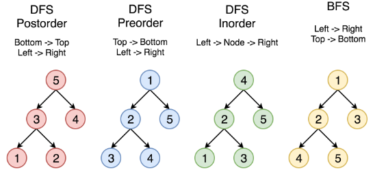

# Leetcode python

## 栈
#### [20. 有效的括号](https://leetcode-cn.com/problems/valid-parentheses/)
符号匹配用单个栈
```python
class Solution:
    def isValid(self, s: str) -> bool:
        stack = []
        match = {'{':'}', '[':']', '(':')'}
        for item in s:
            if item in match.keys():
                stack.append(item)
            else:
                if len(stack) != 0:
                    if match[stack[-1]] == item:
                        stack.pop()
                    else: return False
                else: return False
        if len(stack) == 0: return True
        else: return False
```

#### [394. 字符串解码](https://leetcode-cn.com/problems/decode-string/)
单个栈
```python
class Solution:
    def decodeString(self, s: str) -> str:
        stack = []
        str_out = ""

        for index, item in enumerate(s):
            if item != ']':
                stack.append(item)
            else:
                str_temp = ""
                str_num = ""
                count = 1
                sign = stack[-1]

                while (sign != '['):
                    str_temp += stack.pop()
                    sign = stack[-1]

                stack.pop() # delete '['
                sign = stack[-1]

                while (sign.isdigit()):
                    str_num += stack.pop()
                    if stack:
                        sign = stack[-1]
                    else:
                        sign = "end"

                str_num = str_num[::-1]
                str_temp = str_temp[::-1]

                try:
                    num = int(str_num)
                except:
                    num = 1
                str_temp *= num
                for item in str_temp:
                    stack.append(item)

        if stack:
            str_out = ''.join(stack)

        return str_out
```

#### [739. 每日温度](https://leetcode-cn.com/problems/daily-temperatures/)
包含index的单调递减栈
```python
class Solution:
    def dailyTemperatures(self, T: List[int]) -> List[int]:
        result = [0] * len(T)
        stack = []

        for index, item in enumerate(T):
            # while 维护单调栈
            while stack and item > stack[-1][1]:
                i, value = stack.pop()
                res = index - i
                result[i] = res

            stack.append((index, item))

        return result
```


## 堆
#### [347. 前 K 个高频元素](https://leetcode-cn.com/problems/top-k-frequent-elements)
**堆排序处理海量数据的topK，分位数** 非常合适，因为它不用将所有的元素都进行排序，只需要比较和根节点的大小关系就可以了，同时也不需要一次性将所有的数据都加载到内存。

因此有必要不引入库，自己用python实现研究一下

**原则：最大堆求前n小，最小堆求前n大。**
- 前k小：构建一个k个数的最大堆，当读取的数小于根节点时，替换根节点，重新塑造最大堆
- 前k大：构建一个k个数的最小堆，当读取的数大于根节点时，替换根节点，重新塑造最小堆

**总体思路**
- 建立字典遍历一次统计出现频率
- 取前k个数，构造**规模为k的最小堆** minheap
- 遍历规模k之外的数据，大于堆顶则入堆，维护规模为k的最小堆 minheap
- 如需按频率输出，对规模为k的堆进行排序

```python
class Solution:
    def topKFrequent(self, nums: List[int], k: int) -> List[int]:
        def heapify(arr, n, i):
            smallest = i  # 构造根节点与左右子节点
            l = 2 * i + 1
            r = 2 * i + 2
            if l < n and arr[l][1] < arr[i][1]:  # 如果左子节点在范围内且小于父节点
                smallest = l
            if r < n and arr[r][1] < arr[smallest][1]:
                smallest = r
            if smallest != i:  # 递归基:如果没有交换，退出递归
                arr[i], arr[smallest] = arr[smallest], arr[i]
                heapify(arr, n, smallest)  # 确保交换后，小于其左右子节点

        # 哈希字典统计出现频率
        map_dict = {}
        for item in nums:
            if item not in map_dict.keys():
                map_dict[item] = 1
            else:
                map_dict[item] += 1

        map_arr = list(map_dict.items())
        lenth = len(map_dict.keys())
        # 构造规模为k的minheap
        if k <= lenth:
            k_minheap = map_arr[:k]
            # 从后往前维护堆，避免局部符合而影响递归跳转，例:2,1,3,4,5,0
            for i in range(k // 2 - 1, -1, -1):
                heapify(k_minheap, k, i)
            # 对于k:, 大于堆顶则入堆，维护规模为k的minheap
            for i in range(k, lenth): # 堆建好了，没有乱序，从前往后即可
                if map_arr[i][1] > k_minheap[0][1]:
                    k_minheap[0] = map_arr[i] # 入堆顶
                    heapify(k_minheap, k, 0)  # 维护 minheap
        # 如需按顺序输出，对规模为k的堆进行排序
        # 从尾部起，依次与顶点交换再构造minheap，最小值被置于尾部
        for i in range(k - 1, 0, -1):
            k_minheap[i], k_minheap[0] = k_minheap[0], k_minheap[i]
            k -= 1 # 交换后，维护的堆规模-1
            heapify(k_minheap, k, 0)
        return [item[0] for item in k_minheap]
```

## 队列
### 双向队列
#### [239. 滑动窗口最大值](https://leetcode-cn.com/problems/sliding-window-maximum/)
> TODO: 用动态规划再做一次

双向队列

```python
from collections import deque

class Solution:
    def maxSlidingWindow(self, nums: List[int], k: int) -> List[int]:
        # 建立双向队列,储存索引便于滑窗判断
        window = deque(); res = []
        for i in range(len(nums)):
            # 构建单调队列的push操作，注意用nums恢复索引
            while window and nums[window[-1]] <= nums[i]:
                window.pop()
            window.append(i)
            # 从k-1开始res append()
            if i >= k - 1:
                res.append(nums[window[0]])
            # 如果单调队列最大值落于滑窗之外，popleft()
            if window[0] == i-k+1:
                window.popleft()
        return res
```

## 动态规划
#### [55. 跳跃游戏](https://leetcode-cn.com/problems/jump-game)
动态规划，贪心
```python
class Solution:
    def canJump(self, nums: List[int]) -> bool:
        left_good = len(nums) - 1 # index
        for i in range(left_good, -1, -1):
            if nums[i] + i >= left_good:
                left_good = i
        return left_good == 0

# 从后往前，核对能否到达终点，或者到达后面能到达终点的点
class Solution:
    def canJump(self, nums: List[int]) -> bool:
        if len(nums) == 1:
            return True

        point_to_end = []
        for i in range(len(nums)-2,-1,-1):
            if nums[i] >= len(nums)-1-i:
                point_to_end.append(i)
            if point_to_end and nums[i] >= point_to_end[-1] - i:
                point_to_end.append(i)

        if 0 in point_to_end:
            return True
        else:
            return False
```
参看 [官方题解](https://leetcode-cn.com/problems/jump-game/solution/tiao-yue-you-xi-by-leetcode/) 四种方案思路很清楚

#### [70. 爬楼梯](https://leetcode-cn.com/problems/climbing-stairs/)
动态规划, 它的最优解可以从其子问题的最优解来有效地构建。

第 `i` 阶可以由以下两种方法得到：

- 在第 `(i-1)` 阶后向上爬 1 阶。

- 在第 `(i-2)` 阶后向上爬 2 阶。

所以到达第 `i` 阶的方法总数就是到第 `i-1` 阶和第 `i-2` 阶的方法数之和。

令 `dp[i]` 表示能到达第 `i` 阶的方法总数，
状态转移方程（同斐波那契数）：
`dp[i] = dp[i−1] + dp[i−2]`
```python
class Solution:
    def climbStairs(self, n: int) -> int:
        f0 = 1
        f1 = 2
        if n == 1: return f0
        if n == 2: return f1
        for i in range(n-2):
            f2 = f0 + f1
            f0 = f1
            f1 = f2
        return f2
```

#### [198. 打家劫舍](https://leetcode-cn.com/problems/house-robber)
状态转移方程 cur_max = max(pprev_max + nums[i], prev_max)
```python
class Solution:
    def rob(self, nums: List[int]) -> int:
        # 动态规划两部曲，1.定义初始值 2.定义状态转移方程
        cur_max = 0
        prev_max = 0
        pprev_max = 0

        for i in range(len(nums)):
            cur_max = max(pprev_max + nums[i], prev_max)
            pprev_max = prev_max
            prev_max = cur_max

        return cur_max
```

#### [64. 最小路径和](https://leetcode-cn.com/problems/minimum-path-sum)
逆序，二维
```python
class Solution:
    def minPathSum(self, grid: List[List[int]]) -> int:
        grid_h = len(grid)
        grid_w = len(grid[0])
        dp = [[0] * grid_w for i in range(grid_h)]

        for i in range(grid_h-1, -1, -1):
            for j in range(grid_w-1, -1, -1):
                if i+1 > grid_h-1 and j+1 > grid_w-1:
                    dp[i][j] = grid[i][j]
                elif i+1 > grid_h-1 and j+1 <= grid_w-1:
                    dp[i][j] = grid[i][j] + dp[i][j+1]
                elif i+1 <= grid_h-1 and j+1 > grid_w-1:
                    dp[i][j] = grid[i][j] + dp[i+1][j]
                else:
                    dp[i][j] = grid[i][j] + min(dp[i+1][j], dp[i][j+1])

        return dp[0][0]
```
顺序，二维


## 树
### 树的遍历

- 深度遍历：`后序遍历, 前序遍历, 中序遍历`
- 广度遍历：`层次遍历`

#### [94. 二叉树的中序遍历](https://leetcode-cn.com/problems/binary-tree-inorder-traversal/)
输出顺序如同看二叉树的俯视图：左后 -> 中间节点 -> 右后。递归回溯

前提：任何一个节点都有左孩子，叶子左孩子为`None`
- 从该节点出发，一直递归到其最左节点
- 当该节点左孩子为`None`，该层递归退出，保存该节点
- 尝试去访问该节点右孩子，若为`None`则退出该层递归，返回并保存父节点
- 若不为`None`则去寻找该右孩子的最左节点

解法一： 递归
- 时间复杂度：O(n)。递归函数 T(n) = 2 * T(n/2) + 1。
- 空间复杂度：最坏情况下需要空间O(n)，平均情况为O(logn)
```python
# Definition for a binary tree node.
class TreeNode:
    def __init__(self, x):
        self.val = x
        self.left = None
        self.right = None

class Solution:
    def inorderTraversal(self, root: TreeNode) -> List[int]:
        def traversal(node, res):
            if node != None:
                traversal(node.left, res)
                res.append(node.val)
                traversal(node.right, res)

        res = []
        traversal(root, res)
        return res
```
解法二： 栈加循环
- 使用颜色标记节点的状态，新节点为白色，已访问的节点为灰色。
- 如果遇到的节点为白色，则将其标记为灰色，然后将其右子节点、自身、左子节点依次入栈。
- 如果遇到的节点为灰色，则将节点的值输出。
```python
class Solution:
    def inorderTraversal(self, root: TreeNode) -> List[int]:
        WHITE, GRAY = 0, 1
        stack = []
        stack.append((root, WHITE))
        result = []
        while stack:
            node, color = stack.pop()
            if node:
                if color == WHITE:
                    stack.append((node.right, WHITE))
                    stack.append((node, GRAY))
                    stack.append((node.left, WHITE))
                else:
                    result.append(node.val)
        return result
```

#### [144. 二叉树的前序遍历](https://leetcode-cn.com/problems/binary-tree-preorder-traversal/)
输出顺序：根 -> 左子节点 -> 右子节点
思路：
- 从根节点开始，若当前节点非空，输出
- 依次向左，左子为空再向右

```python
class Solution:
    def preorderTraversal(self, root: TreeNode) -> List[int]:
        def traversal(node, res):
            if node != None:
                res.append(node.val)
                traversal(node.left, res)
                traversal(node.right, res)

        res = []
        traversal(root, res)
        return res
```

```python
class Solution:
    def preorderTraversal(self, root: TreeNode) -> List[int]:
        WHITE, GRAY = 0, 1
        stack = []
        stack.append((root, WHITE))
        result = []
        while stack:
            node, color = stack.pop()
            if node:
                if color == WHITE:
                    stack.append((node.right, WHITE))
                    stack.append((node.left, WHITE))
                    stack.append((node, GRAY))
                else:
                    result.append(node.val)
        return result
```

#### [145. 二叉树的后序遍历](https://leetcode-cn.com/problems/binary-tree-postorder-traversal/)
输出顺序：左后 -> 右后 -> 根

```python
class Solution:
    def postorderTraversal(self, root: TreeNode) -> List[int]:
        def traversal(node, res):
            if node != None:
                traversal(node.left, res)
                traversal(node.right, res)
                res.append(node.val)

        res = []
        traversal(root, res)
        return res
```

```python
class Solution:
    def postorderTraversal(self, root: TreeNode) -> List[int]:
        WHITE, GRAY = 0, 1
        stack = []
        stack.append((root, WHITE))
        result = []
        while stack:
            node, color = stack.pop()
            if node:
                if color == WHITE:
                    stack.append((node, GRAY))
                    stack.append((node.right, WHITE))
                    stack.append((node.left, WHITE))
                else:
                    result.append(node.val)
        return result
```

#### [102. 二叉树的层次遍历](https://leetcode-cn.com/problems/binary-tree-level-order-traversal/submissions/)
输出顺序：按层级从左到右
```python
class Solution:
    def levelOrder(self, root: TreeNode) -> List[List[int]]:
        def traversal(node, level, res):
            if node != None:
                if len(res) == level: res.append([])
                res[level].append(node.val)
                traversal(node.left, level+1, res)
                traversal(node.right, level+1, res)

        res = []; level = 0
        traversal(root, level, res)
        return res
```

```python
class Solution:
    def levelOrder(self, root: TreeNode) -> List[List[int]]:
        WHITE, GRAY = 0, 1
        stack = []
        init_level = 0
        stack.append((root, WHITE, init_level))
        result = []
        while stack:
            node, color, level = stack.pop()
            if node:
                if color == WHITE:
                    stack.append((node.right, WHITE, level+1))
                    stack.append((node.left, WHITE, level+1))
                    stack.append((node, GRAY, level))
                else:
                    if len(result) == level: result.append([])
                    result[level].append(node.val)
        return result
```

#### [987. 二叉树的垂序遍历](https://leetcode-cn.com/problems/vertical-order-traversal-of-a-binary-tree/submissions/)
输出顺序：左 -> 右， 上 -> 下
```python
class Solution:
    def verticalTraversal(self, root: TreeNode) -> List[List[int]]:
        def traversal(node, level, res, levels, deep=0):
            if node != None:
                # 层次遍历
                if level not in levels: levels.append(level); res[level] = []
                traversal(node.left, level-1, res, levels, deep = deep + 1)
                res[level].append([node.val, deep])
                traversal(node.right, level+1, res, levels, deep = deep +  1)

        res = {}; res_order = []; level = 0; levels = []; out = []
        traversal(root, level, res, levels)
        # 按宽度排序
        for key in sorted(res.keys()):
            res_order.append(res[key])
        # 按深度排序（同时保证同深度的，值小的在前）
        for item in res_order:
            item = sorted(item, key=lambda ele:(ele[1],ele[0]))
            out.append([i[0] for i in item])
        return out

class Solution:
    def verticalTraversal(self, root: TreeNode) -> List[List[int]]:
        def traversal(node, level, deep, res):
            if node:

                traversal(node.left, level+1, deep-1, res)
                res.append((node.val, deep, level))
                traversal(node.right, level+1, deep+1, res)

        level = 0
        deep = 0
        res = []
        traversal(root, level, deep, res)

        res_deep = sorted(res, key=lambda ele: ele[1])
        output = []
        deep_level = -1
        deep_last = None

        for item in res_deep:
            val, deep, level = item
            if deep_last != deep:
                output.append([])
                deep_level += 1

            output[deep_level].append((val, level))
            deep_last = deep

        out = []
        for i in range(len(output)):
            output[i] = sorted(output[i], key=lambda ele: (ele[1], ele[0]))
            out.append([])
            for item in output[i]:
                out[i].append(item[0])

        return out
```

#### [226. 翻转二叉树](https://leetcode-cn.com/problems/invert-binary-tree/)
注意体会递归的逐步进入与退出，变量的生命周期
```python
class Solution:
    def invertTree(self, root: TreeNode) -> TreeNode:
        if root != None:
            left_node = self.invertTree(root.left)
            right_node = self.invertTree(root.right)
            root.left = right_node
            root.right = left_node
        return root

class Solution:
    def invertTree(self, root: TreeNode) -> TreeNode:
        def traversal(node):
            if node:
                traversal(node.left)
                traversal(node.right)
                temp = node.left
                node.left = node.right
                node.right = temp
        traversal(root)
        return root
```

#### [437. 路径总和 III](https://leetcode-cn.com/problems/path-sum-iii/submissions/)
```python
class Solution:
    def pathSum(self, root: TreeNode, sum: int) -> int:
        def traversal(node, stack):
            if node:
                stack.append(node.val)
                cur = 0
                for i in range(len(stack)-1, -1, -1):
                    cur += stack[i]
                    if cur == sum: # 注意比较区别 sum(stack[i:]) == sum_
                        self.count += 1
                traversal(node.left, stack)
                traversal(node.right, stack)
                stack.pop() # 注意递归变量的生命周期

        self.count = 0; stack = [] # self.count与直接定义count的区别
        traversal(root, stack)
        return self.count
```

二叉搜索树具有以下性质：
- 如果节点的左子树不空，则左子树上所有结点的值均小于等于它的根结点的值；
- 如果节点的右子树不空，则右子树上所有结点的值均大于等于它的根结点的值；
- 任意节点的左、右子树也分别为二叉查找树；（二叉搜索树的定义是递归的二叉搜索树的定义是递归的）
- 没有键值相等的节点
- 中序遍历是升序

#### [538. 把二叉搜索树转换为累加树](https://leetcode-cn.com/problems/convert-bst-to-greater-tree/)
这道题对理解递归，回溯很有帮助。以树为例子，递归从root开始，在root结束。
递归回溯是一个不断深入，又回溯退出，在之间的操作注意理解同级性
```python
class Solution:
    def convertBST(self, root: TreeNode) -> TreeNode:
        def traversal(node):
            if node:
                traversal(node.right)
                node.val += self.last_value
                self.last_value = node.val
                traversal(node.left)

        self.last_value = 0
        traversal(root)
        return root
```

#### [543. 二叉树的直径](https://leetcode-cn.com/problems/diameter-of-binary-tree)
注意理解递归，通过后序遍历得到每个当前节点的直径，保存最大直径
```python
class Solution:
    def __init__(self):
        self.max_diameter = 0
    def diameterOfBinaryTree(self, root: TreeNode) -> int:
        # 通过后序遍历获得当前节点左右最深子节点的深度，保存最大的直径长度
        def traversal(node):
            if node == None: return 0
            l = traversal(node.left)
            r = traversal(node.right)
            self.max_diameter = max(l + r, self.max_diameter)
            return max(l, r) + 1

        _ = traversal(root)
        return self.max_diameter

class Solution:
    def diameterOfBinaryTree(self, root: TreeNode) -> int:
        def traversal(node, deep):
            if node != None:
                l = traversal(node.left, deep+1)
                r = traversal(node.right, deep+1)

                self.diam = max(self.diam, (l + r - 2 * deep))
                return max(l,r)
            else: return deep-1

        self.diam = 0
        deep = 0
        _ = traversal(root, deep)
        return self.diam
```

### 杂
#### [58. 最后一个单词的长度](https://leetcode-cn.com/problems/length-of-last-word)
```python
class Solution:
    def lengthOfLastWord(self, s: str) -> int:
        l = 0
        flag = 0
        for i in s[::-1]:
            if not i.isspace():
                l += 1
                flag = 1
            if i.isspace() and flag: break
        return l

class Solution:
    def lengthOfLastWord(self, s: str) -> int:
        split_list = s.split()
        if split_list:
            return len(split_list[-1])
        else: return 0
```
#### [67. 二进制求和](https://leetcode-cn.com/problems/add-binary)
```python
class Solution:
    def addBinary(self, a: str, b: str) -> str:
        grap = abs(len(a) - len(b))
        if len(a) > len(b):
            b = '0' * grap + b
        else: a = '0' * grap + a;
        s = ''
        add = 0
        for i in range(-1, -len(a)-1, -1):
            res = int(a[i]) + int(b[i]) + add
            add = 0
            if res > 1:
                res = res % 2
                add = 1
            s += str(res)
        if add == 1: s += str(1)
        return s[::-1]

class Solution:
    def addBinary(self, a: str, b: str) -> str:
        if len(a) > len(b):
            b = '0' * (len(a) - len(b)) + b
        else:
            a = '0' * (len(b) - len(a)) + a

        out = ''
        next_ = 0

        for i in range(len(a)-1,-1,-1):
            c = int(a[i]) + int(b[i]) + next_
            next_ = 0
            if c > 1:
                c -= 2
                next_ = 1
            out += str(c)

        if next_ == 1:
            out += '1'

        return out[::-1]
```
#### [66. 加一](https://leetcode-cn.com/problems/plus-one)
```python
class Solution:
    def plusOne(self, digits: List[int]) -> List[int]:
        if digits[-1] < 9:
            digits[-1] += 1
            return digits

        digits[-1] += 1
        for i in range(len(digits)-1, 0, -1):
            if digits[i] == 10:
                digits[i] = 0
                digits[i-1] += 1
        if digits[0] == 10:
            digits[0] = 0
            digits.insert(0,1)

        return digits
```
#### [83. 删除排序链表中的重复元素](https://leetcode-cn.com/problems/remove-duplicates-from-sorted-list/)
```python
# Definition for singly-linked list.
# class ListNode:
#     def __init__(self, x):
#         self.val = x
#         self.next = None

class Solution:
    def deleteDuplicates(self, head: ListNode) -> ListNode:
        if head == None: return None
        num_list = []
        node = head
        num_list.append(node.val)

        while(node.next):
            next_node = node.next
            if next_node.val not in num_list:
                num_list.append(next_node.val)
                node = node.next
            else: node.next = next_node.next
        return head

class Solution:
    def deleteDuplicates(self, head: ListNode) -> ListNode:
        if head == None or head.next == None: return head
        node = head

        while(node.next):
            while(node.val == node.next.val):
                node.next = node.next.next
                if node.next == None: break
            if node.next == None: break
            else: node = node.next

        return head
```
#### [88. 合并两个有序数组](https://leetcode-cn.com/problems/merge-sorted-array/submissions/)
双指针
```python
class Solution:
    def merge(self, nums1: List[int], m: int, nums2: List[int], n: int) -> None:
        nums1_copy = nums1[:m].copy()
        p0 = 0; p1 = 0; p3 = 0
        while (p0 < m and p1 < n):
            if nums1_copy[p0] < nums2[p1]:
                nums1[p3] = nums1_copy[p0]
                p0 += 1; p3 += 1
            else:
                nums1[p3] = nums2[p1]
                p1 += 1; p3 += 1
        if p0 == m: nums1[p3:] = nums2[p1:]
        else: nums1[p3:] = nums1_copy[p0:]
        return nums1

class Solution:
    def merge(self, nums1: List[int], m: int, nums2: List[int], n: int) -> None:
        i, j = 0, 0
        nums1[:] = nums1[:m]

        while (i < m and j < n):
            if nums1[i] > nums2[j]:
                nums1.insert(i, nums2[j]) # 注意insert后元素位置的变化, 数组大小的变化!
                j += 1
                i += 1
                m += 1
            else:
                i += 1

        if j < n: nums1.extend(nums2[j:])

        return nums1
```

#### [1296. 划分数组为连续数字的集合](https://leetcode-cn.com/problems/divide-array-in-sets-of-k-consecutive-numbers/)
```python
class Solution:
    def isPossibleDivide(self, nums: List[int], k: int) -> bool:
        dict_count = {}
        for i in range(len(nums)):
            if nums[i] not in dict_count:
                dict_count[nums[i]] = 1
            else:
                dict_count[nums[i]] += 1

        new_dict = {}
        for key in sorted(dict_count.keys()):
            new_dict[key] = dict_count[key]

        for key in new_dict:
            count = new_dict[key]
            if count > 0:
                try:
                    for i in range(key, key+k):
                        new_dict[i] = new_dict[i] - count
                except: return False

        for key in new_dict:
            if new_dict[key] != 0: return False
        return True
```


## 排序
#### 快速排序
```python
def qsort(array, l, r):
    def partition(array, l, r):
        p = array[r]
        index = l - 1
        for i in range(l, r):
            if array[i] <= p:
                index += 1
                array[i], array[index] = array[index], array[i]
        p_i = index + 1
        array[p_i], array[r] = array[r], array[p_i]
        return p_i

    if l < r:
        p_i = partition(array, l, r)
        qsort(array, l, p_i - 1)
        qsort(array, p_i + 1, r)
```
#### 归并排序
```python
def mergesort(array):
    def merge(l, r):
        result = []
        l_i, r_i = 0, 0
        while (l_i < len(l) and r_i < len(r)):
            if l[l_i] < r[r_i]:
                result.append(l[l_i])
                l_i += 1
            else:
                result.append(r[r_i])
                r_i += 1
        if l_i < len(l):
            result.extend(l[l_i:])
        else:
            result.extend(r[r_i:])
        return result

    if len(array) <= 1:
        return array
    m = len(array) // 2
    l = mergesort(array[:m])
    r = mergesort(array[m:])
    return merge(l, r)
```
#### 冒泡排序
```python
def bubblesort(array):
    n = len(array)
    while(n != 1):
        flag = 1
        if n == len(array):
            last = len(array[:n])-1
        for i in range(last):
            j = i + 1
            if array[i] > array[j]:
                array[i], array[j] = array[j], array[i]
                flag = 0; last = i
        n -= 1
        if flag == 1: break
```
#### 选择排序
```python
def selectsort(array):
    sort_array = []
    while(len(array) > 0):
        temp_min = 1e5
        temp_i = 0
        for i in range(len(array)):
            if array[i] < temp_min:
                temp_min = array[i]
                temp_i = i
        sort_array.append(temp_min)
        del array[temp_i]
    return sort_array
```
#### 插入排序
```python
def insertsort(array):
    def low_bound(arr, l, r, target):
        while (l < r):
            m = l + (r - l) // 2
            if arr[m] < target:
                l = m + 1
            else:
                r = m
        return l

    result = []
    result.append(array[0])
    for i in range(1, len(array)):
        insert_index = low_bound(result, 0, len(result), array[i])
        result.insert(insert_index, array[i])
    return result
```

## 二分查找
### 基础 (前提，数组有序)
```python
def low_bound(arr, l, r, target):
    while (l < r):
        m = l + (r - l) // 2
        if arr[m] < target:
            l = m + 1
        else:
            r = m
    return l

def up_bound(arr, l, r, target):
    while (l < r):
        m = l + (r - l) // 2
        if arr[m] <= target:
            l = m + 1
        else:
            r = m
    return l

index = low_bound(result, 0, len(result), array[i])
```
#### [69. x 的平方根](https://leetcode-cn.com/problems/sqrtx/)
```python
def mySqrt(x):
    l = 0; r = x // 2 + 1
    while (l < r):
        m = l + (r - l + 1) // 2
        squre = m ** 2
        if squre <= x: l = m
        else: r = m - 1
    return l
```
#### [441. 排列硬币](https://leetcode-cn.com/problems/arranging-coins/solution/er-fen-fa-by-xxinjiee/)
可以直接用数学公式求解，也可以通过二分法求解数学公式 类似[69. x的平方根](https://leetcode-cn.com/problems/sqrtx/)

这里使用二分查找求解的核心是
1. 定义左右边界，r 初始值限定为 n // 2 + 1，缩小范围
2. m为层数，循环中每次用l, r的中点更新
3. 定义target = m * (m + 1) / 2 待求解公式
4. 如果target < n - m (m 同时也是最后一层的个数)，更新查找范围下限l
5. 否则更新查找范围上限r，最后r = l 退出while loop，返回其中一个即可

```python
class Solution:
    def arrangeCoins(self, n: int) -> int:
        # 解方程 m(m+1) / 2 = n
        l = 0; r = n // 2 + 1
        while(l < r):
            m = l + (r - l) // 2
            target = m * (m + 1) / 2
            if target < n - m: l = m + 1
            else: r = m
        return l
```

附上二分查找的low_bound(),该题的主要区别就是定义target，替换low_bound()中的array[m]与被查找值的比较

```python
def low_bound(array, l, r, o):
    # 返回区间内第一个 >= o 的值, o 为被查找值
    while l < r:
        m = l + (r - l) // 2
        # l, r 的赋值规则也要符合左闭右开
        if array[m] < o: l = m + 1
        else: r = m
```

## 字符串
#### [443. 压缩字符串](https://leetcode-cn.com/problems/string-compression/)
```python
class Solution:
    def compress(self, chars: List[str]) -> int:
        count = 1
        temp = chars[0]
        read = 1
        while (read < len(chars)):
            if chars[read] == temp:
                count += 1
                chars.pop(read)
                read -= 1
            else:
                if count != 1:
                    for item in str(count):
                        chars.insert(read, item)
                        read += 1
                count = 1
                temp = chars[read]
            read += 1
        if count != 1:
            for item in str(count):
                chars.insert(read, item)
                read += 1
        return len(chars)

class Solution:
    def compress(self, chars: List[str]) -> int:
        if len(chars) <= 1: return len(chars)
        count = 1
        pointer = 0
        dynamic_boundary = len(chars)
        while (pointer < dynamic_boundary-1):
            next_char = chars[pointer+1]
            curr_char = chars[pointer]
            if next_char == curr_char:
                count += 1
                chars.pop(pointer)
                dynamic_boundary -= 1
            else:
                pointer += 1
                if count > 1:
                    for item in str(count):
                        chars.insert(pointer, item)
                        dynamic_boundary += 1
                        pointer += 1
                    count = 1
        if count > 1:
            for item in str(count):
                chars.insert(pointer+1, item)
                pointer += 1
        return len(chars)
```
#### [541. 反转字符串 II](https://leetcode-cn.com/problems/reverse-string-ii/)
python字符串修改及其麻烦，转换成list，最后再通过''.join()转成str
```python
class Solution:
    def reverseStr(self, s: str, k: int) -> str:
        pointer = 0
        s = list(s)
        while (pointer < len(s)):
            if pointer + k <= len(s):
                s[pointer:pointer+k] = s[pointer:pointer+k][::-1]
            else:
                s[pointer:] = s[pointer:][::-1]
            pointer += 2 * k
        s = ''.join(s)
        return s

class Solution:
    def reverseStr(self, s: str, k: int) -> str:
        s_list = list(s)
        for i in range(len(s_list)):
            if i % (2*k) == 0:
                try:
                    s_list[i:i+k] = s_list[i:i+k][::-1]
                except:
                    s_list[i:] = s_list[i:][::-1]
        s_reverse = ''.join(s_list)
        return s_reverse
```

## 滑动窗口
#### [76. 最小覆盖子串](https://leetcode-cn.com/problems/minimum-window-substring)
双指针，滑动窗口求解
```python
class Solution:
    def minWindow(self, s: str, t: str) -> str:
        window = {}
        # 构造 window dict
        for item in t:
            if item not in window:
                window[item] = 1
            else: window[item] += 1

        # 根据 window 初始化 search_area dict
        search_area = {}
        for key in window.keys():
            search_area[key] = 0

        l_pointer, r_pointer = 0, 0
        ans, ans_len = '', len(s)

        while (r_pointer < len(s)):
            if s[r_pointer] in search_area.keys():
                search_area[s[r_pointer]] += 1
            r_pointer += 1 # 右指针右移
            self.flag = 1
            for key in window.keys():
                if search_area[key] < window[key]:
                    self.flag = 0
                    break
            # 如果search_area已经覆盖window,对search_area进行优化，移动左指针
            while self.flag:
                if s[l_pointer] in search_area.keys():
                    search_area[s[l_pointer]] -= 1
                    if search_area[s[l_pointer]] < window[s[l_pointer]]:
                        if len(s[l_pointer:r_pointer]) <= ans_len:
                            ans = s[l_pointer:r_pointer] #用ans记录当前符合条件的最小长度子串
                            ans_len = len(ans)
                        l_pointer += 1
                        break
                l_pointer += 1

        return ans

class Solution:
    def minWindow(self, s: str, t: str) -> str:
        T_dict = {}
        for item in t:
            if item in T_dict:
                T_dict[item] += 1
            else:
                T_dict[item] = 1

        p1 = 0
        p2 = 0
        result = ''
        last_len = len(s)

        while (p2 < len(s)):
            if s[p2] in T_dict:
                T_dict[s[p2]] -= 1
            p2 += 1

            while max(T_dict.values()) <= 0:
                s_len = p2 - p1
                if s_len <= last_len:
                    result = s[p1:p2]
                    last_len = s_len
                if s[p1] in T_dict:
                    if T_dict[s[p1]] + 1 <= 0:
                        T_dict[s[p1]] += 1
                        p1 += 1
                    else: break
                else:
                    p1 += 1

        return result
```
#### [438. 找到字符串中所有字母异位词](https://leetcode-cn.com/problems/find-all-anagrams-in-a-string)
```python
class Solution:
    def findAnagrams(self, s: str, p: str) -> List[int]:
        res = []
        window = {}
        for item in p:
            if item not in window:
                window[item] = 1
            else: window[item] += 1

        search_area = {}
        for key in window.keys():
            search_area[key] = 0

        pointer = 0
        while (pointer < len(s)):
            self.flag = 1 # 注意flag初始化位置
            if s[pointer] in window.keys():
                search_area[s[pointer]] += 1
            for key in window.keys():
                if search_area[key] != window[key]:
                    self.flag = 0
                    break
            if self.flag: res.append(pointer - len(p) + 1)
            pointer += 1
            if pointer > len(p) - 1:
                if s[pointer-len(p)] in search_area.keys():
                    search_area[s[pointer-len(p)]] -= 1
        return res
```
#### [3. 无重复字符的最长子串](https://leetcode-cn.com/problems/longest-substring-without-repeating-characters)
```python
class Solution:
    def lengthOfLongestSubstring(self, s: str) -> int:
        l_pointer, r_pointer = 0, 0
        ans = ''
        ans_max = ''
        while (r_pointer < len(s)):
            if s[r_pointer] not in s[l_pointer:r_pointer]:
                r_pointer += 1
            else:
                if r_pointer - l_pointer > len(ans_max):
                    ans_max = s[l_pointer:r_pointer]
                l_pointer +=1
        # 补充对最后一次的校对
        if r_pointer - l_pointer > len(ans_max):
            ans_max = s[l_pointer:r_pointer]
        return len(ans_max)
```
