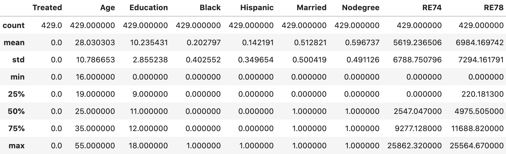
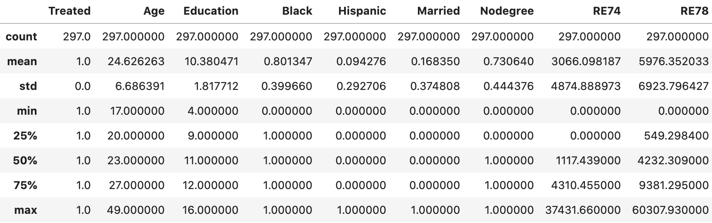
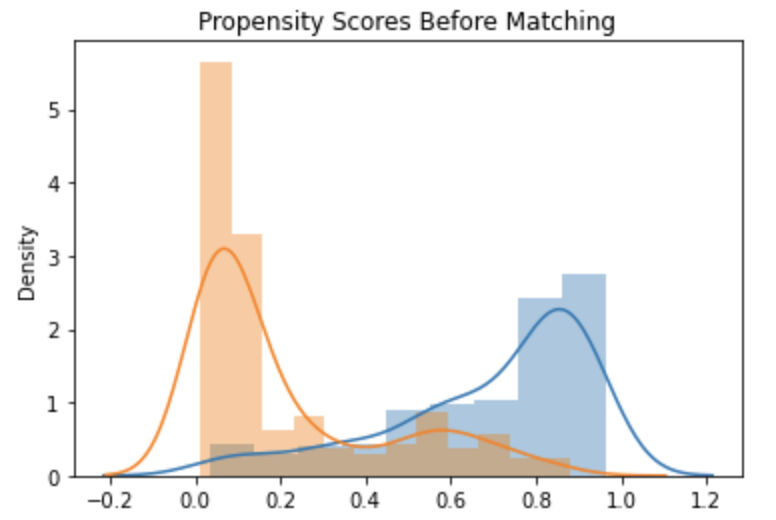
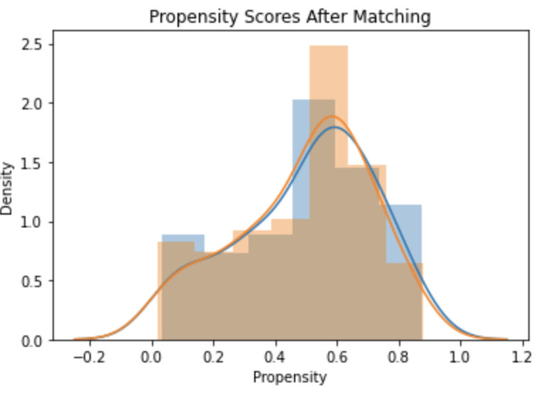
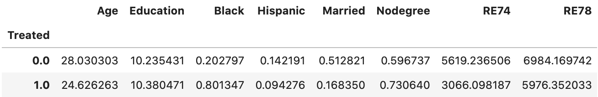
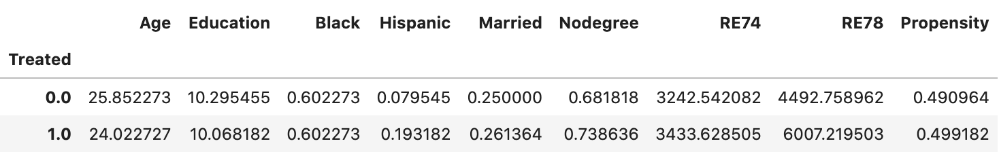
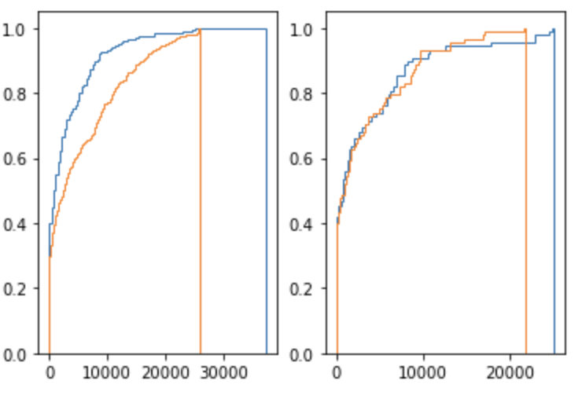

# 倾向性得分匹配 PSM - 示例

在[倾向性得分匹配 PSM - 原理]()中介绍了倾向性得分的原理，现在我们在实际数据上，看看应用效果。

## 数据集
### 总体介绍
数据集使用的是 [The NSW Dataset](http://users.nber.org/~rdehejia/nswdata2.html)，一个观察性研究中非常经典的数据集。这份数据最早是 Robert Lalonde 在论文 [1] 中使用的，研究的是treatment职业教育培训对人员几年后收入的影响。这份数据根据样本属性的齐全程度有几个不同的版本。具体的数据信息如下：

特征X：['Treated', 'Age', 'Education', 'Black', 'Hispanic', 'Married', 'Nodegree', 'RE74']

分别表示：是否接受教育培训，年龄，教育背景，是否黑人，是否西班牙籍，是否结婚，是否无学历，1974年收入

观测表现 label - Y: ['RE78'], 1978年收入

干预 treatment: 'Treated' 是否接受教育培训

1. 实验组：nsw_treated.txt (297 observations)
* wget https://users.nber.org/~rdehejia/data/nsw_treated.txt
2. 对照组：CPS3 controls (429 observations)
* wget https://users.nber.org/~rdehejia/data/cps3_controls.txt

### EDA
对照组（没有接受教育培训）数据分布



实验组（接受教育培训）数据分布



可以从RE74 74年收入 /RE78 78年收入 看到对照组和实验组是十分不同质的。具体体现在对照组74年的收入均值5619高于实验组收入均值3066,对照组78年的收入均值6984高于实验组收入均值5976,给人一种接受了教育培训收入反而不如没有接受教育培训的错觉。事实上本来参加职业教育培训的人员可能就是收入不高的群体，因此基于这份数据，我们无法研究是否参加职业教育培训这一变量对几年后收入的平均因果效应（反事实推断）。

接下来我们通过倾向分匹配，去构建同质的用户群体，去研究treatment的平均因果效应。

### 倾向性得分匹配
1. 我们首先读取数据，并随机切分训练/验证集
```python
names = ['Treated', 'Age', 'Education', 'Black', 'Hispanic', 'Married',
         'Nodegree', 'RE74', 'RE78']
names_re75 = ['Treated', 'Age', 'Education', 'Black', 'Hispanic', 'Married',
         'Nodegree', 'RE74', 'RE75', 'RE78']
treated = pd.read_table('../data/nswre74/nsw_treated.txt', sep='\s+', header=None, names=names)
control = pd.read_table('../data/nswre74/cps3_controls.txt', sep='\s+', header=None, names=names_re75)[names]
data = pd.concat([treated, control], axis=0)
data = data.reset_index(drop=True)

random.seed(5219)
indexes = data.index.tolist()
random.shuffle(indexes)

split_index = 2*len(indexes)//3
df_train_idx = indexes[:split_index]
df_val_idx = indexes[split_index:]
feature_cols = names[1:-1]
df_train = data.loc[df_train_idx].reset_index(drop=True)
df_valid = data.loc[df_val_idx].reset_index(drop=True)
df_train.shape, df_valid.shape

output: ((484, 9), (242, 9))
```

2. 构建一个lightgbm模型，对倾向分建模
```python
train_X, train_y = df_train[feature_cols], df_train['Treated']
valid_X, valid_y = df_valid[feature_cols], df_valid['Treated']
lgb_train = lgb.Dataset(train_X, train_y)
lgb_valid = lgb.Dataset(valid_X, valid_y)
watchlist = [lgb_train, lgb_valid]
valid_names = ["train", "valid"]

random_state = 1321
params = {
    'boosting_type': 'gbdt',
    'objective': 'binary',
    'learning_rate': 0.08,
    'min_data_in_leaf': 100,
    'bagging_fraction': 0.9,
    'bagging_freq': 1,
    'feature_fraction': 0.9,
    'num_leaves': 8,
    'max_depth': 4,
    'metric': ['binary_logloss', 'auc'],
    'early_stopping_rounds': 50,
    'n_estimators': 1000,
    'verbose': -1,
    'random_state': random_state,
    'seed': random_state,
    'feature_fraction_seed': random_state,
    'bagging_seed': random_state,
    'drop_seed': random_state,
    'data_random_seed': random_state,
    'random_state': random_state,
    'first_metric_only': True,
    'save_binary': True
}

model = lgb.train(params, lgb_train, valid_sets=watchlist, valid_names=valid_names, verbose_eval=10)

output: Early stopping, best iteration is:
[159]	train's binary_logloss: 0.376526	train's auc: 0.908828	valid's binary_logloss: 0.451469	valid's auc: 0.865283
```
可以看到模型的 训练/验证集auc 90.8%/86.5% 是很高的，说明treatment组和control组的用户特征分布差异较大，看看主要是哪些特征导致的

```python
pd.set_option('display.max_rows', 20)
feature_name = model.feature_name()
feature_imp = model.feature_importance(importance_type="gain")
feature_df = pd.DataFrame({"feature_name": feature_name, "feature_imp": feature_imp})
feature_df.sort_values(by=["feature_imp"], ascending=False, inplace=True)
feature_df.reset_index(inplace=True, drop=True)
feature_df[:10]
```
| indexes | feature_name | feature_imp |
| ------- | ------------ | ----------- |
| 0       | Black        | 1136        |
| 1       | Age          | 224         |
| 2       | Married      | 194         |
| 3       | RE74         | 171         |
| 4       | Education    | 60          |
| 5       | Nodegree     | 9           |
| 6       | Hispanic     | 0           |


3. 看一下匹配前，treat组和control组的倾向分分布差异
```python
sns.distplot(df_train[df_train['Treated']==1][['Propensity']], label='treat')
sns.distplot(df_train[df_train['Treated']==0][['Propensity']], label='control')
plt.title("Propensity Scores Before Matching")
```




4. 写一个朴素的knn，为样本数量少的组，在另一个组中去匹配倾向分距离小于caliper的n个匹配样本。mode == 'random'时，随机返回n个匹配上的样本；mode == 'ksmallest'时，返回匹配上的距离最近的n个样本。

```python
import heapq
def knn_match(sample_treat, sample_control, mode='random', n_match=1, caliper=0.05, is_repeat=False, seed=316):
    """ 为样本数量少的组，在另一个组中去匹配倾向分距离小于caliper的n个匹配样本
    """
    def get_dist(score, samples):
        """ L1 distance """
        dist = abs(samples - score)
        return dist

    n_treat = len(sample_treat)
    n_control = len(sample_control)
    major, minor = None, None
    if n_treat < n_control:
        minor = sample_treat
        major = sample_control
        print('minority: {}, majority: {}'.format('sample treat', 'sample control'))
    else:
        minor = sample_control
        major = sample_treat
        print('minority: {}, majority: {}'.format('sample control', 'sample treat'))
    src, dst = [], []
    visited = set()
    np.random.seed(seed)
    loop_order = np.random.permutation(len(minor))
    for index in loop_order:
        minor_score = minor[index]
        dist = get_dist(minor_score, major)
        if mode == 'random':
            cand_index = dist[dist<caliper].index.tolist()
            if not is_repeat:
                cand_index = list(filter(lambda x: x not in visited, cand_index))
            match_index = np.random.choice(cand_index, min(n_match, len(cand_index)), replace=False)
        elif mode == 'ksmallest':
            cand_index = heapq.nsmallest(n_match, range(len(dist)), dist.values.take)
            match_index = [index for index in cand_index if dist[index] < caliper]
            if not is_repeat:
                match_index = list(filter(lambda x: x not in visited, match_index))
        for i in match_index:
            src.append(index)
            dst.append(i)
            visited.add(i)

    return src, dst
```


```python
sample_treat = df_train[df_train['Treated']==1].reset_index(drop=True)
sample_control = df_train[df_train['Treated']==0].reset_index(drop=True)
sample_treat_score = sample_treat['Propensity']
sample_control_score = sample_control['Propensity']

src, dst = knn_match(sample_treat_score, sample_control_score, mode='random', n_match=1, caliper=0.05, is_repeat=False)

treat_match = sample_treat.loc[src].reset_index(drop=True)
control_match = sample_control.loc[dst].reset_index(drop=True)
treat_match.shape, control_match.shape
```

5. 看一下匹配后，treat组和control组的倾向分分布差异
```python
sns.distplot(treat_match['Propensity'], label='treat')
sns.distplot(control_match['Propensity'], label='control')
plt.title("Propensity Scores After Matching")
```



6. 这时候再训练一个lgb看看auc
```python
balance_data = pd.concat([treat_match, control_match], axis=0).reset_index(drop=True)
train_X = balance_data[feature_cols]
train_y = balance_data['Treated']
# lgb_train, lgb_valid 训练完后会被delete, free_raw_data=False
lgb_train = lgb.Dataset(train_X, train_y)
lgb_valid = lgb.Dataset(valid_X, valid_y)
watchlist = [lgb_train, lgb_valid]
valid_names = ["train", "valid"]
model = lgb.train(params, lgb_train, valid_sets=watchlist, valid_names=valid_names, verbose_eval=10)
```
```sh
Training until validation scores don't improve for 50 rounds
[10]	train's binary_logloss: 0.693147	train's auc: 0.5	valid's binary_logloss: 0.693147	valid's auc: 0.5
[20]	train's binary_logloss: 0.693147	train's auc: 0.5	valid's binary_logloss: 0.693147	valid's auc: 0.5
[30]	train's binary_logloss: 0.693147	train's auc: 0.5	valid's binary_logloss: 0.693147	valid's auc: 0.5
[40]	train's binary_logloss: 0.693147	train's auc: 0.5	valid's binary_logloss: 0.693147	valid's auc: 0.5
[50]	train's binary_logloss: 0.693147	train's auc: 0.5	valid's binary_logloss: 0.693147	valid's auc: 0.5
Early stopping, best iteration is:
[1]	train's binary_logloss: 0.693147	train's auc: 0.5	valid's binary_logloss: 0.693147	valid's auc: 0.5
```
可以看到这时候lgb已经无法通过用户特征X区分treat和control组了，AUC为0.5。

```python
data.groupby('Treated').mean()
```



```python
balance_data.groupby('Treated').mean()
```



这时候在balance_data上，treat/control两组的特征分布均匀多了，且treatment参加职业教育，在78年的收入能获得33.7%提幅。

```python
plt.subplot(121)
res = plt.hist(data[data['Treated']==1]['RE74'], bins=100, cumulative=True, density=True, histtype='step')
res = plt.hist(data[data['Treated']==0]['RE74'], bins=100, cumulative=True, density=True, histtype='step')
plt.subplot(122)
res = plt.hist(balance_data[balance_data['Treated']==1]['RE74'], bins=100, cumulative=True, density=True, histtype='step')
res = plt.hist(balance_data[balance_data['Treated']==0]['RE74'], bins=100, cumulative=True, density=True, histtype='step')
```



特征RE74在CDF累计概率分布在匹配后的数据集上更为均衡
