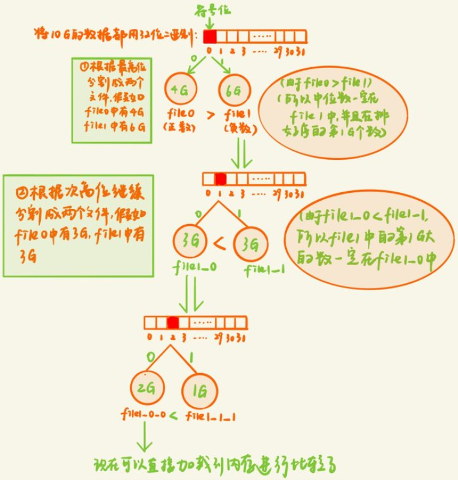
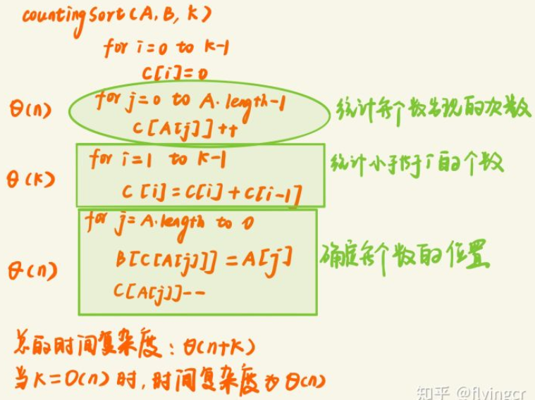
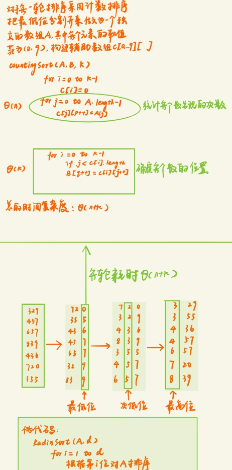
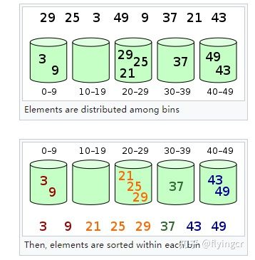
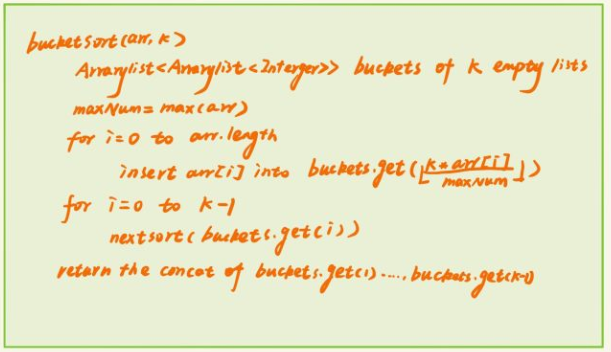
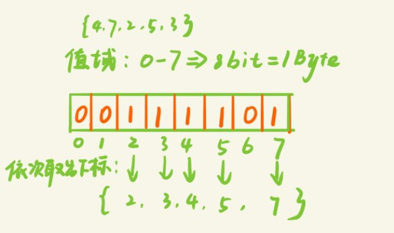
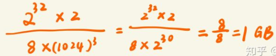

# 海量数据找中位数
#### 题目： 只有2G内存的pc机，在一个存有10G个整数的文件，从中找到中位数，写一个算法。

#### 思路一：外排序（排序-归并）
什么是外排序
外排序就是由于数据量太大不能一次性加载到内存，所以需要先暂时用外存储器（硬盘）将数据存起来，然后依次读入一部分数据到内存，排序之后，生成临时文件存储到硬盘，最后再对这些临时文件进行一个归并，得到最后的排序结果（在合并的过程中虽然不需要多大内存，但是会产生频繁的IO操作，频繁的读磁盘和写磁盘）

《编程之法》中的例子：

假定现在有20个数据的文件A：{5 11 0 18 4 14 9 7 6 8 12 17 16 13 19 10 2 1 3 15}，但一次只能使用仅装4个数据的内容，所以，我们可以每趟对4个数据进行排序，即5路归并，具体方法如下述步骤：

我们先把“大”文件A，分割为a1，a2，a3，a4，a5等5个小文件，每个小文件4个数据
a1文件为：5 11 0 18
a2文件为：4 14 9 7
a3文件为：6 8 12 17
a4文件为：16 13 19 10
a5文件为：2 1 3 15
然后依次对5个小文件分别进行排序
a1文件完成排序后：0 5 11 18
a2文件完成排序后：4 7 9 14
a3文件完成排序后：6 8 12 17
a4文件完成排序后：10 13 16 19
a5文件完成排序后：1 2 3 15
最终多路归并，完成整个排序
整个大文件A文件完成排序后：0 1 2 3 4 5 6 7 8 9 10 11 12 13 14 15 16 17 18 19
本题思路：先通过外排序进行排序再寻找中位数
先将这10G的数据等分成5份存储到硬盘中，然后依次读入一份到内存里面，进行排序，然后将这5份数据进行归并得到最后的排序结果，然后找出中位数第5G大

#### 思路二：堆排序（转换为求前5G大的元素）
我们知道利用堆排序处理海量数据的topK是非常合适不过了，因为它不用将所有的元素都进行排序，只需要比较和根节点的大小关系就可以了，同时也不需要一次性将所有的数据都加载到内存；对于海量数据而言，要求前k小/大的数，我们只需要构建一个k个大小的堆，然后将读入的数依次和根节点比较就行了（当然这里的前提是内存需要存的下k个数）

最大堆求前n小，最小堆求前n大。

1、前k小：构建一个k个数的最大堆，当读取的数大于根节点时，舍弃；当读取的数小于根节点时，替换根节点，重新塑造最大堆，然后继续读取，最后读取完所有的数据之后，最大堆中的数就是最小k个数

2、前k大：构建一个k个数的最小堆，当读取的数小于根节点时舍弃；当读取的数大于根节点时，替换根节点，重新塑造最小堆，然后继续读取，读取完所有的数据之后，最小堆中的数就是最大k个数

所以我们本题采用堆排序来求中位数

对于10G的数据，它的中位数就是第5G个元素，按常理来说我们需要构建一个5G大小的堆，但是允许的内存只有两个G，所以我们先构建一个1G大小的大顶堆，然后求出第1G个元素（根节点），然后利用该元素构建一个新的1G大小的堆，求出第2G大的元素，依次类推，求出第5G大的元素

每次构建一个堆求第几G大的元素，都需要重新遍历完所有10G的数据，相当于要遍历5 * 10G次，这需要频繁的IO操作，需要不断的从硬盘中读取数据

#### 思路三：分而治之：基于二进制位映射分割
基于二进制位将10G数据映射到不同的文件中，利用快速排序的分割思想寻找中位数。

依次读入一部分数据到内存，根据数据的最高位将数据映射到不同的文件中，然后判断中位数可能存在于于哪个文件然后再继续对哪个文件进行分割，知道能够将数据读入内存直接排序

 
该方法相对于外排序和堆排序可以减少磁盘IO的次数，每次可以丢弃一部分数据不再进行读取和写入操作

通过快排的partition思想，时间复杂度为：o(nlogn) ≈ 10G

#### 思路四：基数排序（计数排序）
什么是计数排序（线性时间排序）
前提条件：待排序的数组的n个元素都在（0，k）区间内，k为某个正整数

基本思想：对于n个元素的每个元素x, 找到小于x的元素个数有m个，那么x在最后的排序数组里面的第m+1个位置上

所以关键之处就在于如何寻找小于某个元素的个数

我们首先需要新建一个辅助数组C[0....k]用来统计每个元素出现的次数（并且是按照顺序进行统计）

A[0,...n-1] : 待排序数组

B[0,....n-1]:输出结果

C[0,....k-1]:辅助数组（A[i] <= k-1）

计数排序的伪代码

计数排序的优点

具有顺序稳定性：具有相同值的元素在输出数组的顺序与原数组的相对顺序顺序一致

不改变原数组：并没有对原数组进行移动交换比较等操作

适用

计数排序要求待排序数组的每个数都在0-k的范围内，所以一般适用输入范围在一个较小的范围内，可以有重复的数，并且不会改变重复的数的输入顺序

时间复杂度和空间复杂度

时间复杂度：O(n + k)

当 k = O(n)(当桶的数量和原数据的数量趋于相同) ,时间复杂度为O（n）
空间复杂度：O( n + K)

需要一个长度为k的数组存储原数组每个数出现的次数，同时需要一个长度为n的数组存储排序结果
什么是基数排序
基数排序是分别按照最低位到最高位（或者从高位到低位）依次进行排序，如果有d位，那么就需要进行d轮排序

基数排序的分类

最高位优先(Most Significant Digit first)法，简称MSD法：先按k1排序分组，同一组中记录，关键码k1相等，再对各组按k2排序分成子组，之后，对后面的关键码继续这样的排序分组，直到按最次位关键码kd对各子组排序后。再将各组连接起来，便得到一个有序序列。

最低位优先(Least Significant Digit first)法，简称LSD法：先从kd开始排序，再对kd-1进行排序，依次重复，直到对k1排序后便得到一个有序序列。

基于计数的基数排序

时间复杂度和空间复杂度

时间复杂度：O(d * (n + k) )

其中d为最大的数字的位数，k为每位数的取值范围（相当于桶的个数）
空间复杂度：O(n + k)

需要一个长度为k的数组存储原数组每个数出现的次数，同时需要一个长度为n的数组存储排序结果
计数排序、基数排序与其他对比排序算法的比较
计数排序/基数排序通过构建辅助空间保存出现的次数，时间复杂度可以达到θ（n）

其他排序算法比如快速排序，堆排序等，是基于原址排序，不用构建辅助空间，充分利用硬件的缓存以及输入数据的特征，当主存容量有限的情况下，采用排序算法优于计数排序和基数排序

本题思路:基于计数排序的基数排序
由于基数排序需要构建一个辅助空间用来存储每一位对应0-9的数有哪些，所以对于每一个轮回都需要两部分同样大小的内存，对于本题来说内存只有2G,那么一次最多能读取1G的数据，因为还需要1G的内存作为辅助空间

1、依次读取1G的数据到内存，根据最低位映射到对应的桶里，直到读取完10G数据

2、根据次低位将第一轮的排序结果重新映射，知道轮回到最高位

3、依次统计每个桶累加次数，若最高位为6的累加次数为4G,最高位为7的累加次数为6G,那么中位数一定在最高位为7的桶中，在为7的桶中寻找底1G大的数据即为中位数

思路五：桶排序
什么是桶排序
思路：将待排序树组按照某种规则分别分到有限的桶里面，然后在针对每个桶里面的数据进行排序（可以继续递归采用桶排序也可以采用其他比较排序算法），然后将桶里面的数据依次放回到原数组

适用范围

1、输入数据大约成均匀分布在某个范围内

时间复杂度和空间复杂度

时间复杂度

对n个关键字进行桶排序的时间复杂度分为两个部分：
(1) 将n个元素依次按照某种映射关系映射到对应的桶里，时间复杂度为O(n)
(2) 对于每个桶采用某种比较排序算法进行单独排序，其时间复杂度为 ∑ O(ni*logni) 。其中ni 为第i个桶的数据量。
性能提升：可以从第二部分的时间复杂度下手，即减少对每个桶的排序时间，可以减少每个桶里面的数，或者也可以通过增加桶的数量，当然当桶的数量增加时也会影响空间复杂度

空间复杂度

O(k)：需要数组大小为k的空间存储桶
桶排序与基数排序和计数排序的对比

1、最开始桶排序和基数排序都是将数字分配到有限的桶中，不同点是桶排序需要继续针对每一个桶进行排序，而对于基数排序来说不用进一步对每个桶里面的数据进行排序，而是统计每个桶中数的个数，直接映射到本次轮回的排好序的数据（不是最后的结果）然后继续参与下一轮的排序（如果是LSD，那么下一轮就是根据次低位进行分组排序）

2、桶排序适合均匀分布的相对比较密集的数据，基数排序适合比较稀疏的数据（可以是间隔很大的数据）

3、计数排序相对于桶排序来说，桶的数量比较多，同时计数排序需要统计每个桶里面的个数，而桶排序需要对每个桶进行排序

桶排序的应用

假设数据有500万，其值在0-1000的整数，利用桶排序实现

（1）确定桶的个数：由于这里数据的值的范围比较小，所以这里构建1001个桶（如果值的范围为0-10亿那么就不能用10亿个桶，空间复杂度太高，并且一般没有那么大的内存）

（2）可以自定义一个映射函数将数据映射到这1001个桶中

（3）依次将数据从桶中取出就是一个有序队列，并且还能知道每个桶中有多少个数

本题思路：桶排序
假设这10G数据都是32位的无符号整数，那么每个数的值域为（0，2 ^ 32 -1）

（1）我们不可能创建2^32个桶，空间复杂度太大，所以我们创建2 ^16个桶

（2）由于我们的内存只有2G，所以一次读取2G数据，按照某种映射关系映射到对应的桶里面

（3）依次统计每个桶里面的数据，找到中位数的范围，在针对范围中的数据进行排序，找到中位数的具体位置

思路六：bitmap位图算法
bitmap就是适用一个bit位代表一个数，所有bit位为1的下标就是排好序的数组（当然也可以用2个bit为代表一个数，或者多个）

位图的特点

1) 存储空间的选择受最大值的影响

bitmap的应用

1）查找：先将所有数据映射到bitmap里面，然后判断目标数是否在bitmap里面

2）判断重复：依次将数据放入bitmap里面，若已经放入（该bit位为1），那么就重复

3）找出不重复的数：使用2-bitmap，00表示为出现，01表示出现1次，10表示出现多次，当遍历完所有数据之后，筛选出bit位为00的下标；或者使用两个1-bitmap，如果重复就放入另外一个bitmap，那么另外一个bitmap为1的位都是重复的数

本题思路：使用位图法
假设10G数据都为无符号整数（范围为0-2^32），考虑到可能原数据中可能有重复，所以我们采用两个bit位来表示一个整数，00表示为出现，01表示出现1次，10表示出现多次

所需要的内存为

对于10G的数据我们只需要1G的内存就能够表示出来所有的数据，可见bitmap的压缩性之强

我们依次读取10G数据，然后转换为位图表示，去掉所有bit位为00的位置，找到中间下标就是中位数
