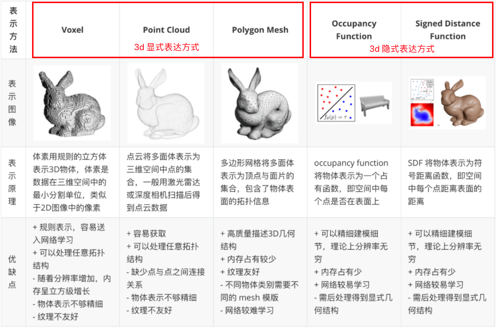
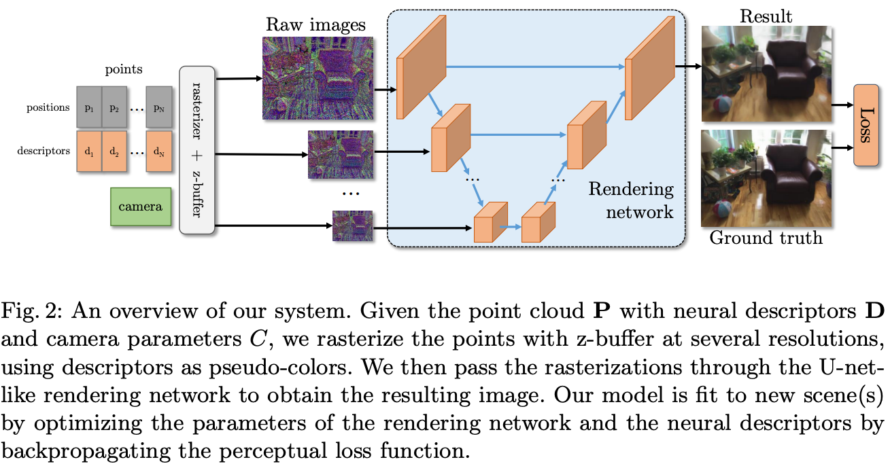
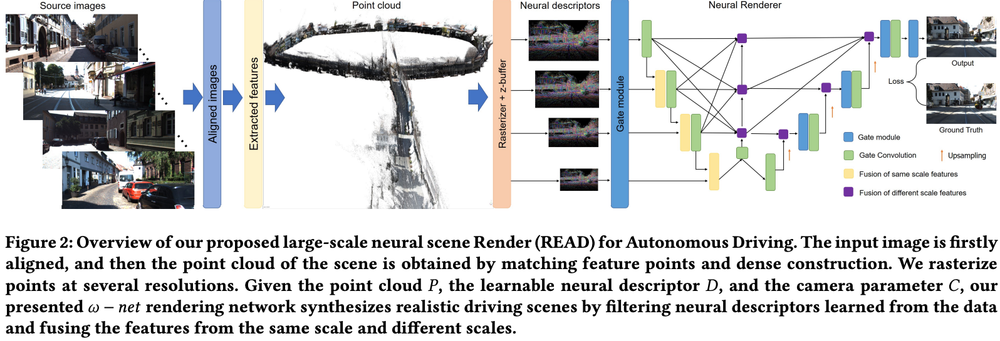
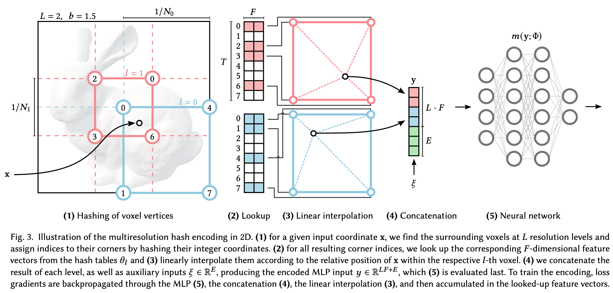
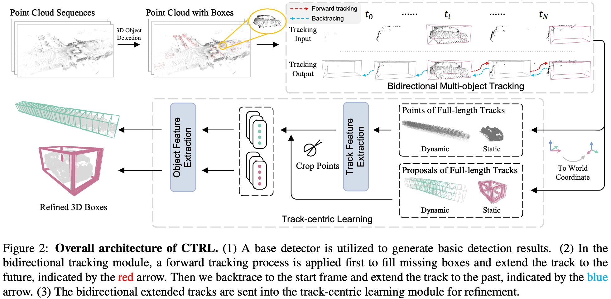
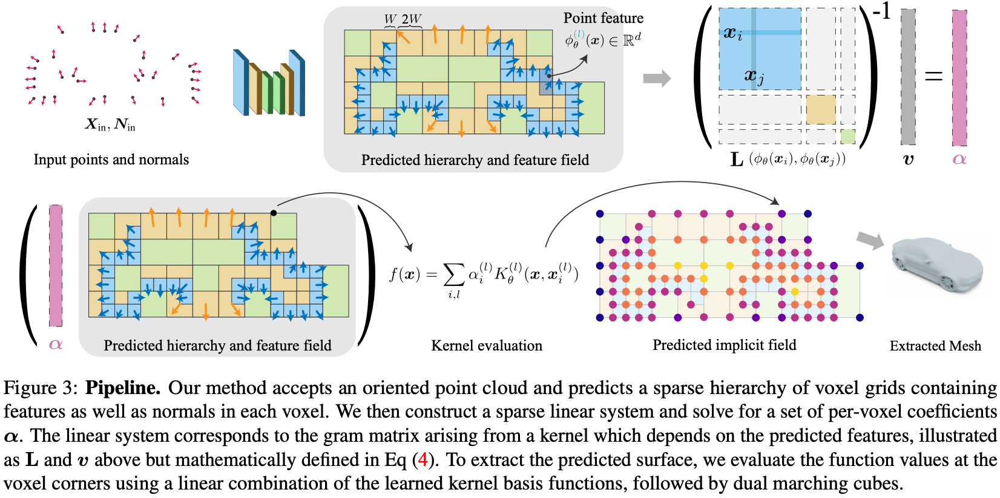
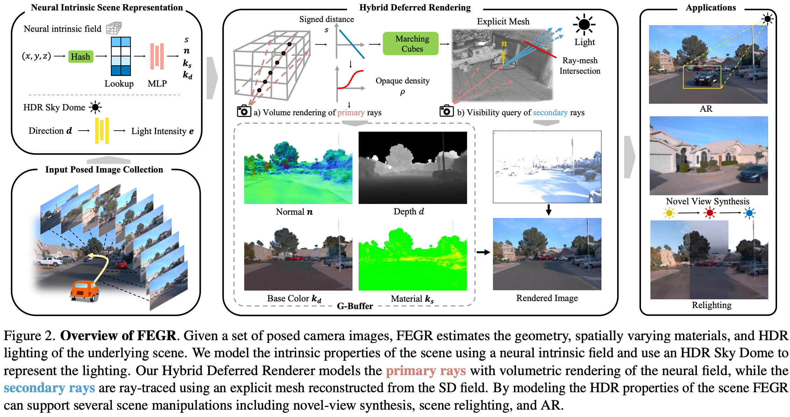
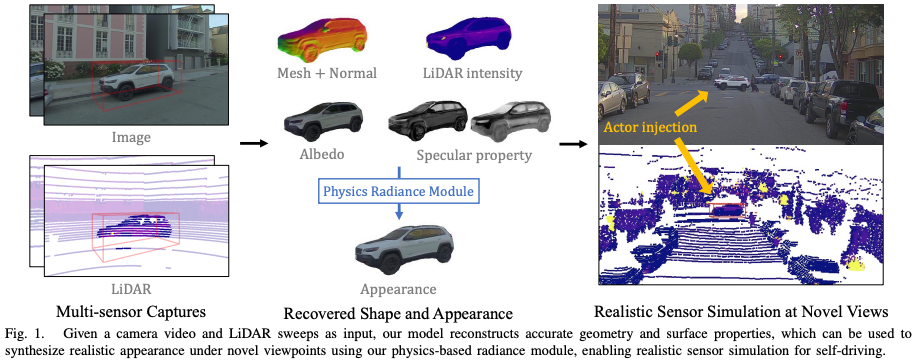

## nerf 相关论文阅读

### 3d 表达方式

### NeRF: Representing Scenes as Neural Radiance Fields for View Synthesis

https://arxiv.org/pdf/2003.08934.pdf

输入：(x, y, z, pitch, yaw)，射线不考虑roll
MLP输出：射线ray对应的RGB和体积密度
体渲染输出：坐标和观察方向对应的新视图

### Neural Point-Based Graphics

https://arxiv.org/pdf/1906.08240.pdf

输入：
1. point cloud `P={p1, p2, ..., pn}` (from lidar or svm or mvs)
2. descriptors as pseudo-colors `D={d1, d2, ..., dn}`, 其中每个d的维度是m
3. camera ex/intrinsic parameters `C`

输出：
1. RGB image

loss:
perceptual loss

一张wh的图片用特征 `S(P, D, Cm)` 去描述，Cm是d的维度m，
$S(P, D, C)[[x], [y]] = d_i$, 假设xy是图像上的点，去除遮挡关系后，该像素点对应一个描述子d_i
用U-net做渲染网络

Infer Efficiency: 62ms on 2080Ti to render a FullHD image.

### READ: Large-Scale Neural Scene Rendering for Autonomous Driving

https://arxiv.org/pdf/2205.05509.pdf

思路的做法和Neural Point-Based Graphics很像，针对自动驾驶场景做了处理
1. 采样加速训练: 筛选出被遮挡的点云, 蒙特卡罗采样(Monte Carlo), 图片Patch采样
2. 场景编辑与block拼接

拼接：对于场景1边界处的坐标（x1，y1，z1），需要拼接场景2的边界坐标（x2，y2，z2）。 先旋转两个场景的点云（P1，P2），使它们在边界处的坐标系上对齐。 特征描述符（D1，D2）表示经过渲染网络训练后场景的纹理，然后在边界处缝合D1和D2以更新场景。

### instant-NGP

https://nvlabs.github.io/instant-ngp/assets/mueller2022instant.pdf

### INeRF: Inverting Neural Radiance Fields for Pose Estimation

https://arxiv.org/pdf/2012.05877.pdf

优化相机pose：利用训练好的nerf模型来进行相机的姿态估计，从而得到更好的相机pose

### Neural-Pull: Learning Signed Distance Functions from Point Clouds by Learning to Pull Space onto Surfaces

SDF (signed distance function) 有向距离场，每个像素（体素）记录自己与距离自己最近物体之间的距离，如果在物体内，则距离为负，正好在物体边界上则为0。

https://arxiv.org/pdf/2011.13495.pdf

基于SDF的训练方案，额外loss，加速模型收敛

### LiDARsim

https://openaccess.thecvf.com/content_CVPR_2020/papers/Manivasagam_LiDARsim_Realistic_LiDAR_Simulation_by_Leveraging_the_Real_World_CVPR_2020_paper.pdf

基于点云的sim变换
利用车辆对称性，对点云进行flip。
将动态目标的点云都对齐到第一帧，利用ICP进行点云配准。

对称CD loss

### Once Detected, Never Lost

https://arxiv.org/pdf/2304.12315.pdf

TCO (track coherence optimization)

#### Multi-way registration

https://www.cv-foundation.org/openaccess/content_cvpr_2015/papers/Choi_Robust_Reconstruction_of_2015_CVPR_paper.pdf

#### Point-to-point ICP

https://graphics.stanford.edu/courses/cs164-09-spring/Handouts/paper_icp.pdf

点云配准(Point cloud registration)：将不同坐标参考系下的点云数据通过旋转、平移等刚体变换转移到同一坐标参考系下,实现点云数据之间的互补,得到几何拓扑信息更加完整的点云数据。常用方法: ICP, 两个点集的对齐，基于最小二乘法的最优匹配.（https://www.cnblogs.com/21207-iHome/p/6038853.html）

图像配准(Image registration): 将不同时间、不同传感器（成像设备）或不同条件下（天候、照度、摄像位置和角度等）获取的两幅或多幅图像进行匹配、叠加的过程. (https://www.cnblogs.com/carsonzhu/p/11188574.html)

### NKSR

https://arxiv.org/pdf/2305.19590.pdf

泊松重建：一种隐式曲面重建方案，输入为一组物体表面的有向点云，输出物体表面三维网格

神经核表面重建（ NKSR ）替代传统的泊松重建

### F2-NeRF

https://arxiv.org/pdf/2303.15951.pdf

### Neural Fields meet Explicit Geometric Representations for Inverse Rendering of Urban Scenes

https://arxiv.org/pdf/2304.03266.pdf

### MARS: An Instance-aware, Modular and Realistic Simulator for Autonomous Driving

https://arxiv.org/pdf/2307.15058.pdf

https://github.com/OPEN-AIR-SUN/mars

### Reconstructing Objects in-the-wild for Realistic Sensor Simulation

https://www.cs.toronto.edu/~zeyang/publication/ICRA2023NeuSim/files/paper.pdf

### unisim

### Neural Dynamic Image-Based Rendering

https://dynibar.github.io/

too slow

### streetsurf

https://ventusff.github.io/streetsurf_web/

### Neuralangelo

https://research.nvidia.com/labs/dir/neuralangelo/

### colmap 算法

三角化：对新提取的特征点计算其在3D空间中的坐标位置

BA优化(Bundle Adjustment)：根据相机模型和A,B图像特征匹配好的像素坐标，求出A图像上的像素坐标对应的归一化的空间点坐标，然后根据该空间点的坐标计算重投影到B图像上的像素坐标，重投影的像素坐标(估计值)与匹配好的B图像上的像素坐标(测量值),不会完全重合，BA的目的就是每一个匹配好的特征点建立方程，然后联立，形成超定方程，解出最优的位姿矩阵或空间点坐标(两者可以同时优化)。