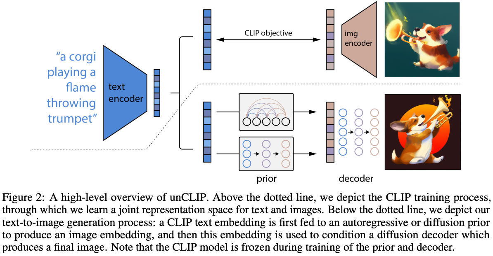
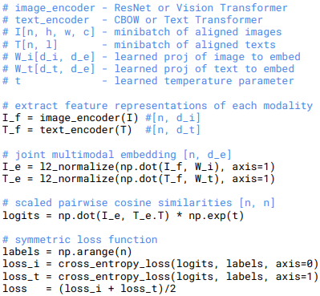
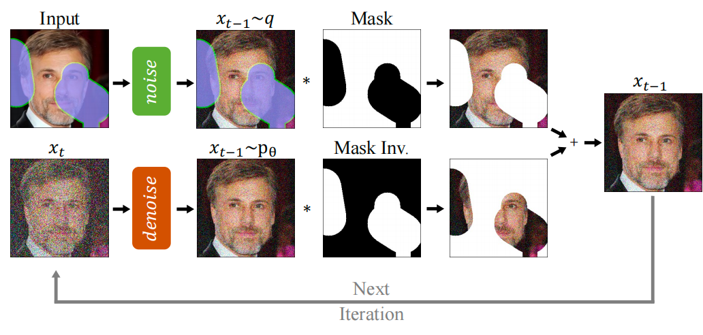
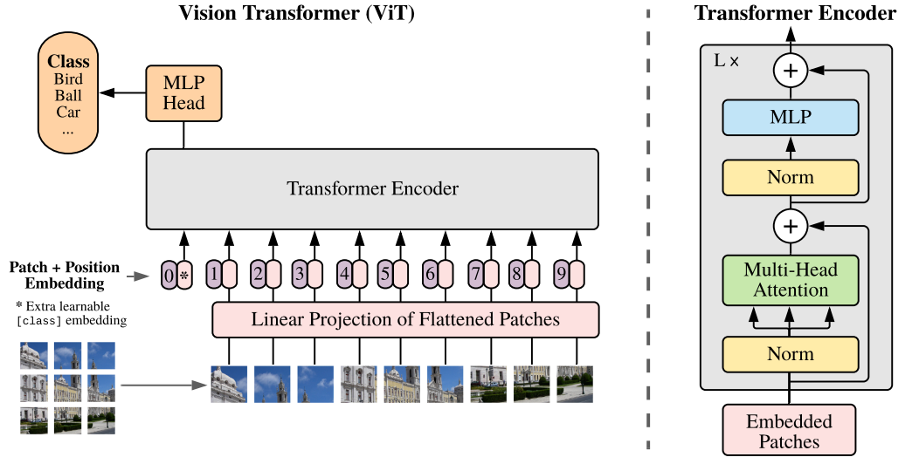

# Diffusion生成编辑
1、diffusion model、多模态大模型的原理。
2、掌握stable diffusion的代码。
3、看一些lora、controlnet的原理和代码。

## 精读 Diffusion models

### [Denoising Diffusion Probabilistic Models](https://arxiv.org/abs/2006.11239)
条件概率：
- P(A|B): 在B发生条件下发生A的概率, $P(A|B) = P(A,B) / P(B)$
- P(A,B): A,B同时发生的概率
KL散度(非对称)：
- 衡量两个分布间的差异
- $D_{K L}(p \| q)=\sum_{i=1}^n p(x) \log \frac{p(x)}{q(x)}$

扩散过程：得到各项独立的高斯分布
逆扩散过程：从高斯噪声恢复原始数据

https://github.com/lucidrains/denoising-diffusion-pytorch
https://hojonathanho.github.io/diffusion/

GaussianDiffusion2中提供了三种loss: 1. model predicts x_{t-1} 2. model predicts x_0 3. model predicts epsilon noise, 最常用的是模型直接预测本轮添加的噪声
```python
# 随机初始化一个噪声
noise = tf.random_normal(shape=x_0.shape, dtype=x_start.dtype)
# 对x_0进行扩散，得到t时刻噪声下的x_t
x_t = self.q_sample(x_start=x_0, t=t, noise=noise)
# 对(x_t, t)通过网络进行逆扩散，预测初始化的噪声
pred_noise = denoise_fn(x_t, t)

losses = nn.meanflat(tf.squared_difference(noise, pred_noise))
```

### [Denoising Diffusion Implicit Models](https://arxiv.org/abs/2010.02502)

https://github.com/ermongroup/ddim

找到了一种能满足DDPM逆向条件，且能减少采样步骤的逆向公式：

化简了p扩散的过程
```python
e = torch.randn_like(x0)
a = (1-b).cumprod(dim=0).index_select(0, t).view(-1, 1, 1, 1)
x = x0 * a.sqrt() + e * (1.0 - a).sqrt()
output = model(x, t.float())

return (e - output).square().sum(dim=(1, 2, 3)).mean(dim=0)
```

### [GLIDE: Towards Photorealistic Image Generation and Editing with Text-Guided Diffusion Models](https://arxiv.org/abs/2112.10741)

CLIP guidance and classifier-free guidance
1. classifier guidance: 可以直接应用于训练好的DDPM模型，分类器要能应用于加噪图片的分类, 通过梯度引导逆扩散过程，生成类别接近的图片
2. clip guidance: 通过clip衡量生成图片与text的相关性，进行引导 
3. classifier-free guidance: 训练的时候生成两个输出，分别在有/无条件下，f(x_t, t, y), f(x_t, t)，就有了无条件生成输出->有条件生成输出的方向

### [DALL·E 2: Hierarchical Text-Conditional Image Generation with CLIP Latents](https://cdn.openai.com/papers/dall-e-2.pdf)



- https://openai.com/dall-e-2
- https://github.com/lucidrains/DALLE2-pytorch
- https://www.bilibili.com/video/BV17r4y1u77B

```bash
CLIP模型提供text embedding的infer和image embedding的GT
 CLIP infer          prior             decoder
text -> text embedding -> image embedding -> image
```

```bash
1. GAN: 不是概率模型，多样性差些
noise -> generator -> image
                        |
    image(real) -> discriminator

2. AE/DAE: DAE就是在AE的基础上把X进行mask后输入encoder
X -> encoder -> z -> decoder -> X_recon

3. VAE: 通过encoder学习一个高斯分布，通过(u, sigma)采样得到Z用于后续的X重建
X -> encoder -> distribution(u, sigma) -> Z -> decoder -> X_recon

4. VQVAE: codebook中维护k个向量(聚类中心)，优化相对容易
                     codebook(kxD)
                    /      |
X -> encoder -> feature -> Z -> feature_quant -> decoder -> X_recon

5. Diffusion: 学习预测每次添加的噪声
X -> X1 -> X_{t-1} -> X_t -> X_T
X <- X1 <- X_{t-1} <- X_t <- X_T
```


[Diffusion Models Beat GANs on Image Synthesis]()


[Classifier-Free Diffusion Guidance]()


[Palette: Image-to-Image Diffusion Models]()


[High-Resolution Image Synthesis with Latent Diffusion Models]()


[Video Diffusion Models]()


[Scalable Diffusion Models with Transformers]()


## 精读 CLIP
[Learning Transferable Visual Models From Natural Language Supervision](https://arxiv.org/abs/2103.00020)



https://openai.com/research/clip
https://zhuanlan.zhihu.com/p/583400386
https://www.bilibili.com/video/BV1SL4y1s7LQ

训练GT构造：text-image pair，训练的过程中对比学习拉近匹配的text-image向量的距离，推远其他向量的距离.

infer
```py
image_input = torch.tensor(np.stack(images)).cuda() # [8, 3, 224, 224]
# clip.tokenize, 向量化文字, 其实就是word->num的映射
text_tokens = clip.tokenize(["This is " + desc for desc in texts]).cuda() # [8, 77]

with torch.no_grad():
    image_features = model.encode_image(image_input).float() # [8, 512]
    text_features = model.encode_text(text_tokens).float() # [8, 512]

image_features /= image_features.norm(dim=-1, keepdim=True)
text_features /= text_features.norm(dim=-1, keepdim=True)
similarity = text_features.cpu().numpy() @ image_features.cpu().numpy().T # [8, 8]
```

## 精读 LORA
- [LoRA: Low-Rank Adaptation of Large Language Models](https://arxiv.org/abs/2106.09685)
作用于transformer的attension里，原始模型的weights是freeze的，训练一个low rank的Wa, Wb.
```python
# freeze: W (in_dim, out_dim)
# update: W_A (in_dim, rank), W_B (rank, out_dim)
h = X @ W
h += X @ (W_A @ W_B) * alpha
```

- https://huggingface.co/blog/zh/sdxl_lora_advanced_script
- https://huggingface.co/blog/zh/peft
- Dream Booth
- style drop
- https://huggingface.co/docs/diffusers/v0.26.3/en/training/lora

- ? train from .safetensor
- ? inpainting
- ? finetune sd: https://github.com/huggingface/diffusers/tree/main/examples/text_to_image
- ? finetune controlnet: https://github.com/huggingface/diffusers/tree/main/examples/controlnet
- ? 训练集如何准备
- ? how video works

## 精读 Stable Diffusion
- [High-Resolution Image Synthesis with Latent Diffusion Models](https://openaccess.thecvf.com/content/CVPR2022/papers/Rombach_High-Resolution_Image_Synthesis_With_Latent_Diffusion_Models_CVPR_2022_paper.pdf)
- [SDXL: Improving Latent Diffusion Models for High-Resolution Image Synthesis](https://arxiv.org/pdf/2307.01952.pdf)

- https://github.com/CompVis/latent-diffusion
- stable-diffusion-v1 https://github.com/CompVis/stable-diffusion
- stable-diffusion-v2 https://github.com/Stability-AI/stablediffusion
- stable-diffusion-v3 https://github.com/Stability-AI/generative-models

- https://stability.ai/
- https://huggingface.co/docs/diffusers/using-diffusers/img2img


使用lora finetune stable diffusion


## 精读 ControlNet

- https://github.com/lllyasviel/ControlNet
- https://github.com/lllyasviel/ControlNet-v1-1-nightly

- https://zhuanlan.zhihu.com/p/660924126


- https://github.com/AUTOMATIC1111/stable-diffusion-webui
- https://github.com/Mikubill/sd-webui-controlnet
- https://www.youtube.com/@civitai

- space: https://huggingface.co/spaces/hysts/ControlNet-v1-1
- examples: https://huggingface.co/docs/diffusers/v0.26.3/en/using-diffusers/controlnet
- train: https://huggingface.co/docs/diffusers/v0.26.3/en/training/controlnet

canny: text + raw_image + canny_image


## 精读 inpaint anything

https://github.com/geekyutao/Inpaint-Anything

https://arxiv.org/abs/2304.06790

https://huggingface.co/diffusers/stable-diffusion-xl-1.0-inpainting-0.1/discussions/11

RePaint 原理


LaMa: https://arxiv.org/pdf/2109.07161.pdf

## 精读 caption anything

- https://github.com/ttengwang/Caption-Anything
- https://arxiv.org/pdf/2305.02677.pdf

- https://github.com/facebookresearch/segment-anything
- https://arxiv.org/pdf/2304.02643.pdf


## StableCascade

- https://github.com/Stability-AI/StableCascade/tree/master

## Stable video diffusion
- https://openai.com/sora
- https://arxiv.org/pdf/2311.15127.pdf
- https://huggingface.co/docs/diffusers/api/pipelines/text_to_video
- https://huggingface.co/docs/diffusers/api/pipelines/text_to_video_zero
- space demo: https://huggingface.co/spaces/PAIR/Text2Video-Zero
- https://arxiv.org/pdf/2303.13439.pdf

## instructpix2pix

- https://huggingface.co/docs/diffusers/main/en/training/instructpix2pix
- https://arxiv.org/pdf/2211.09800.pdf
- https://huggingface.co/docs/diffusers/main/en/api/pipelines/pix2pix


## Vision Transformer
https://arxiv.org/pdf/2010.11929.pdf



标准的Transformer模块，要求输入的是token向量序列`(num_token, token_dim)`, `num_token=HW+1`
以clip中使用的vision-transformer为例，展示关键的维度变化(ps: `permute to [num_token, batch_size, token_dim]`非必需，取决于transformer具体实现的维度顺序)
```py
(1, 3, 224, 224) # raw image tensors
(1, 768, 7, 7) # conv2d(kernel_size=32, stride=32)
(1, 768, 49) # reshape 7x7 -> 49 patches
(1, 49, 768) # permute to [batch_size, num_token, token_dim]
(1, 50, 768) # cat class embedding param
(1, 50, 768) # add positional embedding
(50, 1, 768) # permute to [num_token, batch_size, token_dim]
(50, 1, 768) # feed to transformer encoders and return
(1, 50, 768) # recover [batch_size, num_token, token_dim]
(1, 768) # take class embedding
(1, 512) # linear projection
```


## 疑问
- VQ-GAN
- tokenizer是什么, done
- llama

## 已识别的难点
1. 时序一致性
2. 多视角一致性

## 阅读list
- video latent diffusion
- 全世界 LoRA 训练脚本，联合起来: https://mp.weixin.qq.com/s/EmKIfsYhlSFBzQ_k_Ut-Lg
- [知乎-AIGC-扩散模型](https://www.zhihu.com/column/c_1569815370541752320)


## hugging face app搭建


## 其他
dockerfile
混合专家模型(MoE) https://huggingface.co/blog/zh/moe