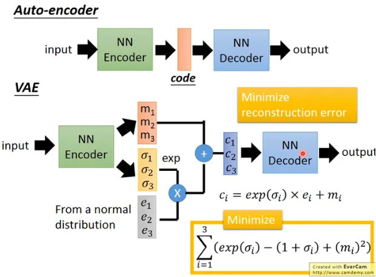
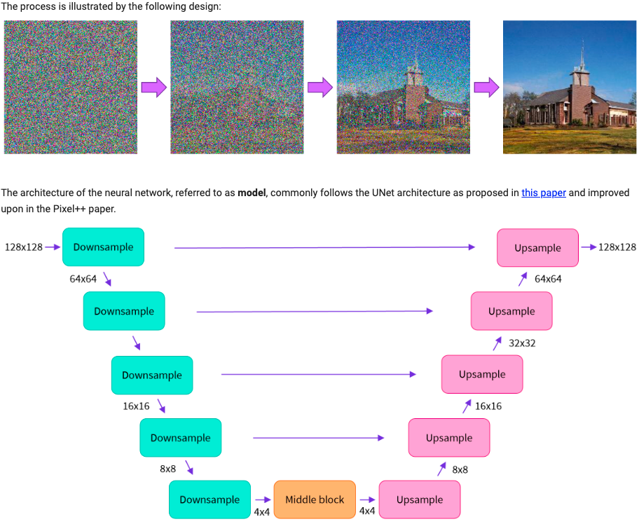
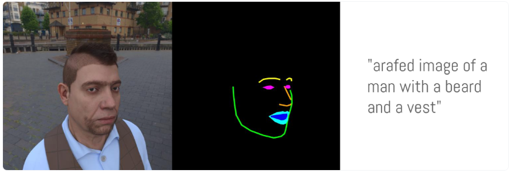
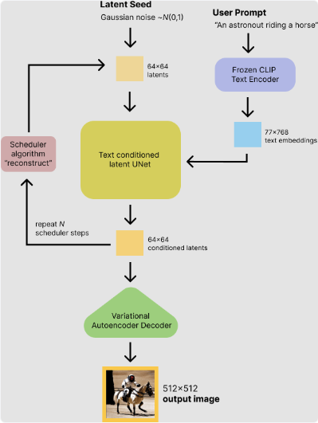
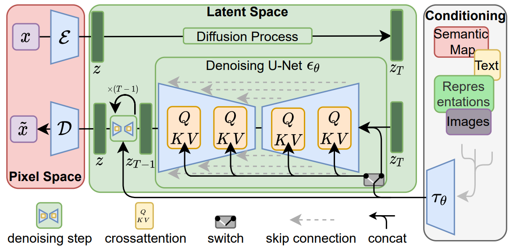

# Hugging Face
先去了解思考Hugging Face的现状/设计
相关的经典论文，不然pipeline理解有困难

## paper list
1. ControlNet
2. 

## 相关概念
### VAE
变分自编码器（VAE）Variational Autoencoder, 无监督学习的神经网络模型，用于学习数据的低维表示。它们的目标是将输入数据编码为低维潜在空间中的表示，并通过解码器将其重构回原始数据。

### U-Net

### ControlNet

**[Adding Conditional Control to Text-to-Image Diffusion Models](https://arxiv.org/pdf/2302.05543.pdf)**

ControlNet资料: 
- 

ControlNet训练：
- https://huggingface.co/blog/zh/train-your-controlnet
- https://huggingface.co/docs/diffusers/v0.25.1/en/training/controlnet

训练数据准备：

Applications:
from: https://huggingface.co/docs/diffusers/v0.25.1/en/using-diffusers/controlnet
1. (text) + canny image
2. (text) + image + it's depth
3. (text) + image + mask area
4. (text) + canny image + pose image

### Diffusion Model
[Denoising Diffusion Probabilistic Models](https://arxiv.org/pdf/2006.11239.pdf)

### Latent Diffusion
https://huggingface.co/blog/stable_diffusion
Latent Diffusion models: 将图像/文本编码到一个低维度的latent space进行计算，再通过autoencoder恢复成目标图像
1. VAE
2. U-Net
3. Text-encoder

inference pipeline
- text_encoder: Stable Diffusion uses CLIP, but other diffusion models may use other encoders such as BERT.
- tokenizer: It must match the one used by the text_encoder model.
- scheduler: The scheduling algorithm used to progressively add noise to the image during training.
- unet: The model used to generate the latent representation of the input.
- vae: Autoencoder module that we'll use to decode latent representations into real images.

https://arxiv.org/pdf/2112.10752.pdf

### CLIP

### 其他

group normalization：
depth anything: https://github.com/LiheYoung/Depth-Anything

DrivingDiffusion: 
- https://mp.weixin.qq.com/s/SNvNZpGG_mfvujyJ3spS2w
- https://drivingdiffusion.github.io/

DriveDreamer:
- https://mp.weixin.qq.com/s/igon7SWjxqVL_gjGNm0H8A
- https://arxiv.org/pdf/2309.09777.pdf
- https://drivedreamer.github.io/