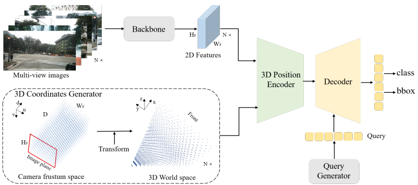
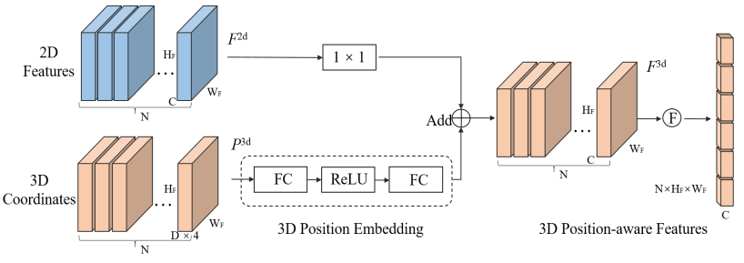
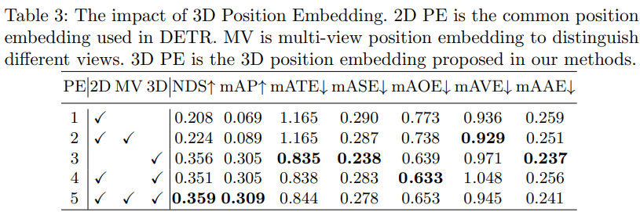
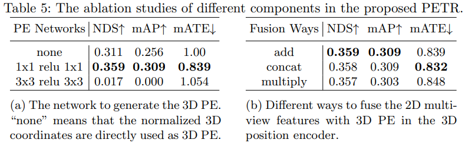

# PETR 论文阅读

[PETR](https://arxiv.org/pdf/2203.05625.pdf)

2D feature 与通过3D内外参生成的PE通过add/concat的方式融合

3D coordinate map 生成
1. 等间距在原图上采样一些(u, v)点
2. (去畸变后) 转到depth norm的camera系下(x, y, 1)
3. 等间距在z维度生成该camera下的伪点云(x, y, z)
4. 通过外参转到vcs下
5. 归一化vcs下的x/y/z

1x1 Conv + ReLU + 1x1 Conv 得到 3D position embedding

3D position embedding 通过 add/concat与2D feature map融合

对3D泛化性的启发:
- 3D coordinate map 包含了相机内参/外参的信息, 且一个相机一个(在train/infer阶段固定)
- 然后训练神经网络学到这种变换, 生成 3D position embedding

有可能遇到的困难:
- 一个相机一组内参/外参, 是离散的, 且数目不多, 神经网络能不能很好学到这种关系, 生成质量较高的PE
