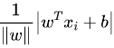
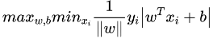
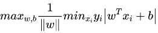
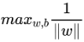
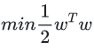
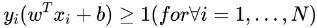

# SVM
## 原理
SVM 是一种二分类模型。它的基本模型是在特征空间中寻找间隔最大化的分离超平面的线性分类器。

- 当训练样本线性可分时，通过硬间隔最大化，学习一个线性分类器，即线性可分支持向量机；
- 当训练数据近似线性可分时，引入松弛变量，通过软间隔最大化，学习一个线性分类器，即线性支持向量机；
- 当训练数据线性不可分时，通过使用核技巧及软间隔最大化，学习非线性支持向量机。

## 硬间隔
最大化间隔 max margin(w,b) s.t. 分类正确, 即 y(w^Tx+b) > 0
点到平面距离，几何间隔

因为y属于{-1,1}, 所以可以将y引入距离公式. 优化目标为最大化点到直线最小的距离margin

上式又可以写成, 其中 $y_i |w^Tx_i + b|$ 称为函数间隔,如果大于0分类正确,否则错误.

其中min y_i(w^Tx_i+b)最小值为1，因此优化可以写成

写成min的形式，是一个二次优化问题

需要满足如下N个约束

上面的优化目标与约束可以用二次规划求解。可发现最小间距取决于分割平面两侧的支持向量，因此对异常值比较敏感，所以之后又有了松弛变量的概念。因为要求解上面的N阶约束的凸优化方程，会引入拉格朗日乘子，对偶。因为有些样本线性不可分，要引入核函数，提升到一个线性可分的高维空间，同时可以避免直接在高维空间中的复杂计算。

## 常见问题
### SVM 为什么采用间隔最大化
当训练数据线性可分时，存在无穷个分离超平面可以将两类数据正确分开。线性可分支持向量机利用间隔最大化求得最优分离超平面，这时，解是唯一的。另一方面，此时的分隔超平面所产生的分类结果是最鲁棒的，对未知实例的泛化能力最强。可以借此机会阐述一下几何间隔以及函数间隔的关系。
### 为什么要将求解 SVM 的原始问题转换为其对偶问题
一是对偶问题往往更易求解，当我们寻找约束存在时的最优点的时候，约束的存在虽然减小了需要搜寻的范围，但是却使问题变得更加复杂。为了使问题变得易于处理，我们的方法是把目标函数和约束全部融入一个新的函数，即拉格朗日函数，再通过这个函数来寻找最优点。二是可以自然引入核函数，进而推广到非线性分类问题。
### 为什么 SVM 要引入核函数
当样本在原始空间线性不可分时，可将样本从原始空间映射到一个更高维的特征空间，使得样本在这个特征空间内线性可分。而引入这样的映射后，所要求解的对偶问题的求解中，无需求解真正的映射函数，而只需要知道其核函数。核函数的定义：K(x,y)=<ϕ(x),ϕ(y)>，即在特征空间的内积等于它们在原始样本空间中通过核函数 K 计算的结果。一方面数据变成了高维空间中线性可分的数据，另一方面不需要求解具体的映射函数，只需要给定具体的核函数即可，这样使得求解的难度大大降低。
### 为什么SVM对缺失数据敏感
这里说的缺失数据是指缺失某些特征数据，向量数据不完整。SVM 没有处理缺失值的策略。而 SVM 希望样本在特征空间中线性可分，所以特征空间的好坏对SVM的性能很重要。缺失特征数据将影响训练结果的好坏。
### SVM 核函数之间的区别
一般选择线性核和高斯核，也就是线性核与 RBF 核。 线性核：主要用于线性可分的情形，参数少，速度快，对于一般数据，分类效果已经很理想了。 RBF 核：主要用于线性不可分的情形，参数多，分类结果非常依赖于参数。有很多人是通过训练数据的交叉验证来寻找合适的参数，不过这个过程比较耗时。 如果 Feature 的数量很大，跟样本数量差不多，这时候选用线性核的 SVM。 如果 Feature 的数量比较小，样本数量一般，不算大也不算小，选用高斯核的 SVM。
