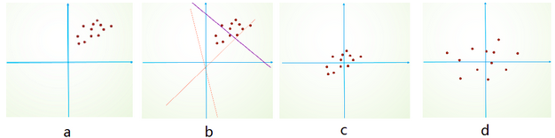

# 面试问答整理

## cv 算法
### 手写IoU
```python
import numpy as np
def iou_calculate(bbox1, bbox2):
    """
    Args:
      bbox1: (N, 4) (xmin, ymin, xmax, ymax)
      bbox2: (M, 4) np.array
    Returns:
      iou: (N,M)
    """
    area1 = (bbox1[..., 2] - bbox1[..., 0]) * (bbox1[..., 3] - bbox1[..., 1]) # (N,)
    area2 = (bbox2[..., 2] - bbox2[..., 0]) * (bbox2[..., 3] - bbox2[..., 1]) # (M,)
    lt = np.maximum(bbox1[:, np.newaxis, :2], bbox2[:, :2]) # (N, M, 2)
    rb = np.minimum(bbox1[:, np.newaxis, 2:], bbox2[:, 2:]) # (N, M, 2)
    inter = np.maximum(0, rb - lt) # (N, M, 2)
    inter_area = inter[..., 0] * inter[..., 1] # (N, M)
    union_area = area1[:, np.newaxis] + area2 - inter_area # (N, M)
    iou = inter_area / union_area
    return iou
```

### 手写NMS
```python
def nms(bboxes, iou_thresh):
    """
    Args:
      bboxes: after score. np.array. (N, 6) [xmin, ymin, xmax, ymax, score, class]
      iou_thresh: float
    Returns:
      bboxes_nms: np.array. (N', 6) [xmin, ymin, xmax, ymax, score, class]
    """
    classes = bboxes[:, 5] # (N,)
    unique_classes = set(classes)
    bboxes_nms = []
    for cls in unique_classes:
        mask = classes == cls # (N,)
        cls_bboxes = bboxes[mask] # (M, 6)
        # nms in each class
        x1, y1 = cls_bboxes[:, 0], cls_bboxes[:, 1] # (M,)
        x2, y2 = cls_bboxes[:, 2], cls_bboxes[:, 3]
        scores = cls_bboxes[:, 4] # (M,)
        areas = (x2 - x1) * (y2 - y1) # (M,)
        order = scores.argsort()[::-1] # (M,)
        keep = []
        while order.size > 0:
            i = order[0]
            keep.append(i)
            x1_max = np.maximum(x1[i], x1[order[1:]]) # (1,), (M-1,) -> (M-1,)
            y1_max = np.maximum(y1[i], y1[order[1:]])
            x2_min = np.minimum(x2[i], x2[order[1:]])
            y2_min = np.minimum(y2[i], y2[order[1:]])
            w = np.maximum(0, x2_min - x1_max) # (M-1,)
            h = np.maximum(0, y2_min - y1_max)
            inter_area = w * h # (M-1,)
            union_area = areas[i] + areas[order[1:]] - inter_area # (1,), (M-1,) -> (M-1,)
            iou = inter_area / union_area # (M-1,)
            keep_index = np.where(iou <= iou_thresh)[0]
            order = order[keep_index + 1]
        keep_bboxes = cls_bboxes[keep]
        bboxes_nms.append(keep_bboxes)
    bboxes_nms = np.vstack(bboxes_nms)
    return bboxes_nms
```

### focal loss
```python
p = torch.sigmoid(predicts)
ce_loss = torch.nn.functional.binary_cross_entropy_with_logits(predicts, targets, reduction="none")
p_t = p * targets + (1 - p) * (1 - targets)
loss = ce_loss * ((1 - p_t) ** gamma)
if alpha >= 0:
    alpha_t = alpha * targets + (1 - alpha) * (1 - targets)
    loss = alpha_t * loss
loss = loss.sum()
loss = loss / max(1, num_matched_based_anchors)
return loss
```

### Opencv 双线性插值
参考:
https://geek-docs.com/opencv/opencv-examples/bilinear-interpolation.html
双线性插值是opencv resize 默认方法,折中来说具有较好速度与图像质量.
1. 生成全黑的放大图像的矩阵
2. 查找放大图像每个点对应的原图像坐标. 设放大后图像x', y', 横纵放大率均为a, 原图像坐标为 x'/a, y'/a
3. 寻找原图像周围4领域像素点, (x,y), (x+1,y), (x,y+1), (x+1,y+1)
4. 求4个点到x'/a, y'/a距离, dx = x'/a - x, dy = y'/a - y
5. 则放大图像像素值为
$$ I'(x',y') = (1-dx)(1-dy)I(x,y) + dx(1-dy)I(x+1,y) + (1-dx)dyI(x,y+1) + dxdyI(x+1,y+1) $$

```python
import cv2
import numpy as np

def bl_interpolate(img, ax=1., ay=1.):
    H, W, C = img.shape
    aH = int(ay * H)
    aW = int(ax * W)
    # get position of resized image
    y = np.tile(np.arange(aH), (aW, 1)).transpose()
    x = np.tile(np.arange(aW), (aH, 1))
    # get position of original position
    y = (y / ay)
    x = (x / ax)
    ix = np.floor(x).astype(np.int)
    iy = np.floor(y).astype(np.int)
    ix = np.minimum(ix, W-2)
    iy = np.minimum(iy, H-2)
    # get distance
    dx = x - ix
    dy = y - iy
    dx = np.repeat(np.expand_dims(dx, axis=-1), 3, axis=-1)
    dy = np.repeat(np.expand_dims(dy, axis=-1), 3, axis=-1)
    # interpolation
    out = (1-dx) * (1-dy) * img[iy, ix] + dx * (1 - dy) * img[iy, ix+1] + \
          (1 - dx) * dy * img[iy+1, ix] + dx * dy * img[iy+1, ix+1]
    out = np.clip(out, 0, 255)
    out = out.astype(np.uint8)

    return out

img = cv2.imread("filepath").astype(np.float)
out = bl_interpolate(img, ax=1.5, ay=1.5)
cv2.imshow("result", out)
cv2.waitKey(0)
```

### 中值滤波
```python
def medianBlur(img_3c, kernel, padding_way='ZERO'):
    # kernel size need 3, 5, 7, 9....
    paddingSize = kernel // 2
    height, width, channel = img_3c.shape

    # 假设输入,如下矩阵,5x5
    # [[2 6 3 4 7]
    #  [6 1 7 1 5]
    #  [4 6 7 3 3]
    #  [3 1 8 8 6]
    #  [2 4 8 0 7]]

    # 创建用于输出的矩阵
    matOut = np.zeros((height, width, 3), dtype=img_3c.dtype)
    for c in range(channel):
        img = img_3c[:, :, c]
        matBase = np.zeros((height + paddingSize * 2, width + paddingSize * 2), dtype=img.dtype)

        # 创建一个添加了padding的矩阵,初始值为0
        # 如果kernel的大小为3,所以从5x5变成了7x7
        # [[0 0 0 0 0 0 0]
        #  [0 0 0 0 0 0 0]
        #  [0 0 0 0 0 0 0]
        #  [0 0 0 0 0 0 0]
        #  [0 0 0 0 0 0 0]
        #  [0 0 0 0 0 0 0]
        #  [0 0 0 0 0 0 0]]

        matBase[paddingSize:-paddingSize, paddingSize:-paddingSize] = img
        # 将原值写入新创建的矩阵当中
        # [[0 0 0 0 0 0 0]
        # [0 2 6 3 4 7 0]
        # [0 6 1 7 1 5 0]
        # [0 4 6 7 3 3 0]
        # [0 3 1 8 8 6 0]
        # [0 2 4 8 0 7 0]
        # [0 0 0 0 0 0 0]]

        if padding_way is 'ZERO':
            pass
        elif padding_way is 'REPLICA':
            for i in range(paddingSize):
                matBase[i, paddingSize:-paddingSize] = img[0, :]
                matBase[-(1 + i), paddingSize:-paddingSize] = img[-1, :]
                matBase[paddingSize:-paddingSize, i] = img[:, 0]
                matBase[paddingSize:-paddingSize, -(1 + i)] = img[:, -1]
                # 通过REPLICA后的矩阵,讲四个边补齐
                #[[0 2 6 3 4 7 0]
                # [2 2 6 3 4 7 7]
                # [6 6 1 7 1 5 5]
                # [4 4 6 7 3 3 3]
                # [3 3 1 8 8 6 6]
                # [2 2 4 8 0 7 7]
                # [0 2 4 8 0 7 0]]

        # 这里是遍历矩阵的每个点
        for x in range(height):
            for y in range(width):
                # 获取kernel X kernel 的内容,并转化成队并列
                line = matBase[x:x + kernel, y:y + kernel].flatten()
                # 队列排序处理.
                line = np.sort(line)
                # 取中间值赋值
                matOut[x, y, c] = line[(kernel * kernel) // 2]
    return matOut
```

### kmeans
算法流程:
1. 随机生成k个质心
while 收敛或达到最大迭代次数:
    2. 分别计算每一个样本与k个质心的距离
    3. 每个样本归类到距离最近质心
    4. 基于归类样本更新质心坐标

缺点:
质心的初始位置和数据的分布很大程度影响了算法的精准度和收敛时间。更严重的是，在某些情况下，质心会被一小簇数据“欺骗”，从而陷入到局部最优解，无法达到全局最优。

参考: https://blog.csdn.net/mottled233/java/article/details/79618968
```python
def rand_center(data, k):
    # 共k个质心，data.shape[1]是每个数据样本的维度，质心的维度应与样本的维度一致。
    centers = np.random.rand(k, data.shape[1])
    # rand随机的范围是零到一，要适用于样本的范围需要进行缩放
    # 这里使用样本在该维度的最大值作为每个维度上的缩放倍数
    scale = np.max(data, axis=0)
    centers *= scale
    return centers
# 将所有样本分组到k个质心，返回二维列表[[属于分组1的样本][属于分组2的样本]...]
def group_all(data, k, centers):
    groups = []
    for index in range(k):
        groups.append([])
    # 对每一个样本进行分组
    for sample in data:
        index = group_one(sample, centers)
        groups[index].append(sample.tolist())
    return groups
# 返回距离单个样本sample最近的质心的下标索引
def group_one(sample, centers):
    distance_vect = np.sum((sample-centers)**2, axis=1)
    return np.argmin(distance_vect)
# 根据样本分组，更新每个质心的位置
def update_centers(data, k, groups):
    centers = np.zeros((k, data.shape[1]))
    for index in range(k):
        # 对每一个分组中的数据，在不同的维度分别求均值
        centers[index] = np.mean(np.array(groups[index]), axis=0)
    return centers

def iter_diff(old_centers, new_centers):
    return np.sum(np.abs(old_centers - new_centers))

def classify(data, k, threshold, max_iter=0):
    # 随机初始化质心
    centers = rand_center(data, k)
    # 初始设定loss为无穷大
    loss = float("inf")
    # 迭代计数
    iter_count = 0

    # 当loss小于阈值，或迭代次数大于指定最大次数时终止
    while loss > threshold and ((max_iter == 0) or iter_count < max_iter):
        # 将每一个样本点分组
        groups = group_all(data, k, centers)
        # 更新质心
        old_centers = centers
        centers = update_centers(data, k, groups)
        # 计算loss
        loss = iter_diff(old_centers, centers)
        # 输出迭代信息
        iter_count += 1
        print("iter_%d : loss=%f" % (iter_count, loss))

    return centers, groups
```

yolov3 kmeans
```python
def kmeans(self, boxes, k, dist=np.median):
    """boxes: (N, 4)"""
    box_number = boxes.shape[0]
    distances = np.empty((box_number, k))
    last_nearest = np.zeros((box_number,))
    # init k clusters. replace=False no repeat element
    clusters = boxes[np.random.choice(box_number, k, replace=False)]
    while True:
        distances = 1 - self.iou(boxes, clusters) # (N, k)
        current_nearest = np.argmin(distances, axis=1) # (N,)
        # clusters won't change
        if (last_nearest == current_nearest).all():
            break  
        # update clusters
        for i in range(k):
            clusters[i] = dist(boxes[current_nearest == i], axis=0)
        last_nearest = current_nearest

    return clusters
```
### 机器学习知识点
#### 欠拟合,过拟合
- 欠拟合: 高偏差, 低方差. 增加模型复杂度, 增加训练时长
- 过拟合: 低偏差, 高方差. 数据增强, 提前结束训练, 正则化
#### SGD, Adam 区别


### python 知识点
#### 深拷贝,浅拷贝
直接赋值：为对象取别名,两个对象的id相同. a=1, b=a
浅拷贝(copy)：拷贝父对象，不会拷贝对象的内部的子对象. 1维数组
深拷贝(deepcopy)：拷贝父对象,并递归的拷贝原对象所包含的子对象.深拷贝出来的对象与原对象没有任何关联. 2维数组

#### 进程,线程
`一个任务就是一个进程（Process）`,每个进程都拥有自己的地址空间、内存、数据栈及其它资源.多个进程可以在不同的 CPU 上运行，互不干扰同一个CPU上，可以运行多个进程，由操作系统来自动分配时间片由于进程间资源不能共享，需要进程间通信，来发送数据，接受消息等多进程，也称为“并行”。
`进程内的“子任务”称为线程（Thread）`.一个进程下可以运行多个线程，这些线程之间共享主进程内申请的操作系统资源.在一个进程中启动多个线程的时候，每个线程按照顺序执行.
`协程`的作用，是在执行函数A时，可以随时中断，去执行函数B，然后中断继续执行函数A（可以自由切换）。但这一过程并不是函数调用（没有调用语句），这一整个过程看似像多线程，然而协程只有一个线程执行.

计算密集型任务使用多进程,IO密集型任务使用多线程.

多任务的实现有3种方式：
- 多进程模式；
- 多线程模式；
- 多进程+多线程模式.

#### GIL
GIL 是python的全局解释器锁，同一进程中假如有多个线程运行，一个线程在运行python程序的时候会霸占python解释器（加了一把锁即GIL），使该进程内的其他线程无法运行，等该线程运行完后其他线程才能运行。如果线程运行过程中遇到耗时操作，则解释器锁解开，使其他线程运行。所以在多线程中，线程的运行仍是有先后顺序的，并不是同时进行。

多进程中因为每个进程都能被系统分配资源，相当于每个进程有了一个python解释器，所以多进程可以实现多个进程的同时运行，缺点是进程系统资源开销大。

#### *args, **kwargs
当我们不知道向函数传递多少参数时，比如我们向传递一个列表或元组，我们就使用*args。

```python
def func(*args):
    for i in args:
        print(i)  
    func(3,2,1,4,7)
```

在我们不知道该传递多少关键字参数时，使用**kwargs来收集关键字参数。
```python
def func(**kwargs):
    for i in kwargs:
        print(i,kwargs[i])
    func(a=1,b=2,c=7)
```

#### 装饰器
装饰器本质上是一个Python函数，它可以让其它函数在不作任何变动的情况下增加额外功能，装饰器的返回值也是一个函数对象. 比如：插入日志、性能测试、事务处理、缓存、权限校验等。有了装饰器我们就可以抽离出大量的与函数功能无关的雷同代码进行重用。装饰器其实就是一个闭包.

#### 生成器
生成器是一个返回迭代器的函数，不需要像迭代器的类一样写__iter__()和__next__()方法，只需要一个yiled关键字，每次遇到yield时函数会暂停并保存当前所有的运行信息，返回yield的值,并在下一次执行next()方法时从当前位置继续运行.
#### 迭代器
迭代器是一个可以记住遍历的位置的对象。迭代器对象从集合的第一个元素开始访问，直到所有的元素被访问完结束。迭代器只能往前不会后退。迭代器有两个基本的方法：iter() 和 next()。

#### python 内存管理
参考: https://juejin.im/post/5ca2471df265da307b2d45a3
##### 内存池机制
**内存池机制**，用于对内存的申请和释放管理。内存池的概念就是预先在内存中申请一定数量的，大小相等的内存块留作备用，当有新的内存需求时，就先从内存池中分配内存给这个需求，不够了之后再申请新的内存. 这样做最显著的优势就是能够减少内存碎片，提升效率。
##### 垃圾回收机制
**垃圾回收机制**，一是找到内存中无用的垃圾对象资源，二是清除找到的这些垃圾对象，释放内存给其他对象使用。Python 采用了`引用计数`为主,`标记清除`和`分代回收`为辅助策略。
###### 1 引用计数
`引用计数`: 每一个对象,都会有一个计数字段.当一个对象有新的引用时，它的ob_refcnt就会增加，当引用它的对象被删除，它的ob_refcnt就会减少. 一旦对象的引用计数为0，该对象立即被回收，对象占用的内存空间将被释放.
```sh
优点:
1. 简单
2. 实时性：一旦没有引用，内存就直接释放了。不用像其他机制等到特定时机。

缺点:
1. 需要额外的空间维护引用计数。
2. 不能解决对象的循环引用。(主要缺点)
```
```
>>>a = { } #对象A的引用计数为 1
>>>b = { } #对象B的引用计数为 1
>>>a['b'] = b  #B的引用计数增1
>>>b['a'] = a  #A的引用计数增1
>>>del a #A的引用减 1，最后A对象的引用为 1
>>>del b #B的引用减 1, 最后B对象的引用为 1
```

###### 2 标记清除
标记清除主要是解决循环引用问题。
标记清除算法是一种基于追踪回收（tracing GC）技术实现的垃圾回收算法。分为两个阶段：第一阶段是标记阶段，GC会把所有的活动对象打上标记，第二阶段是把那些没有标记的对象非活动对象进行回收。
那么GC又是如何判断哪些是活动对象哪些是非活动对象的呢？对象之间通过引用（指针）连在一起，构成一个有向图，对象构成这个有向图的节点，而引用关系构成这个有向图的边。从根对象（root object）出发，沿着有向边遍历对象，可达的（reachable）对象标记为活动对象，不可达的对象就是要被清除的非活动对象。根对象就是全局变量、调用栈、寄存器。

在上图中，我们把小黑圈视为全局变量，也就是把它作为root object，从小黑圈出发，对象1可直达，那么它将被标记，对象2、3可间接到达也会被标记，而4和5不可达，那么1、2、3就是活动对象，4和5是非活动对象会被GC回收。
标记清除算法作为 Python 的辅助垃圾收集技术主要处理的是容器对象(container)，比如list、dict、tuple等，因为对于字符串、数值对象是不可能造成循环引用问题。Python使用一个双向链表将这些容器对象组织起来。
Python 这种简单粗暴的标记清除算法也有明显的缺点：清除非活动的对象前它必须顺序扫描整个堆内存，哪怕只剩下小部分活动对象也要扫描所有对象。

###### 3 分代回收
分代回收是一种以空间换时间的操作方式。
Python将内存根据对象的存活时间划分为不同的集合，每个集合称为一个代，Python将内存分为了3“代”，分别为年轻代（第0代）、中年代（第1代）、老年代（第2代），他们对应的是3个链表，它们的垃圾收集频率与对象的存活时间的增大而减小。新创建的对象都会分配在年轻代，年轻代链表的总数达到上限时，Python垃圾收集机制就会被触发，把那些可以被回收的对象回收掉，而那些不会回收的对象就会被移到中年代去，依此类推，老年代中的对象是存活时间最久的对象，甚至是存活于整个系统的生命周期内。同时，分代回收是建立在标记清除技术基础之上。分代回收同样作为Python的辅助垃圾收集技术处理容器对象。

### 目标检测整个流程
####  
### BN 原理
参考: https://blog.csdn.net/bl128ve900/article/details/95309305
https://blog.csdn.net/qq_25737169/article/details/79048516
1.1 Internal Covariate Shift：此术语是google小组在论文Batch Normalizatoin中提出来的，其主要描述的是：训练深度网络的时候经常发生训练困难的问题，因为，每一次参数迭代更新后，上一层网络的输出数据经过这一层网络计算后，数据的分布会发生变化，为下一层网络的学习带来困难（神经网络本来就是要学习数据的分布，要是分布一直在变，学习就很难了）
1.2 Covariate Shift: Internal Covariate Shift 和Covariate Shift 具有相似性，但并不是一个东西，前者发生在神经网络的内部，所以是Internal，后者发生在输入数据上。Covariate Shift 主要描述的是由于训练数据和测试数据存在分布的差异性，给网络的泛化性和训练速度带来了影响，我们经常使用的方法是做归一化或者白化。想要直观感受的话，看下图：


batchnorm 4步骤


2.1 如果只做归一化，为什么是学不到任何东西的？
如果在每一层之后都归一化成0-1的高斯分布（减均值除方差）那么数据的分布一直都是高斯分布，数据分布都是固定的了，这样即使加更多层就没有意义了，深度网络就是想学习数据的分布发现规律性，BN就是不让学习的数据分布偏离太远，详细细节可以去看论文。beta gamma都是学习的，代码里他们定义的是variable， trainable是True
2.2 两个参数的作用
为了减小Internal Covariate Shift，对神经网络的每一层做归一化不就可以了，假设将每一层输出后的数据都归一化到0均值，1方差，满足正太分布，但是，此时有一个问题，如果每一层的数据分布都是标准正太分布，导致其完全学习不到输入数据的特征，因为，费劲心思学习到的特征分布被归一化了，因此，直接对每一层做归一化显然是不合理的。
但是如果稍作修改，加入可训练的参数做归一化，那就是BatchNorm 实现的了。

接下来详细介绍一下这额外的两个参数，之前也说过如果直接做归一化不做其他处理，神经网络是学不到任何东西的，但是加入这两个参数后，事情就不一样了。先考虑特殊情况下，如果γ 和β 分别等于此batch的标准差和均值，那么yi  就还原到归一化前的x了吗，也即是缩放平移到了归一化前的分布，相当于batchnorm没有起作用，$ β$ 和γ 分别称之为 平移参数和缩放参数 。这样就保证了每一次数据经过归一化后还保留的有学习来的特征，同时又能完成归一化这个操作，加速训练。

### dirtnet
#### gmm, 显著性检测
