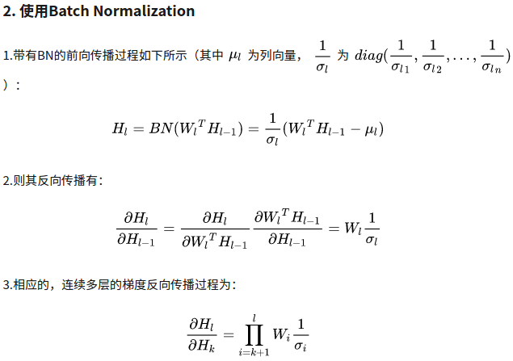

# 面试问答整理

## cv 算法
### 手写IoU
```python
import numpy as np
def iou_calculate(bbox1, bbox2):
    """
    Args:
      bbox1: (N, 4) (xmin, ymin, xmax, ymax)
      bbox2: (M, 4) np.array
    Returns:
      iou: (N,M)
    """
    area1 = (bbox1[..., 2] - bbox1[..., 0]) * (bbox1[..., 3] - bbox1[..., 1]) # (N,)
    area2 = (bbox2[..., 2] - bbox2[..., 0]) * (bbox2[..., 3] - bbox2[..., 1]) # (M,)
    lt = np.maximum(bbox1[:, np.newaxis, :2], bbox2[:, :2]) # (N, M, 2)
    rb = np.minimum(bbox1[:, np.newaxis, 2:], bbox2[:, 2:]) # (N, M, 2)
    inter = np.maximum(0, rb - lt) # (N, M, 2)
    inter_area = inter[..., 0] * inter[..., 1] # (N, M)
    union_area = area1[:, np.newaxis] + area2 - inter_area # (N, M)
    iou = inter_area / union_area
    return iou
```

### 手写NMS
```python
def nms(bboxes, iou_thresh):
    """
    Args:
      bboxes: after score. np.array. (N, 6) [xmin, ymin, xmax, ymax, score, class]
      iou_thresh: float
    Returns:
      bboxes_nms: np.array. (N', 6) [xmin, ymin, xmax, ymax, score, class]
    """
    classes = bboxes[:, 5] # (N,)
    unique_classes = set(classes)
    bboxes_nms = []
    for cls in unique_classes:
        mask = classes == cls # (N,)
        cls_bboxes = bboxes[mask] # (M, 6)
        # nms in each class
        x1, y1 = cls_bboxes[:, 0], cls_bboxes[:, 1] # (M,)
        x2, y2 = cls_bboxes[:, 2], cls_bboxes[:, 3]
        scores = cls_bboxes[:, 4] # (M,)
        areas = (x2 - x1) * (y2 - y1) # (M,)
        order = scores.argsort()[::-1] # (M,)
        keep = []
        while order.size > 0:
            i = order[0]
            keep.append(i)
            x1_max = np.maximum(x1[i], x1[order[1:]]) # (1,), (M-1,) -> (M-1,)
            y1_max = np.maximum(y1[i], y1[order[1:]])
            x2_min = np.minimum(x2[i], x2[order[1:]])
            y2_min = np.minimum(y2[i], y2[order[1:]])
            w = np.maximum(0, x2_min - x1_max) # (M-1,)
            h = np.maximum(0, y2_min - y1_max)
            inter_area = w * h # (M-1,)
            union_area = areas[i] + areas[order[1:]] - inter_area # (1,), (M-1,) -> (M-1,)
            iou = inter_area / union_area # (M-1,)
            keep_index = np.where(iou <= iou_thresh)[0]
            order = order[keep_index + 1]
        keep_bboxes = cls_bboxes[keep]
        bboxes_nms.append(keep_bboxes)
    bboxes_nms = np.vstack(bboxes_nms)
    return bboxes_nms
```

### focal loss
```python
p = torch.sigmoid(predicts)
ce_loss = torch.nn.functional.binary_cross_entropy_with_logits(predicts, targets, reduction="none")
p_t = p * targets + (1 - p) * (1 - targets)
loss = ce_loss * ((1 - p_t) ** gamma)
if alpha >= 0:
    alpha_t = alpha * targets + (1 - alpha) * (1 - targets)
    loss = alpha_t * loss
loss = loss.sum()
loss = loss / max(1, num_matched_based_anchors)
return loss
```

### Opencv 双线性插值
参考:
https://geek-docs.com/opencv/opencv-examples/bilinear-interpolation.html
双线性插值是opencv resize 默认方法,折中来说具有较好速度与图像质量.
1. 生成全黑的放大图像的矩阵
2. 查找放大图像每个点对应的原图像坐标. 设放大后图像x', y', 横纵放大率均为a, 原图像坐标为 x'/a, y'/a
3. 寻找原图像周围4领域像素点, (x,y), (x+1,y), (x,y+1), (x+1,y+1)
4. 求4个点到x'/a, y'/a距离, dx = x'/a - x, dy = y'/a - y
5. 则放大图像像素值为
$$ I'(x',y') = (1-dx)(1-dy)I(x,y) + dx(1-dy)I(x+1,y) + (1-dx)dyI(x,y+1) + dxdyI(x+1,y+1) $$

```python
import cv2
import numpy as np

def bl_interpolate(img, ax=1., ay=1.):
    H, W, C = img.shape
    aH = int(ay * H)
    aW = int(ax * W)
    # get position of resized image
    y = np.tile(np.arange(aH), (aW, 1)).transpose()
    x = np.tile(np.arange(aW), (aH, 1))
    # get position of original position
    y = (y / ay)
    x = (x / ax)
    ix = np.floor(x).astype(np.int)
    iy = np.floor(y).astype(np.int)
    ix = np.minimum(ix, W-2)
    iy = np.minimum(iy, H-2)
    # get distance
    dx = x - ix
    dy = y - iy
    dx = np.repeat(np.expand_dims(dx, axis=-1), 3, axis=-1)
    dy = np.repeat(np.expand_dims(dy, axis=-1), 3, axis=-1)
    # interpolation
    out = (1-dx) * (1-dy) * img[iy, ix] + dx * (1 - dy) * img[iy, ix+1] + \
          (1 - dx) * dy * img[iy+1, ix] + dx * dy * img[iy+1, ix+1]
    out = np.clip(out, 0, 255)
    out = out.astype(np.uint8)

    return out

img = cv2.imread("filepath").astype(np.float)
out = bl_interpolate(img, ax=1.5, ay=1.5)
cv2.imshow("result", out)
cv2.waitKey(0)
```

### 中值滤波
```python
def medianBlur(img_3c, kernel, padding_way='ZERO'):
    # kernel size need 3, 5, 7, 9....
    paddingSize = kernel // 2
    height, width, channel = img_3c.shape

    # 假设输入,如下矩阵,5x5
    # [[2 6 3 4 7]
    #  [6 1 7 1 5]
    #  [4 6 7 3 3]
    #  [3 1 8 8 6]
    #  [2 4 8 0 7]]

    # 创建用于输出的矩阵
    matOut = np.zeros((height, width, 3), dtype=img_3c.dtype)
    for c in range(channel):
        img = img_3c[:, :, c]
        matBase = np.zeros((height + paddingSize * 2, width + paddingSize * 2), dtype=img.dtype)

        # 创建一个添加了padding的矩阵,初始值为0
        # 如果kernel的大小为3,所以从5x5变成了7x7
        # [[0 0 0 0 0 0 0]
        #  [0 0 0 0 0 0 0]
        #  [0 0 0 0 0 0 0]
        #  [0 0 0 0 0 0 0]
        #  [0 0 0 0 0 0 0]
        #  [0 0 0 0 0 0 0]
        #  [0 0 0 0 0 0 0]]

        matBase[paddingSize:-paddingSize, paddingSize:-paddingSize] = img
        # 将原值写入新创建的矩阵当中
        #[[0 0 0 0 0 0 0]
        # [0 2 6 3 4 7 0]
        # [0 6 1 7 1 5 0]
        # [0 4 6 7 3 3 0]
        # [0 3 1 8 8 6 0]
        # [0 2 4 8 0 7 0]
        # [0 0 0 0 0 0 0]]

        if padding_way is 'ZERO':
            pass
        elif padding_way is 'REPLICA':
            for i in range(paddingSize):
                matBase[i, paddingSize:-paddingSize] = img[0, :]
                matBase[-(1 + i), paddingSize:-paddingSize] = img[-1, :]
                matBase[paddingSize:-paddingSize, i] = img[:, 0]
                matBase[paddingSize:-paddingSize, -(1 + i)] = img[:, -1]
                # 通过REPLICA后的矩阵,讲四个边补齐
                #[[0 2 6 3 4 7 0]
                # [2 2 6 3 4 7 7]
                # [6 6 1 7 1 5 5]
                # [4 4 6 7 3 3 3]
                # [3 3 1 8 8 6 6]
                # [2 2 4 8 0 7 7]
                # [0 2 4 8 0 7 0]]

        # 这里是遍历矩阵的每个点
        for x in range(height):
            for y in range(width):
                # 获取kernel X kernel 的内容,并转化成队并列
                line = matBase[x:x + kernel, y:y + kernel].flatten()
                # 队列排序处理.
                line = np.sort(line)
                # 取中间值赋值
                matOut[x, y, c] = line[(kernel * kernel) // 2]
    return matOut
```

### kmeans
算法流程:
1. 随机生成k个质心
while 收敛或达到最大迭代次数:
    2. 分别计算每一个样本与k个质心的距离
    3. 每个样本归类到距离最近质心
    4. 基于归类样本更新质心坐标

缺点:
质心的初始位置和数据的分布很大程度影响了算法的精准度和收敛时间。更严重的是，在某些情况下，质心会被一小簇数据“欺骗”，从而陷入到局部最优解，无法达到全局最优。

参考: https://blog.csdn.net/mottled233/java/article/details/79618968
```python
def rand_center(data, k):
    # 共k个质心，data.shape[1]是每个数据样本的维度，质心的维度应与样本的维度一致。
    centers = np.random.rand(k, data.shape[1])
    # rand随机的范围是零到一，要适用于样本的范围需要进行缩放
    # 这里使用样本在该维度的最大值作为每个维度上的缩放倍数
    scale = np.max(data, axis=0)
    centers *= scale
    return centers
# 将所有样本分组到k个质心，返回二维列表[[属于分组1的样本][属于分组2的样本]...]
def group_all(data, k, centers):
    groups = []
    for index in range(k):
        groups.append([])
    # 对每一个样本进行分组
    for sample in data:
        index = group_one(sample, centers)
        groups[index].append(sample.tolist())
    return groups
# 返回距离单个样本sample最近的质心的下标索引
def group_one(sample, centers):
    distance_vect = np.sum((sample-centers)**2, axis=1)
    return np.argmin(distance_vect)
# 根据样本分组，更新每个质心的位置
def update_centers(data, k, groups):
    centers = np.zeros((k, data.shape[1]))
    for index in range(k):
        # 对每一个分组中的数据，在不同的维度分别求均值
        centers[index] = np.mean(np.array(groups[index]), axis=0)
    return centers

def iter_diff(old_centers, new_centers):
    return np.sum(np.abs(old_centers - new_centers))

def classify(data, k, threshold, max_iter=0):
    # 随机初始化质心
    centers = rand_center(data, k)
    # 初始设定loss为无穷大
    loss = float("inf")
    # 迭代计数
    iter_count = 0

    # 当loss小于阈值，或迭代次数大于指定最大次数时终止
    while loss > threshold and ((max_iter == 0) or iter_count < max_iter):
        # 将每一个样本点分组
        groups = group_all(data, k, centers)
        # 更新质心
        old_centers = centers
        centers = update_centers(data, k, groups)
        # 计算loss
        loss = iter_diff(old_centers, centers)
        # 输出迭代信息
        iter_count += 1
        print("iter_%d : loss=%f" % (iter_count, loss))

    return centers, groups
```

yolov3 kmeans
```python
def kmeans(self, boxes, k, dist=np.median):
    """boxes: (N, 4)"""
    box_number = boxes.shape[0]
    distances = np.empty((box_number, k))
    last_nearest = np.zeros((box_number,))
    # init k clusters. replace=False no repeat element
    clusters = boxes[np.random.choice(box_number, k, replace=False)]
    while True:
        distances = 1 - self.iou(boxes, clusters) # (N, k)
        current_nearest = np.argmin(distances, axis=1) # (N,)
        # clusters won't change
        if (last_nearest == current_nearest).all():
            break  
        # update clusters
        for i in range(k):
            clusters[i] = dist(boxes[current_nearest == i], axis=0)
        last_nearest = current_nearest

    return clusters
```
### 机器学习知识点
#### 欠拟合,过拟合
- 欠拟合: 高偏差, 低方差. 增加模型复杂度, 增加训练时长
- 过拟合: 低偏差, 高方差. 数据增强, 提前结束训练, 正则化
#### SGD, Adam 区别
SGD为随机梯度下降,每一次迭代计算数据集的mini-batch的梯度,然后对参数进行跟新。
Momentum参考了动量的概念,前几次的梯度也会参与到当前的计算中,但是前几轮的梯度叠加在当前计算中会有一定的衰减。
Adagard在训练的过程中可以自动变更学习的速率,设置一个全局的学习率,而实际的学习率与以往的参数模和的开方成反比。
Adam利用梯度的一阶矩估计和二阶矩估计动态调整每个参数的学习率,使得参数更新较为平稳。

#### 向量与矩阵的欧几里得距离计算
参考: https://blog.csdn.net/Autism_/article/details/88360483
向量与向量的欧式距离

矩阵与矩阵的欧式距离

$$ C=sum(A^2,axis=1)∗ones((1,3))+ones((2,1))∗sum(B^2,axis=1)^T − 2AB^T $$

####  矩阵正定性的判断,Hessian矩阵正定性在梯度下降中的应用
若矩阵所有特征值均不小于0,则判定为半正定。若矩阵所有特征值均大于0,则判定为正定。在判断优化算法的可行性时Hessian矩阵的正定性起到了很大的作用,若Hessian正定,则函数的二阶偏导恒大于0,函数的变化率处于递增状态,在牛顿法等梯度下降的方法中,Hessian矩阵的正定性可以很容易的判断函数是否可收敛到局部或全局最优解。

#### PCA
PCA是比较常见的线性降维方法,通过线性投影将高维数据映射到低维数据中,所期望的是在投影的维度上,1.新特征自身的方差尽量大(方差越大特征越有效),2.使产生的新特征间的相关性尽量小。PCA算法的具体操作为对所有的样本进行中心化操作,计算样本的协方差矩阵,然后对协方差矩阵做特征值分解,取最大的n个特征值对应的特征向量构造投影矩阵。

#### 拟牛顿法的原理
牛顿法的收敛速度快,迭代次数少,但是Hessian矩阵很稠密时,每次迭代的计算量很大,随着数据规模增大,Hessian矩阵也会变大,需要更多的存储空间以及计算量。拟牛顿法就是在牛顿法的基础上引入了Hessian矩阵的近似矩阵,避免了每次都计算Hessian矩阵的逆,在拟牛顿法中,用Hessian矩阵的逆矩阵来代替Hessian矩阵,虽然不能像牛顿法那样保证最优化的方向,但其逆矩阵始终是正定的,因此算法始终朝最优化的方向搜索。

#### 梯度下降法和牛顿法区别
梯度下降法：利用一阶导数
牛顿法：利用二阶导数，收敛速度快；但对目标函数有严格要求，必须有连续的一、二阶偏导数，计算量大


TODO:
gpu卷积实现
卷积反向传播


### python 知识点
#### 深拷贝,浅拷贝
直接赋值：为对象取别名,两个对象的id相同. a=1, b=a
浅拷贝(copy)：拷贝父对象，不会拷贝对象的内部的子对象. 1维数组
深拷贝(deepcopy)：拷贝父对象,并递归的拷贝原对象所包含的子对象.深拷贝出来的对象与原对象没有任何关联. 2维数组

#### 进程,线程
`一个任务就是一个进程（Process）`,每个进程都拥有自己的地址空间、内存、数据栈及其它资源.多个进程可以在不同的 CPU 上运行，互不干扰同一个CPU上，可以运行多个进程，由操作系统来自动分配时间片由于进程间资源不能共享，需要进程间通信，来发送数据，接受消息等多进程，也称为“并行”。
`进程内的“子任务”称为线程（Thread）`.一个进程下可以运行多个线程，这些线程之间共享主进程内申请的操作系统资源.在一个进程中启动多个线程的时候，每个线程按照顺序执行.
`协程`的作用，是在执行函数A时，可以随时中断，去执行函数B，然后中断继续执行函数A（可以自由切换）。但这一过程并不是函数调用（没有调用语句），这一整个过程看似像多线程，然而协程只有一个线程执行.

计算密集型任务使用多进程,IO密集型任务使用多线程.

多任务的实现有3种方式：
- 多进程模式；
- 多线程模式；
- 多进程+多线程模式.

#### GIL
GIL 是python的全局解释器锁，同一进程中假如有多个线程运行，一个线程在运行python程序的时候会霸占python解释器（加了一把锁即GIL），使该进程内的其他线程无法运行，等该线程运行完后其他线程才能运行。如果线程运行过程中遇到耗时操作，则解释器锁解开，使其他线程运行。所以在多线程中，线程的运行仍是有先后顺序的，并不是同时进行。

多进程中因为每个进程都能被系统分配资源，相当于每个进程有了一个python解释器，所以多进程可以实现多个进程的同时运行，缺点是进程系统资源开销大。

#### *args, **kwargs
当我们不知道向函数传递多少参数时，比如我们向传递一个列表或元组，我们就使用*args。

```python
def func(*args):
    for i in args:
        print(i)  
    func(3,2,1,4,7)
```

在我们不知道该传递多少关键字参数时，使用**kwargs来收集关键字参数。
```python
def func(**kwargs):
    for i in kwargs:
        print(i,kwargs[i])
    func(a=1,b=2,c=7)
```

#### 装饰器
装饰器本质上是一个Python函数，它可以让其它函数在不作任何变动的情况下增加额外功能，装饰器的返回值也是一个函数对象. 比如：插入日志、性能测试、事务处理、缓存、权限校验等。有了装饰器我们就可以抽离出大量的与函数功能无关的雷同代码进行重用。装饰器其实就是一个闭包.

#### 生成器
生成器是一个返回迭代器的函数，不需要像迭代器的类一样写__iter__()和__next__()方法，只需要一个yiled关键字，每次遇到yield时函数会暂停并保存当前所有的运行信息，返回yield的值,并在下一次执行next()方法时从当前位置继续运行.

#### 迭代器
迭代器是一个可以记住遍历的位置的对象。迭代器对象从集合的第一个元素开始访问，直到所有的元素被访问完结束。迭代器只能往前不会后退。迭代器有两个基本的方法：iter() 和 next()。

#### python 内存管理
参考: https://juejin.im/post/5ca2471df265da307b2d45a3
##### 内存池机制
**内存池机制**，用于对内存的申请和释放管理。内存池的概念就是预先在内存中申请一定数量的，大小相等的内存块留作备用，当有新的内存需求时，就先从内存池中分配内存给这个需求，不够了之后再申请新的内存. 这样做最显著的优势就是能够减少内存碎片，提升效率。
##### 垃圾回收机制
**垃圾回收机制**，一是找到内存中无用的垃圾对象资源，二是清除找到的这些垃圾对象，释放内存给其他对象使用。Python 采用了`引用计数`为主,`标记清除`和`分代回收`为辅助策略。
###### 1 引用计数
`引用计数`: 每一个对象,都会有一个计数字段.当一个对象有新的引用时，它的ob_refcnt就会增加，当引用它的对象被删除，它的ob_refcnt就会减少. 一旦对象的引用计数为0，该对象立即被回收，对象占用的内存空间将被释放.
```sh
优点:
1. 简单
2. 实时性：一旦没有引用，内存就直接释放了。不用像其他机制等到特定时机。

缺点:
1. 需要额外的空间维护引用计数。
2. 不能解决对象的循环引用。(主要缺点)
```
```
>>>a = { } #对象A的引用计数为 1
>>>b = { } #对象B的引用计数为 1
>>>a['b'] = b  #B的引用计数增1
>>>b['a'] = a  #A的引用计数增1
>>>del a #A的引用减 1，最后A对象的引用为 1
>>>del b #B的引用减 1, 最后B对象的引用为 1
```

###### 2 标记清除
标记清除主要是解决循环引用问题。
标记清除算法是一种基于追踪回收（tracing GC）技术实现的垃圾回收算法。分为两个阶段：第一阶段是标记阶段，GC会把所有的活动对象打上标记，第二阶段是把那些没有标记的对象非活动对象进行回收。
那么GC又是如何判断哪些是活动对象哪些是非活动对象的呢？对象之间通过引用（指针）连在一起，构成一个有向图，对象构成这个有向图的节点，而引用关系构成这个有向图的边。从根对象（root object）出发，沿着有向边遍历对象，可达的（reachable）对象标记为活动对象，不可达的对象就是要被清除的非活动对象。根对象就是全局变量、调用栈、寄存器。

在上图中，我们把小黑圈视为全局变量，也就是把它作为root object，从小黑圈出发，对象1可直达，那么它将被标记，对象2、3可间接到达也会被标记，而4和5不可达，那么1、2、3就是活动对象，4和5是非活动对象会被GC回收。
标记清除算法作为 Python 的辅助垃圾收集技术主要处理的是容器对象(container)，比如list、dict、tuple等，因为对于字符串、数值对象是不可能造成循环引用问题。Python使用一个双向链表将这些容器对象组织起来。
Python 这种简单粗暴的标记清除算法也有明显的缺点：清除非活动的对象前它必须顺序扫描整个堆内存，哪怕只剩下小部分活动对象也要扫描所有对象。

###### 3 分代回收
分代回收是一种以空间换时间的操作方式。
Python将内存根据对象的存活时间划分为不同的集合，每个集合称为一个代，Python将内存分为了3“代”，分别为年轻代（第0代）、中年代（第1代）、老年代（第2代），他们对应的是3个链表，它们的垃圾收集频率与对象的存活时间的增大而减小。新创建的对象都会分配在年轻代，年轻代链表的总数达到上限时，Python垃圾收集机制就会被触发，把那些可以被回收的对象回收掉，而那些不会回收的对象就会被移到中年代去，依此类推，老年代中的对象是存活时间最久的对象，甚至是存活于整个系统的生命周期内。同时，分代回收是建立在标记清除技术基础之上。分代回收同样作为Python的辅助垃圾收集技术处理容器对象。

#### list 底层
参考:https://blog.csdn.net/lucky404/article/details/79596319
https://juejin.im/post/595f0de75188250d781cfd12
http://wklken.me/posts/2014/08/10/python-source-list.html
Python中的list是一个动态数组，它储存在一个连续的内存块中，随机存取的时间复杂度是O(1)，但插入和删除时会造成内存块的移动，时间复杂度是O(n)。同时，当数组中内存不够时，会重新申请一块内存空间并进行内存拷贝。
PyListObject五个属性: ob_refcnt, *obtype, ob_size, **ob_item, allocated.*
python的列表总是会被频繁的添加或者删除元素，因此频繁的申请释放内存显然是不明智的,所以python的列表在创建时总是会申请一大块内存，申请的内存大小就记录在 allocated 上, 已经使用的就记录在 ob_size.
当通过 PyObject_GC_New 创建列表之后，其实里面的元素都是null.
list 赋值 步骤
1 参数类型检查
2 索引 有效性检查 不可超出索引
3 设置元素
list insert 步骤
1 参数检查
2 从新调整列表容量 通过 list_resize 方法确定 是否需要申请内存
3 确定插入点
4 插入元素 (列表插入时 都会将后面的位置的元素重新移动)
list append 步骤
1 参数检查
2 容量检查
3 调用 list_resize 方法检查是否需要申请内存
4 添加元素

#### dict 底层实现
python字典源码(https://github.com/python/cpython/blob/master/Objects/dictobject.c, https://github.com/python/cpython/blob/master/Include/dictobject.h)
参考: https://blog.csdn.net/lucky404/article/details/79606089
哈希表，根据键（Key）直接访问在内存储存位置的数据结构
python的字典是一种哈希表，是根据关键码值(Key value)而直接进行访问的数据结构。也就是说，它通过把关键码值映射到表中一个位置来访问记录，以加快查找的速度。映射函数叫做哈希函数，存放记录的数组叫做哈希表.
在理想的状态下,不同的对象经过哈希函数计算出来的哈希值是不一样的，但是随着存储数据的增多,不同的对象经过哈希函数计算出的哈希值可能是一样的，这种情况就是哈希冲突. python 通过开放定址法（open addressing）解决哈希冲突. 原理是产生哈希冲突时, python 通过一个二次探测函数 f, 计算下一个候选位置,当下一个位置可用，则将数据插入该位置,如果不可用则再次调用探测函数 f,获得下一个候选位置，因此经过不断探测,总会找到一个可用的位置.
开放定址法存在的问题: 通过多次使用二次探测函数f，从一个位置出发就可以依次到达多个位置,我们认为这些位置形成了一个 ‘冲突探测链’ 当需要删除探测链上的某个数据时问题就产生了, 假如这条链路上的首个元素是 a 最后的元素是 c 现在需要删除 处于中间位置的 b ，这样就会导致探测链断裂, 当下一次搜索 c 时会从 a 出发 沿着链路一步步出发，但是中途的链路断了导致无法到达 c 的位置, 因此无法搜索到c
所以在采用 开放定地法解决哈希冲突的策略，删除链路上的某个元素时，不能真正的删除元素，只能进行 ‘伪删除’.
python字典的 三种状态 Unused, Active, Dummy
Unused 状态下也就是当该字典中还没有存储key 和 value 每个字典初始化时都是该状态
Active 当字典中存储了key 和 value 时状态就进入到了 Active
Dummy 当字典中的 key 和 value 被删除后字典不能从Active 直接进入 Unused 状态 否则就会出现之前提到的 冲突链路中断,实际上python进行删除字典元素时，会将key的状态改为Dummy ,这就是 python的 ‘伪删除’.

#### + 与 join 的区别
字符串是不可变对象，当用操作符+连接字符串的时候，每执行一次+都会申请一块新的内存，然后复制上一个+操作的结果和本次操作的右操作符到这块内存空间，因此用+连接字符串的时候会涉及好几次内存申请和复制。而join在连接字符串的时候，会先计算需要多大的内存存放结果，然后一次性申请所需内存并将字符串复制过去，这是为什么join的性能优于+的原因。所以在连接字符串数组的时候，我们应考虑优先使用join。
#### is 与 == 区别
- is 判断id是否相等
- == 判断值是否相等
> 1 is 1.0　False
> 1 == 1.0　True

#### type, isinstance 区别
isinstance才能用于含继承关系的判断
```
class A:
    pass
class B(A):
    pass
isinstance(A(), A)    # returns True
type(A()) == A        # returns True
isinstance(B(), A)    # returns True
type(B()) == A        # returns False
```

#### 面向对象
继承可以把父类的所有功能都直接拿过来，这样就不必重零做起，子类只需要新增自己特有的方法，也可以把父类不适合的方法覆盖重写。
对于静态语言（例如Java）来说，如果需要传入Animal类型，则传入的对象必须是Animal类型或者它的子类，否则，将无法调用run()方法。
对于Python这样的动态语言来说，则不一定需要传入Animal类型。我们只需要保证传入的对象有一个run()方法就可以了：
### 目标检测整个流程
####  
### BN 原理
参考: https://blog.csdn.net/bl128ve900/article/details/95309305
https://blog.csdn.net/qq_25737169/article/details/79048516
https://www.zhihu.com/question/38102762/answer/391649040

batchnorm 4步骤
1. 计算mini-batch内channel的均值
2. 计算mini-batch内channel的方差
3. 归一化
4. 缩放gamma, 平移beta


BN 解决的问题
一. 梯度消失,梯度爆炸




梯度的连续反向传播，是通过权重Wi的连乘进行的。因此，如果权重Wi的值总是较小的（与1相比），则在反向过程中，梯度呈指数级衰减，就出现了梯度消失的问题；反之，如果如果权重Wi总是较大，就会出现梯度爆炸的问题。

与不使用BN相比，$\frac{\partial H_l}{\partial H_k}$多了一个 $\frac{1}{\sigma_i}$, 对权重Wi进行缩放。如果权重Wi较小，则$W_l^TH_{l-1}$较小，从而使得 $\frac{1}{\sigma_i}$ 较大，所以$W_i\frac{1}{\sigma_i}$相对于原本的$W_i$就放大了，避免了梯度的衰减；同样的，如果权重$W_i$较大，$W_i\frac{1}{\sigma_i}$相对于原本的$W_i$缩小了，避免了梯度的爆炸。于是，加入了BN的反向传播过程中，就不易出现梯度消失或梯度爆炸，梯度将始终保持在一个合理的范围内。而这样带来的好处就是，基于梯度的训练过程可以更加有效的进行，即加快收敛速度，减轻梯度消失或爆炸导致的无法训练的问题。

二. 网络能力退化
平移参数β和缩放参数γ作用
bn有两个可学习参数,平移参数β和缩放参数γ,维度等于张量的通道数。这样就保证了每一次数据经过归一化后还保留有学习来的特征，同时又能完成归一化这个操作，加速训练。

三. 避免过拟合
在训练阶段引入随机性，防止过度匹配(在随机的batch上norm)；在测试阶段通过求期望等方式在全局去除掉这种随机性.

? 训练与推理时BN中的均值和方差分别是多少
训练时: 均值、方差为该batch内,数据相应channel的均值与方差.
推理时: 均值、方差是基于所有批次的期望计算所得，公式如下：

在代码实现中，使用了滑动平均，储存固定个数Batch的均值和方差，不断迭代更新推理时需要的均值mean与方差Var.


### dirtnet
#### gmm, 显著性检测
### TODO: 待整理
http://www.fenghz.xyz/telephone-meeting/

## 深度学习
#### backbone异同点
##### alexnet
2012年

- AlexNet一共包含8层，前5层由卷积层组成，而剩下的3层为全连接层。
- 网络结构分为同样的上下两层，分别对应两个GPU的操作过程.
卷积核大小 11x11 -> 5x5 -> 3x3,　后接全连接层

##### vgg16
2014年

- 整个网络都使用了同样大小的卷积核尺寸3x3
- 使用3x3的卷积组合代替大尺寸的卷积（2个3x3卷积即可与5x5卷积拥有相同的感受视野, 3个3x3的卷积层串联的效果则相当于1个7x7的卷积层。这样的连接方式使得1.网络参数量更小，2.多层激活函数令网络对特征的学习能力更强。

理论感受野计算:


##### resnet
参考: https://zhuanlan.zhihu.com/p/42833949
https://www.zhihu.com/question/64494691/answer/786270699
网络结构:
一次层是 7x7 步长 2 的 卷积下采样, 3*3 MaxPool 步长为2
Bottleneck: 先压缩再膨胀

解决的问题
1. 梯度消失
反向传播过程,一旦其中某一个导数很小，多次连乘后梯度可能越来越小，对于深层网络，传到浅层几乎就没了。但是如果使用了残差，每一个导数就加上了一个恒等项1，dh/dx=d(f+x)/dx=1+df/dx。此时就算原来的导数df/dx很小，这时候误差仍然能够有效的反向传播。
2. 网络退化
网络退化: 虽然是一个高维的矩阵，但是大部分维度却没有信息，表达能力没有看起来那么强大。
让模型的内部结构至少有恒等映射的能力。以保证在堆叠网络的过程中，网络至少不会因为继续堆叠而产生退化. 假设权重矩阵完全退化为0，则输出已经失去鉴别能力，此时加上残差连接，网络又恢复了表达能力。

##### mobilenetv2
网络结构:
一次层是 3x3 步长 2 的 卷积下采样
InvertedResidual: 先将通道膨胀6倍,再压缩


解决的问题:
和 MobileNetV1 的区别:


##### darknet53
网络结构:

##### dla32
网络结构:

#### 目标检测网络与异同点

#### 什么是梯度爆炸，什么是梯度消失，神经网络是怎么解决梯度爆炸问题的，ResNet为什么能够解决梯度消失问题？

#### 有哪些梯度下降算法，它们各有什么异同。

#### 过拟合？深度学习的过拟合如何缓解？

牛客网 机器学习 题目 https://www.nowcoder.com/ta/review-ml

#### Pooling层的作用以及如何进行反向传播
pooling层作用
1、增加非线性,也起到注意力机制的作用
2、保留主要的特征同时减少计算量(pooling层无参数)，防止过拟合，提高模型泛化能力
3、invariance(不变性)，这种不变性包括translation(平移)，rotation(旋转)，scale(尺度)

1. average pooling 把当前梯度平均分成 n 份分配给上一层
2. max pooling 将当前梯度直接传递给前一层的某个像素, 所以，max pooling和average pooling不同的是，max pooling在前向传播的时候要记录池化操作时哪个像素的值是最大的，即max_id，在反向传播中才能将其对应起来。

Spatial Pyramid Pooling（空间金字塔池化）
用大小不同的池化窗口来作用于feature map，得到1×1、2×2和4×4的池化结果
