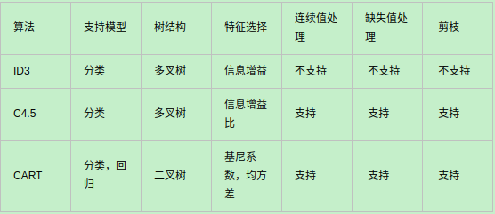

## 决策树 ID3 C4.5 CART
参考 https://www.cnblogs.com/pinard/p/6050306.html
https://www.cnblogs.com/pinard/p/6053344.html

信息熵
$$ H(c) = -\sum_{i=1}^n p(c_i) log(p(c_i)) $$

条件熵
当特征X的整体分布情况被固定时，条件熵为: H(c|X)
$$ H(c|X) = -\sum_{i=1}^n p(x_i)H(c|x=x_i) $$

$$ = -\sum_{i=1}^n  p(x_i)p(c|x=x_i) log(p(c|x=x_i)) $$

$$ = -\sum_{i=1}^n p(c,x_i) log(p(c|x=x_i)) $$

ID3 特征X的信息增益
$$ IG(c,X) = H(c) - H(c|X) $$

$$ = - \sum_{i=1}^n p(c_i) log(p(c_i)) + \sum_{i=1}^n p(c,x_i) log(p(c|x=x_i)) $$

C4.5 特征X的信息增益比
$$ g = \frac{IG(c,X)}{H(X)} = \frac{H(c) - H(c|X)}{H(X)} $$

CART 基尼系数
$$ Gini(p) = \sum_{i=1}^n p_i(1 - p_i)$$

### CART

CART分类树算法使用基尼系数来代替信息增益比，基尼系数代表了模型的不纯度，基尼系数越小，则不纯度越低，特征越好。这和信息增益是相反的。
$$ Gini(p) = \sum_{k=1}^K p_k(1 - p_k)$$

#### 建立CART分类树
算法输入是训练集D，基尼系数的阈值，样本个数阈值。输出是决策树T。
我们的算法从根节点开始，用训练集递归的建立CART分类树。
1) 对于当前节点的数据集为D，如果样本个数小于阈值或者没有特征，return。
2) 计算样本集D的基尼系数，如果基尼系数小于阈值，return。
3) 计算当前节点的各个特征对数据集D的基尼系数.
4) 在各特征对数据集D的基尼系数中，选择基尼系数最小的特征A作为最优特征，把数据集划分成两部分D1和D2至左右节点。
5) 对左右的子节点递归的调用1-4步，生成决策树。

对于生成的决策树做预测的时候，假如测试集里的样本A落到了某个叶子节点，而节点里有多个训练样本。则对于A的类别预测采用的是这个叶子节点里概率最大的类别。

#### 建立CART回归树
CART回归树和CART分类树的建立和预测的区别主要有下面两点：
1) 连续值的处理方法不同
CART分类度量目标是树采用基尼系数最小,CART回归树的度量目标是均方差之和最小。
2) 决策树建立后做预测的方式不同。
CART分类树采用叶子节点里概率最大的类别作为当前节点的预测类别。而回归树输出不是类别，它采用的是用最终叶子的均值或者中位数来预测输出结果。

#### 剪枝
决策树很容易出现的一种情况是过拟合(overfitting)，所以需要进行剪枝。而基本的策略包括两种：预剪枝(Pre-Pruning)与后剪枝(Post-Pruning)。

预剪枝：其中的核心思想就是，在每一次实际对结点进行进一步划分之前，先采用验证集的数据来验证如果划分是否能提高划分的准确性。如果不能，就把结点标记为叶结点并退出进一步划分；如果可以就继续递归生成节点。
后剪枝：后剪枝则是先从训练集生成一颗完整的决策树，然后自底向上地对非叶结点进行考察，若将该结点对应的子树替换为叶结点能带来泛化性能提升，则将该子树替换为叶结点。
参考 https://blog.csdn.net/bitcarmanlee/java/article/details/106824993
### XGBoost -> GBDT
对比原算法GBDT，XGBoost主要从下面三个方面做了优化：
1. 算法本身的优化：在算法的弱学习器模型选择上，GBDT只支持决策树，XGBoost还支持很多其他的弱学习器。在算法的优化方式上，GBDT的损失函数只对误差部分做负梯度（一阶泰勒）展开，而XGBoost损失函数对误差部分做二阶泰勒展开，更加准确。
2. 是算法运行效率的优化：XGBoost决策树建立的过程可并行，找到合适的子树分裂特征和特征值。在并行选择之前，先对所有的特征值进行排序分组，对分组的特征，选择合适的分组大小，使用CPU缓存进行读取加速。将各个分组保存到多个硬盘以提高IO速度。
3. 算法健壮性的优化：算法本身加入了L1和L2正则化项，泛化能力更强。对于缺失值的特征，通过枚举所有缺失值在当前节点是进入左子树还是右子树来决定缺失值的处理方式。

### 随机森林
bagging每次对数据集随机采样,使用一部分数据训练不同的基学习器,最后再集成起来.
随机森林使用CART作为基学习器,不同的是,RF随机选择节点上的一部分特征𝑛𝑠𝑢𝑏，然后在这些随机选择的𝑛𝑠𝑢𝑏个样本特征中，选择一个最优的特征来做决策树的左右子树划分。(nsub越小,模型方差越小,偏差越大.一般通过交叉验证调参获取合适的𝑛𝑠𝑢𝑏)
如果是分类算法预测，则T个弱学习器投出最多票数的类别或者类别之一为最终类别。如果是回归算法，T个弱学习器得到的回归结果进行算术平均得到的值为最终的模型输出。
优点:
1. 训练可以高度并行化
2. 采用随机采样，随机选取节点特征,训练出的模型的方差小，泛化能力强。
