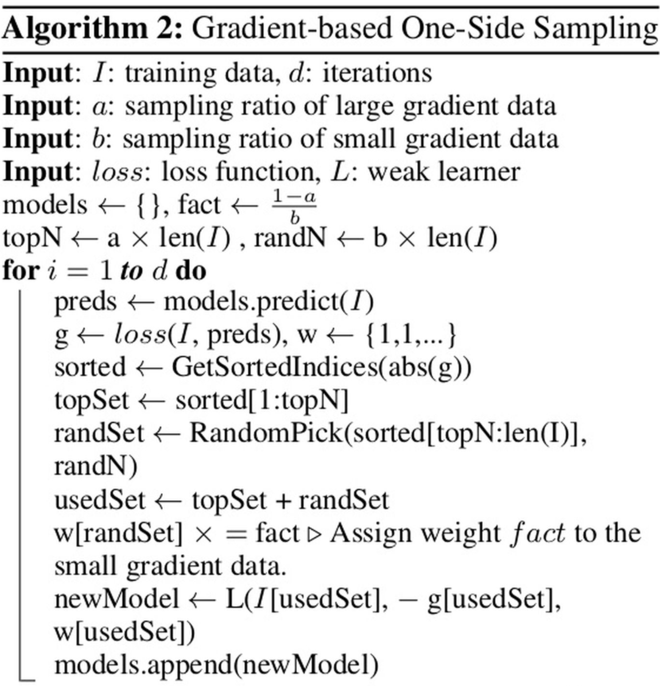

# 决策树再梳理

## lightgbm

https://zhuanlan.zhihu.com/p/38516467

#### XGB 相比 GDBT 优点
- XGB利用了二阶梯度对节点进行划分，比GDBT精度更高
- 损失函数加入了 L1/L2正则项，控制模型复杂度
- 在树节点求不同勾选分裂点时可并行
- Tree shrinkage, column/samples subsampling

#### XGB 缺点
- 需要pre-sorted,消耗内存空间 (data*feature)
- 需要对每个特征依次切分
- 由于pre-sorted, 在寻找特征分裂点时，会产生大量cache随机访问

#### LGB 相比 XGB 优点
- histogram
- GOSS采样
- EFB预处理稀疏数据

##### Gradient-based One-Side Sampling (GOSS)
梯度单边采样。
1. 选取前a%个较大梯度的值作为大梯度值的训练样本
2. 从剩余的1 - a%个较小梯度的值中，我们随机选取其中的b%个作为小梯度值的训练样本
3. 对于较小梯度的样本，也就是b% * #samples，我们在计算信息增益时将其放大(1 - a) / b倍
总的来说就是a% * #samples + b% * #samples个样本作为训练样本。 而这样的构造是为了尽可能保持与总的数据分布一致，并且保证小梯度值的样本得到训练。

##### Exclusive Feature Bundling
独立特征合并，将若干个特征合并到一起。为了解决数据稀疏问题。
