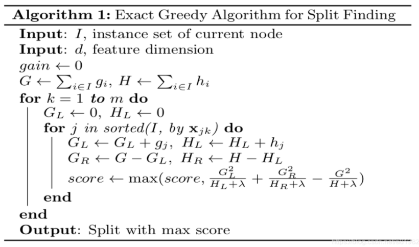
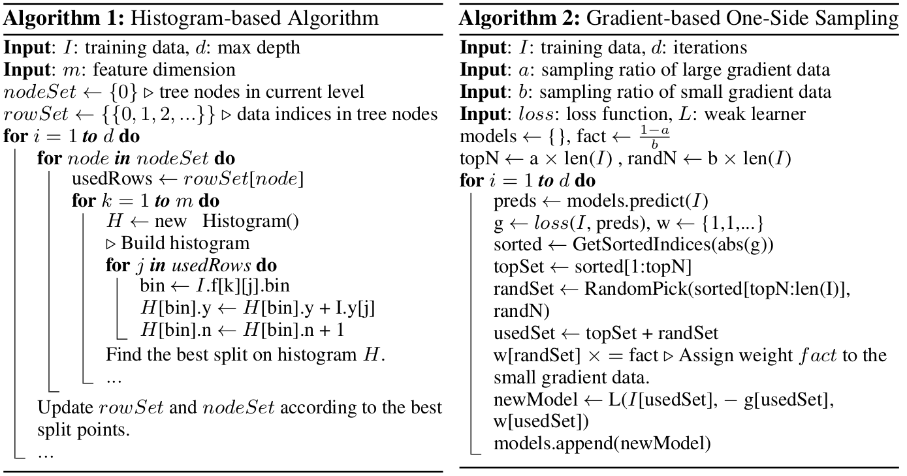
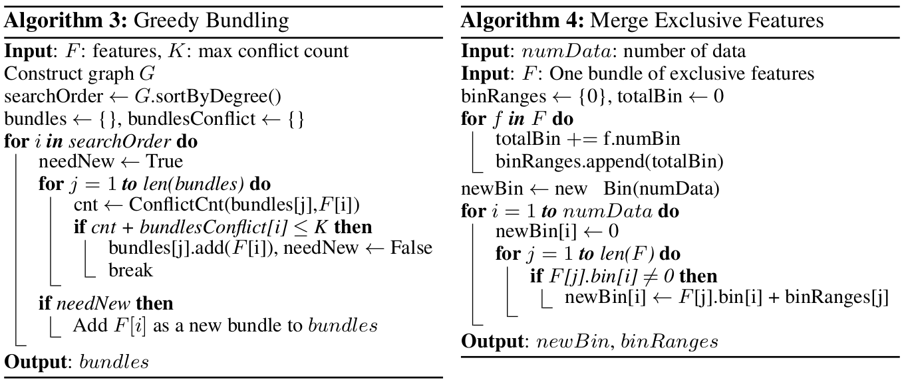

# 决策树再梳理

## GBDT 整理
https://xgboost.readthedocs.io/en/latest/tutorials/model.html

目标函数
$$ obj(\theta) = L(\theta) + \Omega(\theta) $$

基于boosting思想，最终对于样本i的打分为$\hat y_i$，其中K为树的棵树, $f_k$为映射函数
$$ \hat y_i = \sum_{k=1}^K f_k(x_i)$$

目标函数可写为
$$ obj(\theta) = \sum_i^n l(y_i, \hat y_i) + \sum_{k=1}^K \Omega(f_k) $$

基于boosting的残差优化
$$ obj = \sum_{i=1}^n l(y_i, \hat y_i^{(t)}) + \sum_{i=1}^t \Omega(f_i) $$

对于第t棵树上的输出 $\hat y_i^{(t)}$
$$ \hat y_i^{(t)} = \sum_{k=1}^t f_k(x_i) = \hat y_i^{(t-1)} + f_t(x_i) $$

因此对于当前第t棵树的优化目标即为$obj^{(t)}$
$$ obj^{(t)} = \sum_{i=1}^n l(y_i, \hat y_i^{(t-1)} + f_t(x_i)) + \Omega(f_i) $$

用泰勒展开的前两阶去拟合目标函数
$$ obj^{(t)} = \sum_{i=1}^n [l(y_i, \hat y_i^{(t-1)}) + g_i f_t(x_i) + \frac{1}{2} h_i f_t^2(x_i)] + \Omega(f_t) $$
其中$g_i$, $h_i$是一阶/二阶导
$$ g_i = \delta_{\hat y_i^{(t-1)}}   l(y_i, \hat y_i^{(t-1)}) $$
$$ h_i = \delta^2_{\hat y_i^{(t-1)}} l(y_i, \hat y_i^{(t-1)}) $$

当损失函数为MSE时，损失函数L为
$$ L(\theta) = \sum_i (y_i - \hat y_i)^2 $$
当损失函数为logloss时，损失函数L为
$$ L(\theta) = -ylogp - (1-y)log(1-p) $$
$$ L(\theta) = \sum_i[y_i ln(1+e^{-\hat y_i}) + (1-y_i)ln(1+e^{\hat y_i}))] $$

当logloss结合sigmoid时候，$g_i$, $h_i$和MSE是一样的
$$ g_i = \hat y_i - y \\
h_i = \hat y_i (1-\hat y_i) $$

$g_i$, $h_i$的计算时点是构建当前t-th树时，基于残差（前t-1棵树输出累加与样本i label的距离）得到的，在单棵树分裂过程中保持不变。

这里把 $l(y_i, \hat y_i^{(t-1)})$ 看作是常数，泰勒展开后的目标函数可写为
$$ \sum_{i=1}^n [g_i f_t(x_i) + 1/2 h_i f_t^2(x_i)] + \Omega(f_t) $$

对于正则项$\Omega(f)$的配置, 其中$w$表示叶子节点对应分数组成的向量, 维度为T, T是叶子节点的个数。

$$ \Omega(f) = \gamma T + 1/2 \gamma \sum_{j=1}^T w_j^2 $$

因此对于第t个树的目标函数可写为, 其中 $q$为把样本分配到对应叶子节点的函数, $I_j = {i | q(x_i) = j}$ 是落在 j-th 叶子节点的样本集合。第二行sum的改写，因为所有落在同一节点的样本的分数相同。

$$ obj^{(t)} = \sum_{i=1}^n [g_i f_t(x_i) + 1/2 h_i f_t^2(x_i)] + \gamma T + 1/2 \gamma \sum_{j=1}^T w_j^2 \\
= \sum^T_{j=1}[(\sum_{i \in I_j} g_i)w_j + 1/2(\sum_{i \in I_j}h_i + \lambda)w_j^2] + \gamma T $$

定义 $G_j = \sum_{i \in I_j} g_i$,  $H_j = \sum_{i \in I_j} h_i$, 目标函数可进一步改写为:
$$ obj^{(t)} = \sum_{j=1}^T [G_j w_j + 1/2 (H_j + \lambda) w_j^2] + \gamma T $$

对于 $G_j w_j + 1/2 (H_j + \lambda) w_j^2$ 是一个抛物线，最小值出现在 $w_j$ 处于 -b/(2a)的位置, 因此最佳的叶子节点j-th分数$w_j^*$ 并带入目标函数得到最小值 $obj^*$:
$$ w_j^* = -\frac{G_j}{H_j + \lambda} $$
$$ obj^* = -1/2 \sum_{j=1}^T \frac{G_j^2}{H_j + \lambda} + \lambda T $$
$obj^*$可用于衡量整棵树的结构性能, 越低越好。

因此，增益GAIN定义为对于该节点，分裂前obj-分裂后obj，如果GAIN大于0说明分裂后整体的obj变小了，分裂才是有意义的。下面式子中，第三项为分裂前 obj, 前两项为分裂后 -obj, $\gamma$为新增一个叶子节点带来的正则化成本。
$$ Gain = 1/2[\frac{G^2_L}{H_L+\lambda} + \frac{G^2_R}{H_R+\lambda} - \frac{(G_L+G_R)^2}{H_L+H_R+\lambda}] - \gamma $$

按照m个特征值从小到大提前排序，得到m个特征值下样本的索引排序顺序，存储到block中，单棵树寻找最优特征和分裂点的过程中，开多线程去找。取g,h梯度时候是按索引去寻找的，导致非连续的内存访问，CPU缓存命中率降低。可以使用预取数据到buffer中（非连续->连续），在buffer中再统计梯度信息。

除了CPU和内存，磁盘空间也可以用来存储数据，这就涉及到了IO，有两种方法可以加快IO：
- Block Compression: 块压缩，压缩后存储到磁盘，当加载到主内存后开独立线程解压。
- Block sharding: 块分片，将数据分片到多个磁盘，为每个磁盘分配一个线程，将数据提取到内存缓冲区，然后每次训练线程的时候交替地从每个缓冲区读取数据，有助于在多个磁盘可用时，增加读取的吞吐量。

核外计算：

## 比较好的参考
- [20道XGBoost面试题](https://cloud.tencent.com/developer/article/1500914)
- [XGBoost 和 LightGBM](https://cloud.tencent.com/developer/article/1534903)
- [xgb 介绍](https://blog.csdn.net/a819825294/article/details/51206410)

## lightgbm

https://zhuanlan.zhihu.com/p/38516467

#### XGB 相比 GDBT 优点
- XGB利用了二阶梯度对节点进行划分，比GDBT精度更高
- 损失函数加入了 L1/L2正则项，控制模型复杂度
- 在树节点求不同勾选分裂点时可并行
- Tree shrinkage, column/samples subsampling

#### XGB 缺点
- 需要pre-sorted,消耗内存空间 (data*feature)
- 需要对每个特征依次切分
- 由于pre-sorted, 在寻找特征分裂点时，会产生大量cache随机访问

#### LGB 相比 XGB 优点
- histogram
- GOSS采样
- EFB预处理稀疏数据

##### Gradient-based One-Side Sampling (GOSS)
梯度单边采样。
1. 选取前a%个较大梯度的值作为大梯度值的训练样本
2. 从剩余的1 - a%个较小梯度的值中，我们随机选取其中的b%个作为小梯度值的训练样本
3. 对于较小梯度的样本，也就是b% * #samples，我们在计算信息增益时将其放大(1 - a) / b倍
总的来说就是a% * #samples + b% * #samples个样本作为训练样本。 而这样的构造是为了尽可能保持与总的数据分布一致，并且保证小梯度值的样本得到训练。

##### Exclusive Feature Bundling
独立特征合并，将若干个特征合并到一起。为了解决数据稀疏问题。

