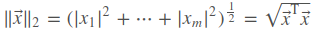
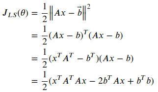
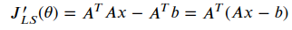
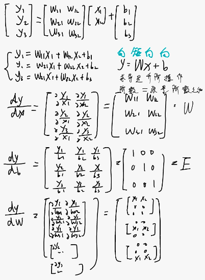
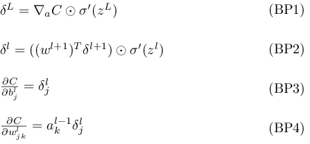
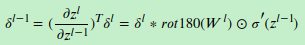
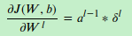
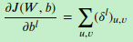
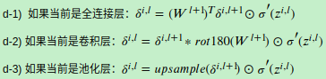
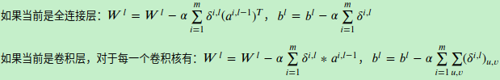

# 反向传播
## 基础知识
- 向量范数
2范数: 向量元素绝对值的平方和再开方，表示x到零点的欧式距离

求导, 假设J为损失函数:

对向量x求导得

- 矩阵求导
yx拉伸(先纵向拉伸y,在横向拉伸x)

## DNN 反向传播
参考:https://www.jianshu.com/p/d52626b39382
https://www.cnblogs.com/pinard/p/6422831.html
https://zhuanlan.zhihu.com/p/25794795

## CNN 反向传播
https://www.cnblogs.com/pinard/p/6494810.html
将卷积核翻转后和反向传播的梯度误差进行卷积，就得到了前一次的梯度误差

此时卷积核并没有反转，主要是此时是层内的求导，而不是反向传播到上一层的求导

𝛿^𝑙 是高维张量，而𝑏只是一个向量，将 𝛿^𝑙 的各个子矩阵的项分别求和，得到一个误差向量，即为𝑏的梯度

这里$a^{l-1}$不应该T转置

 
