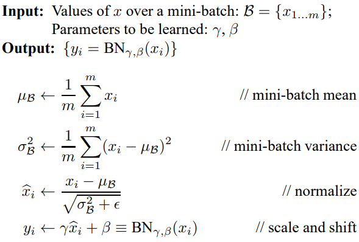
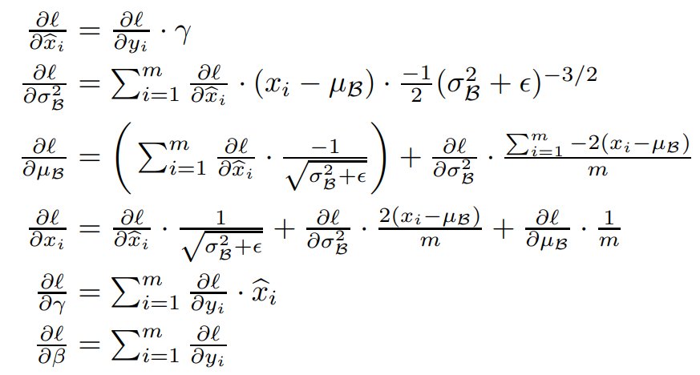

<!-- TOC titleSize:2 tabSpaces:4 depthFrom:1 depthTo:6 withLinks:1 updateOnSave:1 orderedList:0 skip:0 title:1 charForUnorderedList:* -->
## Table of Contents
* [手写算法](#)
    * [常见手写](#)
        * [手写IoU](#iou)
        * [手写NMS](#nms)
        * [focal loss](#focal-loss)
        * [yolo v3 loss](#yolo-v3-loss)
        * [手写梯度下降](#)
        * [最小二乘法](#)
        * [AUC](#auc)
        * [kmeans](#kmeans)
        * [knn python 实现](#knn-python-)
        * [Opencv 双线性插值](#opencv-)
        * [中值滤波](#)
        * [mean shift 聚类流程](#mean-shift-)
        * [计算理论感受野](#)
        * [Huffman 编码](#huffman-)
    * [神经网络各种算子实现](#)
        * [relu](#relu)
        * [batch normalization](#batch-normalization)
        * [dropout](#dropout)
        * [卷积 conv](#-conv)
        * [max pooling](#max-pooling)
        * [softmax loss](#softmax-loss)
        * [手写Adam](#adam)
        * [融合Conv和BN层](#convbn)
<!-- /TOC -->

# 手写算法
## 常见手写
### 手写IoU
```python
import numpy as np
def iou_calculate(bbox1, bbox2):
    """
    Args:
      bbox1: (N, 4) (xmin, ymin, xmax, ymax)
      bbox2: (M, 4) np.array
    Returns:
      iou: (N,M)
    """
    area1 = (bbox1[..., 2] - bbox1[..., 0]) * (bbox1[..., 3] - bbox1[..., 1]) # (N,)
    area2 = (bbox2[..., 2] - bbox2[..., 0]) * (bbox2[..., 3] - bbox2[..., 1]) # (M,)
    lt = np.maximum(bbox1[:, None, :2], bbox2[:, :2]) # (N, M, 2)
    rb = np.minimum(bbox1[:, None, 2:], bbox2[:, 2:]) # (N, M, 2)
    inter = np.maximum(0, rb - lt) # (N, M, 2)
    inter_area = inter[..., 0] * inter[..., 1] # (N, M)
    union_area = area1[:, None] + area2 - inter_area # (N, M)
    iou = inter_area / union_area
    return iou
```

### 手写NMS
大于阈值的检测框按置信度从大到小排序
while 剩余检测框非空：
    1. 把当前置信度最大的检测框加入keep
    2. 计算其他检测框与当前置信度最大检测框的iou
    3. 只保留iou小于阈值的检测框

与soft nms区别：
NMS删除IOU大于阈值的其他检测框，而Soft-NMS通过iou得到权重，来降低其他检测框原有的置信度。对于有重叠的框，iou越大，置信度衰减越严重。
```python
def nms(bboxes, iou_thresh):
    """
    Args:
      bboxes: after score. np.array. (N, 6) [xmin, ymin, xmax, ymax, score, class]
      iou_thresh: float
    Returns:
      bboxes_nms: np.array. (N', 6) [xmin, ymin, xmax, ymax, score, class]
    """
    classes = bboxes[:, 5] # (N,)
    unique_classes = set(classes)
    bboxes_nms = []
    for cls in unique_classes:
        mask = classes == cls # (N,)
        cls_bboxes = bboxes[mask] # (M, 6)
        # nms in each class
        x1, y1 = cls_bboxes[:, 0], cls_bboxes[:, 1] # (M,)
        x2, y2 = cls_bboxes[:, 2], cls_bboxes[:, 3]
        scores = cls_bboxes[:, 4] # (M,)
        areas = (x2 - x1) * (y2 - y1) # (M,)
        order = scores.argsort()[::-1] # (M,)
        keep = []
        while order.size > 0:
            i = order[0]
            keep.append(i)
            x1_max = np.maximum(x1[i], x1[order[1:]]) # (1,), (M-1,) -> (M-1,)
            y1_max = np.maximum(y1[i], y1[order[1:]])
            x2_min = np.minimum(x2[i], x2[order[1:]])
            y2_min = np.minimum(y2[i], y2[order[1:]])
            w = np.maximum(0, x2_min - x1_max) # (M-1,)
            h = np.maximum(0, y2_min - y1_max)
            inter_area = w * h # (M-1,)
            union_area = areas[i] + areas[order[1:]] - inter_area # (1,), (M-1,) -> (M-1,)
            iou = inter_area / union_area # (M-1,)
            keep_index = np.where(iou <= iou_thresh)[0]
            order = order[keep_index + 1]
        keep_bboxes = cls_bboxes[keep]
        bboxes_nms.append(keep_bboxes)
    bboxes_nms = np.vstack(bboxes_nms)
    return bboxes_nms
```

### focal loss
$$ \text{FL}(p_t) = -a_t(1-p_t)^\gamma log(p_t) $$
p_t = p if y == 1 else (1-p)
由于正负样本数目间悬殊的差距，会造成训练初期不稳定，focal loss提出网络权重初始化的问题，让模型训练初期正样本的预测更少，负样本的更多，获得一个更稳定更小的初期的训练loss。网络class head最后一层的bias被设置成 $ -log((1-\pi)/\pi) $, 其中$\pi=0.01$。 其他层（backbone除外），被设置为均值0，方差0.01
```python
torch.nn.init.normal_(layer.weight, mean=0, std=0.01)
torch.nn.init.constant_(layer.bias, 0)
```
```python
p = torch.sigmoid(predicts)
ce_loss = torch.nn.functional.binary_cross_entropy_with_logits(predicts, targets, reduction="none")
p_t = p * targets + (1 - p) * (1 - targets)
loss = ce_loss * ((1 - p_t) ** gamma)
if alpha >= 0:
    alpha_t = alpha * targets + (1 - alpha) * (1 - targets)
    loss = alpha_t * loss
loss = loss.sum()
loss = loss / max(1, num_matched_based_anchors)
return loss
```

### yolo v3 loss
```python
xy_loss = object_mask * box_loss_scale * K.binary_crossentropy(raw_true_xy, raw_pred[...,0:2], from_logits=True)
wh_loss = object_mask * box_loss_scale * 0.5 * K.square(raw_true_wh-raw_pred[...,2:4])
confidence_loss = object_mask * K.binary_crossentropy(object_mask, raw_pred[...,4:5], from_logits=True) + \
    (1-object_mask) * K.binary_crossentropy(object_mask, raw_pred[...,4:5], from_logits=True) * ignore_mask
class_loss = object_mask * K.binary_crossentropy(true_class_probs, raw_pred[...,5:], from_logits=True)
loss = xy_loss + wh_loss + confidence_loss + class_loss
```

### 手写梯度下降
当损失函数为MSE / logloss+sigmoid时：
对特征X求偏导为 $X^T (f(X)-Y)$
(如果有偏置项)对b求偏导为$(f(X)-Y)$
```python
""" 假设有m张图片, 展开后有n个特征向量, 逻辑归回 """
import numpy as np
def prepare_data(batch):
    X = np.zeros((m, n))
    for i in range(m):
        img = cv2.imread(paths[batch][i])
        img = norm(preprocess(img))
        X[i] = img.reshape(-1) # (n,)
    Y = np.ones((m, 1))
    return X, Y

def sigmoid(z):
    return 1 / (1 + np.exp(-z) + 1e-6)

def logit_loss(pred, target, m):
    loss = -target*np.log(pred) - (1-target)*np.log(1-pred)
    return np.sum(loss) / m

def mse_loss(pred, target):
    delta = pred - target
    return np.dot(delta.transpose(), delta) / 2

def forward(X, W):
    """ X (m,n) W (n,1) """
    return np.dot(X, W) + b

def backward(X, A, Y):
    delta = A - Y # (m, 1)
    dW = np.dot(X.transpose(), delta) / m # (n,1)
    db = np.sum(delta) / m                # (1,)
    return dW, db

W = np.random.rand(n, 1)
b = 0
end_loss = 1e-6
for i in range(iteration):
    X, Y = prepare_data(i) # X (m, n), Y (m, 1)
    A = forward(X, W, b) # (m, 1)
    A = sigmoid(A)
    loss = logit_loss(A, Y, m)
    if loss < end_loss:
        break
    dW, db = backward(X, A, Y, m) # (n, 1)
    W = W - lr * dW
    b = b - lr * db
```

### 最小二乘法
假设使用MSE作为损失函数，m个样本，特征维度n
$$ L(a0,a1,...,an) = 1/(2m) \sum_{j=1}^m(f(x0^j,x1^j,...,xn^j) - y^j)^2 $$

f(X)为(m,1)向量，a为(n+1,1)向量，X为(m,n+1)维矩阵，多出来的1是常数项
$$ f(X) = Xa $$

$$ L = 1/2 (Xa-Y)^T(Xa-Y) $$

根据最小二乘法，对损失函数L对a向量求导取0
$$ \frac{\partial L(a)}{\partial a} = X^T(Xa-Y) = 0$$

整理可得
$$ a = (X^T X)^{-1} X^T Y $$

### AUC
ROC曲线: X轴-FPR(false positive rate)，Y轴-TPR(true positive rate)
TPR：在所有实际为阳性的样本中，被正确地判断为阳性之比率。
TPR = TP / (TP + FN)
FPR：在所有实际为阴性的样本中，被错误地判断为阳性之比率。
FPR = FP / (FP + TN)

设置阈值来得到混淆矩阵，不同的阈值会影响得到的TPRate，FPRate，如果阈值取0.5，小于0.5的为0，否则为1。依次使用所有预测值作为阈值，得到一系列TPRate，FPRate，描点，求面积，即可得到AUC。

AUC: 若随机抽取一个阳性样本和一个阴性样本，分类器正样本的预测概率大于负样本的预测概率之几率.
AUC的计算方法同时考虑了分类器对于正例和负例的分类能力，在样本不平衡的情况下，依然能够对分类器作出合理的评价。
mAP受正负样本分布影响明显, AUC几乎不变.
但是在某些场景下，我们会更关注正样本，这时候就要用到 PR 曲线了。例如, 提高二分类的 threshold 就能提高 precision，降低 threshold 就能提高 recall，这时便可观察 PR 曲线，得到最优的 threshold。
```python
def AUC(label, pre):
    # label = [1,0,0,0,1,0,1,0]
    # pre = [0.9, 0.8, 0.3, 0.1, 0.4, 0.9, 0.66, 0.7]
    pos = [i for i in range(len(label)) if label[i] == 1]
    neg = [i for i in range(len(label)) if label[i] == 0]
    auc = 0
    # AUC的含义就是所有穷举所有的正负样本对，
    # 如果正样本的预测概率大于负样本的预测概率，+１
    # 如果正样本的预测概率等于负样本的预测概率，+0.5
    # 如果正样本的预测概率小于负样本的预测概率，+0
    for i in pos:
        for j in neg:
            if pre[i] > pre[j]:
                auc += 1
            elif pre[i] == pre[j]:
                auc += 0.5

    return auc / (len(pos)*len(neg))
```

### kmeans
算法流程:
1. 随机生成k个质心
while 收敛或达到最大迭代次数:
    2. 分别计算每一个样本与k个质心的距离
    3. 每个样本归类到距离最近质心
    4. 基于归类样本更新质心坐标

缺点:
质心的初始位置和数据的分布很大程度影响了算法的精准度和收敛时间。更严重的是，在某些情况下，质心会被一小簇数据“欺骗”，从而陷入到局部最优解，无法达到全局最优。
```python
import numpy as np

def dist(X, centers):
    # (k, n, m) -> (k, n)
    return np.mean(X[None, :, :] - centers, axis=2)

def kmeans(k, X):
    """
    :param k: int
    :param X: shape (n, m)
    :return:  shape (k, m) centers
    """
    n, m = X.shape
    centers = X[np.random.choice(n, k), :]
    prev_cls = np.zeros((n,))
    max_iter = 1000000
    iter = 0
    while iter < max_iter:
        distance = dist(X, centers) # (k, n)
        curr_cls = distance.argmin(axis=0) # (n,)
        if (curr_cls == prev_cls).all():
            break
        for i in range(k):
            centers[i, :] = np.mean(X[curr_cls == i, :], axis=0) # (m, )
        prev_cls = curr_cls
        iter += 1
    return centers
```

yolov3 kmeans
```python
def kmeans(self, X, k, dist=np.median):
    """X: (n, 4) bboxes"""
    n = len(X)
    prev_cls = np.zeros((n,))
    # init k centers. replace=False no repeat element
    centers = X[np.random.choice(n, k, replace=False)] # (k, 4)
    while True:
        # distances = np.sqrt(np.sum((X[:,None,:]-centers[:,None,:])**2, axis=-1)) # (n, k)
        distances = 1 - self.iou(X, centers) # (n, k)
        curr_cls = np.argmin(distances, axis=1) # (n,)
        # centers won't change
        if (prev_cls == curr_cls).all():
            break
        # update centers coordinates
        for i in range(k):
            centers[i] = dist(X[curr_cls == i], axis=0)
        prev_cls = curr_cls

    return centers
```

### knn python 实现
```python
def knn_np(sample, dataset, k):
    """ sample.shape (1, m), dataset.shape (n, m) """
    dists = (dataset - sample) ** 2 # (n, m)
    dists = np.sum(dists, axis=1)
    order = np.argsort(dists)
    return order[:k]

def knn(sample, dataset, k):
    """ dataset.shape (n, m) n个样本每个样本m个特征 """
    n = len(dataset)
    if n == 0:
        return None
    m = len(dataset[0])
    if m == 0:
        return None
    def distance(sample1, sample2):
        dist = 0
        for j in range(m):
            dist += (sample1[j] - sample2[j])**2
        return dist
    dists = []
    for i in range(n):
        dist = distance(sample, dataset[i])
        dists.append((i, dist))
    dists = sorted(dists, key=lambda ele:ele[1])
    matches = []
    for i in range(k):
        matches.append(dists[i])
    return matches


if __name__ == '__main__':
    dataset = [[1,1,1],[2,2,2],[3,3,3],[4,4,4]]
    sample = [2,2,3]
    matches = knn(sample, dataset, 2)
    print(matches)
```

### Opencv 双线性插值
参考:
https://geek-docs.com/opencv/opencv-examples/bilinear-interpolation.html
双线性插值是opencv resize 默认方法,折中来说具有较好速度与图像质量.
1. 生成全黑的放大图像的矩阵
2. 查找放大图像每个点对应的原图像坐标. 设放大后图像x', y', 横纵轴放大率均为a, 原图像坐标为 x'/a, y'/a
3. 寻找原图像周围4领域像素点, (x,y), (x+1,y), (x,y+1), (x+1,y+1)
4. 求4个点到x'/a, y'/a距离, dx = x'/a - x, dy = y'/a - y
5. 则放大图像像素值为
$$ I'(x',y') = (1-dx)(1-dy)I(x,y) + dx(1-dy)I(x+1,y) + (1-dx)dyI(x,y+1) + dxdyI(x+1,y+1) $$

```python
import cv2
import numpy as np

def bl_interpolate(img, ax=1., ay=1.):
    H, W, C = img.shape
    aH = int(ay * H)
    aW = int(ax * W)
    # get position of resized image
    y = np.tile(np.arange(aH), (aW, 1)).transpose()
    x = np.tile(np.arange(aW), (aH, 1))
    # get position of original position
    y = (y / ay)
    x = (x / ax)
    ix = np.floor(x).astype(np.int)
    iy = np.floor(y).astype(np.int)
    ix = np.minimum(ix, W-2)
    iy = np.minimum(iy, H-2)
    # get distance
    dx = x - ix
    dy = y - iy
    dx = np.repeat(np.expand_dims(dx, axis=-1), 3, axis=-1)
    dy = np.repeat(np.expand_dims(dy, axis=-1), 3, axis=-1)
    # interpolation
    out = (1-dx) * (1-dy) * img[iy, ix] + dx * (1 - dy) * img[iy, ix+1] + \
          (1 - dx) * dy * img[iy+1, ix] + dx * dy * img[iy+1, ix+1]
    out = np.clip(out, 0, 255)
    out = out.astype(np.uint8)

    return out

img = cv2.imread("filepath").astype(np.float)
out = bl_interpolate(img, ax=1.5, ay=1.5)
cv2.imshow("result", out)
cv2.waitKey(0)
```

### 中值滤波
```python
def medianBlur(img_3c, kernel, padding_way='ZERO'):
    # kernel size need 3, 5, 7, 9....
    paddingSize = kernel // 2
    height, width, channel = img_3c.shape

    # 假设输入,如下矩阵,5x5
    # [[2 6 3 4 7]
    #  [6 1 7 1 5]
    #  [4 6 7 3 3]
    #  [3 1 8 8 6]
    #  [2 4 8 0 7]]

    # 创建用于输出的矩阵
    matOut = np.zeros((height, width, 3), dtype=img_3c.dtype)
    for c in range(channel):
        img = img_3c[:, :, c]
        matBase = np.zeros((height + paddingSize * 2, width + paddingSize * 2), dtype=img.dtype)

        # 创建一个添加了padding的矩阵,初始值为0
        # 如果kernel的大小为3,所以从5x5变成了7x7
        # [[0 0 0 0 0 0 0]
        #  [0 0 0 0 0 0 0]
        #  [0 0 0 0 0 0 0]
        #  [0 0 0 0 0 0 0]
        #  [0 0 0 0 0 0 0]
        #  [0 0 0 0 0 0 0]
        #  [0 0 0 0 0 0 0]]

        matBase[paddingSize:-paddingSize, paddingSize:-paddingSize] = img
        # 将原值写入新创建的矩阵当中
        #[[0 0 0 0 0 0 0]
        # [0 2 6 3 4 7 0]
        # [0 6 1 7 1 5 0]
        # [0 4 6 7 3 3 0]
        # [0 3 1 8 8 6 0]
        # [0 2 4 8 0 7 0]
        # [0 0 0 0 0 0 0]]

        if padding_way is 'ZERO':
            pass
        elif padding_way is 'REPLICA':
            for i in range(paddingSize):
                matBase[i, paddingSize:-paddingSize] = img[0, :]
                matBase[-(1 + i), paddingSize:-paddingSize] = img[-1, :]
                matBase[paddingSize:-paddingSize, i] = img[:, 0]
                matBase[paddingSize:-paddingSize, -(1 + i)] = img[:, -1]
                # 通过REPLICA后的矩阵,讲四个边补齐
                #[[0 2 6 3 4 7 0]
                # [2 2 6 3 4 7 7]
                # [6 6 1 7 1 5 5]
                # [4 4 6 7 3 3 3]
                # [3 3 1 8 8 6 6]
                # [2 2 4 8 0 7 7]
                # [0 2 4 8 0 7 0]]

        # 这里是遍历矩阵的每个点
        for x in range(height):
            for y in range(width):
                # 获取kernel X kernel 的内容,并转化成队并列
                line = matBase[x:x + kernel, y:y + kernel].flatten()
                # 队列排序处理.
                line = np.sort(line)
                # 取中间值赋值
                matOut[x, y, c] = line[(kernel * kernel) // 2]
    return matOut
```


### mean shift 聚类流程
mean shift就是沿着密度上升的方向寻找同属一个簇的数据点。图像分割、图像跟踪，需要加入核函数。
1. 在未被标记的数据点中随机选择一个点作为中心center；
2. 找出离center距离在bandwidth之内的所有点，记做集合M，认为这些点属于簇c。同时，把这些求内点属于这个类的概率加1，这个参数将用于最后步骤的分类
3. 以center为中心点，计算从center开始到集合M中每个元素的向量，将这些向量相加，得到向量shift。
4. center = center+shift。即center沿着shift的方向移动，移动距离是||shift||。
5. 重复步骤2、3、4，直到shift的大小很小（就是迭代到收敛），记住此时的center。注意，这个迭代过程中遇到的点都应该归类到簇c。
6. 如果收敛时当前簇c的center与其它已经存在的簇c2中心的距离小于阈值，那么把c2和c合并。否则，把c作为新的聚类，增加1类。
6. 重复1、2、3、4、5直到所有的点都被标记访问。
7. 分类：根据每个类，对每个点的访问频率，取访问频率最大的那个类，作为当前点集的所属类。

https://github.com/zziz/mean-shift
https://nicehuster.github.io/2019/08/05/shift/

### 计算理论感受野
```python
RF = 1
for layer in （top layer To down layer）: 　　　　
    RF = ((RF - 1)* stride) + k
```

### Huffman 编码

- 是一种文件，图像无损压缩的方法。
- 核心思想：出现频次较多的符号使用较短的编码，出现频次较少的符号使用较长的编码

算法流程
1. 统计符号出现频率
2. 根据频率建立小顶堆(基于频率)，存储HeapNode
3. 依次heappop()出当前堆中最小的两个Node合并，建立二叉树
4. 为二叉树每个节点01编码，左边为0，右边为1

以如下字符串为例，从下往上基于频率合并节点，建立得到二叉树如图，父节点的值为左右子节点的和。左节点编码为0，右节点为1，右节点大于左节点。
```
sample = "A"*40+"B"*20+"C"*16+"D"*11+"E"*7+"F"*4+"G"*2
```


```python
import heapq
from typing import Dict

class HuffmanCoding():
    def __init__(self):
        self.heap = []
        self.char2coding = {}
        self.coding2char = {}

    def freqence_calculate(self, compressed_str: str):
        """O(n)"""
        freq = {}
        for char in compressed_str:
            freq[char] = 1 if char not in freq else freq[char]+1
        return freq

    def build_heap(self, freq: Dict[str,int]):
        """O(n)"""
        for key in freq:
            node = HeapNode(key, freq[key])
            heapq.heappush(self.heap, node)

    def merge_nodes(self):
        """O(nlogn)"""
        while len(self.heap) > 1:
            node1 = heapq.heappop(self.heap)
            node2 = heapq.heappop(self.heap)
            merge_node = HeapNode(None, node1.freq+node2.freq)
            merge_node.left = node1
            merge_node.right = node2
            heapq.heappush(self.heap, merge_node)

    def encoding(self):
        def helper(node, coding):
            if node == None:
                return
            if node.char != None:
                self.char2coding[node.char] = coding
                self.coding2char[coding] = node.char
            helper(node.left, coding+"0")
            helper(node.right, coding+"1")

        root = heapq.heappop(self.heap)
        helper(root, "")


class HeapNode():
    def __init__(self, char, freq):
        self.char = char
        self.freq = freq
        self.left = None
        self.right = None

    def __lt__(self, other):
        """for comparison in heaq push and pop"""
        return self.freq < other.freq


if __name__ == "__main__":
    sample = "A"*40+"B"*20+"C"*16+"D"*11+"E"*7+"F"*4+"G"*2
    huffman_coding = HuffmanCoding()
    freq = huffman_coding.freqence_calculate(sample)
    huffman_coding.build_heap(freq)
    huffman_coding.merge_nodes()
    huffman_coding.encoding()

    size_cnt = 0
    for key in sorted(huffman_coding.char2coding.keys()):
        code = huffman_coding.char2coding[key]
        print("{}: {}".format(key, code))
        size_cnt += freq[key] * len(code)

    print("before compress: {}".format(len(sample)*(len(bin(len(freq)))-2)))
    print("after compress: {}".format(size_cnt))
```

## 神经网络各种算子实现
参考：https://github.com/Halfish/cs231n/blob/master/assignment2/cs231n/layers.py

### relu
```python
def relu_forward(x):
    """
    x: inputs
    out: output
    cache: x
    """
    out = np.maximum(0, x)
    cache = x
    return out, cache

def relu_backward(dout, cache):
    """
    dout: 上游传来的导数
    cache: input 该层的输入
    """
    x = cache
    dx = dout * (x > 0)
    return dx
```

### batch normalization



```python
def batchnorm_forward(x, gamma, beta, bn_param):
    """
    x.shape (N, D) N个samples，D维特征
    gamma.shape (D,)
    beta.shape (D,)
    bn_param:
      - mode: 'train' or 'test'
      - eps: Constant for numeric stability
      - momentum: Constant for running mean / variance
      - running_mean: Array of shape (D,) giving running mean of features
      - running_var:  Array of shape (D,) giving running variance of features

    out.shape (N, D)
    cache, tuple values needed in backward
    """
    mode = bn_param['mode']
    eps = bn_param['eps']
    momentum = bn_param['momentum']
    N, D = x.shape
    running_mean = bn_param.get('running_mean', np.zeros(D, dtype=x.dtype))
    running_var = bn_param.get('running_var', np.zeros(D, dtype=x.dtype))

    out, cache = None, None
    if mode == 'train':
        sample_mean = np.mean(x, axis=0) # (D,)
        sample_var = np.var(x, axis=0) # (D,)
        x_hat = (x - sample_mean) / np.sqrt(sample_var + eps)
        out = gamma * x_hat + beta
        cache = (x, gamma, beta, x_hat, sample_mean, sample_var, eps)
        running_mean = momentum * running_mean + (1 - momentum) * sample_mean
        runing_var = momentum * running_var + (1 - momentum) * sample_var
    else:
        x_hat = (x - running_mean) / np.sqrt(running_var)
        out = gamma * x_hat + beta
    bn_param['running_mean'] = running_mean
    bn_param['running_var'] = running_var

    return out, cache
```



```python
def batchnorm_backward(dout, cache):
  """
  Inputs:
  - dout: Upstream derivatives, of shape (N, D)
  - cache: Variable of intermediates from batchnorm_forward.
  Returns a tuple of:
  - dx: Gradient with respect to inputs x, of shape (N, D)
  - dgamma: Gradient with respect to scale parameter gamma, of shape (D,)
  - dbeta: Gradient with respect to shift parameter beta, of shape (D,)
  """
  dx, dgamma, dbeta = None, None, None
  x, gamma, beta, x_hat, sample_mean, sample_var, eps = cache
  m = dout.shape[0] # m is N here
  dxhat = dout * gamma # (N, D)
  dvar = (dxhat * (x-sample_mean) * (-0.5) * np.power(sample_var+eps, -1.5)).sum(axis = 0)  # (D,)
  dmean = np.sum(dxhat * (-1) * np.power(sample_var + eps, -0.5), axis = 0)
  dmean += dvar * np.sum(-2 * (x - sample_mean), axis = 0) / m
  dx = dxhat * np.power(sample_var + eps, -0.5) + dvar*2*(x - sample_mean) / m + dmean / m
  dgamma = np.sum(dout * x_hat, axis = 0)
  dbeta = np.sum(dout, axis = 0)

  return dx, dgamma, dbeta
```

### dropout
```python
def dropout_forward(x, dropout_param):
    p = dropout_param['p'] # drop out ratio
    mode = dropout_param['mode'] # 'train' or 'test'
    np.random.seed(dropout_param.get('seed', 0))
    mask, out = None, None
    if mode == 'train':
        mask = np.random.rand(x.shape) < (1-p)
        mask = mask / (1-p)
        out = mask * x
    else:
        out = x
    cache = (dropout_param, mask)
    out = out.astype(x.dtype, copy=False)
    return out, cache

def dropout_backward(dout, cache):
    """
    Inputs:
    - dout: Upstream derivatives, of any shape
    - cache: (dropout_param, mask) from dropout_forward.
    """
    dropout_param, mask = cache
    mode = dropout_param['mode']
    dx = None
    if mode == 'train':
        dx = dout * mask
    else:
        dx = dout
    return dx
```

### 卷积 conv
简单实现
```python
def conv_forward(feature, filter, bias, conv_param):
    """
    :param feature: input batch image feature map, shape (batch, img_h, img_w, channel)
    :param filter:  implemented filter, shape (filter_num, filter_h, filter_w, filter_channel)
    :param bias: biases, shape (filter_num)
    :param conv_param: dictionary which contains 'pad', 'stride', ...
    :return: output feature map
    """
    batch, feature_h, feature_w, channel = feature.shape
    filter_num, filter_h, filter_w, filter_channel = filter.shape
    pad = conv_param['pad']
    stride = conv_param['stride']
    feature_pad = np.pad(x, ((0,0), (0,0), (pad,pad),(pad,pad)), 'constant')
    feature_out_h = 1 + (feature_h + 2 * pad - filter_h) // stride)
    feature_out_w = 1 + (feature_w + 2 * pad - filter_w) // stride)
    feature_out = np.zeros((batch, filter_num, feature_out_h, feature_out_w))

    for b in range(barch):
        for f in range(filter_num):
            for i in range(feature_out_h):
                for j in range(feature_out_w):
                    feature_window = feature_pad[b, :, i*stride:i*stride+filter_h, j*stride:j*stride+filter_w].reshape(1, -1)
                    filter_vector = filter[f].reshape(-1, 1)
                    feature_out[b, f, i, j] = feature_window.dot(filter_vector) + bias[f]
    cache = (feature, filter, bias, conv_param)
    return feature_out, cache
```

优化版本
```python  
feature_ori = np.zeros((Ho, Wo, 3))
feature = np.zeros((Ho+2*p, Wo+2*p, 3))
feature[p:-p, p:-p, :] = feature_ori
matrix = np.zeros((Ho*Wo, Ci*k*k))
row = 0
for i in range(Ho):
    for j in range(Wo):
        window = feature[i*s:i*s+k, j*s:j*s+k, :].reshape(-1)
        matrix[row] = window
filters = filters.transpose()# (Ci*k*k, Co)
output = np.dot(matrix, filters) # (Ho*Wo, Co)
output = output.reshape(Ho, Wo, Co)
```

卷积反向传播
```python
def conv_backward_naive(dout, cache):
    """
    A naive implementation of the backward pass for a convolutional layer.
    Inputs:
    - dout: Upstream derivatives.
    - cache: A tuple of (x, w, b, conv_param) as in conv_forward_naive
    Returns a tuple of:
    - dx: Gradient with respect to x
    - dw: Gradient with respect to w
    - db: Gradient with respect to b
    """

    x, w, b, conv_param = cache

    N, C, H, W = x.shape
    F, _, HH, WW = w.shape
    stride, pad = conv_param['stride'], conv_param['pad']
    H_out = 1 + (H + 2 * pad - HH) / stride
    W_out = 1 + (W + 2 * pad - WW) / stride

    x_pad = np.pad(x, ((0,), (0,), (pad,), (pad,)), mode='constant', constant_values=0)
    dx = np.zeros_like(x)
    dx_pad = np.zeros_like(x_pad)
    dw = np.zeros_like(w)
    db = np.zeros_like(b)

    db = np.sum(dout, axis = (0,2,3))

    x_pad = np.pad(x, ((0,), (0,), (pad,), (pad,)), mode='constant', constant_values=0)
    for i in range(H_out):
      for j in range(W_out):
          x_pad_masked = x_pad[:, :, i*stride:i*stride+HH, j*stride:j*stride+WW]
          for k in range(F): #compute dw
              dw[k ,: ,: ,:] += np.sum(x_pad_masked * (dout[:, k, i, j])[:, None, None, None], axis=0)
          for n in range(N): #compute dx_pad
              dx_pad[n, :, i*stride:i*stride+HH, j*stride:j*stride+WW] += np.sum((w[:, :, :, :] *
                                                 (dout[n, :, i, j])[:,None ,None, None]), axis=0)
    dx = dx_pad[:,:,pad:-pad,pad:-pad]
    return dx, dw, db
```

### max pooling
每次取池化窗口取max写入out
```python
def max_pool_forward(x, pool_param):
    """
    Inputs:
    - x: Input data, of shape (N, C, H, W)
    - pool_param: dictionary with the following keys:
    - 'pool_height': The height of each pooling region
    - 'pool_width': The width of each pooling region
    - 'stride': The distance between adjacent pooling regions
    Returns a tuple of:
    - out: Output data
    - cache: (x, pool_param)
    """
    N, C, H, W = x.shape
    pool_height, pool_width = pool_param['pool_height'], pool_param['pool_width']
    stride = pool_param['stride']
    out_height = H // pool_height
    out_width = W // pool_width
    out = np.zeros((N, C, out_height, out_width))
    for i in range(out_height):
        for j in range(out_width):
            mask = x[:, :, i*stride:i*stride+pool_height, j*stride:j*stride+pool_width]
            out[:, :, i, j] = np.max(mask, axis=(2,3))
    cache = (x, pool_param)
    return out, cache
```
```python
def max_pool_backward(dout, cache):
    """
    Inputs:
    - dout: Upstream derivatives
    - cache: A tuple of (x, pool_param) as in the forward pass.
    Returns:
    - dx: Gradient with respect to x
    """
    x, pool_param = cache
    N, C, H, W = x.shape
    pool_height, pool_width = pool_param['pool_height'], pool_param['pool_width']
    stride = pool_param['stride']
    dx = np.zeros_like(x)
    out_height = H // pool_height
    out_width = W // pool_width
    for i in range(out_height):
        for j in range(out_width):
            x_mask = x[:, :, i*stride:i*stride+pool_height, j*stride:j*stride+pool_width]
            dx_mask = dx[:, :, i*stride:i*stride+pool_height, j*stride:j*stride+pool_width]
            flags = np.max(x_mask, axis=(2,3), keepdims=True) == x_mask
            dx_mask += flags * (dout[:, :, i, j])[:, :, None, None]
    return dx
```

### softmax loss
计算softmax时候，为了防止数值溢出，会减去一个exp指数上的最大值
```python
def softmax_loss(x, y):
    """
    Computes the loss and gradient for softmax classification.
    Inputs:
    - x: Input data, of shape (N, C) where x[i, j] is the score for the jth class
    for the ith input.
    - y: Vector of labels, of shape (N,) where y[i] is the label for x[i] and
    0 <= y[i] < C
    Returns a tuple of:
    - loss: Scalar giving the loss
    - dx: Gradient of the loss with respect to x
    """
    probs = np.exp(x - np.max(x, axis=1, keepdims=True))
    probs /= np.sum(probs, axis=1, keepdims=True)
    N = x.shape[0]
    loss = -np.sum(np.log(probs[np.arange(N), y])) / N
    dx = probs.copy()
    dx[np.arange(N), y] -= 1
    dx /= N
    return loss, dx
```
### 手写Adam
```python
import torch

def init_adam_states(feature_dim):
    v_w, v_b = torch.zeros((feature_dim, 1)), torch.zeros(1)
    s_w, s_b = torch.zeros((feature_dim, 1)), torch.zeros(1)
    return ((v_w, s_w), (v_b, s_b))

def adam(params, states, hyperparams):
    beta1, beta2, eps = 0.9, 0.999, 1e-6
    for p, (v, s) in zip(params, states):
        with torch.no_grad():
            v[:] = beta1 * v + (1 - beta1) * p.grad
            s[:] = beta2 * s + (1 - beta2) * torch.square(p.grad)
            v_bias_corr = v / (1 - beta1 ** hyperparams['t'])
            s_bias_corr = s / (1 - beta2 ** hyperparams['t'])
            p[:] -= hyperparams['lr'] * v_bias_corr / (torch.sqrt(s_bias_corr)
                                                       + eps)
        p.grad.data.zero_()
    hyperparams['t'] += 1
```

### 融合Conv和BN层
BN 可以写成
, 即
$$ W_{bn} = \frac{\gamma}{\sigma^2 + \varepsilon} $$
$$ b_{bn} = \beta - \frac{\gamma u}{\sqrt{\sigma^2 + \varepsilon}} $$
现在融合卷积与BN
$$ f(X) = W_{bn}(W_{conv}X + b_{conv}) + b_{bn} $$

nn.Conv2d参数:


nn.BatchNorm2d参数:


```python
import torch
import torchvision

    def fuse(conv, bn):
        fused = torch.nn.Conv2d(
            conv.in_channels,
            conv.out_channels,
            kernel_size=conv.kernel_size,
            stride=conv.stride,
            padding=conv.padding,
            bias=True
        )

        # setting weights
        w_conv = conv.weight.clone().view(conv.out_channels, -1)
        w_bn = torch.diag(bn.weight.div(torch.sqrt(bn.eps+bn.running_var)))
        fused.weight.copy_( torch.mm(w_bn, w_conv).view(fused.weight.size()) )

        # setting bias
        if conv.bias is not None:
            b_conv = conv.bias
        else:
            b_conv = torch.zeros( conv.weight.size(0) )
        b_conv = torch.mm(w_bn, b_conv.view(-1, 1)).view(-1)
        b_bn = bn.bias - bn.weight.mul(bn.running_mean).div(
                              torch.sqrt(bn.running_var + bn.eps)
                            )
        fused.bias.copy_( b_conv + b_bn )

        return fused

    # Testing
    # we need to turn off gradient calculation because we didn't write it
    torch.set_grad_enabled(False)
    x = torch.randn(16, 3, 256, 256)
    resnet18 = torchvision.models.resnet18(pretrained=True)
    # removing all learning variables, etc
    resnet18.eval()
    model = torch.nn.Sequential(
        resnet18.conv1,
        resnet18.bn1
    )
    f1 = model.forward(x)
    fused = fuse(model[0], model[1])
    f2 = fused.forward(x)
    d = (f1 - f2).mean().item()
    print("error:",d)
```
