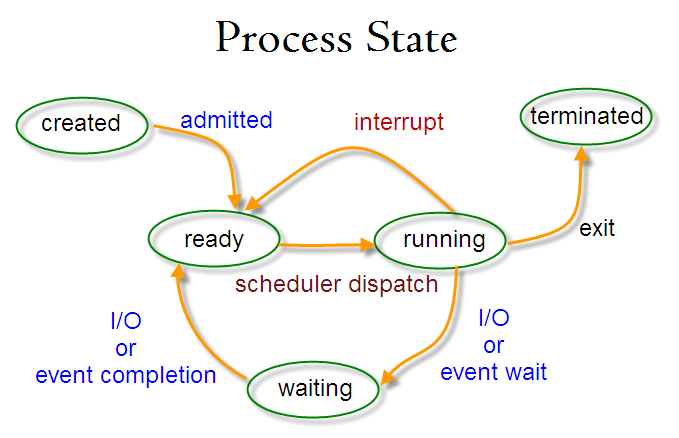

# 操作系统
待整理: https://www.cnblogs.com/javaguide/p/operating-system.html
## 概述
进程,内存管理,文件系统,锁,进程间通信.linux知识. c++ STL容器种类.
### 操作系统基本特征
1. 并发
并发是指宏观上在一段时间内能同时运行多个程序，而并行则指同一时刻能运行多个指令。
并行需要硬件支持，如多流水线、多核处理器或者分布式计算系统。
操作系统通过引入进程和线程，使得程序能够并发运行。
2. 共享
共享是指系统中的资源可以被多个并发进程共同使用。
有两种共享方式：互斥共享和同时共享。
互斥共享的资源称为临界资源，例如打印机等，在同一时刻只允许一个进程访问，需要用同步机制来实现互斥访问。
3. 虚拟
虚拟技术把一个物理实体转换为多个逻辑实体。
主要有两种虚拟技术：时（时间）分复用技术和空（空间）分复用技术。
多个进程能在同一个处理器上并发执行使用了时分复用技术，让每个进程轮流占用处理器，每次只执行一小个时间片并快速切换。
虚拟内存使用了空分复用技术，它将物理内存抽象为地址空间，每个进程都有各自的地址空间。地址空间的页被映射到物理内存，地址空间的页并不需要全部在物理内存中，当使用到一个没有在物理内存的页时，执行页面置换算法，将该页置换到内存中。
4. 异步
异步指进程不是一次性执行完毕，而是走走停停，以不可知的速度向前推进。

### 操作系统基本功能
1. 进程管理: 进程控制、进程同步、进程通信、死锁处理、处理机调度等。
2. 内存管理: 内存分配、地址映射、内存保护与共享、虚拟内存等。
3. 文件管理: 文件存储空间的管理、目录管理、文件读写管理和保护等。
4. 设备管理: 完成用户的 I/O 请求，方便用户使用各种设备，并提高设备的利用率。主要包括缓冲管理、设备分配、设备处理、虛拟设备等。

### 大内核和微内核
1. 大内核
大内核是将操作系统功能作为一个紧密结合的整体放到内核。
由于各模块共享信息，因此有很高的性能。

2. 微内核
由于操作系统不断复杂，因此将一部分操作系统功能移出内核，从而降低内核的复杂性。移出的部分根据分层的原则划分成若干服务，相互独立。在微内核结构下，操作系统被划分成小的、定义良好的模块，只有微内核这一个模块运行在内核态，其余模块运行在用户态。因为需要频繁地在用户态和核心态之间进行切换，所以会有一定的性能损失。

### 用户态和内核态的区别
内核态: 可以访问内存所有数据, 外围设备.在特权级最高的（0级）内核代码中执行。
用户态: 只能受限的访问内存, 不能访问外围设备. 占用CPU的能力被剥夺, CPU资源可以被其他程序获取,在特权级最低的（3级）用户代码中运行。

当一个任务（进程）执行系统调用而陷入内核代码中执行时，我们就称进程处于内核运行态（或简称为内核态）。此时处理器处于特权级最高的（0级）内核代码中执行。当进程处于内核态时，执行的内核代码会使用当前进程的内核栈。每个进程都有自己的内核栈。
当进程在执行用户自己的代码时，则称其处于用户运行态（用户态）。即此时处理器在特权级最低的（3级）用户代码中运行。

CPU状态之间的转换
用户态--->内核态：唯一途径是通过中断、异常、陷入机制（访管指令）
内核态--->用户态：设置程序状态字PSW

## 进程管理

### 进程 线程区别
`一个任务就是一个进程（Process）`,每个进程都拥有自己的地址空间、内存、数据栈及其它资源.多个进程可以在不同的 CPU 上运行，互不干扰同一个CPU上，可以运行多个进程，由操作系统来自动分配时间片由于进程间资源不能共享，需要进程间通信，来发送数据，接受消息等多进程，也称为“并行”。
`进程内的“子任务”称为线程（Thread）`.一个进程下可以运行多个线程，这些线程之间共享主进程内申请的操作系统资源.在一个进程中启动多个线程的时候，每个线程按照顺序执行.
`协程`的作用，是在执行函数A时，可以随时中断，去执行函数B，然后中断继续执行函数A（可以自由切换）。但这一过程并不是函数调用（没有调用语句），这一整个过程看似像多线程，然而协程只有一个线程执行.
计算密集型任务使用多进程,IO密集型任务使用多线程.

Ⅰ 拥有资源
进程是资源分配的基本单位，但是线程不拥有资源，线程可以访问隶属进程的资源。
Ⅱ 调度
线程是独立调度的基本单位，在同一进程中，线程的切换不会引起进程切换，从一个进程中的线程切换到另一个进程中的线程时，会引起进程切换。
Ⅲ 系统开销
由于创建或撤销进程时，系统都要为之分配或回收资源，如内存空间、I/O 设备等，所付出的开销远大于创建或撤销线程时的开销。类似地，在进行进程切换时，涉及当前执行进程 CPU 环境的保存及新调度进程 CPU 环境的设置，而线程切换时只需保存和设置少量寄存器内容，开销很小。
Ⅳ 通信方面
线程间可以通过直接读写同一进程中的数据进行通信，但是进程通信需要借助 IPC。

### 进程状态

就绪,运行,阻塞,创建,终止
- 只有就绪态和运行态可以相互转换，其它的都是单向转换。就绪状态的进程通过调度算法从而获得 CPU 时间，转为运行状态；而运行状态的进程，在分配给它的 CPU 时间片用完之后就会转为就绪状态，等待下一次调度。
- 阻塞状态是缺少需要的资源从而由运行状态转换而来，但是该资源不包括 CPU 时间，缺少 CPU 时间会从运行态转换为就绪态。

### PCB 进程控制块 (process control block)
PCB 是进程存在的唯一标识
包含如下信息: 进程描述信息, 进程控制和管理信息, 资源分配清单, CPU 相关信息
PCB通过链表的方式进行组织，把具有相同状态的进程链在一起，组成各种队列

进程的上下文切换不仅包含了虚拟内存、栈、全局变量等用户空间的资源，还包括了内核堆栈、寄存器等内核空间的资源。
通常，会把交换的信息保存在进程的 PCB，当要运行另外一个进程的时候，我们需要从这个进程的 PCB 取出上下文，然后恢复到 CPU 中，这使得这个进程可以继续执行.

### epoll
### 进程特征
动态性, 并发性, 独立性, 异步性, 结构性

### 进程调度算法
1.批处理系统
批处理系统没有太多的用户操作，在该系统中，调度算法目标是保证吞吐量和周转时间（从提交到终止的时间）。
1.1 先来先服务 first-come first-serverd（FCFS）
非抢占式的调度算法，按照请求的顺序进行调度。不利于短作业，不利于IO繁忙型作业
1.2 短作业优先 shortest job first（SJF）
非抢占式的调度算法，按估计运行时间最短的顺序进行调度。
长作业有可能会饿死.

2.交互式系统
交互式系统有大量的用户交互操作，在该系统中调度算法的目标是快速地进行响应。
2.1 时间片轮转
将所有就绪进程按 FCFS 的原则排成一个队列，每次调度时，把 CPU 时间分配给队首进程，该进程可以执行一个时间片。当时间片用完时，由计时器发出时钟中断，调度程序便停止该进程的执行，并将它送往就绪队列的末尾，同时继续把 CPU 时间分配给队首的进程。时间片轮转算法的效率和时间片的大小有很大关系：因为进程切换都要保存进程的信息并且载入新进程的信息，如果时间片太小，会导致进程切换得太频繁。如果时间片过长，那么实时性就不能得到保证。
2.2 优先级调度
为每个进程分配一个优先级，按优先级进行调度。为了防止低优先级的进程永远等不到调度，可以随着时间的推移增加等待进程的优先级。
2.3 多级反馈队列
一个进程需要执行 100 个时间片，如果采用时间片轮转调度算法，那么需要交换 100 次。
多级队列是为这种需要连续执行多个时间片的进程考虑，它设置了多个队列，每个队列时间片大小都不同，例如 1,2,4,8,..。进程在第一个队列没执行完，就会被移到下一个队列。这种方式下，之前的进程只需要交换 7 次。每个队列优先权也不同，最上面的优先权最高。因此只有上一个队列没有进程在排队，才能调度当前队列上的进程。可以将这种调度算法看成是时间片轮转调度算法和优先级调度算法的结合。

3.实时系统
实时系统要求一个请求在一个确定时间内得到响应。
分为硬实时和软实时，前者必须满足绝对的截止时间，后者可以容忍一定的超时。

### 调度评价指标
CPU 利用率, 系统吞吐量, 周转时间, 响应时间

### 进程同步
同步与互斥
同步：多个进程因为合作产生的直接制约关系，使得进程有一定的先后执行关系。
互斥：多个进程在同一时刻只有一个进程能进入临界区。

### 进程间通信 IPC
进程间通信:每个进程各自有不同的用户地址空间，任何一个进程的全局变量在另一个进程中都看不到，所以进程之间要交换数据必须通过内核，在内核中开辟一块缓冲区，进程1把数据从用户空间拷到内核缓冲区，进程2再从内核缓冲区把数据读走，内核提供的这种机制称为进程间通信（IPC，InterProcess Communication）
进程间通信的7种方式:
- 管道(pipe): 数据只能向一个方向流动；需要双方通信时，需要建立起两个管道.只能用于父子进程或者兄弟进程之间.
- 有名管道(FIFO): 通过有名管道不相关的进程也能交换数据. FIFO严格遵循先进先出.
- 信号(Signal): 信号可以在任何时候发给某一进程，而无需知道该进程的状态
- 信号量(semaphore): 调协进程对共享资源的访问, 让一个临界区同一时间只有一个线程在访问它
- 消息队列(Message): 存放在内核中的消息链表.
- 共享内存(share memory): 使得多个进程可以可以直接读写同一块内存空间，是最快的可用IPC形式.
- 套接字(socket): 是一种通信机制，凭借这种机制，客户/服务器（即要进行通信的进程）系统的开发工作既可以在本地单机上进行，也可以跨网络进行.

### 线程间通信
1、锁机制
互斥锁：提供了以排它方式阻止数据结构被并发修改的方法。
读写锁：允许多个线程同时读共享数据，而对写操作互斥。
条件变量：可以以原子的方式阻塞进程，直到某个特定条件为真为止。对条件测试是在互斥锁的保护下进行的。条件变量始终与互斥锁一起使用。
2、信号量机制：包括无名线程信号量与有名线程信号量
3、信号机制：类似于进程间的信号处理。
线程间通信的主要目的是用于线程同步，所以线程没有象进程通信中用于数据交换的通信机制。

### 进程运行步骤
编译, 链接, 装入

### 进程切换和线程切换的区别
进程切换涉及虚拟地址空间的切换而线程不会。因为每个进程都有自己的虚拟地址空间，而线程是共享所在进程的虚拟地址空间的，因此同一个进程中的线程进行线程切换时不涉及虚拟地址空间的转换。

虚拟内存: 操作系统为每个进程提供的一种抽象，每个进程都有属于自己的、私有的、地址连续的虚拟内存.最终进程的数据及代码必然要放到物理内存上，那么必须有某种机制能记住虚拟地址空间中的某个数据被放到了哪个物理内存地址上，这就是所谓的地址空间映射，那么操作系统是如何记住这种映射关系的呢，答案就是页表。

每个进程都有自己的虚拟地址空间，那么显然每个进程都有自己的页表，那么当进程切换后页表也要进行切换，页表切换后缓存TLB就失效了，cache失效导致命中率降低，那么虚拟地址转换为物理地址就会变慢，表现出来的就是程序运行会变慢，而线程切换则不会导致TLB失效，因为线程线程无需切换地址空间，因此我们通常说线程切换要比较进程切换块.

### 什么叫僵尸进程？怎么处理僵尸进程？
僵尸进程: 完成了生命周期但却依然留在进程表中的进程
若父进程未能读取到子进程的 Exit 信号，则这个子进程虽然完成执行处于死亡的状态，但也不会从进程表中删掉。
确保删除子僵尸的唯一方法就是杀掉它们的父进程。
ps -aux 显示所有的进程

### 什么是缓冲区溢出？有什么危害？其原因是什么？
缓冲区溢出是指当计算机向缓冲区填充数据时超出了缓冲区本身的容量，溢出的数据覆盖在合法数据上。
危害有以下两点：
1. 程序崩溃，导致拒绝服务
2. 跳转并且执行一段恶意代码
造成缓冲区溢出的主要原因是程序中没有仔细检查用户输入。

###　内存抖动
指内存频繁地分配和回收，而频繁的gc会导致卡顿，严重时和内存泄漏一样会导致OOM。

###　内存溢出　out of memory
是指程序在申请内存时，没有足够的内存空间供其使用，出现out of memory；比如申请了一个integer,但给它存了long才能存下的数，那就是内存溢出。

###　内存泄露 memory leak：
是指程序在申请内存后，无法释放已申请的内存空间，一次内存泄露危害可以忽略，但内存泄露堆积后果很严重，无论多少内存,迟早会被占光。memory leak会最终会导致out of memory

### 页面置换算法/缓存替换策略 —> FIFO，LRU，LFU
- LRU(Least Recently Used) 最近最少使用算法，它是根据时间维度来选择将要淘汰的元素，即删除掉最长时间没被访问的元素。
- LFU(Least Frequently Used) 最近最不常用算法，它是根据频率维度来选择将要淘汰的元素，即删除访问频率最低的元素。如果两个元素的访问频率相同，则淘汰最久没被访问的元素。

### 大端模式 小端模式
1) 小端模式：就是低位字节排放在内存的低地址端，高位字节排放在内存的高地址端。
2) 大端模式：就是高位字节排放在内存的低地址端，低位字节排放在内存的高地址端。

### 线程池
线程池的基本思想是一种对象池，在程序启动时就开辟一块内存空间，里面存放了众多(未死亡)的线程，池中线程执行调度由池管理器来处理。当有线程任务时，从池中取一个，执行完成后线程对象归池，这样可以避免反复创建线程对象所带来的性能开销，节省了系统的资源。

### 线程安全性的三个体现
- 原子性：一个操作要么全部执行（生效），要么全部都不执行（都不生效）
线程是调度的基本单位。CPU有时间片的概念，会根据不同的调度算法进行线程调度。当一个线程获得时间片之后开始执行，在时间片耗尽之后，就会失去CPU使用权。所以在多线程场景下，由于时间片在线程间轮换，就会发生原子性问题。
- 可见性：当多个线程并发访问共享变量时，一个线程对共享变量的修改，其它线程能够立即看到。
- 有序性：程序执行的顺序按照代码的先后顺序执行。

如何保证原子性?
加锁 lock, 同步 synchronized: 使用锁，可以保证同一时间只有一个线程能拿到锁，也就保证了同一时间只有一个线程能执行申请锁和释放锁之间的代码。 比如线程1CPU时间片用完，线程1放弃了CPU，但是，他并没有进行解锁。而由于synchronized的锁是可重入的，下一个时间片还是只能被他自己获取到，还是会继续执行代码。直到所有代码执行完。这就保证了原子性。
无论使用锁还是synchronized，本质都是一样，通过锁来实现资源的排它性，从而实际目标代码段同一时间只会被一个线程执行，进而保证了目标代码段的原子性。这是一种以牺牲性能为代价的方法。

如何保证可见性?
当使用volatile修饰某个变量时，它会保证对该变量的修改会立即被更新到内存中，并且将其它缓存中对该变量的缓存设置成无效，因此其它线程需要读取该值时必须从主内存中读取，从而得到最新的值。

如何保证顺序性?
volatile在一定程序上保证顺序性，另外还可以通过synchronized和锁来保证顺序性。
synchronized和锁保证顺序性的原理和保证原子性一样，都是通过保证同一时间只会有一个线程执行目标代码段来实现的。

## 内存管理

操作系统为每个进程分配独立的「虚拟地址」，互不干涉

- 程序使用的内存地址叫做虚拟内存地址（Virtual Memory Address）
- 实际存在硬件里面的空间地址叫物理内存地址（Physical Memory Address）。
- 操作系统会提供一种机制，将不同进程的虚拟地址和不同内存的物理地址映射起来。

### 操作系统如何管理虚拟地址与物理地址之间的关系？
主要是内存分段和内存分页
#### 内存分段
参考： https://www.nowcoder.com/discuss/445401
分段机制下的虚拟地址由两部分组成，段选择因子和段内偏移量。
- 段选择子就保存在段寄存器里面。段选择子里面最重要的是段号，用作段表的索引。段表里面保存的是这个段的基地址、段的界限和特权等级等。
- 虚拟地址中的段内偏移量应该位于 0 和段界限之间，如果段内偏移量是合法的，就将段基地址加上段内偏移量得到物理内存地址。

缺点
- 第一个就是内存碎片的问题。
- 第二个就是内存交换的效率低的问题。

解决外部内存碎片的问题就是内存交换，Linux 系统里，就是Swap空间，这块空间是从硬盘划分出来的，用于内存与硬盘的空间交换。

对于多进程的系统来说，用分段的方式，内存碎片是很容易产生的，产生了内存碎片，那不得不重新 Swap 内存区域，这个过程会产生性能瓶颈。因为硬盘的访问速度要比内存慢太多了，每一次内存交换，我们都需要把一大段连续的内存数据写到硬盘上。所以，如果内存交换的时候，交换的是一个占内存空间很大的程序，这样整个机器都会显得卡顿。

#### 内存分页
为了解决内存分段的内存碎片和内存交换效率低的问题，就出现了内存分页。
分页是把整个虚拟和物理内存空间切成一段段固定尺寸的大小。这样一个连续并且尺寸固定的内存空间，我们叫页（Page）。在 Linux 下，每一页的大小为 4KB。
虚拟地址与物理地址之间通过页表来映射，页表实际上存储在 CPU 的内存管理单元 （MMU），于是 CPU 就可以直接通过 MMU，找出要实际要访问的物理内存地址。
缺页异常：当进程访问的虚拟地址在页表中查不到时产生，进入系统内核空间分配物理内存、更新进程页表，最后再返回用户空间，恢复进程的运行。

##### 分页是怎么解决分段的内存碎片、内存交换效率低的问题？
- 由于内存空间都是预先划分好的，也就不会像分段会产生间隙非常小的内存，这正是分段会产生内存碎片的原因。而采用了分页，那么释放的内存都是以页为单位释放的，也就不会产生无法给进程使用的小内存。
- 如果内存空间不够，操作系统会把其他正在运行的进程中的「最近没被使用」的内存页面给释放掉，也就是暂时写在硬盘上，称为换出（Swap Out）。一旦需要的时候，再加载进来，称为换入（Swap In）。所以，一次性写入磁盘的也只有少数的一个页或者几个页，不会花太多时间，内存交换的效率就相对比较高。
更进一步地，分页的方式使得我们在加载程序的时候，不再需要一次性都把程序加载到物理内存中。我们完全可以在进行虚拟内存和物理内存的页之间的映射之后，并不真的把页加载到物理内存里，而是只有在程序运行中，需要用到对应虚拟内存页里面的指令和数据时，再加载到物理内存里面去。
##### 分页机制下，虚拟地址和物理地址是如何映射的？
在分页机制下，虚拟地址分为两部分，页号和页内偏移。页号作为页表的索引，页表包含物理页每页所在物理内存的基地址，这个基地址与页内偏移的组合就形成了物理内存地址。
##### 多级页表
简单的分页缺陷: 空间占用大，4GB空间的映射就需要有4MB的内存来存储页表，100 个进程的话，就需要 400MB 的内存来存储页表（64位下更大）
多级页表
如果使用了二级分页，一级页表就可以覆盖整个 4GB 虚拟地址空间，但如果某个一级页表的页表项没有被用到，也就不需要创建这个页表项对应的二级页表了，即可以在需要时才创建二级页表
##### TLB（Translation Lookaside Buffer）
多级页表虽然解决了空间上的问题，但是虚拟地址到物理地址的转换就多了几道转换的工序，显然降低了地址转换的速度，带来了时间上的开销。
程序是有局部性的，即在一段时间内，整个程序的执行仅限于程序中的某一部分。相应地，执行所访问的存储空间也局限于某个内存区域。把最常访问的几个页表项存储到访问速度更快的硬件，于是在 CPU 芯片中，加入了一个专门存放程序最常访问的页表项的 Cache，这个 Cache 就是 TLB（Translation Lookaside Buffer）
有了 TLB 后，那么 CPU 在寻址时，会先查 TLB，如果没找到，才会继续查常规的页表。TLB 的命中率其实是很高的，因为程序最常访问的页就那么几个。

#### 段页式内存管理
内存分段和内存分页并不是对立的，它们是可以组合起来在同一个系统中使用的，那么组合起来后，通常称为段页式内存管理。
地址结构就由段号、段内页号和页内位移三部分组成。

### fork()
fork系统调用用于创建一个新进程.
为什么fork会返回两次？
由于在复制时复制了父进程的堆栈段，fork函数会返回两次，一次是在父进程中返回，另一次是在子进程中返回
- 在父进程中，fork返回新创建子进程的进程ID；
- 在子进程中，fork返回0(因为子进程没有子进程)；
- 如果出现错误，fork返回一个负值。
