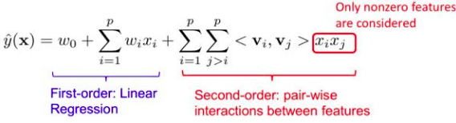

# 机器学习

### FM
FM通过特征组合来解决大规模稀疏数据的分类问题.在实际的CTR任务中，大量的特征都是categorical类型的。我们通常要对特征进行One-Hot Encoding处理。转换之后维度变得超大，特征矩阵也变得极其地稀疏。

通过这个表达式可以看出，FM很像在学习每一个经过one-hot encoding转化的特征的embedding，然后学习不同特征之间的embedding相似度对于最后预测结果的影响。由于可以将很大量的稀疏特征压缩到几百维的embedding向量，极大地减少了模型的参数量级，从而能获取较强的模型泛化能力，取得较好的预测效果



### ROC 曲线 AUC 含义
ROC曲线: X轴-FPR(false positive rate)，Y轴-TPR(true positive rate)
TPR：在所有实际为阳性的样本中，被正确地判断为阳性之比率。
TPR = TP / (TP + FN)
FPR：在所有实际为阴性的样本中，被错误地判断为阳性之比率。
FPR = FP / (FP + TN)

设置阈值来得到混淆矩阵，不同的阈值会影响得到的TPRate，FPRate，如果阈值取0.5，小于0.5的为0，否则为1。依次使用所有预测值作为阈值，得到一系列TPRate，FPRate，描点，求面积，即可得到AUC。

AUC: 若随机抽取一个阳性样本和一个阴性样本，分类器正样本的预测概率大于负样本的预测概率之几率.
AUC的计算方法同时考虑了分类器对于正例和负例的分类能力，在样本不平衡的情况下，依然能够对分类器作出合理的评价。
mAP受正负样本分布影响明显,AUC几乎不变
```python
def AUC(label, pre):
    # label = [1,0,0,0,1,0,1,0]
    # pre = [0.9, 0.8, 0.3, 0.1, 0.4, 0.9, 0.66, 0.7]
    pos = [i for i in range(len(label)) if label[i] == 1]
    neg = [i for i in range(len(label)) if label[i] == 0]
    auc = 0
    # AUC的含义就是所有穷举所有的正负样本对，
    # 如果正样本的预测概率大于负样本的预测概率，+１
    # 如果正样本的预测概率等于负样本的预测概率，+0.5
    # 如果正样本的预测概率小于负样本的预测概率，+0
    for i in pos:
        for j in neg:
            if pre[i] > pre[j]:
                auc += 1
            elif pre[i] == pre[j]:
                auc += 0.5

    return auc / (len(pos)*len(neg))
```
例如在反欺诈场景，设欺诈类样本为正例，正例占比很少（假设0.1%），如果使用准确率评估，把所有的样本预测为负例，便可以获得99.9%的准确率。但是如果使用AUC，把所有样本预测为负例，TPRate和FPRate同时为0（没有Positive），与(0,0) (1,1)连接，得出AUC仅为0.5，成功规避了样本不均匀带来的问题。

### 生成模型与判别模型有什么区别
生成模型学习联合概率分布p(x,y)，而判别模型学习条件概率分布p(y|x)
