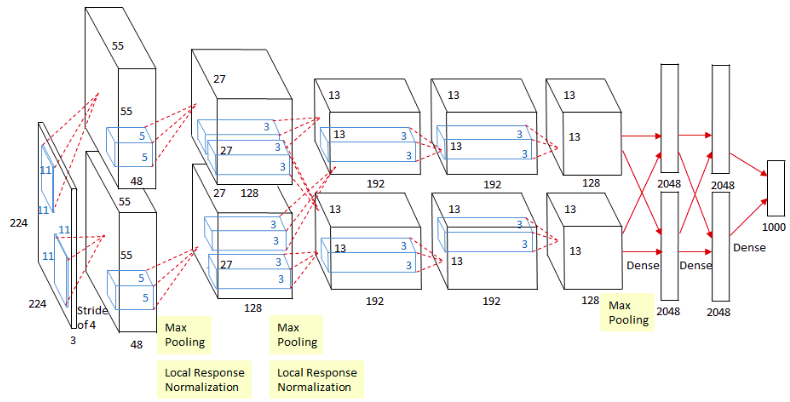
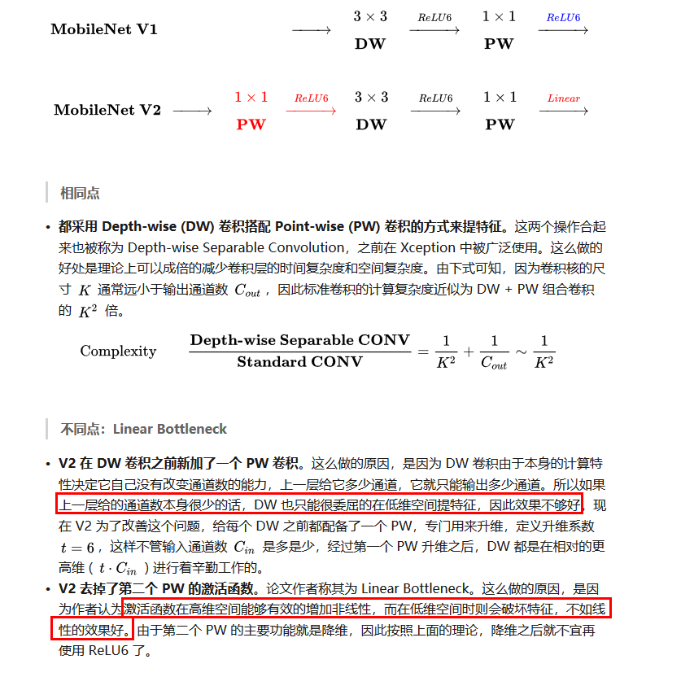

<!-- TOC depthFrom:1 depthTo:6 withLinks:1 updateOnSave:1 orderedList:0 -->

	- [机器学习](#机器学习)
		- [欠拟合，过拟合](#欠拟合过拟合)
		- [样本不平衡](#样本不平衡)
		- [数据增强方法](#数据增强方法)
		- [梯度消失，梯度爆炸](#梯度消失梯度爆炸)
		- [优化器 SGD, Adam, AdamW](#优化器-sgd-adam-adamw)
		- [dropout](#dropout)
		- [batch norm, layer norm, instance norm, group norm](#batch-norm-layer-norm-instance-norm-group-norm)
		- [nms与soft nms区别](#nms与soft-nms区别)
		- [GIOU](#giou)
		- [FM, FFM, deepFFM](#fm-ffm-deepffm)
		- [GDBT+LR](#gdbtlr)
		- [ROC 曲线 AUC 含义](#roc-曲线-auc-含义)
		- [生成模型与判别模型的区别](#生成模型与判别模型的区别)
		- [逻辑回归的损失函数为什么不用MSE](#逻辑回归的损失函数为什么不用mse)
		- [逻辑回归为什么用sigmoid](#逻辑回归为什么用sigmoid)
		- [L1, L2 正则化](#l1-l2-正则化)
		- [距离公式](#距离公式)
		- [概率/似然区别](#概率似然区别)
		- [KNN](#knn)
			- [KD树](#kd树)
		- [特征工程](#特征工程)
		- [假设检验](#假设检验)
			- [Z检验 T检验](#z检验-t检验)
		- [mAP指标解释](#map指标解释)
		- [均匀分布生成标准正太分布](#均匀分布生成标准正太分布)
		- [知识蒸馏](#知识蒸馏)
		- [大数定律](#大数定律)
		- [EM 算法](#em-算法)
		- [SVM 逻辑回归 区别](#svm-逻辑回归-区别)
		- [梯度检查](#梯度检查)
		- [stack, blending 原理与区别](#stack-blending-原理与区别)
		- [Adaboost](#adaboost)
		- [PCA算法](#pca算法)
		- [SVD](#svd)
		- [梯度下降法和牛顿法区别](#梯度下降法和牛顿法区别)
		- [拟牛顿法的原理](#拟牛顿法的原理)
		- [向量与矩阵的欧几里得距离计算](#向量与矩阵的欧几里得距离计算)
		- [矩阵正定性的判断,Hessian矩阵正定性在梯度下降中的应用](#矩阵正定性的判断hessian矩阵正定性在梯度下降中的应用)
		- [不同的损失函数](#不同的损失函数)
		- [A/B test](#ab-test)
	- [深度学习](#深度学习)
		- [dirtnet](#dirtnet)
		- [gmm, 显著性检测](#gmm-显著性检测)
		- [TODO: 待整理](#todo-待整理)
	- [深度学习](#深度学习)
		- [CNN分类网络演变脉络](#cnn分类网络演变脉络)
			- [LeNet-5](#lenet-5)
			- [alexnet](#alexnet)
			- [vgg16](#vgg16)
			- [resnet](#resnet)
			- [SENet](#senet)
			- [darknet53](#darknet53)
			- [dla32](#dla32)
			- [mobilenetv2](#mobilenetv2)
			- [inception系列](#inception系列)
		- [NVIDIA INT8量化流程](#nvidia-int8量化流程)
		- [全连接层作用](#全连接层作用)
		- [Pooling层的作用以及如何进行反向传播](#pooling层的作用以及如何进行反向传播)
		- [神经网络反向求导不可导情况处理](#神经网络反向求导不可导情况处理)
		- [ROI Pooling](#roi-pooling)
		- [ROI Align](#roi-align)
		- [rpn的loss](#rpn的loss)
		- [FasterRCNN 训练4步骤](#fasterrcnn-训练4步骤)
		- [CNN结构特点](#cnn结构特点)
		- [1x1卷积作用](#1x1卷积作用)
		- [混淆矩阵：](#混淆矩阵)
		- [GELU](#gelu)
		- [GAN](#gan)
		- [灰度直方图与均匀化](#灰度直方图与均匀化)
		- [图像算法加速方法](#图像算法加速方法)
		- [BFLOAT16](#bfloat16)

<!-- /TOC -->

## 机器学习
### 欠拟合，过拟合
欠拟合：训练集和测试集效果都很差
1. 检查y的定义，在有限指定样本上训练并测试，检查是不是label的定义有问题
2. 检查训练集是否噪声过大，学习率过大，影响了学习器的拟合
3. 检查数据预处理后，样本和label的匹配
确保样本y，特征X没问题后，就可以检查改进f模型
4. 检查网络是否太简单，损失函数定义，增加非线性，增加模型复杂度
5. 增加shortcut, FPN等特征融合，避免网络退化

过拟合：训练集效果好，测试集效果差
机器学习的基础，i.i.d. 独立同分布假设，即训练集和测试集分布一致。
1. 检查训练集和测试集label/特征分布上的差异（二分类），进行必要的样本/特征检查与清洗采样
2. 增加样本空间的多样性，增加样本数目，使用一些数据增强方法
3. 在损失函数加入正则项l1/l2, weight decay adamW, dropout, batchnorm
4. 调节学习率，超参数，提前结束训练
5. 集成学习, bagging, RandomForest

### 样本不平衡
训练集/验证集间样本分布不平衡
1. 从样本层面：可以对训练集/验证集样本进行清洗，采样，赋予不同样本不同权重对训练集/验证集分布进行调和。
2. 从样本label定义层面：可以使用label smoothing
3. 从模型训练优化层面：加入正则项避免模型在训练集上过拟合

不同类别样本间数目不平衡
1. 通过数据增强，比如copy-paste的方式，调和不同类别间数目差异
2. 从模型训练优化层面：可以使用例如focal loss赋予正负样本不同的权重

### 数据增强方法
数据增强整张图片：
1. 仿射变化/透视变化：旋转，缩放，平移，投影映射
2. 剪裁，翻转
3. 添加噪声，模糊，滤波（中值，均值，高斯）
4. 亮度，对比度，颜色扰动，锐化
5. mixup
数据增强正样本：
1. 畸变
2. 添加光斑
遮挡关系增强：
cutout，cutmix，马赛克, grid mask

### 梯度消失，梯度爆炸
梯度的反向传播，链式法则，是通过权重Wi的连乘进行的。因此，如果权重Wi的值总是较小的（与1相比），则在反向过程中，梯度呈指数级衰减，就出现了梯度消失的问题；反之，如果如果权重Wi总是较大，就会出现梯度爆炸的问题。

缓解方法：
1. 预训练模型 + fin tune
2. 梯度剪裁
3. relu而不是sigmoid
4. bn等归一化方法
5. shortcut
6. 合理的权重初始化(例如retinanet最后一层clshead的bias设为log((1-pi)/pi))
7. loss设计, 例如smooth L1

### 优化器 SGD, Adam, AdamW
SGD为随机梯度下降,每一次迭代计算数据集的mini-batch的梯度,然后对参数进行更新。
Momentum参考了动量的概念,前几次的梯度也会参与到当前的计算中,但是前几轮的梯度叠加在当前计算中会有一定的衰减。
Adagard在训练的过程中可以自动变更学习的速率,设置一个全局的学习率,而实际的学习率与以往的参数模和的开方成反比。
Adam利用梯度的一阶矩估计和二阶矩估计动态调整每个参数的学习率,使得参数更新较为平稳。
AdamW在Adam基础上引入weight decay, 相当于加上L2正则项

SGD: W = W - lr * grad

Adam:

前两行对梯度和梯度的平方进行滑动平均
中间两行对初期滑动平均偏差的修正，当t越来越大时，分母都趋近于 1
最后一行是参数更新公式. 每个参数的梯度都是不同的，每个参数的学习率即使在同一轮也不一样.

AdamW:
weight decay $\lambda$ 一般取0.01, $\beta_1$取0.9, $\beta_2$取0.999, $\beta_1^t$取$\beta_1^{iter}$, $\beta_1^t$取$\beta_2^{iter}$


<!--
$$ m_t = \beta_1 m_{t-1} + (1 - \beta_1) g_t \\
   v_t = \beta_2 v_{t-1} + (1 - \beta_2) g_t^2 \\
   \hat{m_t} = \frac{m_t}{1 - \beta_1^t} \\
   \hat{v_t} = \frac{v_t}{1 - \beta_2^t} \\
   \theta_{t+1} = \theta_t - \frac{\hat{m_t}}{\sqrt{\hat{v_t}}+\varepsilon } lr $$

$$ m_t = \beta_1 m_{t-1} + (1 - \beta_1) g_t \\
   v_t = \beta_2 v_{t-1} + (1 - \beta_2) g_t^2 \\
   \hat{m_t} = \frac{m_t}{1 - \beta_1^t} \\
   \hat{v_t} = \frac{v_t}{1 - \beta_2^t} \\
   \theta_{t+1} = \theta_t -  (\frac{\hat{m_t}}{\sqrt{\hat{v_t}}+\varepsilon } + \lambda \theta_t) lr $$
-->

### dropout
训练时留下的神经元除以(1 - dropout_rate)，预测时不做处理

### batch norm, layer norm, instance norm, group norm
- batch norm: channel 维度 norm, 卷积
- layer norm: sample 维度 norm, transformer
- instance norm: channel & sample 维度 norm, GAN
- group norm: sample 维度 & channel分group norm, 卷积


### nms与soft nms区别
NMS直接删除IOU大于阈值的其他检测框，而Soft-NMS通过iou得到权重，来降低其他检测框原有的置信度，然后通过置信度阈值过滤。对于有重叠的框，iou越大，置信度衰减越严重。

### GIOU
bbox回归中常用L1,L2loss，自然可以想到用评估指标iou本身作为距离函数，iou本身还有个问题就是当A，B没有交集时候，iou=0，没办法衡量他们之间到达相距多远，因此GIoU中引入了C。（A，B是两个检测框矩形，C是A，B的最小包围框）


$$ IoU=\frac{|A \cap B|}{|A \cup B|} $$
$$ GIoU=IoU-\frac{|C - A \cup B|}{|C|} $$
$$ GIoU_{loss} = 1 - GIoU $$

### FM, FFM, deepFFM
线性回归模型

可见上式中各个特征分量之间是独立的,如果进一步考虑特征之间二阶组合的交互关系,可将线性回归写成

上述公式的问题是, 对于观察样本中未出现过的交互的特征分类, 很难正确估计w矩阵中的相应参数. 因此FM提出用(n,k)维的v, $V V^T$ 对w矩阵分解替代. 可以看到长度为k的v相当于对原始长度为n的特征做了embbeding.
时间复杂度O(kn).
参考: https://www.cnblogs.com/pinard/p/6370127.html
1. 可以在非常稀疏的数据中进行合理的参数估计
2. FM模型的时间复杂度是线性的

FFM: 通过引入field的概念，FFM把相同性质的特征归于同一个field。简单来说，同一个categorical特征经过One-Hot编码生成的数值特征都可以放到同一个field。在FFM中，每一维特征 xi，针对其它特征的每一种field fj，都会学习一个隐向量 v. 假设样本的 n 个特征属于 f 个field，那么FFM每一维特征有f个隐向量。而在FM模型中，每一维特征的隐向量只有一个。FM可以看作FFM的特例. FFM的二次参数有 nfk 个，远多于FM模型的 nk 个. 时间复杂度O(kn^2).
https://tech.meituan.com/2016/03/03/deep-understanding-of-ffm-principles-and-practices.html

### GDBT+LR
例如，gbdt里有3棵树T1,T2,T3，每棵树的叶节点个数为4，第i个树的第j个叶节点是Li,j。
当gdbt训练完成之后，样本X1在第一棵树中被分到了第3个叶节点上，也就是L1,3，那么这个样本在T1上的向量表达为(0,0,1,0)。
样本X1在T2被分到了L2,1，那么X1在T2上的向量表达为(1,0,0,0)
样本X1在T3被分到了L3,4，那么X1在T3上的向量表达为(0,0,0,1)
那么X1在整个gbdt上的向量表达为 (0,0,1,0,1,0,0,0,0,0,0,1)
所以每个样本都会被表示为一个长度为12的0-1向量，其中有3个数值是1。这样每棵树输出的就相当于是一个 one-hot 编码的特征.
然后这类向量就是LR模型的输入数据。

通过gbdt引入交叉特征与非线性, GBDT 担任了特征工程的工作, 特征的组合和选择, 再用带惩罚项的逻辑回归学习高维稀疏的特征.

### ROC 曲线 AUC 含义
ROC曲线: X轴-FPR(false positive rate)，Y轴-TPR(true positive rate)
TPR：在所有实际为阳性的样本中，被正确地判断为阳性之比率。
TPR = TP / (TP + FN)
FPR：在所有实际为阴性的样本中，被错误地判断为阳性之比率。
FPR = FP / (FP + TN)

设置阈值来得到混淆矩阵，不同的阈值会影响得到的TPRate，FPRate，如果阈值取0.5，小于0.5的为0，否则为1。依次使用所有预测值作为阈值，得到一系列TPRate，FPRate，描点，求面积，即可得到AUC。

AUC: 若随机抽取一个阳性样本和一个阴性样本，分类器正样本的预测概率大于负样本的预测概率之几率.
AUC的计算方法同时考虑了分类器对于正例和负例的分类能力，在样本不平衡的情况下，依然能够对分类器作出合理的评价。
mAP受正负样本分布影响明显, AUC几乎不变.
但是在某些场景下，我们会更关注正样本，这时候就要用到 PR 曲线了。例如, 提高二分类的 threshold 就能提高 precision，降低 threshold 就能提高 recall，这时便可观察 PR 曲线，得到最优的 threshold。
```python
def AUC(label, pre):
    # label = [1,0,0,0,1,0,1,0]
    # pre = [0.9, 0.8, 0.3, 0.1, 0.4, 0.9, 0.66, 0.7]
    pos = [i for i in range(len(label)) if label[i] == 1]
    neg = [i for i in range(len(label)) if label[i] == 0]
    auc = 0
    # AUC的含义就是所有穷举所有的正负样本对，
    # 如果正样本的预测概率大于负样本的预测概率，+１
    # 如果正样本的预测概率等于负样本的预测概率，+0.5
    # 如果正样本的预测概率小于负样本的预测概率，+0
    for i in pos:
        for j in neg:
            if pre[i] > pre[j]:
                auc += 1
            elif pre[i] == pre[j]:
                auc += 0.5

    return auc / (len(pos)*len(neg))
```
例如在反欺诈场景，设欺诈类样本为正例，正例占比很少（假设0.1%），如果使用准确率评估，把所有的样本预测为负例，便可以获得99.9%的准确率。但是如果使用AUC，把所有样本预测为负例，TPRate和FPRate同时为0（没有Positive），与(0,0) (1,1)连接，得出AUC仅为0.5，成功规避了样本不均匀带来的问题。

### 生成模型与判别模型的区别
对于大多数的分类算法，比如决策树,KNN,逻辑回归，支持向量机等，他们都是判别方法，也就是直接学习出特征输出Y和特征X之间的关系，要么是决策函数𝑌=f(𝑋),要么是条件概率分布𝑃(𝑌|𝑋)。
朴素贝叶斯是生成方法，找出输出Y和特征X的联合分布𝑃(𝑋,𝑌), 然后用 𝑃(𝑌|𝑋)=𝑃(𝑋,𝑌)/𝑃(𝑋) 得出条件概率分布 𝑃(𝑌|𝑋). 具体说下, 联合概率分布P(X,Y)由P(X|Y)乘P(Y)得到. 朴素:指假设各个特征间相互独立. 朴素贝叶斯可以用极大似然估计和贝叶斯估计求解, 贝叶斯估计在极大似然估计的基础上引入了先验分布(拉普拉斯平滑,在计算条件概率的时候引入lambda).


朴素贝叶斯法分类时, 对给定的输入 x. 通过学习到的模型计算后验概率分布 P(Y=c|X=x), 将后验概率最大的类作为 x 的类输出. 根据期望风险最小化准则就得到后验概率最大化准则.

生成方法的特点: 生成方法可以还原出联合概率分布 P(X,Y), 而如判别方法则不能. 生成方法的学习收敛速度更快, 当存在隐变量时, 仍可以用生成方法学习, 此时判别方法就不能用。
判别方法的特点: 判别方法直接学习的是条件概率 P(Y|X)或决策函数f(X), 直接面对预测, 往往学习的准确率更高. 由于直接学习 P(Y|X) 或 f(X), 可以对数据进行各种程度上的抽象、定义特征并使用特征, 因此可以简化学习问题。
参考: http://www.ruanyifeng.com/blog/2013/12/naive_bayes_classifier.html
https://www.cnblogs.com/pinard/p/6069267.html

### 逻辑回归的损失函数为什么不用MSE

1. KL散度. 用于衡量两个事件分布的相似度. 可发现KL散度的后半部分就是交叉熵. 整体与交叉熵同增同减, 而sigmoid+交叉熵的梯度计算很方便, 因此从优化的角度, 要优化两个事件分布的相似度, 优化KL散度, 优化交叉熵.
2. 根据对数最大似然估计得到的模型的损失函数就是logloss.
3. 梯度. 对sigmoid+交叉熵求梯度正好是预测的f(x)与真值y的delta, 是线性的梯度. 对sigmoid+MSE求梯度, 在f(x)-y的基础上要乘上sigmoid的导数, 也就是sigmoid(z)乘(1-sigmoid(z)). 也就是说当z落在sigmoid的饱和区, 其导数几乎为0, 此时即使f(x)与y的delta比较大, 梯度也会因为sigmoid缩放的很小, 不利于梯度下降, 参数更新.

### 逻辑回归为什么用sigmoid
最大熵原理认为，学习概率模型时，在所有可能的概率模型中，熵最大的模型是最好的模型。根据Sigmoid函数，最后推导下来逻辑回归其实就是最大熵模型，根据对数最大似然估计得到的模型的损失函数就是logloss。这让整个逻辑回归都有理可据。

### L1, L2 正则化
L1正则化:将权重的绝对值之和加入到损失函数
L2正则化:将权重的平方值之和加入到损失函数,减小模型复杂度

L1正则化有特征选择的效果,得到稀疏化的权重
L2正则化同样有减小权重的效果,最终得到平滑的权重

其实L1,L2正则化可以看作是为原始损失函数添加了约束,使得权重|w| < C, ||w||^2 < C. (以L1为例)通过拉格朗日方程,可以把损失函数与约束整理为 $L_0 + \lambda(|w|-C)$,因为是优化问题可以忽略掉常数项C, 得到最终损失函数的形式$min (L_0 + \lambda |w|)$. 因为是不等式约束, 根据KKT条件, 如果原始损失函数L0的等高线在约束域外, 最优解就是等高线与约束域的切点.(如果在约束域内,不用理会约束域).其实拉格朗日方程能融合约束与损失函数是基于梯度方向一致性的假设(要想让目标函数f(x,y)的等高线和约束相切，则他们切点的梯度一定在一条直线上(f和g的斜率平行)).

L1 更容易产生稀疏解的三种解释.
1. 解空间形状

图中以二个权重为例,L2正则化定义了圆形(w^2),L1定义了菱形(|w|).蓝色的等高线是原始损失函数的. 等高线圆心在约束域外,根据KKT条件,等高线与约束域的切点为极值点.对于L2约束域,只有一个梯度方向会导致极值点落在权重为零的位置.对于L1约束域,许多梯度方向都会导致极值点落在权重为零的位置.因此L1更容易产生稀疏解.

2. 损失函数
参数更新公式 $ w = w - lr \frac{\partial{L}}{\partial{w}}$
$ L_0 + \sum \lambda |w| $ --L1损失函数求导得-- $ \frac{\partial{L_0}}{\partial{w}} + sign(\lambda)$
$ L_0 + \sum \lambda w^2 $ --L2损失函数求导得-- $ \frac{\partial{L_0}}{\partial{w}} + 2\lambda w$
    - 当$\frac{\partial{L_0}}{\partial{w}}$梯度较小时,L1的梯度为$sign(\lambda)$ 主导梯度更新的方向,若w>0,向负方向更新$lr \lambda$(假设L0梯度很小可忽略);若w<0,向正方向更新$lr \lambda$. 因此w总是向0点方向更新,趋向于取得零值.
    - 当$\frac{\partial{L_0}}{\partial{w}}$梯度较小时,L2的梯度为$2\lambda w$,梯度值也较小,L2的梯度也同L1一样,想让w的更新方向向零点靠近,但是由于此时w变小,相对于L0的偏导,无法主导梯度更新的方向.因此L2趋向与取得较小而分散的权重

3. 拉普拉斯先验 与 高斯先验 分布
$$ p(\theta|x) = \frac{p(x|\theta)p(\theta)}{p(x)}$$
其中$p(\theta|x)$是贝叶斯概率, $p(x|\theta)$是似然函数, $p(\theta)$是先验概率分布. $p(x)$是固定的只与样本有关, 因此重点看分子.
其中$p(\theta)$是先验分布,如果是拉普拉斯分布,取log后正好是L1 |w| 的形式,相当于在原来似然函数上加上了L1正则化. 拉普拉斯分布见下图,0附近概率密度最大,而且有平顶,容易停留,因此容易产生稀疏解. 高斯分布会产生L2 $w^2$的形式.

拉普拉斯分布函数


贝叶斯概率与最大后验概率的区别,贝叶斯认为先验是一个分布,最大后验概率认为先验是一个常量.


注意最大似然估计假设样本之间是独立的,因此最大化总体的似然估计可以转化成最大化每个个体似然估计的连乘,取log变成累加,就可以推导出交叉熵公式.

MSE假设分布符合高斯分布,因此个体连乘,取log后就是平方项的累加形式.

### 距离公式
欧式距离, 闵可夫斯基距离(p次方求和开p根号,是欧式距离的一般形式), 曼哈顿距离, 汉明距离, 余弦距离(1-cos)两向量夹角余弦值
除了余弦距离外,以上都属于严格的距离公式,即满足1.正定性 2.对称性 3.三角距离公式

### 概率/似然区别
似然: 基于特定观测值，推测模型参数是否合理。
概率: 基于给定模型参数，推测结果的合理性，不涉及任何观察到的数据。
最大似然估计: 找到参数theta的一个估计值,使得当前样本出现的可能性最大。

### KNN
要找到k个最近的邻居来做预测，那么我们只需要计算预测样本和所有训练集中的样本的距离，然后计算出最小的k个距离即可，接着多数表决，很容易做出预测。这个方法的确简单直接，但计算量大。

#### KD树
- KD树建树采用的是从m个样本的n维特征中，分别计算n个特征的取值的方差，用方差最大的第k维特征𝑛𝑘来作为根节点。对于这个特征，我们选择特征𝑛𝑘的取值的中位数𝑛𝑘𝑣对应的样本作为划分点，对于所有第k维特征的取值小于𝑛𝑘𝑣的样本，我们划入左子树，对于第k维特征的取值大于等于𝑛𝑘𝑣的样本，我们划入右子树，对于左子树和右子树，我们采用和刚才同样的办法来找方差最大的特征来做更节点，递归的生成KD树。
- 生成KD树以后，就可以去预测测试集里面的样本目标点了。对于一个目标点，我们首先在KD树里面找到包含目标点的叶子节点。以目标点为圆心，以目标点到叶子节点样本实例的距离为半径，得到一个超球体，最近邻的点一定在这个超球体内部。然后返回叶子节点的父节点，检查另一个子节点包含的超矩形体是否和超球体相交，如果相交就到这个子节点寻找是否有更加近的近邻,有的话就更新最近邻。如果不相交那就简单了，我们直接返回父节点的父节点，在另一个子树继续搜索最近邻。当回溯到根节点时，算法结束，此时保存的最近邻节点就是最终的最近邻。
参考: https://www.cnblogs.com/pinard/p/6061661.html

### 特征工程
1. 过滤法
1.1 方差选择法: 如果一个特征不发散，例如方差接近于0，也就是说样本在这个特征上基本上没有差异，这个特征对于样本的区分并没有什么用. 计算各个特征的方差，然后根据阈值，选择方差大于阈值的特征。
1.2 相关系数法: Pearson 相关系数定义为两个变量之间的协方差和标准差的商, 可以理解为无量纲化后的协方差, 计算公式如下

1.3 卡方检验: 检验某个特征分布和输出值分布之间的无关性(1-无关性就是相关性). 1.首先基于真实分布,我们可以得到两个变量的统计表格. 2.因为无法排除两个遍历分布的差异是否由抽样差异决定的,所以我们先做无关性假设,计算出理论值的分布表格.卡方(x^2)的计算$\sum \frac{(A-T)^2}{T}$ 其中T为理论值, A为真实值. 3.根据自由度查询卡方分布的临界值表(自由度V=(行数-1)(列数-1)), 可得到两变量无关的概率.
1.4 互信息，即从信息熵的角度分析各个特征和输出值之间的关系, 互信息值越大，说明该特征和输出值之间的相关性越大，越需要保留.


2. 包装法
递归消除特征法: 递归消除特征法使用一个机器学习模型来进行多轮训练，每轮训练后，消除若干权值系数的对应的特征，再基于新的特征集进行下一轮训练。

3. 嵌入法
机器学习的方法来选择特征，但是它和RFE的区别是它不是通过不停的筛掉特征来进行训练，而是使用的都是特征全集。最常用的是使用L1正则化和L2正则化来选择特征, 或者决策树的特征重要程度.

寻找高级特征常用方法：
- 特征加和, 特征之差, 特征乘积, 特征除商
- 基于业务挖掘高级特征, 更有表现力的特征, 挖掘模式, 行为习惯等.

参考: https://segmentfault.com/a/1190000003719712
https://www.zhihu.com/question/28641663
https://www.cnblogs.com/pinard/p/9032759.html

### 假设检验
#### Z检验 T检验
Z检验是用于大样本(>30),总体方差已知的均值差异检验.
比较总体的均值$\bar X$与某个常数$\mu_0$是否有显著性的差异,公式如下. $\bar{X}$是样本均值,$\mu$是总体均值,$\sigma$是总体标准差,n是样本容量.
- 单个样本的Z检验
$$ Z = \frac{\bar{X}-\mu_0}{\sqrt\frac{\sigma^2}{{n}}} $$
如果是检验两组样本间平均值的差异, 公式如下 (检验时假设两个总体的均值相等u1-u2=0)
- 两个样本的均值的Z检验
$$ Z = \frac{\bar{X}_1-\bar{X}_2}{\sqrt{\frac{\sigma_1^2}{n_1}+\frac{\sigma_2^2}{n_2}}} $$

T检验是用于小样本,总体方差未知的均值差异检验.
- 单个样本的T检验
$\bar X$ 为样本均值, $\mu_0$为总体均值,$\sigma$为样本标准差,n为样本数.
$$ T = \frac{\bar{X}-\mu_0}{\sqrt\frac{\sigma^2}{{n}}} $$

- 两个配对样本t检验($\bar d$为配对样本差值的均值)


- 两个独立样本均值的T检验
异方差独立样本T检验
$$ T = \frac{\bar{X}_1-\bar{X}_2}{\sqrt{\frac{\sigma_1^2}{n_1}+\frac{\sigma_2^2}{n_2}}} $$
等方差独立样本T检验


- 卡方检验: 检验两个变量之间有没有关系
- F检验: 检验两个正态随机变量的总体方差是否相等

单边检测,双边检测看假设有没有方向性,有就单边,没有就双边.
p值（P value）就是当原假设为真时, 样本观察结果出现的概率。 如果P值很小，说明原假设情况的发生的概率很小，而如果出现了，根据小概率原理，我们就有理由拒绝原假设，P值越小，我们拒绝原假设的理由越充分. 显著性水平（0.05或0.01）.

### mAP指标解释
precision = TP / (TP+FP)
recall = TP / (TP+FN) = TP / (n_GT)
precision_curve = accumulate TP / (accumulate(TP+FP))
recall_curve = accumulate TP / n_GT
AP计算: 置信度从大到小排序, 插值precision_curve, recall_curve 计算

### 均匀分布生成标准正太分布
中心极限定理：设从均值为μ、方差为σ^2 的任意一个总体中抽取样本量为n的样本，当n充分大时，样本均值的抽样分布近似服从均值为μ、方差为（σ^2）/n 的正态分布。
正态分布概率密度函数:
正态转标准正态分布N(0,1): $ \frac{X - \mu}{\sigma} $
均匀分布 [a,b), 均值为(a+b)/2, 方差为(b-a)^2/12. 方差是由该公式计算出来的, $D(X) = E(X^2) - (E(X))^2$. 求E(X^2)的时候用概率密度函数在[a,b)积分.
因此假设给出[0,1)上的均匀分布样本集X.

```python
def getNormal(SampleSize,n):
    distribution = []
    for i in range(SampleSize):
        # 利用中心极限定理，[0,1)均匀分布期望为0.5，方差为1/12
        sample = (np.mean(np.random.uniform(0,1,n)) - 0.5) / (np.sqrt(1/12/n))
        distribution.append(sample)
    return distribution
```

反变换法: 假设F(x)是一个概率分布函数(CDF)，$F^{-1}$是它的反函数，若U是一个服从(0,1)均匀分布的随机变量，则$F^{−1}(U)$服从函数F给出的分布

例如要生成一个服从指数分布的随机变量，我们知道指数分布的概率分布函数(CDF)为 $F(x)=1−e^{−λx}$，其反函数为 $F^{−1}(x)=−\frac{ln(1−x)}{λ}$
```python
def getExponential(SampleSize,p_lambda):
    result = -np.log(1-np.random.uniform(0,1,SampleSize))/p_lambda
    return result
SampleSize = 10000
es = getExponential(SampleSize, 1)
plt.hist(es,np.linspace(0,5,50),facecolor="green")
```

参考: https://bindog.github.io/blog/2015/05/20/different-method-to-generate-normal-distribution/#%E6%A6%82%E7%8E%87%E5%88%86%E5%B8%83%E5%87%BD%E6%95%B0%E5%92%8C%E6%A6%82%E7%8E%87%E5%AF%86%E5%BA%A6%E5%87%BD%E6%95%B0

### 知识蒸馏
用大网络输出的soft label指导小网络的学习。小网络的分类损失函数替换为交叉熵 $L = CE(y, p) + \alpha CE(q, p)$, 其中y是样本本来label，q是大网络的输出概率。为了避免大网络经过softmax后的输出概率q_i过于集中，增加了一个温度系数T。$q_i = \frac{exp(p_i/T)}{\sum_j exp(z_j/T)}$.

### 大数定律
指当样本的数量越来越多时，样本的算术平均值越来越逼近系统概率分布的期望值，也就是说只要样本数量足够多的，几乎肯定能够反映出系统的真实分布

### EM 算法

### SVM 逻辑回归 区别
1. 损失函数不同. 逻辑回归方法基于最大熵模型，然后通过极大似然估计的方法估计出参数的值. SVM​基于几何间隔最大化原理，认为存在最大几何间隔的分类面为最优分类面.
2. 支持向量机只考虑局部的边界线附近的点，而逻辑回归考虑全局.（远离的点对边界线的确定也起作用）
3. 在解决非线性问题时，支持向量机采用核函数的机制，而LR通常不采用核函数的方法. 在计算决策面时，SVM算法里只有少数几个代表支持向量的样本参与了计算，也就是只有少数几个样本需要参与核计算。然而，LR算法里，每个样本点都必须参与决策面的计算过程，也就是说，假设我们在LR里也运用核函数的原理，那么每个样本点都必须参与核计算，这带来的计算复杂度是相当高的。所以，在具体应用时，LR很少运用核函数机制。​
4. SVM的损失函数就自带正则（损失函数中的1/2||w||^2项）, 而LR必须另外在损失函数上添加正则项.

### 梯度检查
用泰勒展开一阶近似拟合未知函数的梯度
```python
class Layer(object):
   def forward(self, input) -> output:
         ...

   def backward(self, output_grad, input, output) -> input_grad:
         ...

def gradient_check(layer, eps=1e-5) -> bool:
    """
    f(x+x0) = f(x) + f(x)'(x0)
    f(x)' = (f(x+x0) - f(x)) / x0
    """
    esp = 1e-7
    delta = 1e-2
    for i in range(100):
        grad = (layer.forward(i+delta) - layer.forward(i)) / delta
        if abs(grad - layer.backward()) > esp:
            print("wrong gradient")
```

### stack, blending 原理与区别
stacking：
假设有n个基模型，使用k-fold交叉验证。对于每个基模型取k-1份数据作为训练集，剩下的一份作为验证集，重复k次，得到k个模型与k个验证集上的输出。将验证集上的输出纵向拼接起来，作为第二层模型的训练集P。对于n个基模型，得到n维的P，作为第二层的训练集。训练时，第一层，第二层的label都是原始label。在预测阶段，特征输入k*n个模型，在维度k上取均值得到第一层基模型的预测，然后输入第二层模型，得到最终输出。
blending：
blending 每次只训练一个模型，而stacking训练模型数和交叉验证折数相关；
blending 训练时训练集和验证集是确定不变的，stacking则是通过交叉验证使得所有数据都做过验证集。

### Adaboost
基学习器G加权误差率e, 基学习器权重系数a, 训练集每个样本的相对误差 e_i, 训练集每个样本权重w
每个样本的相对误差 e_i
$$ e_i = \frac{|y_i-G_k(x_i)|}{max(|y_i-G_k(x_i)|)} $$
基学习器G加权误差e
$$ e = \sum_{i=1}^m w_i e_i $$

$$ a = 1/2 log \frac{1-e}{e} $$

$$ w_{k+1} = \frac{w_k}{Z} e^{-a_k y G_k(x)} $$

规范化因子
$$ Z = \sum^m_{i=1} w_k e^{-a_k y G_k(x)} $$

得到k个弱分类器,最终强分类器为他们的加权和
参考 https://www.cnblogs.com/pinard/p/6133937.html

### PCA算法
参考 https://www.cnblogs.com/pinard/p/6239403.html
PCA的优化目标，就是最大化投影方差。换种说法就是，让数据在某个超平面（主轴）上投影的方差最大。

X投影后的方差就是协方差矩阵的特征值。要找到最大的方差，相当于求协方差矩阵的最大特征值，而最佳投影方向就是最大特征值所对应的特征向量。
输入：n维样本集𝐷=(𝑥(1),𝑥(2),...,𝑥(𝑚))，要降维到的维数n'.
输出：降维后的样本集𝐷′
1. 对所有的样本进行中心化：$ x(i)=x(i)−1/m \sum_{j=1}^m x^j$
2. 计算样本的协方差矩阵$𝑋𝑋^𝑇$
3. 对矩阵$𝑋𝑋^𝑇$进行特征值分解
4. 取出最大的k个特征值对应的特征向量(𝑤1,𝑤2,...,𝑤k), 将所有的特征向量标准化后，组成特征向量矩阵W
5. 对样本集中的每一个样本𝑥(𝑖),转化为新的样本 $𝑧(𝑖)=𝑊^𝑇𝑥(𝑖)$
6. 得到输出样本集𝐷′=(𝑧(1),𝑧(2),...,𝑧(𝑚))

在上面的PCA算法中，我们假设存在一个线性的超平面，可以让我们对数据进行投影。但是有些时候，数据不是线性的，不能直接进行PCA降维。这里就需要用到和支持向量机一样的核函数的思想，先把数据集从n维映射到线性可分的高维N>n,然后再从N维降维到一个低维度n', 这里的维度之间满足$n'<n<N$。

使用了核函数的主成分分析一般称之为核主成分分析(Kernelized PCA)
通过在高维空间进行协方差矩阵的特征值分解，然后用和PCA一样的方法进行降维。一般来说，映射𝜙不用显式的计算，而是在需要计算的时候通过核函数完成。由于KPCA需要核函数的运算，因此它的计算量要比PCA大很多。

总结, PCA算法的主要优点有：
1）仅仅需要以方差衡量信息量，不受数据集以外的因素影响。　
2）各主成分之间正交，可消除原始数据成分间的相互影响的因素。
3）计算方法简单，主要运算是特征值分解，易于实现。
PCA算法的主要缺点有：
1）主成分各个特征维度的含义具有一定的模糊性，不如原始样本特征的解释性强。
2）方差小的非主成分也可能含有对样本差异的重要信息，因降维丢弃可能对后续数据处理有影响。

### SVD
SVD也是对矩阵进行分解，但是和特征分解不同，SVD并不要求要分解的矩阵为方阵。假设我们的矩阵A是一个𝑚×𝑛的矩阵，那么我们定义矩阵A的SVD为$ 𝐴=𝑈Σ𝑉^𝑇 $
U是一个𝑚×𝑚的矩阵，Σ是一个𝑚×𝑛的矩阵，除了主对角线上的元素以外全为0，主对角线上的每个元素都称为奇异值，V是一个𝑛×𝑛的矩阵。U和V都是酉矩阵，即满足$ 𝑈^𝑇𝑈=𝐼 $,$ 𝑉^𝑇𝑉=𝐼 $

1. 计算右奇异矩阵V
将A的转置和A做矩阵乘法，会得到𝑛×𝑛的一个方阵。将$𝐴^𝑇𝐴$进行特征分解，就可以得到n个特征值和对应的n个特征向量𝑣。将$𝐴^𝑇𝐴$的所有特征向量张成一个𝑛×𝑛的矩阵V，就是SVD公式里面的V矩阵.
2. 计算左奇异矩阵U
将A和A的转置做矩阵乘法，会得到𝑚×𝑚的一个方阵$𝐴𝐴^𝑇$,将$𝐴𝐴^𝑇$的所有特征向量张成一个𝑚×𝑚的矩阵U，就是SVD公式里面的U矩阵.
3. 计算奇异值矩阵
由于Σ除了对角线上是奇异值其他位置都是0，那我们只需要求出每个奇异值𝜎就可以了.可以用特征值开根号,𝜎=𝜆_i^0.5直接求出奇异值.

前10%甚至1%的奇异值的和就占了全部的奇异值之和的99%以上的比例。也就是说，可以用最大的k个的奇异值和对应的左右奇异向量来近似描述矩阵.

在PCA降维中，右奇异矩阵可以用于列数即特征维度的压缩.PCA中需要找到样本协方差矩阵$𝑋^𝑇𝑋$的最大的d个特征向量，然后用这最大的d个特征向量张成的矩阵来做低维投影降维。多样本多特征数的时候，计算量很大。
注意这个过程其实就是SVD中求解右奇异矩阵.有一些SVD的实现算法不用求出协方差矩阵$𝑋^𝑇𝑋$，也能求出右奇异矩阵𝑉。也就是说，PCA算法可以不用做特征分解，而是做SVD来完成。这个方法在样本量很大的时候很有效。实际上，scikit-learn的PCA算法的背后真正的实现就是用的SVD，而不是我们我们认为的暴力特征分解。
另一方面，注意到PCA仅仅使用了我们SVD的右奇异矩阵V，没有使用左奇异矩阵U，那么左奇异矩阵有什么用呢？假设我们的样本是𝑚×𝑛的矩阵X，如果我们通过SVD找到了矩阵$𝑋^𝑇𝑋$最大的d个特征向量张成的𝑚×𝑑维矩阵U，则我们如果进行如下处理：
$$ Xc_{𝑑×𝑛}=𝑈^𝑇_{𝑑×𝑚}𝑋_{𝑚×𝑛} $$
可以得到一个𝑑×𝑛的矩阵Xc,这个矩阵和我们原来的𝑚×𝑛维样本矩阵X相比，行数从m减到了d，可见对行数进行了压缩。也就是说，左奇异矩阵可以用于行数的压缩。相对的，右奇异矩阵可以用于列数即特征维度的压缩，也就是我们的PCA降维。　　　
### 梯度下降法和牛顿法区别
梯度下降法：利用一阶导数
牛顿法：利用二阶导数，收敛速度快；但对目标函数有严格要求，必须有连续的一、二阶偏导数，计算量大

### 拟牛顿法的原理
牛顿法的收敛速度快,迭代次数少,但是Hessian矩阵很稠密时,每次迭代的计算量很大,随着数据规模增大,Hessian矩阵也会变大,需要更多的存储空间以及计算量。拟牛顿法就是在牛顿法的基础上引入了Hessian矩阵的近似矩阵,避免了每次都计算Hessian矩阵的逆,在拟牛顿法中,用Hessian矩阵的逆矩阵来代替Hessian矩阵,虽然不能像牛顿法那样保证最优化的方向,但其逆矩阵始终是正定的,因此算法始终朝优化的方向搜索。

### 向量与矩阵的欧几里得距离计算
参考: https://blog.csdn.net/Autism_/article/details/88360483
向量与向量的欧式距离

矩阵与矩阵的欧式距离

$$ C=sum(A^2,axis=1)∗ones((1,3))+ones((2,1))∗sum(B^2,axis=1)^T − 2AB^T $$

###  矩阵正定性的判断,Hessian矩阵正定性在梯度下降中的应用
若矩阵所有特征值均不小于0,则判定为半正定。若矩阵所有特征值均大于0,则判定为正定。在判断优化算法的可行性时Hessian矩阵的正定性起到了很大的作用,若Hessian正定,则函数的二阶偏导恒大于0,函数的变化率处于递增状态,在牛顿法等梯度下降的方法中,Hessian矩阵的正定性可以很容易的判断函数是否可收敛到局部或全局最优解。

### 不同的损失函数
https://zhuanlan.zhihu.com/p/77686118
MSE, MAE, SMOOTH L1, CE, Hinge Loss

### A/B test
一部分用户使用原方案A（对照组），同时另一部分用户使用新方案B（试验组），对比不同方案下转化率、点击量、留存率等指标，以判断不同方案的优劣并进行决策。
A/B测试中是用对照组和试验组这两个样本的数据来对两个总体是否存在差异进行检验，所以其本质是使用假设检验中的独立样本t检验 。

1. 测试时长如何设定？
测试的时长不宜过短。用户进入到新方案中，很可能因为好奇而表现得更加活跃，但随着时间的推移，逐渐趋于冷静，数据表现回到本该有的水平，如果实验观察期设置的过早，则容易得出错误的结论。适应期的长短通常以足量用户参与试验后的2到3天为宜。适应期过后的试验时间长短除了需要考察样本量外，还需要参考用户的行为周期，譬如说电商用户的购买行为有较强的周期规律，周末的购买量与工作日会有显著差异，这时测试的周期需要能够覆盖一个完整的周期，也就是应该大于1周。
但是测试时间也不宜太长，因为A/B测试是对线上多个版本的测试，这也就意味着线上系统需要同时维护多个可用的版本，长时间的A/B测试无疑加大了系统的复杂性。

2. 确定实验所需样本数量
H0 = A、B没有差异
H1 = A、B存在差异
统计功效power是说拒绝H0后接受H1假设概率。直观上说，AB即使有差异，也不一定能被你观测出来，必须保证一定的条件（比如样本要充足）才能使你能观测出统计量之间的差异；

3. 如何用户 实验组/对照组 分组
1.样本互相独立 2.分组的用户群在各维度的特征都应相似

4. A/B测试只能同时测试2个方案吗？
A/B测试不是只能测试A方案和B方案，实际上一个测试可以包含A/B/C/D/E/……多个版本，但是要保证是单变量的测试，比如按钮的颜色---赤/橙/黄/绿/青/蓝/紫，那么这七个方案可以同时做A/B测试，但如果某方案在旁边新增了另一个按钮，即便实验结果产生了显著差异，我们也无法判断这种差异的成因究竟是什么。

5. 什么是A/A测试？
A/A测试将分给原始版本的流量再次划分，分出的两组流量分别给两个相同的原始版本进行测试。A/A测试用来评估两个实验组是否是处于相同的水平，是为了测试埋点、分流、实验统计的正确性，增加A/B测试的结论可信度。如果AA实验的结果不存在显著差异，那么可以认为实验结果是有效的，进而可以对新老版本的实验结果进行进一步的判断。

参考:
- https://www.cnblogs.com/HuZihu/p/11178068.html
- https://zhuanlan.zhihu.com/p/38471891

- 卡方检验 https://blog.csdn.net/sdssee/article/details/88239160
- Chi-Squared Test https://www.evanmiller.org/ab-testing/chi-squared.html
- https://zhuanlan.zhihu.com/p/345277678
- Sample Size Calculator https://www.evanmiller.org/ab-testing/sample-size.html


## 深度学习

待整理:
https://www.nowcoder.com/discuss/128148?type=post&order=jing&pos=&page=3&channel=1004&source_id=search_post
https://blog.csdn.net/liuxiao214/article/details/83043170

### dirtnet
### gmm, 显著性检测
### TODO: 待整理
http://www.fenghz.xyz/telephone-meeting/

## 深度学习
### CNN分类网络演变脉络
#### LeNet-5
LeNet 被视为CNN的开山之作，1998，定义了基本组件：卷积、池化、全连接。用于手写数字识别10分类问题，主要有5层，包括：两层 5x5 卷积层和三层全连接层。
#### alexnet
2012年

- AlexNet一共包含8层，前5层由卷积层组成，而剩下的3层为全连接层。
- 网络结构分为同样的上下两层，分别对应两个GPU的操作过程.
卷积核大小 11x11 -> 5x5 -> 3x3,　后接全连接层

#### vgg16
2014年

- 整个网络都使用了同样大小的卷积核尺寸3x3
- 使用3x3的卷积组合代替大尺寸的卷积（2个3x3卷积即可与5x5卷积拥有相同的感受视野, 3个3x3的卷积层串联的效果则相当于1个7x7的卷积层。这样的连接方式使得1.网络参数量更小，2.多层激活函数令网络对特征的学习能力更强。
- VGG 中还没有BN

理论感受野计算:
```python
RF = 1
for layer in （top layer To down layer）: 　　　　
    RF = ((RF - 1)* stride) + k
```

#### resnet
参考: https://zhuanlan.zhihu.com/p/42833949
https://www.zhihu.com/question/64494691/answer/786270699
网络结构:
一次层是 7x7 步长 2 的 卷积下采样, 3*3 MaxPool 步长为2
1. building block: 跳跃连接
2. Bottleneck: 先压缩再膨胀

解决的问题
1. 梯度消失
反向传播过程,一旦其中某一个导数很小，多次连乘后梯度可能越来越小，对于深层网络，传到浅层几乎就没了。但是如果使用了残差，每一个导数就加上了一个恒等项1，dh/dx=d(f+x)/dx=1+df/dx。此时就算原来的导数df/dx很小，这时候误差仍然能够有效的反向传播。
2. 网络退化
网络退化: 虽然是一个高维的矩阵，但是大部分维度却没有信息，表达能力没有看起来那么强大。
让模型的内部结构至少有恒等映射的能力。以保证在堆叠网络的过程中，网络至少不会因为继续堆叠而产生退化. 假设权重矩阵完全退化为0，则输出已经失去鉴别能力，此时加上残差连接，网络又恢复了表达能力。

#### SENet
引入了attention机制,对每个channel训练得到一个权重系数

#### darknet53
网络结构:

#### dla32
网络结构:

#### mobilenetv2
网络结构:
一次层是 3x3 步长 2 的 卷积下采样
InvertedResidual: 先将通道膨胀6倍,再压缩


解决的问题:
和 MobileNetV1 的区别:



#### inception系列
inception v1, 汇合1x1,3x3,5x5,maxpool,汇合前1x1减少通道数

inception系列贡献:
1. 提出了Global Average Pooling
2. 1x1 卷积, 深度可分离卷积
3. label smoothing


### NVIDIA INT8量化流程


### 全连接层作用
1. 将学到的“特征表示”映射到样本标记空间
2. FC可在模型表示能力迁移过程中充当“防火墙”

### Pooling层的作用以及如何进行反向传播
pooling层作用
1、增加非线性,也起到注意力机制的作用
2、保留主要的特征同时减少计算量(pooling层无参数)，防止过拟合，提高模型泛化能力
3、invariance(不变性)，这种不变性包括translation(平移)，rotation(旋转)，scale(尺度)

1. average pooling 把当前梯度平均分成 n 份分配给上一层
2. max pooling 将当前梯度直接传递给前一层的某个像素, 所以，max pooling和average pooling不同的是，max pooling在前向传播的时候要记录池化操作时哪个像素的值是最大的，即max_id，在反向传播中才能将其对应起来。

Spatial Pyramid Pooling（空间金字塔池化）
用大小不同的池化窗口来作用于feature map，得到1×1、2×2和4×4的池化结果

### 神经网络反向求导不可导情况处理
1. 激活函数不可导
以relu函数为例，当x>0时，导数为1，当x<0时导数为0,当x=0的次梯度c∈[0,1]，c可以取[0,1]之间的任意值,一般直接取0。
2. 平均池化
反向传播的过程也就是把某个元素的梯度等分为n份分配给前一层，保证池化前后的梯度之和保持不变
3. max池化
反向传播也就是把梯度直接传给前一层某一个像素，而其他像素不接受梯度

### ROI Pooling
输入为region proposals 和 特征提取的 feature map。将region proposal 映射到feature map上，然后对每个region proposal分成7 * 7的方格，做max pooling，从而输出为大小相等的7*7的proposal feature maps。roi pooling的作用是不固定输入的尺寸，输出相同尺寸，从而能够进入全连接层。

### ROI Align
解决ROI Pooling中的两次量化，第一次是将原图的候选框映射到特征图上时，会除以32，得到一个浮点数，此时会进行取整操作。第二次是在pooling时，将特征图映射为7*7的大小，此时也是除不尽的，要进行取整操作。就会对边框位置产生影响。
ROI Align通过对浮点数的位置进行双线性插值，得到这个点的值。对于pooling中的每个格子，取固定的4个点进行双线性插值，然后取maxpooling，作为这个格子的输出。
https://zhuanlan.zhihu.com/p/161540817

### rpn的loss
分类的loss为交叉熵cross_entroy,回归的loss为smooth L1 loss.
Smooth L1完美地避开了 L1 和 L2 损失的缺陷，在 损失 较小时，对 其梯度也会变小，使得能够更好的进行收敛; 而在损失很大时，对 x 的梯度的绝对值达到上限1，不会因预测值的梯度十分大导致训练不稳定。L2对离群点，异常值更敏感，容易发生梯度爆炸。

### FasterRCNN 训练4步骤
1. load pre-trained base network, train RPN top
2. load new pre-trained base network, train classifier top
3. fix the new pre-trained base network from (2), fine tune the RNP top
4. fix the new pre-trained base network from (2), fine tune the classifier top

### CNN结构特点
局部连接，权值共享，池化操作，多层次结构。
局部连接使网络可以提取数据的局部特征
权值共享大大降低了网络的训练难度，一个Filter只提取一个特征，在整个图片（或者语音／文本） 中进行卷积
池化操作与多层次结构一起，实现了数据的降维，将低层次的局部特征组合成为较高层次的特征，从而对整个图片进行表示。

### 1x1卷积作用
1. 改变通道数
2. 融合通道间特征,任意输入形状
3. 加入非线性。卷积层之后经过激励层，1*1的卷积在前一层的学习表示上添加了非线性激励（ non-linear activation ），提升网络的表达能力；

### 混淆矩阵：
True Positive(真正例, TP)：将正类预测为正类数.
True Negative(真负例, TN)：将负类预测为负类数.
False Positive(假正例, FP)：将负类预测为正类数 → 误报 (Type I error).
False Negative(假负例, FN)：将正类预测为负类数 → 漏报 (Type II error).

### GELU
GELU是 dropout、Relu的综合，GELU对于输入乘以一个0,1组成的mask，而该mask的生成则是依概率随机的依赖于输入。假设输入为X, mask为m，则m服从一个伯努利分布(Φ(x), Φ(x) = P(X<=x)，X服从标准正太分布Φ(x)=P(X<=x),X服从标准正太分布)，这么选择是因为神经元的输入趋向于正太分布，这么设定使得当输入x减小的时候，输入会有一个更高的概率被dropout掉，这样的激活变换就会随机依赖于输入了。
$$ GELU(x)=x P(X<=x)=x \Phi(x) $$
近似的计算公式
$$ GELU(x) = 0.5x(1+tanh[\sqrt{2/\pi}(x+0.044715x^3)]) $$

### GAN


### 灰度直方图与均匀化
https://zhuanlan.zhihu.com/p/32857009
https://zhuanlan.zhihu.com/p/54771264

### 图像算法加速方法
1. 知识蒸馏
2. 基于指令集的优化
3. 精简网络结构(SSH, sconv)
4. 剪枝,通道剪裁
5. 量化

### BFLOAT16
用于量化，同时可在训练与预测过程中使用。BF16的指数位比FP16多，跟FP32一样，不过小数位比较少。希望在16bits的空间中，通过降低精度（比FP16的精度还低）的方式，来获得更大的数值空间（Dynamic Range）。

| Format | Bits | Exponent | Fraction |
| ------ | ---- | -------- | -------- |
| FP32   | 32   | 8        | 23       |
| FP16   | 16   | 5        | 10       |
| BF16   | 16   | 8        | 7        |
