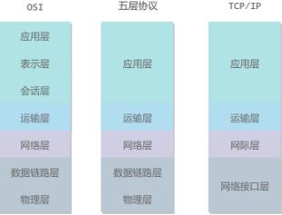
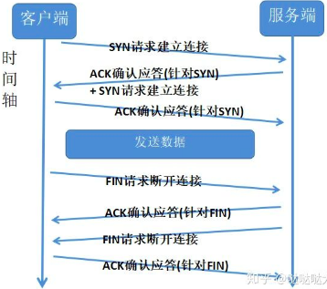
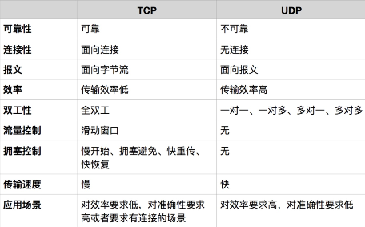

# 计算机网络
待整理: https://github.com/Snailclimb/JavaGuide/blob/master/docs/network/%E8%AE%A1%E7%AE%97%E6%9C%BA%E7%BD%91%E7%BB%9C.md
## 计算机网络体系结构
参考 https://github.com/CyC2018/CS-Notes/blob/master/notes/%E8%AE%A1%E7%AE%97%E6%9C%BA%E7%BD%91%E7%BB%9C%20-%20%E7%9B%AE%E5%BD%95.md

1. 五层协议
- 应用层：为特定应用程序提供数据传输服务，例如 HTTP、DNS 等协议。数据单位为报文。
- 传输层：为进程提供通用数据传输服务。由于应用层协议很多，定义通用的传输层协议就可以支持不断增多的应用层协议。包括两种协议：传输控制协议 TCP，提供面向连接、可靠的数据传输服务，数据单位为报文段；用户数据报协议 UDP，提供无连接、尽最大努力的数据传输服务，数据单位为用户数据报。TCP 主要提供完整性服务，UDP 主要提供及时性服务。
- 网络层：为主机提供数据传输服务。而传输层协议是为主机中的进程提供数据传输服务。网络层把传输层传递下来的报文段或者用户数据报封装成分组。
- 数据链路层 ：网络层针对的还是主机之间的数据传输服务，而主机之间可以有很多链路，链路层协议就是为同一链路的主机提供数据传输服务。数据链路层把网络层传下来的分组封装成帧。
- 物理层：考虑的是怎样在传输媒体上传输数据比特流，而不是指具体的传输媒体。物理层的作用是尽可能屏蔽传输媒体和通信手段的差异，使数据链路层感觉不到这些差异。

2. OSI
其中表示层和会话层用途如下：
- 表示层：数据压缩、加密以及数据描述，这使得应用程序不必关心在各台主机中数据内部格式不同的问题。
- 会话层：建立及管理会话。
五层协议没有表示层和会话层，而是将这些功能留给应用程序开发者处理。

3. TCP/IP
它只有四层，相当于五层协议中数据链路层和物理层合并为网络接口层。
TCP/IP 体系结构不严格遵循 OSI 分层概念，应用层可能会直接使用 IP 层或者网络接口层。

4. 数据在各层之间的传递过程
在向下的过程中，需要添加下层协议所需要的首部或者尾部，而在向上的过程中不断拆开首部和尾部。
路由器只有下面三层协议，因为路由器位于网络核心中，不需要为进程或者应用程序提供服务，因此也就不需要传输层和应用层。

### 三次握手
第一次握手：客户端发送网络包，服务端收到了。这样服务端就能得出结论：客户端的发送能力、服务端的接收能力是正常的。

第二次握手：服务端发包，客户端收到了。这样客户端就能得出结论：服务端的接收、发送能力，客户端的接收、发送能力是正常的。

第三次握手：客户端发包，服务端收到了。这样服务端就能得出结论：客户端的接收、发送能力，服务端的发送、接收能力是正常的。 第一、二次握手后，服务端并不知道客户端的接收能力以及自己的发送能力是否正常。而在第三次握手时，服务端收到了客户端对第二次握手作的回应。从服务端的角度，我在第二次握手时的响应数据发送出去了，客户端接收到了。所以，我的发送能力是正常的。而客户端的接收能力也是正常的。

经历了上面的三次握手过程，客户端和服务端都确认了自己的接收、发送能力是正常的。之后就可以正常通信了。

### 四次挥手
TCP连接是双向传输的对等的模式，就是说双方都可以同时向对方发送或接收数据。当有一方要关闭连接时，会发送指令告知对方，我要关闭连接了。这时对方会回一个ACK，此时一个方向的连接关闭。但是另一个方向仍然可以继续传输数据，等到发送完了所有的数据后，会发送一个FIN段来关闭此方向上的连接。接收方发送ACK确认关闭连接。
TODO: TIME WAIT
参考: https://zhuanlan.zhihu.com/p/53374516

### 什么是面向有连接型和面向无连接型？
面向有连接型传输: 包括会话建立、传输数据和会话断开，此外还包括保证传输可靠性的各种措施，比如超时重传、流量控制等，常见的面向有连接传输有TCP；
面向无连接型传输: 仅提供基本的传输数据的功能，即使接收端不存在，发送端也能发送数据包，常见的面向无连接传输有UDP、IP。

### TCP UDP 区别
传输控制协议 TCP（Transmission Control Protocol）
是面向连接的，提供可靠交付，有流量控制，拥塞控制，提供全双工通信，面向字节流（把应用层传下来的报文看成字节流，把字节流组织成大小不等的数据块），每一条 TCP 连接只能是点对点的（一对一）。
用户数据报协议 UDP（User Datagram Protocol）
是无连接的，尽最大可能交付，没有拥塞控制，面向报文（对于应用程序传下来的报文不合并也不拆分，只是添加 UDP 首部），支持一对一、一对多、多对一和多对多的交互通信。

### TCP对应的应用层协议有哪些？UDP对应的应用层协议有哪些？
TCP对应的典型的应用层协议：
- FTP：文件传输协议；
- SSH：远程登录协议；
- HTTP：web服务器传输超文本到本地浏览器的超文本传输协议。

UDP对应的典型的应用层协议：
- DNS：域名解析协议；
- TFTP：简单文件传输协议；
- SNMP：简单网络管理协议。

### TCP 拥塞控制
计算机网络都处在一个共享的环境，在通信开始时如果立即把大量数据注入到网络，可能会引起网络阻塞，甚至带来网络瘫痪。TCP为了防止该问题的出现，采用了拥塞控制的策略，常见的拥塞控制策略有慢启动、拥塞避免、快重传与快恢复.
以慢启动为例, 在通信开始时，定义一个“拥塞窗口”，窗口大小为1，意思是开始时只发送一个分组，之后每收到一个确认回执（ACK），拥塞窗口的大小就加1（即逐渐增大窗口大小），发送端在发送数据时，将拥塞窗口的大小与接收端流量控制窗口的大小作比较，取二者中较小的值，然后实际发送的数据量比这个最小值还要小。

### 什么是TCP 粘包、拆包？
1. 接收端正常收到两个数据包，即没有发生拆包和粘包的现象。
2. 接收端只收到一个数据包，但是这一个数据包中包含了发送端发送的两个数据包的信息，这种现象即为粘包。
3. 接收端收到了两个数据包，但是这两个数据包要么是不完整的，要么就是多出来一块，这种情况即发生了拆包和粘包。

### 为什么会发生 TCP 粘包、拆包？
- 要发送的数据大于 TCP 发送缓冲区剩余空间大小，将会发生拆包。
- 待发送数据大于 MSS（最大报文长度），TCP 在传输前将进行拆包。
- 要发送的数据小于 TCP 发送缓冲区的大小，TCP 将多次写入缓冲区的数据一次发送出去，将会发生粘包。
- 接收数据端的应用层没有及时读取接收缓冲区中的数据，将发生粘包。

### 粘包、拆包解决办法
由于 TCP 本身是面向字节流的，无法理解上层的业务数据，所以在底层是无法保证数据包不被拆分和重组的，这个问题只能通过上层的应用协议栈设计来解决，解决方案归纳如下：
- 消息定长：发送端将每个数据包封装为固定长度（不够的可以通过补 0 填充），这样接收端每次接收缓冲区中读取固定长度的数据就自然而然的把每个数据包拆分开来。
- 设置消息边界：服务端从网络流中按消息边界分离出消息内容。在包尾增加回车换行符进行分割，例如 FTP 协议。
- 将消息分为消息头和消息体：消息头中包含表示消息总长度（或者消息体长度）的字段。

### http和https的区别
http协议是应用层的协议，中文名称是超文本传输协议，是客户端和服务端相互通信时将信息以http报文的形式传输。
https可以简单的理解为：https = http + 加密 + 认证 + 完整性保护。
http协议的缺点:
- 通信使用明文，内容可能被窃听。
- 通信双方的身份无法得到认证，身份可能遭遇伪装。
- 无法验证报文的完整性。

https协议改进
- 加密。https协议通过SSL或者TLS协议将报文内容进行加密，client端进行加密，server端进行解密。
- 认证。通过值得信赖的第三方机构颁布证书，即可确认通信双方的身份。客户端持有证书即可完成客户端身份的确认，客户端通信前会查看服务端的证书。
- 完整性保护。可以通过MD5等散列码进行通信内容的校验。

todo: HTTPS密钥交换过程，CA信任链

### 常见的http动词
- GET: 从服务器获取资源
- POST: 在服务器新建资源
- PUT: 在服务器更新资源
- DELETE: 在服务器删除资源
- HEAD: 获取资源的元数据
- OPTIONAL: 查询对指定的资源支持的方法

### 从URL输入到页面展现发生什么
1. 根据域名到DNS中找到IP
2. 根据IP建立TCP连接(三次握手)
3. 发起http请求
4. 服务器响应http请求
5. 浏览器解析HTML代码并请求html中的静态资源（js,css）
6. 关闭TCP连接（四次挥手）
7. 浏览器渲染页面
